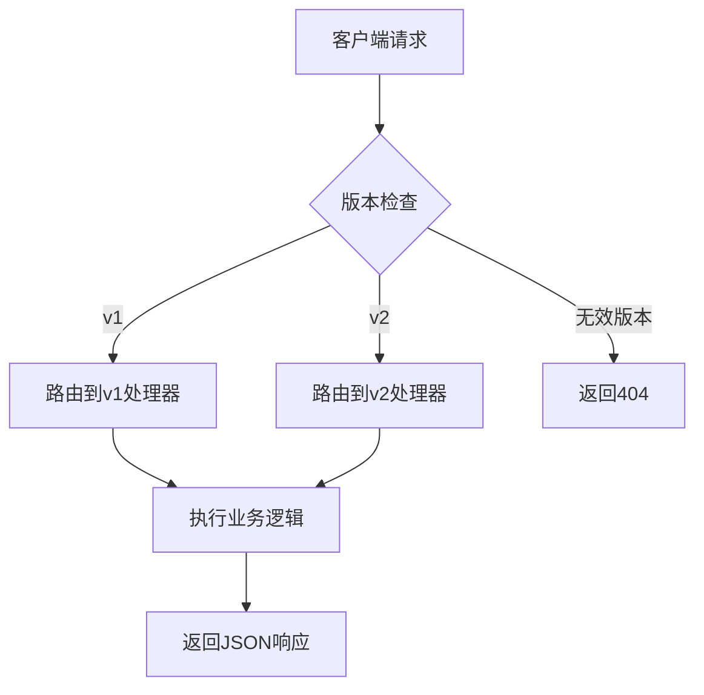

# API文档

<cite>
**本文档中引用的文件**  
- [index.py](file://api/controllers/service_api/index.py)
- [app.py](file://api/controllers/service_api/app/app.py)
- [conversation.py](file://api/controllers/service_api/app/conversation.py)
- [completion.py](file://api/controllers/service_api/app/completion.py)
- [message.py](file://api/controllers/service_api/app/message.py)
- [workflow.py](file://api/controllers/service_api/app/workflow.py)
- [file.py](file://api/controllers/service_api/app/file.py)
- [site.py](file://api/controllers/service_api/app/site.py)
- [dataset.py](file://api/controllers/service_api/dataset/dataset.py)
- [document.py](file://api/controllers/service_api/dataset/document.py)
- [segment.py](file://api/controllers/service_api/dataset/segment.py)
- [upload_file.py](file://api/controllers/service_api/dataset/upload_file.py)
- [error.py](file://api/controllers/service_api/app/error.py)
- [wraps.py](file://api/controllers/service_api/wraps.py)
- [dify_config.py](file://api/configs/app_config.py)
</cite>

## 目录
1. [简介](#简介)
2. [API版本与兼容性](#api版本与兼容性)
3. [认证机制](#认证机制)
4. [速率限制](#速率限制)
5. [错误处理](#错误处理)
6. [核心API端点](#核心api端点)
   - [应用元信息](#应用元信息)
   - [会话管理](#会话管理)
   - [对话交互](#对话交互)
   - [消息管理](#消息管理)
   - [工作流执行](#工作流执行)
   - [文件操作](#文件操作)
   - [站点配置](#站点配置)
7. [数据集API](#数据集api)
   - [数据集管理](#数据集管理)
   - [文档管理](#文档管理)
   - [分段管理](#分段管理)
   - [文件上传](#文件上传)
8. [客户端实现指南](#客户端实现指南)
9. [最佳实践](#最佳实践)
10. [附录](#附录)

## 简介

Dify平台提供了一套完整的RESTful API，用于程序化访问和管理AI应用、数据集、会话和工作流。本API文档详细说明了所有公共接口，包括端点、请求/响应格式、认证方法和错误处理机制。

API设计遵循REST原则，使用标准HTTP方法和状态码，返回JSON格式响应。主要功能包括应用配置查询、会话管理、对话生成、消息历史、文件处理和数据集操作。

**Section sources**
- [index.py](file://api/controllers/service_api/index.py#L1-L14)
- [app.py](file://api/controllers/service_api/app/app.py#L1-L95)

## API版本与兼容性

Dify API采用语义化版本控制，当前版本为v1。API版本通过URL路径进行管理，所有端点均以`/v1`为前缀。

平台承诺向后兼容性，确保在主要版本内：
- 不会移除现有端点
- 不会更改现有字段的语义
- 不会引入破坏性变更

当需要引入重大变更时，将发布新版本（如v2），同时保持旧版本在合理期限内的可用性。



**Diagram sources**
- [index.py](file://api/controllers/service_api/index.py#L1-L14)

## 认证机制

Dify API使用基于令牌的认证机制。所有请求必须在HTTP头中包含有效的API令牌：

```
Authorization: Bearer <your-api-token>
```

API令牌与特定应用关联，可在Dify控制台的应用设置中生成和管理。每个令牌具有以下属性：
- 作用域：限定可访问的应用
- 权限：读取、写入或管理权限
- 过期时间：可配置的令牌有效期

认证中间件会验证令牌的有效性，并将请求与对应的应用和用户关联。

**Section sources**
- [wraps.py](file://api/controllers/service_api/wraps.py)
- [app.py](file://api/controllers/service_api/app/app.py#L1-L95)

## 速率限制

为确保服务稳定性和公平使用，Dify API实施速率限制策略：

- 免费计划：600次请求/小时
- 专业计划：5000次请求/小时
- 企业计划：10000次请求/小时

速率限制基于令牌进行跟踪，响应头中包含相关限流信息：

```
X-RateLimit-Limit: 600
X-RateLimit-Remaining: 598
X-RateLimit-Reset: 3600
```

当达到速率限制时，API返回429状态码，并在`Retry-After`头中建议重试时间。

## 错误处理

API使用标准HTTP状态码表示请求结果，错误响应采用统一格式：

```json
{
  "error": {
    "type": "invalid_request",
    "message": "Invalid API key provided"
  }
}
```

### 常见错误码

| 状态码 | 类型 | 说明 |
|--------|------|------|
| 400 | bad_request | 请求参数无效或格式错误 |
| 401 | unauthorized | 认证失败，API令牌无效或缺失 |
| 403 | forbidden | 权限不足，无法访问资源 |
| 404 | not_found | 请求的资源不存在 |
| 429 | rate_limit_exceeded | 超出速率限制 |
| 500 | internal_error | 服务器内部错误 |

**Section sources**
- [error.py](file://api/controllers/service_api/app/error.py)

## 核心API端点

### 应用元信息

提供应用的基本信息和配置参数。

#### 获取应用信息
- **端点**: `GET /v1/app/info`
- **描述**: 获取应用的基本信息
- **响应**:
```json
{
  "name": "客服助手",
  "description": "自动回复客户咨询",
  "tags": ["customer", "support"],
  "mode": "chat",
  "author_name": "张三"
}
```

#### 获取应用参数
- **端点**: `GET /v1/app/parameters`
- **描述**: 获取应用的输入参数和配置
- **响应**:
```json
{
  "parameters": [
    {
      "variable": "name",
      "name": "姓名",
      "type": "string",
      "required": true
    }
  ],
  "system_parameters": {
    "time_enabled": true
  }
}
```

#### 获取应用元数据
- **端点**: `GET /v1/app/meta`
- **描述**: 获取应用的元数据配置
- **响应**:
```json
{
  "provider": "openai",
  "model": "gpt-3.5-turbo",
  "max_tokens": 2048
}
```

**Section sources**
- [app.py](file://api/controllers/service_api/app/app.py#L1-L95)

### 会话管理

管理用户与AI应用的对话会话。

#### 列出会话
- **端点**: `GET /v1/conversations`
- **参数**:
  - `last_id`: 分页起始会话ID
  - `limit`: 返回数量（1-100）
  - `sort_by`: 排序方式（created_at, -created_at等）
- **响应**:
```json
{
  "data": [
    {
      "id": "conv-123",
      "name": "第一次对话",
      "created_at": "2023-01-01T00:00:00Z",
      "updated_at": "2023-01-01T00:05:00Z"
    }
  ],
  "has_more": true,
  "last_id": "conv-123"
}
```

#### 删除会话
- **端点**: `DELETE /v1/conversations/{c_id}`
- **描述**: 删除指定会话
- **成功响应**: 204 No Content

#### 重命名会话
- **端点**: `POST /v1/conversations/{c_id}/name`
- **请求体**:
```json
{
  "name": "新的会话名称",
  "auto_generate": false
}
```
- **响应**: 更新后的会话对象

#### 会话变量管理
- **端点**: `GET /v1/conversations/{c_id}/variables`
- **描述**: 获取会话变量列表
- **响应**:
```json
{
  "data": [
    {
      "id": "var-123",
      "name": "user_name",
      "value": "李四",
      "type": "string"
    }
  ]
}
```

**Section sources**
- [conversation.py](file://api/controllers/service_api/app/conversation.py#L1-L248)

### 对话交互

与AI应用进行实时对话交互。

#### 创建完成
- **端点**: `POST /v1/completion-messages`
- **请求体**:
```json
{
  "inputs": {
    "query": "你好，今天天气怎么样？"
  },
  "response_mode": "streaming",
  "user": "user-123"
}
```
- **响应模式**: 支持同步（blocking）和流式（streaming）

#### 流式响应示例
```json
{"event": "message", "data": {"id": "msg-123", "content": "你好"}}
{"event": "message", "data": {"content": "今天天气很好"}}
{"event": "end", "data": {"metadata": {}}}
```

**Section sources**
- [completion.py](file://api/controllers/service_api/app/completion.py)

### 消息管理

管理对话中的消息记录。

#### 获取消息历史
- **端点**: `GET /v1/messages`
- **参数**: 分页和过滤参数
- **响应**: 消息对象数组

#### 获取消息详情
- **端点**: `GET /v1/messages/{m_id}`
- **响应**: 单条消息的详细信息

**Section sources**
- [message.py](file://api/controllers/service_api/app/message.py)

### 工作流执行

执行和管理复杂的工作流应用。

#### 执行工作流
- **端点**: `POST /v1/workflows/run`
- **请求体**: 工作流输入参数
- **响应**: 执行结果和状态

#### 获取执行状态
- **端点**: `GET /v1/workflows/run/{run_id}`
- **响应**: 执行进度和结果

**Section sources**
- [workflow.py](file://api/controllers/service_api/app/workflow.py)

### 文件操作

管理应用相关的文件。

#### 上传文件
- **端点**: `POST /v1/files`
- **支持格式**: PDF, DOCX, TXT等
- **响应**: 文件元数据

#### 获取文件预览
- **端点**: `GET /v1/files/{file_id}/preview`
- **描述**: 获取文件内容预览

**Section sources**
- [file.py](file://api/controllers/service_api/app/file.py)

### 站点配置

获取应用的站点级配置。

#### 获取站点信息
- **端点**: `GET /v1/site`
- **响应**: 站点名称、描述、图标等配置

**Section sources**
- [site.py](file://api/controllers/service_api/app/site.py)

## 数据集API

提供对知识库数据集的完整管理功能。

### 数据集管理
- **创建数据集**: `POST /v1/datasets`
- **列出数据集**: `GET /v1/datasets`
- **获取数据集详情**: `GET /v1/datasets/{dataset_id}`
- **更新数据集**: `PUT /v1/datasets/{dataset_id}`
- **删除数据集**: `DELETE /v1/datasets/{dataset_id}`

**Section sources**
- [dataset.py](file://api/controllers/service_api/dataset/dataset.py)

### 文档管理
- **添加文档**: `POST /v1/datasets/{dataset_id}/documents`
- **列出文档**: `GET /v1/datasets/{dataset_id}/documents`
- **文档状态查询**: `GET /v1/datasets/{dataset_id}/documents/{document_id}/status`

**Section sources**
- [document.py](file://api/controllers/service_api/dataset/document.py)

### 分段管理
- **获取分段列表**: `GET /v1/datasets/{dataset_id}/segments`
- **更新分段**: `PUT /v1/datasets/{dataset_id}/segments/{segment_id}`
- **删除分段**: `DELETE /v1/datasets/{dataset_id}/segments/{segment_id}`

**Section sources**
- [segment.py](file://api/controllers/service_api/dataset/segment.py)

### 文件上传
- **上传处理**: `POST /v1/datasets/upload`
- **文件类型验证**: 支持多种文档格式
- **响应**: 上传文件的临时ID和元数据

**Section sources**
- [upload_file.py](file://api/controllers/service_api/dataset/upload_file.py)

## 客户端实现指南

### 认证流程
1. 在Dify控制台获取API令牌
2. 在每个请求的Authorization头中包含令牌
3. 处理401错误，提示用户重新认证

### 速率限制处理
```python
def make_api_request():
    response = requests.get(url, headers=headers)
    if response.status_code == 429:
        retry_after = int(response.headers.get('Retry-After', 60))
        time.sleep(retry_after)
        return make_api_request()
    return response
```

### 错误恢复机制
- 实现指数退避重试策略
- 对可重试错误（5xx）进行自动重试
- 记录错误日志用于调试

## 最佳实践

### 应用集成场景
- 使用长生命周期的会话ID保持上下文
- 缓存应用参数减少API调用
- 批量处理提高效率

### 自动化脚本场景
- 使用服务账户进行认证
- 实现完整的错误处理和日志记录
- 遵守速率限制避免服务中断

## 附录

### HTTP状态码参考
| 代码 | 类别 | 建议操作 |
|------|------|----------|
| 2xx | 成功 | 正常处理响应 |
| 4xx | 客户端错误 | 检查请求参数 |
| 5xx | 服务器错误 | 重试或报告问题 |

### 数据类型说明
- `string`: 字符串
- `number`: 数字
- `boolean`: 布尔值
- `object`: JSON对象
- `array`: JSON数组