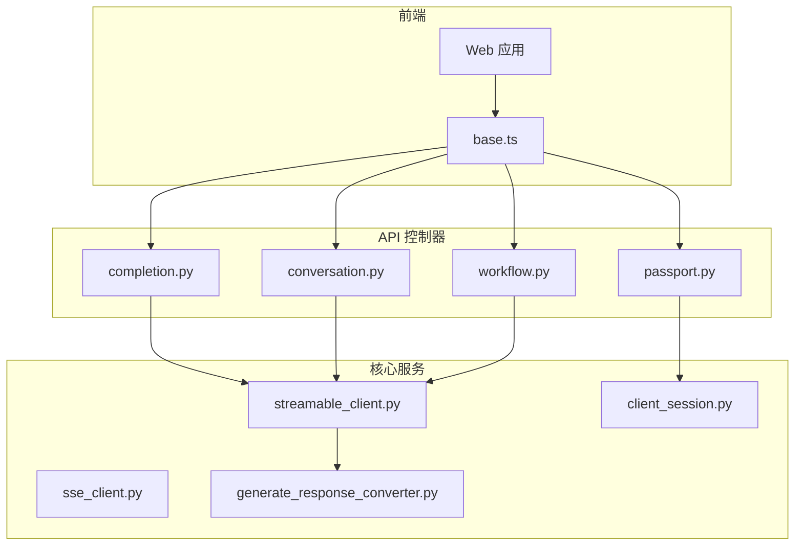
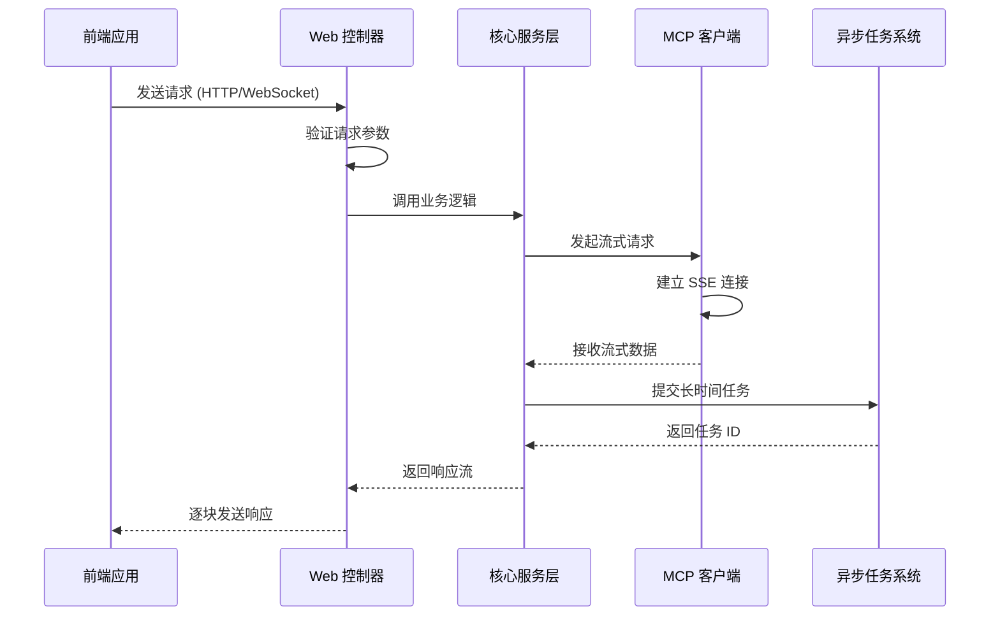
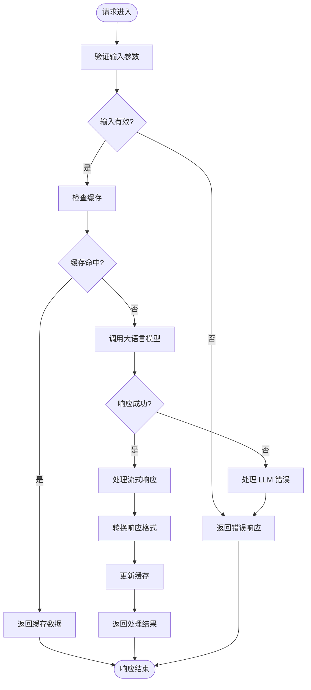
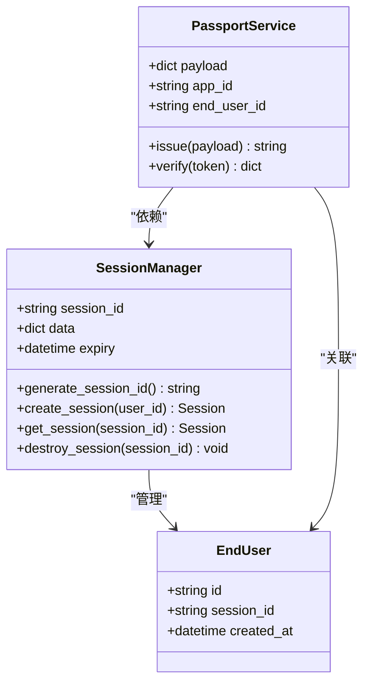
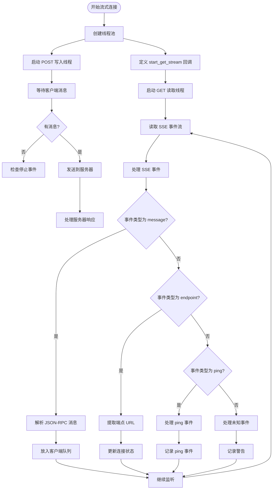
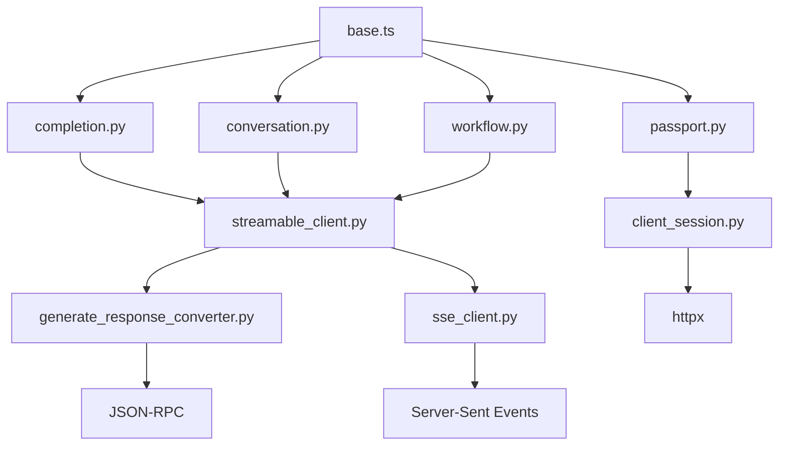

# Web API

<cite>
**本文档中引用的文件**  
- [completion.py](file://api/controllers/web/completion.py)
- [conversation.py](file://api/controllers/web/conversation.py)
- [workflow.py](file://api/controllers/web/workflow.py)
- [passport.py](file://api/controllers/web/passport.py)
- [streamable_client.py](file://api/core/mcp/client/streamable_client.py)
- [sse_client.py](file://api/core/mcp/client/sse_client.py)
- [client_session.py](file://api/core/mcp/session/client_session.py)
- [generate_response_converter.py](file://api/core/app/apps/completion/generate_response_converter.py)
- [base.ts](file://web/service/base.ts)
</cite>

## 目录
1. [简介](#简介)
2. [项目结构](#项目结构)
3. [核心组件](#核心组件)
4. [架构概述](#架构概述)
5. [详细组件分析](#详细组件分析)
6. [依赖分析](#依赖分析)
7. [性能考虑](#性能考虑)
8. [故障排除指南](#故障排除指南)
9. [结论](#结论)

## 简介
Dify Web API 为前端应用提供实时交互功能，支持对话、补全和工作流执行。API 通过流式响应机制实现低延迟数据传输，并集成 WebSocket 连接以支持双向通信。系统采用会话管理机制维护用户上下文，结合消息 ID 生成策略确保消息顺序一致性。后端异步任务系统处理长时间运行的操作，前端可通过 JavaScript 示例代码使用 fetch API 或 WebSocket 客户端与这些端点交互。

## 项目结构
Dify Web API 的项目结构按功能模块组织，主要包含控制器、核心服务、模型定义和前端集成。控制器层位于 `api/controllers/web/` 目录下，负责处理 HTTP 请求并调用核心服务。核心逻辑实现在 `api/core/` 目录中，涵盖 MCP 协议客户端、会话管理、流式响应处理等关键功能。前端服务通过 `web/service/base.ts` 提供统一的 API 调用接口。

**图示来源**
- [completion.py](file://api/controllers/web/completion.py)
- [conversation.py](file://api/controllers/web/conversation.py)
- [workflow.py](file://api/controllers/web/workflow.py)
- [passport.py](file://api/controllers/web/passport.py)
- [streamable_client.py](file://api/core/mcp/client/streamable_client.py)
- [sse_client.py](file://api/core/mcp/client/sse_client.py)
- [client_session.py](file://api/core/mcp/session/client_session.py)
- [generate_response_converter.py](file://api/core/app/apps/completion/generate_response_converter.py)
- [base.ts](file://web/service/base.ts)

**章节来源**
- [api/controllers/web](file://api/controllers/web)
- [api/core/mcp](file://api/core/mcp)
- [web/service](file://web/service)

## 核心组件
Dify Web API 的核心组件包括完成端点、对话管理、工作流执行和会话认证。完成端点处理文本生成请求，支持流式响应；对话管理维护消息链和上下文关系；工作流执行协调多个节点的任务调度；会话认证通过访问令牌和会话 ID 实现安全访问控制。这些组件共同支持前端应用的实时交互需求。

**章节来源**
- [completion.py](file://api/controllers/web/completion.py#L1-L50)
- [conversation.py](file://api/controllers/web/conversation.py#L1-L50)
- [workflow.py](file://api/controllers/web/workflow.py#L1-L50)
- [passport.py](file://api/controllers/web/passport.py#L1-L50)

## 架构概述
Dify Web API 采用分层架构设计，前端通过 RESTful API 和 WebSocket 与后端交互。控制器层接收请求并验证参数，核心服务层处理业务逻辑，包括流式响应生成、会话管理和异步任务调度。MCP 协议客户端实现与外部服务的通信，支持 JSON 和 SSE 两种内容类型。系统通过线程池管理并发连接，确保高吞吐量下的稳定性。

**图示来源**
- [streamable_client.py](file://api/core/mcp/client/streamable_client.py#L237-L273)
- [sse_client.py](file://api/core/mcp/client/sse_client.py#L80-L115)
- [base.ts](file://web/service/base.ts#L165-L198)

## 详细组件分析

### 完成端点分析
完成端点处理文本生成请求，支持流式响应机制。系统通过 `generate_response_converter.py` 将子流响应转换为标准格式，确保前端能够正确解析和显示增量内容。响应流包含多种事件类型，如消息块、代理思考、文件附件和消息结束标记。

**图示来源**
- [completion.py](file://api/controllers/web/completion.py)
- [generate_response_converter.py](file://api/core/app/apps/completion/generate_response_converter.py#L104-L115)

**章节来源**
- [completion.py](file://api/controllers/web/completion.py#L1-L100)
- [generate_response_converter.py](file://api/core/app/apps/completion/generate_response_converter.py#L1-L50)

### 会话管理分析
会话管理通过 `passport.py` 中的 `generate_session_id()` 函数实现唯一会话 ID 生成。系统使用 UUID 并检查数据库确保唯一性。会话信息存储在数据库的 `sessions` 表中，包含会话 ID、数据和过期时间。访问令牌通过 JWT 签发，包含应用 ID、用户 ID 等声明信息。

**图示来源**
- [passport.py](file://api/controllers/web/passport.py#L206-L236)
- [migrations/versions/64b051264f32_init.py](file://api/migrations/versions/64b051264f32_init.py#L507-L532)

**章节来源**
- [passport.py](file://api/controllers/web/passport.py#L200-L240)
- [migrations/versions/64b051264f32_init.py](file://api/migrations/versions/64b051264f32_init.py#L500-L540)

### 流式响应处理分析
流式响应处理由 `streamable_client.py` 实现，支持 JSON 和 SSE 两种内容类型。系统使用线程池管理并发连接，一个线程处理 POST 请求写入，另一个线程处理 GET 流读取。SSE 事件处理器区分 "message"、"endpoint" 和 "ping" 事件，确保不同类型的消息得到正确处理。

**图示来源**
- [streamable_client.py](file://api/core/mcp/client/streamable_client.py#L435-L463)
- [sse_client.py](file://api/core/mcp/client/sse_client.py#L113-L149)

**章节来源**
- [streamable_client.py](file://api/core/mcp/client/streamable_client.py#L400-L500)
- [sse_client.py](file://api/core/mcp/client/sse_client.py#L100-L150)

## 依赖分析
Dify Web API 的组件间存在紧密依赖关系。控制器层依赖核心服务层提供的业务逻辑，核心服务层又依赖 MCP 客户端进行外部通信。会话管理组件被多个功能模块共享，确保用户状态的一致性。异步任务系统通过 Celery 实现，支持长时间运行操作的后台处理。

**图示来源**
- [completion.py](file://api/controllers/web/completion.py)
- [conversation.py](file://api/controllers/web/conversation.py)
- [workflow.py](file://api/controllers/web/workflow.py)
- [passport.py](file://api/controllers/web/passport.py)
- [streamable_client.py](file://api/core/mcp/client/streamable_client.py)
- [client_session.py](file://api/core/mcp/session/client_session.py)
- [generate_response_converter.py](file://api/core/app/apps/completion/generate_response_converter.py)
- [sse_client.py](file://api/core/mcp/client/sse_client.py)
- [base.ts](file://web/service/base.ts)

**章节来源**
- [api/controllers/web](file://api/controllers/web)
- [api/core/mcp](file://api/core/mcp)
- [web/service](file://web/service)

## 性能考虑
为优化性能，建议采用连接复用和消息批处理策略。对于频繁调用的 API，可保持长连接减少握手开销。批量处理多个相关请求可降低网络往返延迟。系统已实现缓存机制，合理利用可显著提升响应速度。WebSocket 连接应设置适当的保活机制，防止因超时中断影响用户体验。

## 故障排除指南
常见问题包括连接超时、认证失败和流式响应中断。检查网络连接和防火墙设置以排除连接问题。验证访问令牌的有效性和权限范围。对于流式响应中断，确认服务器端是否正确处理了连接关闭事件。使用日志记录功能跟踪请求生命周期，有助于定位具体故障点。

**章节来源**
- [streamable_client.py](file://api/core/mcp/client/streamable_client.py#L145-L178)
- [base.ts](file://web/service/base.ts#L165-L198)
- [sse_client.py](file://api/core/mcp/client/sse_client.py#L80-L115)

## 结论
Dify Web API 提供了一套完整的实时交互解决方案，支持对话、补全和工作流执行等核心功能。通过流式响应机制和 WebSocket 集成，实现了低延迟的数据传输。会话管理和消息 ID 生成确保了上下文的一致性，后端异步任务系统有效处理长时间运行的操作。开发者可参考提供的 JavaScript 示例代码快速集成前端应用。