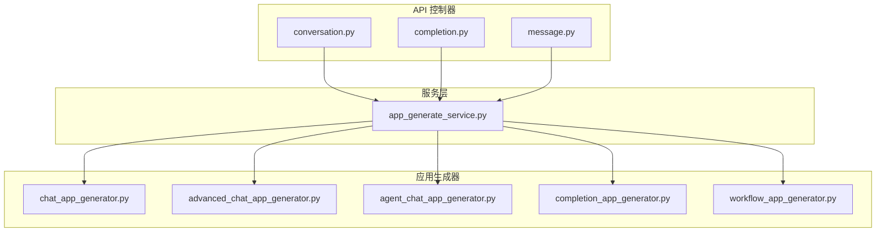
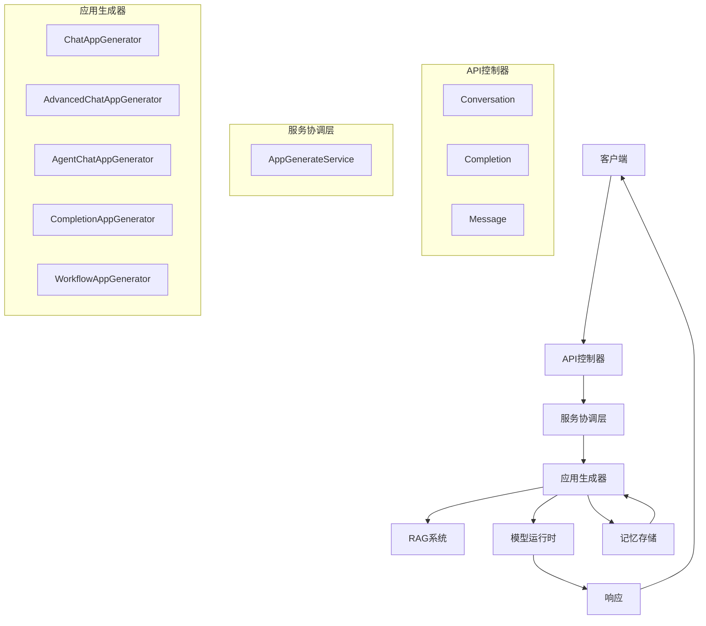
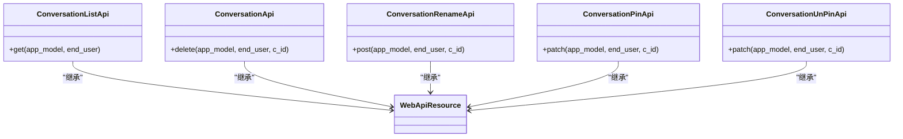
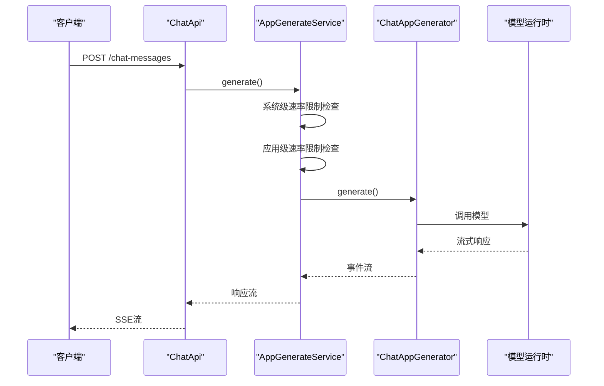
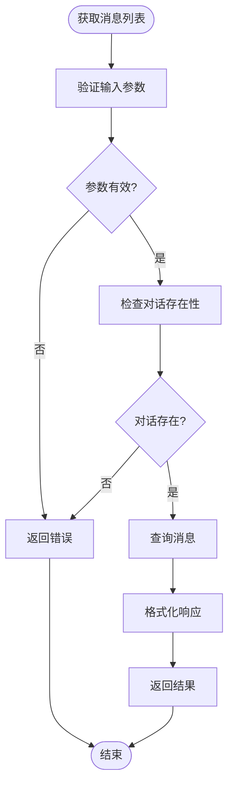
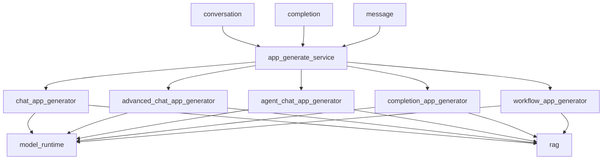

# 对话API

<cite>
**本文档中引用的文件**  
- [conversation.py](file://api/controllers/web/conversation.py)
- [completion.py](file://api/controllers/web/completion.py)
- [message.py](file://api/controllers/web/message.py)
- [app_generate_service.py](file://api/services/app_generate_service.py)
- [chat_app_task_pipeline.py](file://api/core/app/task_pipeline/chat_app_task_pipeline.py)
- [chat_app_generator.py](file://api/core/app/apps/chat/app_generator.py)
- [advanced_chat_app_generator.py](file://api/core/app/apps/advanced_chat/app_generator.py)
- [agent_chat_app_generator.py](file://api/core/app/apps/agent_chat/app_generator.py)
- [completion_app_generator.py](file://api/core/app/apps/completion/app_generator.py)
- [workflow_app_generator.py](file://api/core/app/apps/workflow/app_generator.py)
</cite>

## 目录
1. [简介](#简介)
2. [项目结构](#项目结构)
3. [核心组件](#核心组件)
4. [架构概述](#架构概述)
5. [详细组件分析](#详细组件分析)
6. [依赖分析](#依赖分析)
7. [性能考虑](#性能考虑)
8. [故障排除指南](#故障排除指南)
9. [结论](#结论)

## 简介
Dify对话API为开发者提供了一套完整的接口，用于创建和管理智能对话应用。该API支持创建新对话、发送消息并接收流式响应，适用于聊天、补全和高级对话等多种应用场景。API通过服务器发送事件（SSE）实现流式响应，结合RAG系统和模型运行时生成智能回复。本文档详细描述了关键端点的请求/响应模式、认证机制、流式处理实现以及错误恢复策略。

## 项目结构
Dify的API层采用模块化设计，主要功能分布在`api/controllers/web`目录下。对话相关功能由`conversation.py`、`completion.py`和`message.py`三个核心文件实现，分别处理对话管理、消息生成和消息反馈。服务层位于`api/services`目录，其中`app_generate_service.py`是消息生成的核心服务。应用生成器位于`api/core/app/apps`目录，根据不同的应用模式（聊天、补全、工作流等）提供具体的生成逻辑。

**图示来源**  
- [conversation.py](file://api/controllers/web/conversation.py)
- [completion.py](file://api/controllers/web/completion.py)
- [message.py](file://api/controllers/web/message.py)
- [app_generate_service.py](file://api/services/app_generate_service.py)

**节来源**  
- [conversation.py](file://api/controllers/web/conversation.py)
- [completion.py](file://api/controllers/web/completion.py)
- [message.py](file://api/controllers/web/message.py)

## 核心组件
对话API的核心功能由控制器、服务和生成器三层架构实现。控制器层处理HTTP请求和响应，服务层协调业务逻辑和速率限制，生成器层根据应用模式生成具体内容。API支持多种响应模式，包括阻塞式和流式，通过EventSource API实现服务器发送事件（SSE）流。对话上下文管理通过会话状态保持和消息历史检索实现，确保对话的连贯性。

**节来源**  
- [app_generate_service.py](file://api/services/app_generate_service.py#L1-L50)
- [chat_app_generator.py](file://api/core/app/apps/chat/app_generator.py#L1-L30)

## 架构概述
Dify对话API采用分层架构设计，从上至下分为API控制器、服务协调层和应用生成层。API控制器接收客户端请求，进行参数验证和权限检查。服务协调层处理速率限制、计费检查和请求调度。应用生成层根据应用模式选择相应的生成器，集成RAG系统和模型运行时生成智能回复。整个流程通过任务管道（task pipeline）管理，确保高效的消息处理和流式响应。

**图示来源**  
- [app_generate_service.py](file://api/services/app_generate_service.py#L1-L100)
- [chat_app_generator.py](file://api/core/app/apps/chat/app_generator.py#L1-L20)

## 详细组件分析

### 对话管理分析
对话管理组件负责创建、列出和删除对话。`ConversationListApi`提供分页获取对话列表的功能，支持按最后ID、限制数量、置顶状态和排序方式进行查询。`ConversationApi`处理对话的删除操作，`ConversationRenameApi`和`ConversationPinApi`分别处理对话重命名和置顶操作。这些操作都基于应用模式进行权限检查，确保只有聊天类应用才能执行相关操作。

**图示来源**  
- [conversation.py](file://api/controllers/web/conversation.py#L1-L141)

**节来源**  
- [conversation.py](file://api/controllers/web/conversation.py#L1-L141)

### 消息生成分析
消息生成组件是对话API的核心，支持聊天和补全两种主要模式。`ChatApi`和`CompletionApi`分别处理聊天消息和补全消息的生成请求，都支持阻塞式和流式两种响应模式。`AppGenerateService`作为核心服务，根据应用模式选择相应的生成器，并处理速率限制和计费检查。生成器将请求转换为事件流，通过SSE协议发送给客户端。

**图示来源**  
- [completion.py](file://api/controllers/web/completion.py#L1-L237)
- [app_generate_service.py](file://api/services/app_generate_service.py#L1-L251)

**节来源**  
- [completion.py](file://api/controllers/web/completion.py#L1-L237)
- [app_generate_service.py](file://api/services/app_generate_service.py#L1-L251)

### 消息历史分析
消息历史组件提供对话中消息的分页检索功能。`MessageListApi`允许客户端按对话ID和首条消息ID获取消息列表，支持无限滚动分页。该组件与对话服务紧密集成，确保只有属于指定对话的消息被返回。消息包含完整的上下文信息，包括输入、查询、回答、文件、反馈和检索资源，为前端提供全面的数据支持。

**图示来源**  
- [message.py](file://api/controllers/web/message.py#L1-L200)

**节来源**  
- [message.py](file://api/controllers/web/message.py#L1-L200)

## 依赖分析
对话API的组件之间存在清晰的依赖关系。控制器层依赖服务层进行业务逻辑处理，服务层依赖具体的生成器实现内容生成。`AppGenerateService`作为中心协调者，根据应用模式动态选择相应的生成器。这种设计实现了高内聚低耦合，便于扩展新的应用模式。外部依赖包括数据库、模型运行时和RAG系统，通过清晰的接口进行集成。

**图示来源**  
- [app_generate_service.py](file://api/services/app_generate_service.py)
- [chat_app_generator.py](file://api/core/app/apps/chat/app_generator.py)

**节来源**  
- [app_generate_service.py](file://api/services/app_generate_service.py)
- [chat_app_generator.py](file://api/core/app/apps/chat/app_generator.py)

## 性能考虑
对话API在设计时充分考虑了性能因素。系统级和应用级双重速率限制机制有效防止滥用，确保服务稳定性。流式响应减少了客户端等待时间，提高了用户体验。任务管道设计优化了资源利用，支持高并发处理。通过缓存和异步处理，系统能够在保证响应速度的同时处理复杂的生成任务。建议客户端实现连接超时处理和断线重连机制，以应对网络不稳定情况。

## 故障排除指南
常见问题包括认证失败、速率限制错误和模型调用异常。认证失败通常由于API密钥无效或过期，应检查密钥配置。速率限制错误表明请求过于频繁，应实现指数退避重试策略。模型调用异常可能由配额耗尽或模型不可用引起，应检查计费状态和模型配置。对于流式连接中断，客户端应实现自动重连机制，从最后接收到的消息继续获取。

**节来源**  
- [app_generate_service.py](file://api/services/app_generate_service.py#L50-L100)
- [completion.py](file://api/controllers/web/completion.py#L50-L100)

## 结论
Dify对话API提供了一套完整、灵活且高性能的对话管理解决方案。通过清晰的分层架构和模块化设计，API能够支持多种应用场景，从简单的文本补全到复杂的多轮对话。流式响应和SSE实现确保了实时交互体验，而RAG系统和模型运行时的集成则保证了回复的智能性和准确性。开发者可以基于此API快速构建功能丰富的对话应用，同时享受完善的错误处理和性能优化机制。