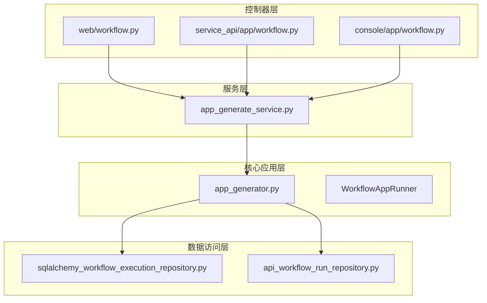
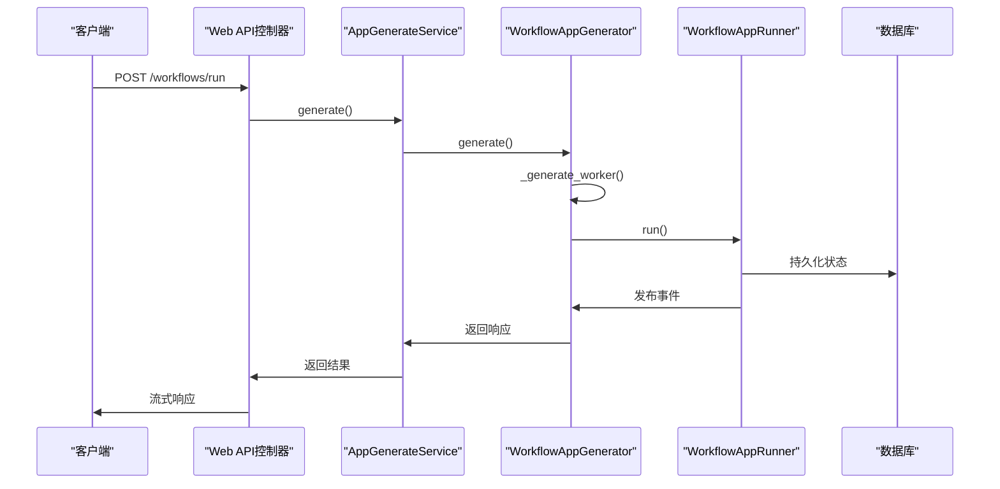
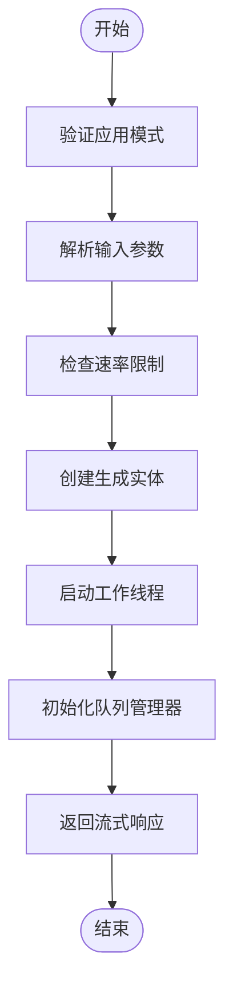
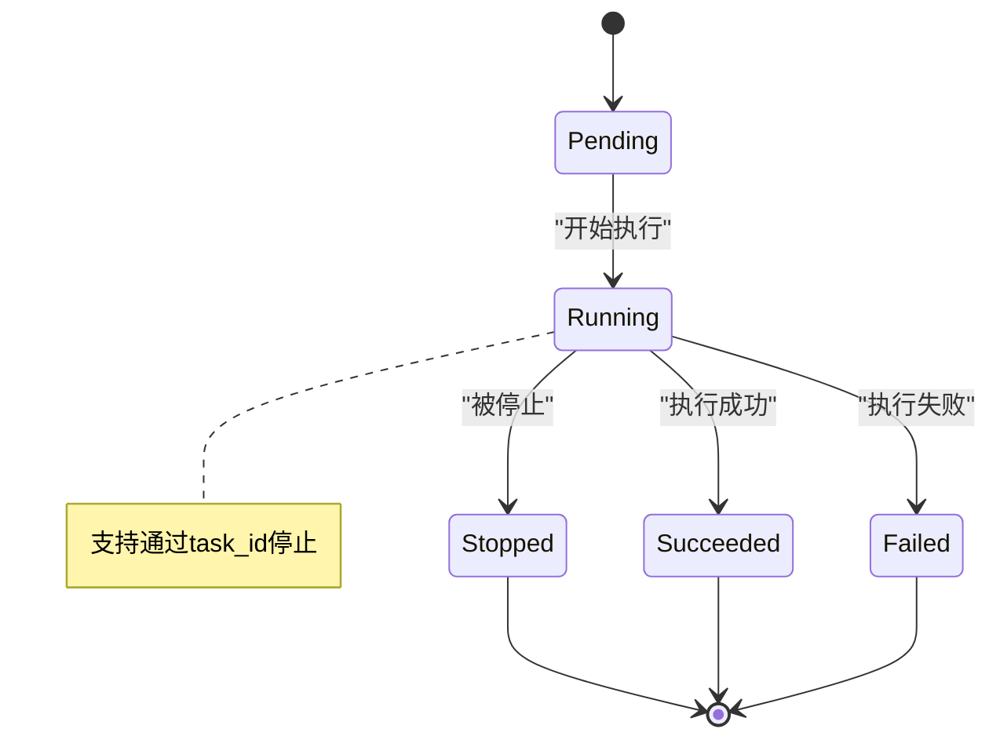
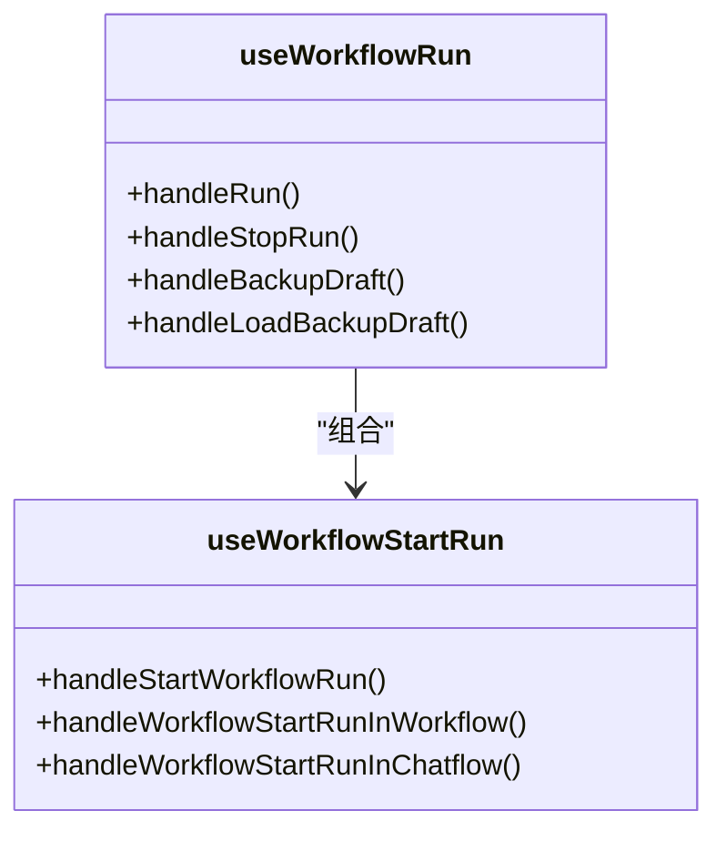
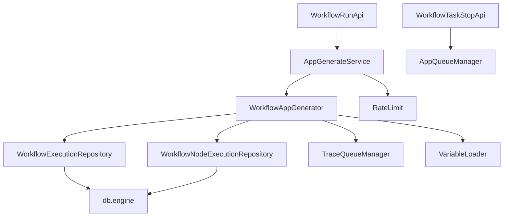

# 工作流API

<cite>
**本文档中引用的文件**  
- [workflow.py](file://api/controllers/web/workflow.py)
- [app_generator.py](file://api/core/app/apps/workflow/app_generator.py)
- [app_generate_service.py](file://api/services/app_generate_service.py)
- [sqlalchemy_workflow_execution_repository.py](file://api/core/repositories/sqlalchemy_workflow_execution_repository.py)
- [api_workflow_run_repository.py](file://api/repositories/api_workflow_run_repository.py)
</cite>

## 目录
1. [简介](#简介)
2. [项目结构](#项目结构)
3. [核心组件](#核心组件)
4. [架构概述](#架构概述)
5. [详细组件分析](#详细组件分析)
6. [依赖分析](#依赖分析)
7. [性能考虑](#性能考虑)
8. [故障排除指南](#故障排除指南)
9. [结论](#结论)

## 简介
本文档旨在全面描述Dify平台中可视化工作流API的技术实现。重点涵盖工作流执行、状态查询和结果获取等核心端点，详细说明异步执行机制、状态机转换逻辑以及与前端的集成方式。文档还包含复杂工作流的性能优化建议，为开发者提供完整的API使用指导。

## 项目结构
Dify的工作流API分布在多个模块中，主要涉及控制器、核心应用逻辑和数据访问层。控制器层负责接收HTTP请求并进行初步验证，核心层处理业务逻辑和工作流执行，数据访问层负责持久化工作流运行状态。

**Diagram sources**
- [workflow.py](file://api/controllers/web/workflow.py)
- [app_generate_service.py](file://api/services/app_generate_service.py)
- [app_generator.py](file://api/core/app/apps/workflow/app_generator.py)
- [sqlalchemy_workflow_execution_repository.py](file://api/core/repositories/sqlalchemy_workflow_execution_repository.py)
- [api_workflow_run_repository.py](file://api/repositories/api_workflow_run_repository.py)

**Section sources**
- [workflow.py](file://api/controllers/web/workflow.py)
- [app_generate_service.py](file://api/services/app_generate_service.py)

## 核心组件
工作流API的核心组件包括执行端点、任务管理器、生成服务和状态存储。这些组件协同工作，实现工作流的异步执行和状态跟踪。

**Section sources**
- [workflow.py](file://api/controllers/web/workflow.py#L31-L83)
- [app_generate_service.py](file://api/services/app_generate_service.py#L27-L132)

## 架构概述
工作流API采用分层架构，从HTTP请求接收到底层执行引擎调用，形成清晰的调用链。系统支持多种调用来源，包括Web应用、服务API和控制台调试。

**Diagram sources**
- [workflow.py](file://api/controllers/web/workflow.py#L31-L83)
- [app_generate_service.py](file://api/services/app_generate_service.py#L27-L132)
- [app_generator.py](file://api/core/app/apps/workflow/app_generator.py#L191-L262)

## 详细组件分析

### 工作流执行分析
工作流执行组件负责处理POST /workflows/{id}/run请求，实现异步执行模式。系统生成唯一的任务ID，并通过流式响应机制返回执行进度和最终结果。

#### 执行流程分析

**Diagram sources**
- [workflow.py](file://api/controllers/web/workflow.py#L31-L83)
- [app_generator.py](file://api/core/app/apps/workflow/app_generator.py#L86-L189)

#### 状态机分析

**Diagram sources**
- [sqlalchemy_workflow_execution_repository.py](file://api/core/repositories/sqlalchemy_workflow_execution_repository.py#L138-L166)
- [api_workflow_run_repository.py](file://api/repositories/api_workflow_run_repository.py#L68-L108)

**Section sources**
- [workflow.py](file://api/controllers/web/workflow.py#L31-L83)
- [app_generator.py](file://api/core/app/apps/workflow/app_generator.py#L191-L262)

### 前端集成分析
前端通过Hooks与工作流API集成，实现进度监控和用户交互。

**Diagram sources**
- [use-workflow-run.ts](file://web/app/components/workflow/hooks/use-workflow-run.ts)
- [use-workflow-start-run.ts](file://web/app/components/workflow/hooks/use-workflow-start-run.tsx)

## 依赖分析
工作流API依赖多个核心服务和数据访问组件，形成复杂的依赖网络。

**Diagram sources**
- [workflow.py](file://api/controllers/web/workflow.py)
- [app_generate_service.py](file://api/services/app_generate_service.py)
- [app_generator.py](file://api/core/app/apps/workflow/app_generator.py)
- [sqlalchemy_workflow_execution_repository.py](file://api/core/repositories/sqlalchemy_workflow_execution_repository.py)

**Section sources**
- [workflow.py](file://api/controllers/web/workflow.py)
- [app_generate_service.py](file://api/services/app_generate_service.py)
- [app_generator.py](file://api/core/app/apps/workflow/app_generator.py)

## 性能考虑
对于复杂工作流，建议实施以下性能优化策略：

1. **并行执行控制**：合理设置工作流节点的并行度，避免资源过度竞争
2. **资源限制**：配置适当的速率限制和并发请求数
3. **缓存策略**：对频繁访问的工作流定义和配置进行缓存
4. **数据库优化**：确保工作流执行记录表有适当的索引
5. **流式处理**：使用流式响应减少内存占用和提高响应速度

## 故障排除指南
常见问题及解决方案：

- **任务无法停止**：检查AppQueueManager.set_stop_flag是否正确调用
- **状态更新延迟**：确认数据库事务是否及时提交
- **流式响应中断**：检查网络连接和超时设置
- **资源耗尽**：监控线程池使用情况，调整并发限制

**Section sources**
- [workflow.py](file://api/controllers/web/workflow.py#L86-L114)
- [app_generator.py](file://api/core/app/apps/workflow/app_generator.py#L429-L500)

## 结论
Dify的工作流API提供了一套完整的异步执行解决方案，支持复杂的可视化工作流管理和监控。通过清晰的分层架构和状态管理机制，系统能够高效处理工作流执行、状态查询和结果获取等操作。建议开发者充分利用流式API和状态轮询机制，构建响应迅速的用户界面。