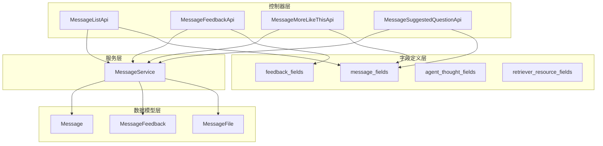
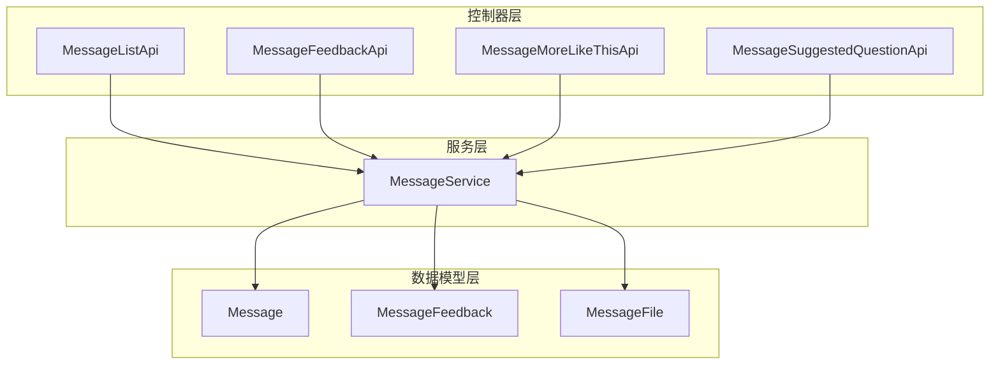
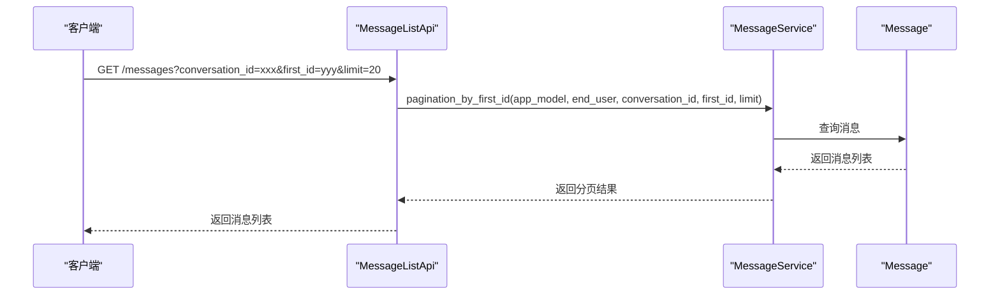
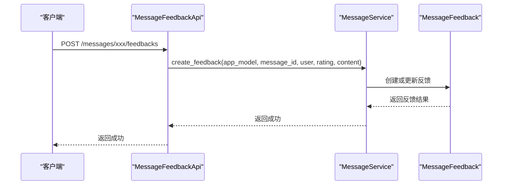
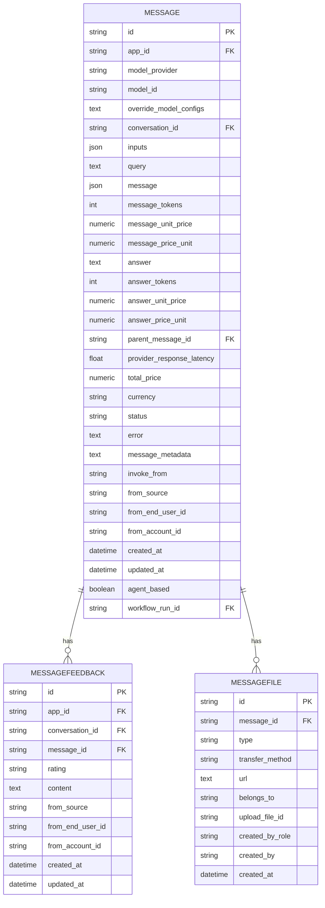
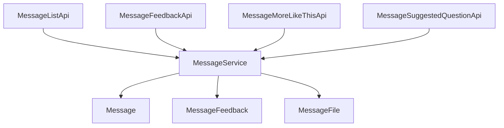

# 消息API

<cite>
**本文档引用的文件**
- [message.py](file://api/controllers/web/message.py)
- [message_service.py](file://api/services/message_service.py)
- [model.py](file://api/models/model.py)
- [message_fields.py](file://api/fields/message_fields.py)
</cite>

## 目录
1. [简介](#简介)
2. [项目结构](#项目结构)
3. [核心组件](#核心组件)
4. [架构概述](#架构概述)
5. [详细组件分析](#详细组件分析)
6. [依赖分析](#依赖分析)
7. [性能考虑](#性能考虑)
8. [故障排除指南](#故障排除指南)
9. [结论](#结论)
10. [附录](#附录)（如有必要）

## 简介
本文档全面介绍了Dify平台的消息API，详细描述了消息创建、检索和管理的端点。文档涵盖了POST /messages、GET /messages和DELETE /messages/{id}操作，以及消息数据模型的结构，包括消息ID、内容、角色、元数据和关联文件。此外，还说明了消息持久化机制、数据库存储策略、分页查询、过滤和排序功能的使用示例，以及消息与对话的关联关系、消息链的构建和上下文窗口管理。文档还包含了消息安全控制，如访问权限验证和内容审核集成，并解释了该API如何支持消息历史分析和对话摘要生成等高级功能。

## 项目结构
Dify的消息API主要由以下几个核心组件构成：控制器层（Controller）、服务层（Service）、数据模型层（Model）和字段定义层（Fields）。这些组件协同工作，实现了消息的创建、检索、更新和删除功能。

**图表来源**
- [message.py](file://api/controllers/web/message.py#L1-L200)
- [message_service.py](file://api/services/message_service.py#L1-L300)
- [model.py](file://api/models/model.py#L800-L1599)
- [message_fields.py](file://api/fields/message_fields.py#L1-L77)

**章节来源**
- [message.py](file://api/controllers/web/message.py#L1-L200)
- [message_service.py](file://api/services/message_service.py#L1-L300)

## 核心组件
消息API的核心组件包括消息控制器（MessageController）、消息服务（MessageService）和消息模型（MessageModel）。消息控制器负责处理HTTP请求，调用消息服务进行业务逻辑处理，而消息服务则负责与数据库交互，实现消息的持久化和查询。消息模型定义了消息的数据结构，包括消息ID、内容、角色、元数据和关联文件等。

**章节来源**
- [message.py](file://api/controllers/web/message.py#L1-L200)
- [message_service.py](file://api/services/message_service.py#L1-L300)
- [model.py](file://api/models/model.py#L800-L1599)

## 架构概述
Dify的消息API采用分层架构，分为控制器层、服务层和数据模型层。控制器层负责处理HTTP请求，服务层负责业务逻辑处理，数据模型层负责数据持久化。这种分层架构使得代码结构清晰，易于维护和扩展。

**图表来源**
- [message.py](file://api/controllers/web/message.py#L1-L200)
- [message_service.py](file://api/services/message_service.py#L1-L300)
- [model.py](file://api/models/model.py#L800-L1599)

## 详细组件分析
### 消息列表API分析
消息列表API（MessageListApi）提供了分页查询消息的功能。客户端可以通过指定对话ID和起始消息ID来获取消息列表。API支持正序和倒序排列，返回的消息列表包含消息ID、对话ID、父消息ID、输入、查询、回答、反馈、检索资源、创建时间、代理思考、元数据、状态和错误信息。

**图表来源**
- [message.py](file://api/controllers/web/message.py#L1-L200)
- [message_service.py](file://api/services/message_service.py#L1-L300)
- [model.py](file://api/models/model.py#L800-L1599)

**章节来源**
- [message.py](file://api/controllers/web/message.py#L1-L200)
- [message_service.py](file://api/services/message_service.py#L1-L300)

### 消息反馈API分析
消息反馈API（MessageFeedbackApi）允许用户对消息进行反馈，包括点赞和点踩。客户端通过POST请求发送反馈信息，API会创建或更新消息的反馈记录。

**图表来源**
- [message.py](file://api/controllers/web/message.py#L1-L200)
- [message_service.py](file://api/services/message_service.py#L1-L300)
- [model.py](file://api/models/model.py#L800-L1599)

**章节来源**
- [message.py](file://api/controllers/web/message.py#L1-L200)
- [message_service.py](file://api/services/message_service.py#L1-L300)

### 消息数据模型分析
消息数据模型（Message）定义了消息的结构，包括消息ID、应用ID、模型提供者、模型ID、覆盖模型配置、对话ID、输入、查询、消息、消息令牌、消息单价、消息价格单位、回答、回答令牌、回答单价、回答价格单位、父消息ID、提供者响应延迟、总价、货币、状态、错误、消息元数据、调用来源、来源、来自终端用户ID、来自账户ID、创建时间、更新时间、基于代理、工作流运行ID等字段。

**图表来源**
- [model.py](file://api/models/model.py#L800-L1599)

**章节来源**
- [model.py](file://api/models/model.py#L800-L1599)

## 依赖分析
消息API的各个组件之间存在明确的依赖关系。控制器层依赖于服务层，服务层依赖于数据模型层。这种依赖关系确保了代码的模块化和可维护性。

**图表来源**
- [message.py](file://api/controllers/web/message.py#L1-L200)
- [message_service.py](file://api/services/message_service.py#L1-L300)
- [model.py](file://api/models/model.py#L800-L1599)

**章节来源**
- [message.py](file://api/controllers/web/message.py#L1-L200)
- [message_service.py](file://api/services/message_service.py#L1-L300)

## 性能考虑
为了提高性能，消息API采用了分页查询和缓存机制。分页查询可以减少单次请求的数据量，降低数据库压力。缓存机制可以减少对数据库的频繁访问，提高响应速度。

## 故障排除指南
在使用消息API时，可能会遇到一些常见问题，如消息不存在、对话不存在、权限不足等。这些问题通常可以通过检查请求参数、验证用户权限和查看日志来解决。

**章节来源**
- [message.py](file://api/controllers/web/message.py#L1-L200)
- [message_service.py](file://api/services/message_service.py#L1-L300)

## 结论
Dify的消息API提供了一套完整的消息管理功能，支持消息的创建、检索、更新和删除。通过分层架构和模块化设计，API具有良好的可维护性和扩展性。未来可以进一步优化性能，增加更多的高级功能，如消息搜索、消息分类等。

## 附录
### 消息API端点
| 端点 | 方法 | 描述 |
| --- | --- | --- |
| /messages | GET | 获取消息列表 |
| /messages/{id}/feedbacks | POST | 创建或更新消息反馈 |
| /messages/{id}/more-like-this | GET | 获取类似消息 |
| /messages/{id}/suggested-questions | GET | 获取建议问题 |

### 消息数据模型字段
| 字段 | 类型 | 描述 |
| --- | --- | --- |
| id | string | 消息ID |
| app_id | string | 应用ID |
| model_provider | string | 模型提供者 |
| model_id | string | 模型ID |
| override_model_configs | text | 覆盖模型配置 |
| conversation_id | string | 对话ID |
| inputs | json | 输入 |
| query | text | 查询 |
| message | json | 消息 |
| message_tokens | int | 消息令牌 |
| message_unit_price | numeric | 消息单价 |
| message_price_unit | numeric | 消息价格单位 |
| answer | text | 回答 |
| answer_tokens | int | 回答令牌 |
| answer_unit_price | numeric | 回答单价 |
| answer_price_unit | numeric | 回答价格单位 |
| parent_message_id | string | 父消息ID |
| provider_response_latency | float | 提供者响应延迟 |
| total_price | numeric | 总价 |
| currency | string | 货币 |
| status | string | 状态 |
| error | text | 错误 |
| message_metadata | text | 消息元数据 |
| invoke_from | string | 调用来源 |
| from_source | string | 来源 |
| from_end_user_id | string | 来自终端用户ID |
| from_account_id | string | 来自账户ID |
| created_at | datetime | 创建时间 |
| updated_at | datetime | 更新时间 |
| agent_based | boolean | 基于代理 |
| workflow_run_id | string | 工作流运行ID |