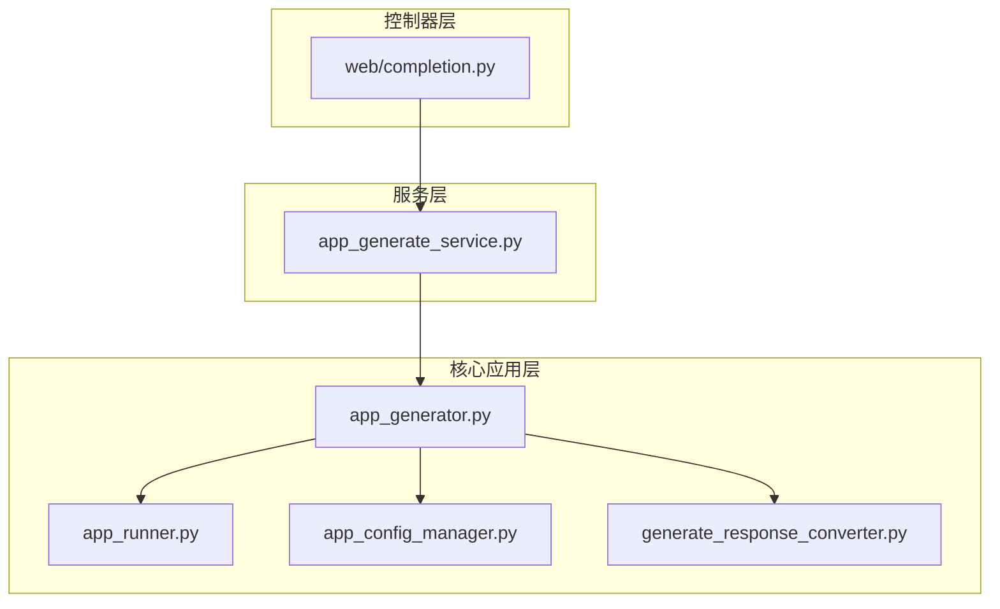
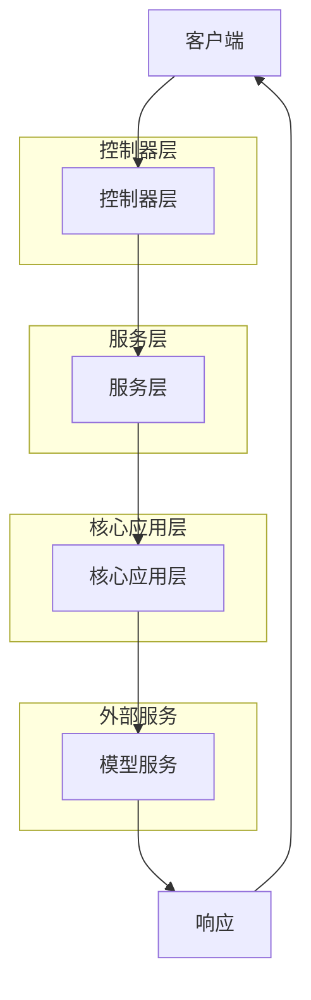
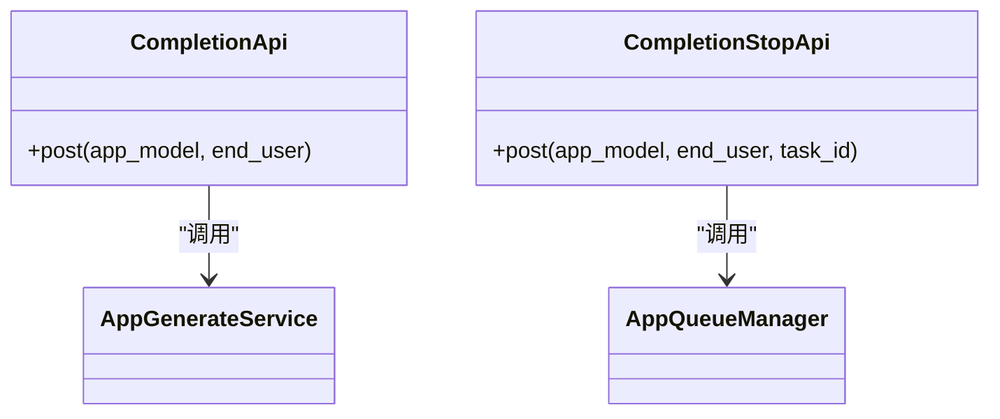
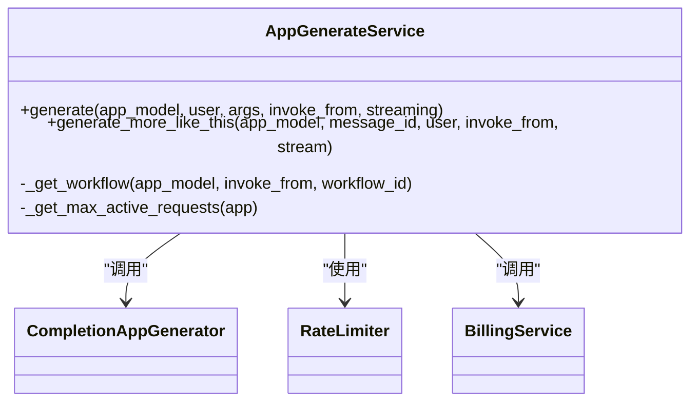
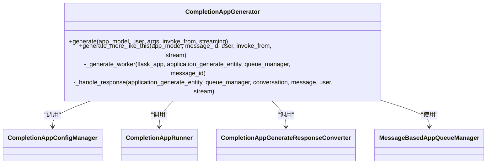
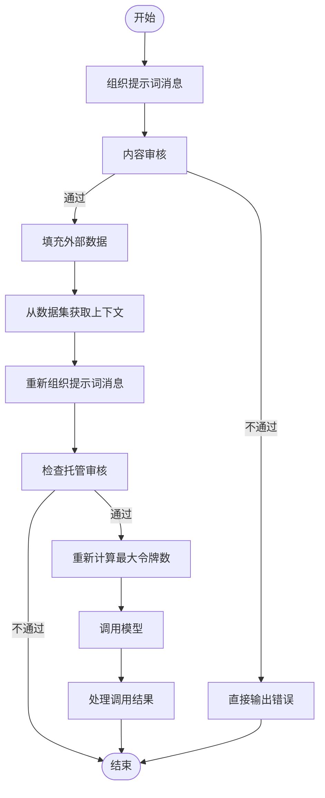
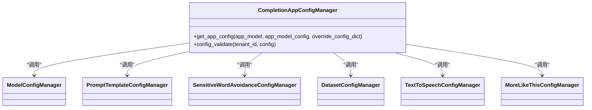
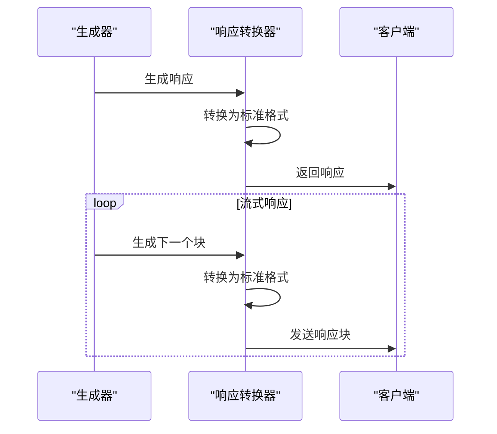
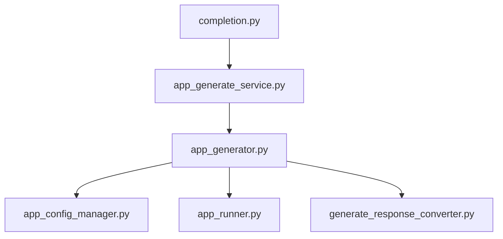
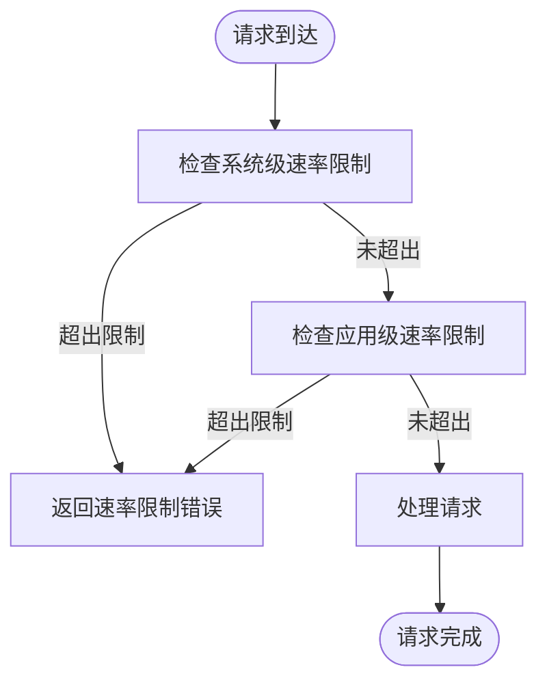

# 补全API

<cite>
**本文档中引用的文件**  
- [completion.py](file://api/controllers/web/completion.py)
- [app_generate_service.py](file://api/services/app_generate_service.py)
- [app_generator.py](file://api/core/app/apps/completion/app_generator.py)
- [app_runner.py](file://api/core/app/apps/completion/app_runner.py)
- [app_config_manager.py](file://api/core/app/apps/completion/app_config_manager.py)
- [generate_response_converter.py](file://api/core/app/apps/completion/generate_response_converter.py)
</cite>

## 目录
1. [简介](#简介)
2. [项目结构](#项目结构)
3. [核心组件](#核心组件)
4. [架构概述](#架构概述)
5. [详细组件分析](#详细组件分析)
6. [依赖分析](#依赖分析)
7. [性能考量](#性能考量)
8. [故障排除指南](#故障排除指南)
9. [结论](#结论)

## 简介
本文档详细描述了Dify平台中补全API的技术实现，重点介绍单次请求-响应模式下的文本生成端点。文档涵盖输入预处理、提示词工程、模型调用流程、参数配置、同步与流式响应机制、前端集成示例以及性能最佳实践。该API专为非对话式文本生成任务设计，通过核心应用生成器实现高效的内容生成。

## 项目结构
补全API相关代码分布在多个模块中，主要位于`api/controllers/web/`、`api/services/`和`api/core/app/apps/completion/`目录下。控制器层处理HTTP请求，服务层协调业务逻辑，核心应用层实现具体的生成逻辑。

**图示来源**  
- [completion.py](file://api/controllers/web/completion.py)
- [app_generate_service.py](file://api/services/app_generate_service.py)
- [app_generator.py](file://api/core/app/apps/completion/app_generator.py)

**本节来源**  
- [completion.py](file://api/controllers/web/completion.py)
- [app_generate_service.py](file://api/services/app_generate_service.py)

## 核心组件
补全API的核心组件包括控制器、服务、生成器、运行器、配置管理器和响应转换器。这些组件协同工作，完成从接收请求到返回生成结果的完整流程。

**本节来源**  
- [app_generate_service.py](file://api/services/app_generate_service.py)
- [app_generator.py](file://api/core/app/apps/completion/app_generator.py)
- [app_runner.py](file://api/core/app/apps/completion/app_runner.py)

## 架构概述
补全API采用分层架构，从上至下分为控制器层、服务层和核心应用层。控制器层负责接收和验证HTTP请求，服务层负责协调和调度，核心应用层负责具体的生成逻辑执行。

**图示来源**  
- [completion.py](file://api/controllers/web/completion.py)
- [app_generate_service.py](file://api/services/app_generate_service.py)

## 详细组件分析
### 补全API控制器分析
补全API控制器负责处理`/completion-messages`端点的POST请求，验证应用模式，解析请求参数，并调用服务层进行内容生成。

#### 控制器类图

**图示来源**  
- [completion.py](file://api/controllers/web/completion.py#L20-L237)

**本节来源**  
- [completion.py](file://api/controllers/web/completion.py#L20-L237)

### 应用生成服务分析
`AppGenerateService`是补全API的核心服务类，负责协调整个生成流程，包括速率限制检查、应用模式判断和具体生成器的调用。

#### 服务类图

**图示来源**  
- [app_generate_service.py](file://api/services/app_generate_service.py#L20-L251)

**本节来源**  
- [app_generate_service.py](file://api/services/app_generate_service.py#L20-L251)

### 补全应用生成器分析
`CompletionAppGenerator`是具体实现补全应用生成逻辑的类，负责初始化生成实体、管理队列和处理响应。

#### 生成器类图

**图示来源**  
- [app_generator.py](file://api/core/app/apps/completion/app_generator.py#L20-L348)

**本节来源**  
- [app_generator.py](file://api/core/app/apps/completion/app_generator.py#L20-L348)

### 补全应用运行器分析
`CompletionAppRunner`负责执行具体的生成任务，包括提示词组织、内容审核、上下文检索和模型调用。

#### 运行器流程图

**图示来源**  
- [app_runner.py](file://api/core/app/apps/completion/app_runner.py#L20-L179)

**本节来源**  
- [app_runner.py](file://api/core/app/apps/completion/app_runner.py#L20-L179)

### 配置管理器分析
`CompletionAppConfigManager`负责管理补全应用的配置，包括模型配置、提示词模板、敏感词规避等。

#### 配置管理器类图

**图示来源**  
- [app_config_manager.py](file://api/core/app/apps/completion/app_config_manager.py#L20-L121)

**本节来源**  
- [app_config_manager.py](file://api/core/app/apps/completion/app_config_manager.py#L20-L121)

### 响应转换器分析
`CompletionAppGenerateResponseConverter`负责将内部生成响应转换为客户端可理解的格式，支持阻塞和流式两种模式。

#### 响应转换器序列图

**图示来源**  
- [generate_response_converter.py](file://api/core/app/apps/completion/generate_response_converter.py#L20-L116)

**本节来源**  
- [generate_response_converter.py](file://api/core/app/apps/completion/generate_response_converter.py#L20-L116)

## 依赖分析
补全API的组件之间存在明确的依赖关系，形成了一条清晰的调用链。控制器依赖服务，服务依赖生成器，生成器依赖运行器和配置管理器。

**图示来源**  
- [completion.py](file://api/controllers/web/completion.py)
- [app_generate_service.py](file://api/services/app_generate_service.py)
- [app_generator.py](file://api/core/app/apps/completion/app_generator.py)

**本节来源**  
- [completion.py](file://api/controllers/web/completion.py)
- [app_generate_service.py](file://api/services/app_generate_service.py)
- [app_generator.py](file://api/core/app/apps/completion/app_generator.py)

## 性能考量
补全API在设计时考虑了多种性能优化措施，包括系统级和应用级的速率限制、最大活动请求数控制以及令牌数重新计算等机制。

### 速率限制机制

**本节来源**  
- [app_generate_service.py](file://api/services/app_generate_service.py#L20-L251)

## 故障排除指南
本节提供常见问题的解决方案和错误处理建议。

**本节来源**  
- [completion.py](file://api/controllers/web/completion.py#L20-L237)
- [app_generate_service.py](file://api/services/app_generate_service.py#L20-L251)

## 结论
补全API通过分层架构和模块化设计，实现了高效、可靠的非对话式文本生成功能。各组件职责明确，依赖关系清晰，便于维护和扩展。通过合理的性能优化和错误处理机制，确保了API的稳定性和可用性。