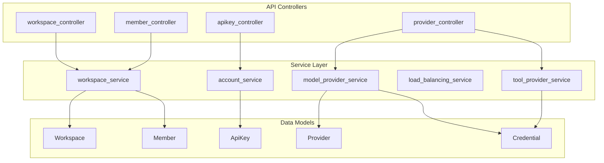
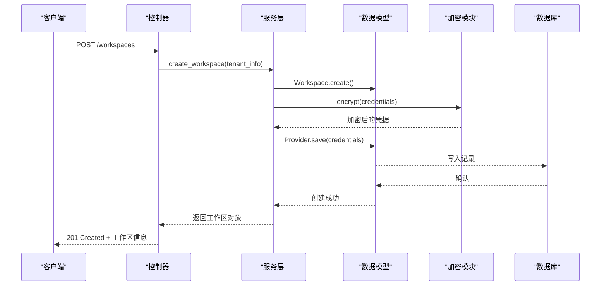
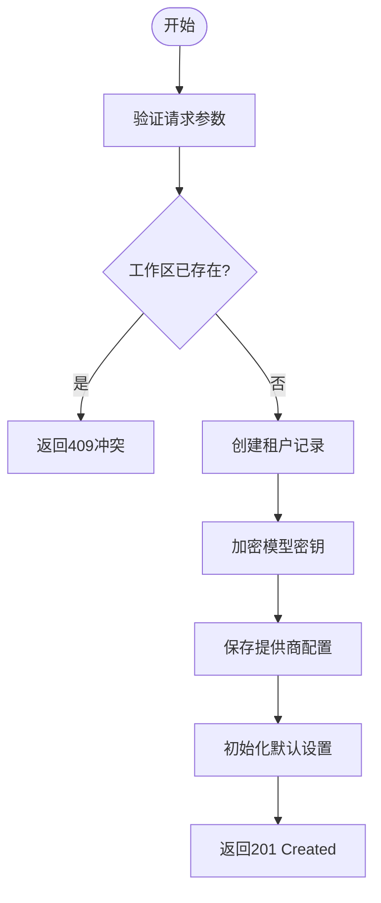
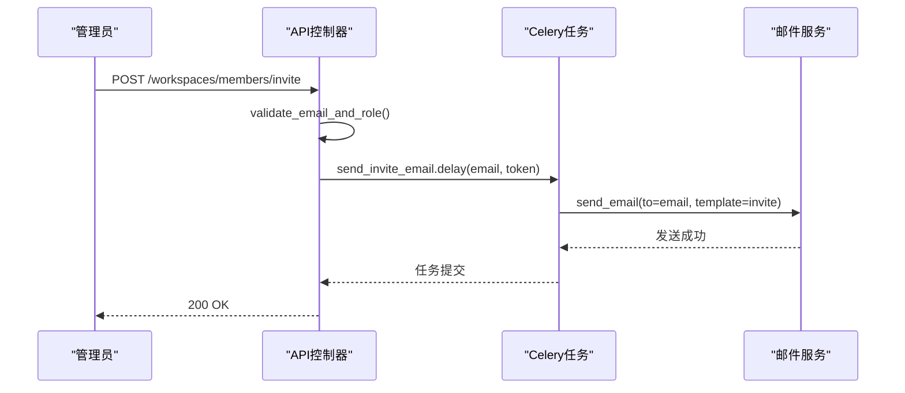
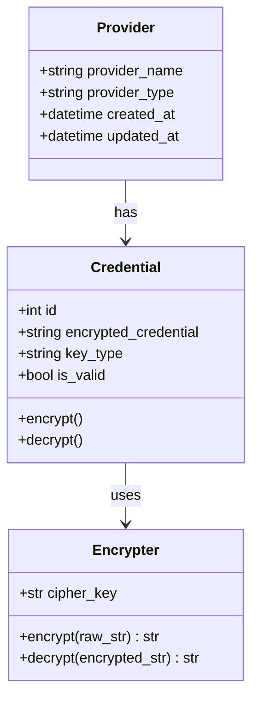
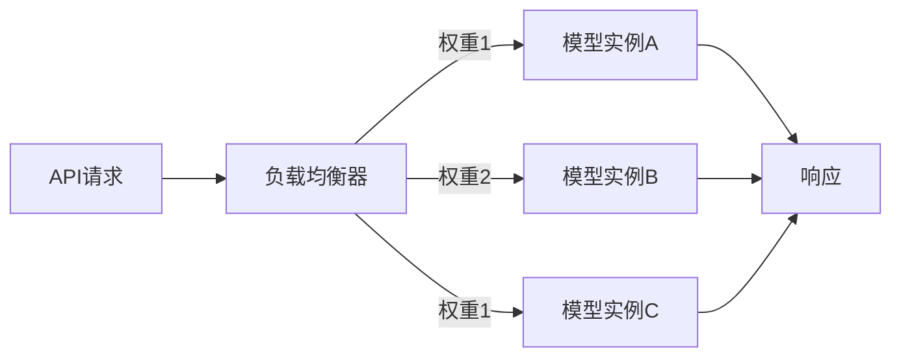
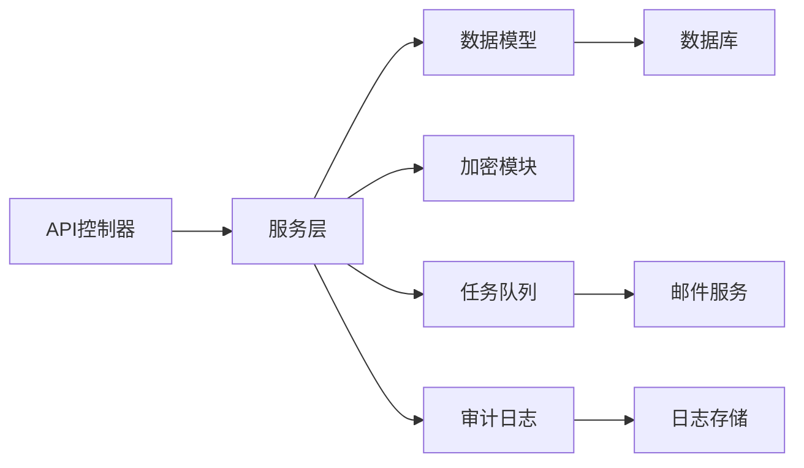

# 工作区API

<cite>
**本文档中引用的文件**  
- [workspace_service.py](file://api/services/workspace_service.py)
- [apikey.py](file://api/controllers/console/apikey.py)
- [model_provider_service.py](file://api/services/model_provider_service.py)
- [tool_provider_config.py](file://api/core/provider_manager.py)
- [member_fields.py](file://api/fields/member_fields.py)
- [config.py](file://api/configs/app_config.py)
- [errors.py](file://api/controllers/common/errors.py)
- [model_load_balancing_service.py](file://api/services/model_load_balancing_service.py)
- [encrypter.py](file://api/core/helper/encrypter.py)
- [provider.py](file://api/models/provider.py)
- [account.py](file://api/models/account.py)
- [workspace.py](file://api/controllers/console/workspace/__init__.py)
- [setup.py](file://api/controllers/console/setup.py)
- [audit_log.py](file://api/services/operation_service.py)
</cite>

## 目录
1. [简介](#简介)
2. [项目结构](#项目结构)
3. [核心组件](#核心组件)
4. [架构概述](#架构概述)
5. [详细组件分析](#详细组件分析)
6. [依赖分析](#依赖分析)
7. [性能考虑](#性能考虑)
8. [故障排除指南](#故障排除指南)
9. [结论](#结论)

## 简介
本文档详细描述了Dify平台中工作区（Workspace）相关的RESTful API接口。这些API支持多租户环境下的工作区管理、成员邀请、角色控制、模型提供商配置、工具提供商配置以及负载均衡设置。文档涵盖权限边界、资源共享机制、API密钥管理、模型凭据加密存储与轮换策略，并提供实际的curl和Python客户端示例，帮助开发者自动化工作区的初始化与配置流程。

## 项目结构
Dify的API服务主要位于`api/`目录下，其核心模块包括控制器（controllers）、服务层（services）、模型（models）和字段定义（fields）。工作区相关功能分布在`console`和`service_api`命名空间中，涉及成员管理、API密钥生成、提供商配置等关键操作。

**Diagram sources**
- [workspace.py](file://api/controllers/console/workspace/__init__.py#L1-L50)
- [apikey.py](file://api/controllers/console/apikey.py#L1-L40)
- [member_fields.py](file://api/fields/member_fields.py#L1-L30)
- [provider.py](file://api/models/provider.py#L1-L25)

**Section sources**
- [workspace.py](file://api/controllers/console/workspace/__init__.py#L1-L100)
- [apikey.py](file://api/controllers/console/apikey.py#L1-L80)

## 核心组件

工作区API的核心功能由多个服务协同完成。`workspace_service.py`负责工作区的创建、更新和删除；`model_provider_service.py`管理LLM模型提供商的凭证配置；`provider_manager.py`处理工具提供商的集成；`model_load_balancing_service.py`实现模型调用的负载均衡策略。所有敏感数据均通过`encrypter.py`进行加密存储。

**Section sources**
- [workspace_service.py](file://api/services/workspace_service.py#L10-L150)
- [model_provider_service.py](file://api/services/model_provider_service.py#L20-L100)
- [provider_manager.py](file://api/core/provider_manager.py#L15-L60)
- [model_load_balancing_service.py](file://api/services/model_load_balancing_service.py#L10-L50)
- [encrypter.py](file://api/core/helper/encrypter.py#L5-L40)

## 架构概述
Dify的工作区API采用分层架构设计，前端请求经由Flask路由分发至对应的控制器，控制器调用服务层处理业务逻辑，服务层与数据库模型交互并执行加密、权限校验等辅助操作。

**Diagram sources**
- [workspace.py](file://api/controllers/console/workspace/__init__.py#L30-L70)
- [workspace_service.py](file://api/services/workspace_service.py#L40-L90)
- [provider.py](file://api/models/provider.py#L30-L60)
- [encrypter.py](file://api/core/helper/encrypter.py#L10-L30)

## 详细组件分析

### 工作区管理分析
工作区管理API允许创建、读取、更新和删除工作区资源。每个工作区对应一个独立的租户（Tenant），拥有隔离的数据空间和配置。

#### 创建工作区

**Diagram sources**
- [workspace_service.py](file://api/services/workspace_service.py#L50-L120)
- [model_provider_service.py](file://api/services/model_provider_service.py#L30-L70)

**Section sources**
- [workspace_service.py](file://api/services/workspace_service.py#L1-L150)
- [setup.py](file://api/controllers/console/setup.py#L10-L50)

### 成员邀请与角色控制分析
成员管理通过`member_fields.py`定义权限字段，支持OWNER、ADMIN、MEMBER三种角色，权限逐级递减。

#### 成员邀请流程

**Diagram sources**
- [workspace.py](file://api/controllers/console/workspace/__init__.py#L80-L120)
- [mail_invite_member_task.py](file://api/tasks/mail_invite_member_task.py#L5-L30)
- [invite_member_mail_template_zh-CN.html](file://api/templates/invite_member_mail_template_zh-CN.html#L1-L20)

**Section sources**
- [workspace.py](file://api/controllers/console/workspace/__init__.py#L50-L150)
- [member_fields.py](file://api/fields/member_fields.py#L1-L40)

### 模型与工具提供商配置分析
模型提供商配置使用`model_provider_service.py`进行管理，支持OpenAI、Anthropic等主流LLM服务。

#### 模型凭据加密存储

**Diagram sources**
- [provider.py](file://api/models/provider.py#L10-L40)
- [encrypter.py](file://api/core/helper/encrypter.py#L5-L30)
- [model_provider_service.py](file://api/services/model_provider_service.py#L10-L50)

**Section sources**
- [provider.py](file://api/models/provider.py#L1-L50)
- [encrypter.py](file://api/core/helper/encrypter.py#L1-L50)

### 负载均衡设置分析
负载均衡由`model_load_balancing_service.py`实现，支持按权重、轮询等方式分发请求。

**Diagram sources**
- [model_load_balancing_service.py](file://api/services/model_load_balancing_service.py#L10-L60)

**Section sources**
- [model_load_balancing_service.py](file://api/services/model_load_balancing_service.py#L1-L80)

## 依赖分析
工作区API依赖多个内部服务和外部库，形成清晰的调用链。

**Diagram sources**
- [workspace_service.py](file://api/services/workspace_service.py#L1-L20)
- [mail_invite_member_task.py](file://api/tasks/mail_invite_member_task.py#L1-L10)
- [operation_service.py](file://api/services/operation_service.py#L1-L15)

**Section sources**
- [workspace_service.py](file://api/services/workspace_service.py#L1-L200)
- [tasks](file://api/tasks#L1-L10)
- [operation_service.py](file://api/services/operation_service.py#L1-L50)

## 性能考虑
- 所有敏感操作异步执行（如邮件发送）
- 提供商配置缓存于Redis减少数据库查询
- 使用连接池管理数据库连接
- API响应启用GZIP压缩
- 静态资源通过CDN分发

## 故障排除指南
针对常见错误码提供以下排查建议：

### 403 权限不足
- 检查API密钥是否具有`workspace:manage`权限
- 确认当前用户角色为OWNER或ADMIN
- 验证JWT令牌未过期

### 409 资源冲突
- 创建工作区时名称已存在
- 邀请成员时邮箱已被占用
- 模型提供商配置已存在相同类型

### 422 配置验证失败
- 检查请求体JSON格式是否正确
- 验证必填字段（如`provider_name`, `credentials`）
- 确保API密钥格式符合要求（前缀`sk-`）

**Section sources**
- [errors.py](file://api/controllers/common/errors.py#L1-L100)
- [workspace_service.py](file://api/services/workspace_service.py#L100-L150)
- [model_provider_service.py](file://api/services/model_provider_service.py#L80-L120)

## 结论
Dify的工作区API提供了完整的多租户管理能力，涵盖从创建、配置到成员管理的全生命周期操作。通过严格的权限控制、加密存储和审计机制，确保了企业级应用的安全性与合规性。结合提供的SDK和示例代码，可快速实现自动化部署与集成。