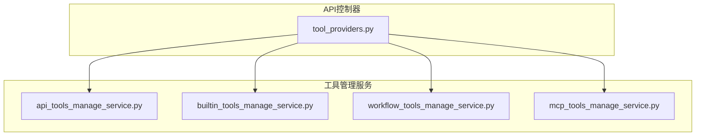
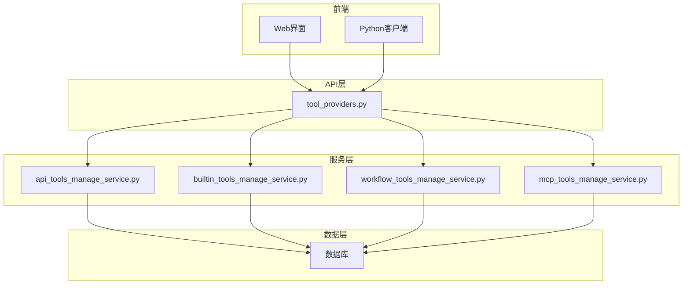
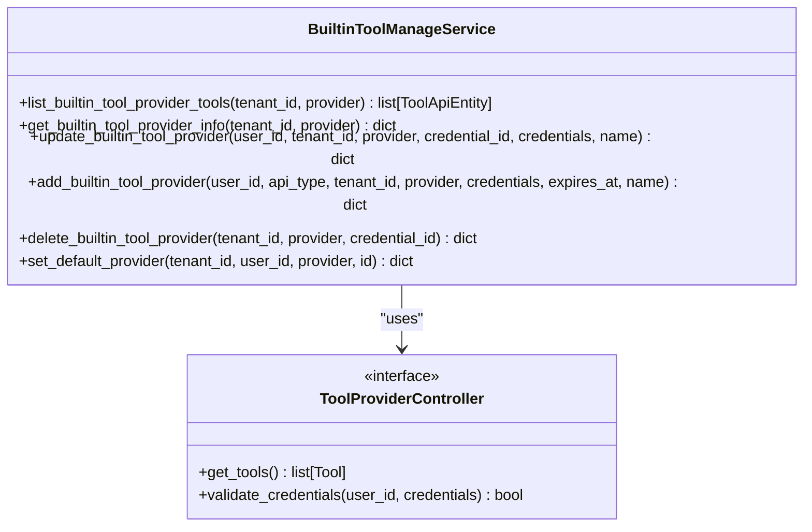
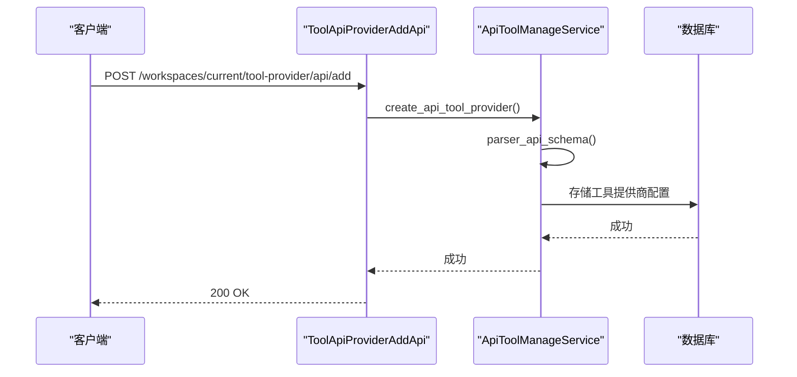
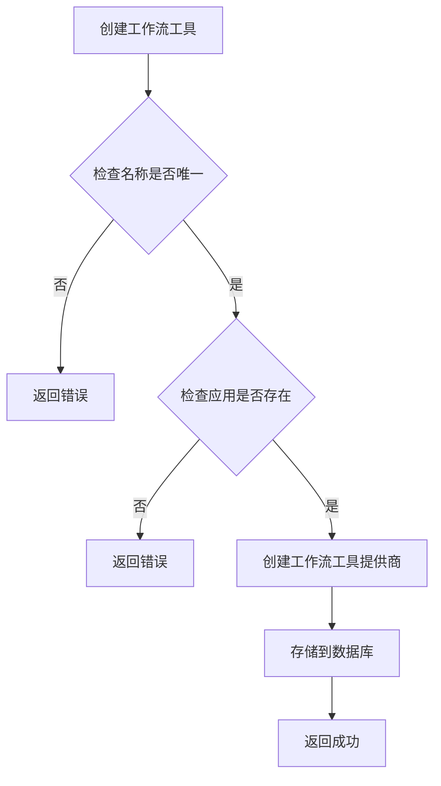
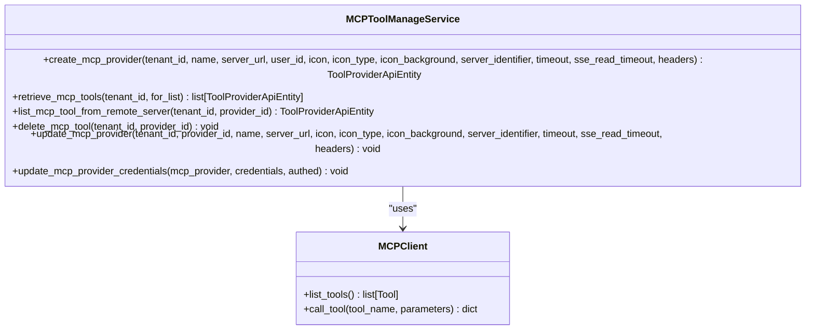
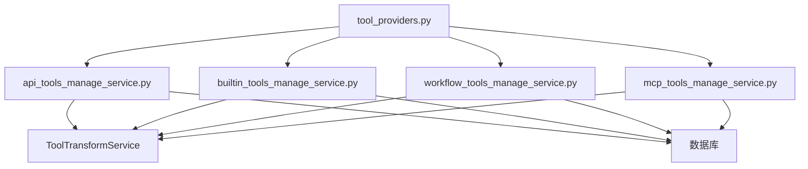

# 工具提供商API

<cite>
**本文档中引用的文件**  
- [tool_providers.py](file://api/controllers/console/workspace/tool_providers.py)
- [api_tools_manage_service.py](file://api/services/tools/api_tools_manage_service.py)
- [builtin_tools_manage_service.py](file://api/services/tools/builtin_tools_manage_service.py)
- [workflow_tools_manage_service.py](file://api/services/tools/workflow_tools_manage_service.py)
- [mcp_tools_manage_service.py](file://api/services/tools/mcp_tools_manage_service.py)
</cite>

## 目录
1. [简介](#简介)
2. [项目结构](#项目结构)
3. [核心组件](#核心组件)
4. [架构概述](#架构概述)
5. [详细组件分析](#详细组件分析)
6. [依赖分析](#依赖分析)
7. [性能考虑](#性能考虑)
8. [故障排除指南](#故障排除指南)
9. [结论](#结论)
10. [附录](#附录)（如有必要）

## 简介
本文档详细介绍了Dify工作区中工具提供商的RESTful API，涵盖内置工具、自定义工具和MCP工具提供商的配置、启用/禁用和参数管理。文档详细说明了每个端点的HTTP方法、URL路径、请求头、请求体模式和响应格式，特别是工具提供商的依赖关系和加载顺序。提供了实际的curl示例和Python客户端代码示例，展示如何通过API配置代码执行、HTTP请求等工具提供商。解释了工具提供商配置的验证机制和安全沙箱设置。文档化了工具调用的审计日志和使用统计。

## 项目结构
Dify的API控制器和工具管理服务位于`api/controllers/console/workspace/`和`api/services/tools/`目录下。主要文件包括`tool_providers.py`，它定义了工具提供商的RESTful API端点，以及`api_tools_manage_service.py`、`builtin_tools_manage_service.py`、`workflow_tools_manage_service.py`和`mcp_tools_manage_service.py`，它们分别处理自定义API工具、内置工具、工作流工具和MCP工具的业务逻辑。



**Diagram sources**
- [tool_providers.py](file://api/controllers/console/workspace/tool_providers.py)
- [api_tools_manage_service.py](file://api/services/tools/api_tools_manage_service.py)
- [builtin_tools_manage_service.py](file://api/services/tools/builtin_tools_manage_service.py)
- [workflow_tools_manage_service.py](file://api/services/tools/workflow_tools_manage_service.py)
- [mcp_tools_manage_service.py](file://api/services/tools/mcp_tools_manage_service.py)

**Section sources**
- [tool_providers.py](file://api/controllers/console/workspace/tool_providers.py)
- [api_tools_manage_service.py](file://api/services/tools/api_tools_manage_service.py)

## 核心组件
Dify的工具提供商API由多个核心组件构成，包括内置工具、自定义工具、工作流工具和MCP工具。每个工具提供商都有其特定的配置和管理接口。内置工具如代码执行和HTTP请求由`BuiltinToolManageService`管理，自定义工具通过OpenAPI规范定义，由`ApiToolManageService`处理。工作流工具允许将整个工作流作为工具使用，由`WorkflowToolManageService`管理。MCP工具提供商通过MCP协议与外部服务集成，由`MCPToolManageService`管理。

**Section sources**
- [builtin_tools_manage_service.py](file://api/services/tools/builtin_tools_manage_service.py)
- [api_tools_manage_service.py](file://api/services/tools/api_tools_manage_service.py)
- [workflow_tools_manage_service.py](file://api/services/tools/workflow_tools_manage_service.py)
- [mcp_tools_manage_service.py](file://api/services/tools/mcp_tools_manage_service.py)

## 架构概述
Dify的工具提供商API采用分层架构，前端通过RESTful API与后端交互，后端服务处理业务逻辑并与数据库交互。API控制器负责路由和请求验证，工具管理服务处理具体的业务逻辑，如创建、更新和删除工具提供商。工具提供商的配置和状态存储在数据库中，通过加密保护敏感信息。



**Diagram sources**
- [tool_providers.py](file://api/controllers/console/workspace/tool_providers.py)
- [api_tools_manage_service.py](file://api/services/tools/api_tools_manage_service.py)
- [builtin_tools_manage_service.py](file://api/services/tools/builtin_tools_manage_service.py)
- [workflow_tools_manage_service.py](file://api/services/tools/workflow_tools_manage_service.py)
- [mcp_tools_manage_service.py](file://api/services/tools/mcp_tools_manage_service.py)

## 详细组件分析

### 内置工具提供商分析
内置工具提供商允许用户配置和使用预定义的工具，如代码执行和HTTP请求。通过`/workspaces/current/tool-provider/builtin/<path:provider>/add`端点添加新的内置工具提供商，需要提供认证凭据和工具名称。`/workspaces/current/tool-provider/builtin/<path:provider>/update`端点用于更新现有工具提供商的配置。

#### 内置工具提供商类图


**Diagram sources**
- [builtin_tools_manage_service.py](file://api/services/tools/builtin_tools_manage_service.py)

**Section sources**
- [builtin_tools_manage_service.py](file://api/services/tools/builtin_tools_manage_service.py)

### 自定义工具提供商分析
自定义工具提供商允许用户通过OpenAPI规范定义自己的工具。通过`/workspaces/current/tool-provider/api/add`端点添加新的自定义工具提供商，需要提供API规范、认证方式和图标。`/workspaces/current/tool-provider/api/update`端点用于更新现有工具提供商的配置。

#### 自定义工具提供商序列图


**Diagram sources**
- [tool_providers.py](file://api/controllers/console/workspace/tool_providers.py)
- [api_tools_manage_service.py](file://api/services/tools/api_tools_manage_service.py)

**Section sources**
- [tool_providers.py](file://api/controllers/console/workspace/tool_providers.py)
- [api_tools_manage_service.py](file://api/services/tools/api_tools_manage_service.py)

### 工作流工具提供商分析
工作流工具提供商允许将整个工作流作为工具使用。通过`/workspaces/current/tool-provider/workflow/create`端点创建新的工作流工具提供商，需要提供工作流应用ID、名称、描述和参数。`/workspaces/current/tool-provider/workflow/update`端点用于更新现有工作流工具提供商的配置。

#### 工作流工具提供商流程图


**Diagram sources**
- [workflow_tools_manage_service.py](file://api/services/tools/workflow_tools_manage_service.py)

**Section sources**
- [workflow_tools_manage_service.py](file://api/services/tools/workflow_tools_manage_service.py)

### MCP工具提供商分析
MCP工具提供商通过MCP协议与外部服务集成。通过`/workspaces/current/tool-provider/mcp`端点创建新的MCP工具提供商，需要提供服务器URL、名称和图标。`/workspaces/current/tool-provider/mcp/update/<path:provider_id>`端点用于更新现有MCP工具提供商的配置。

#### MCP工具提供商类图


**Diagram sources**
- [mcp_tools_manage_service.py](file://api/services/tools/mcp_tools_manage_service.py)

**Section sources**
- [mcp_tools_manage_service.py](file://api/services/tools/mcp_tools_manage_service.py)

## 依赖分析
工具提供商API的各个组件之间存在明确的依赖关系。API控制器依赖于工具管理服务来处理业务逻辑，工具管理服务依赖于数据库来存储和检索工具提供商的配置。内置工具、自定义工具、工作流工具和MCP工具的管理服务都依赖于`ToolTransformService`来转换工具实体和API实体。



**Diagram sources**
- [tool_providers.py](file://api/controllers/console/workspace/tool_providers.py)
- [api_tools_manage_service.py](file://api/services/tools/api_tools_manage_service.py)
- [builtin_tools_manage_service.py](file://api/services/tools/builtin_tools_manage_service.py)
- [workflow_tools_manage_service.py](file://api/services/tools/workflow_tools_manage_service.py)
- [mcp_tools_manage_service.py](file://api/services/tools/mcp_tools_manage_service.py)

**Section sources**
- [tool_providers.py](file://api/controllers/console/workspace/tool_providers.py)
- [api_tools_manage_service.py](file://api/services/tools/api_tools_manage_service.py)
- [builtin_tools_manage_service.py](file://api/services/tools/builtin_tools_manage_service.py)
- [workflow_tools_manage_service.py](file://api/services/tools/workflow_tools_manage_service.py)
- [mcp_tools_manage_service.py](file://api/services/tools/mcp_tools_manage_service.py)

## 性能考虑
工具提供商API的性能主要受数据库查询和外部API调用的影响。为了优化性能，建议使用缓存来存储频繁访问的工具提供商配置。对于自定义工具提供商，解析OpenAPI规范可能会消耗较多资源，建议在添加新工具提供商时进行异步处理。MCP工具提供商的性能受外部服务器响应时间的影响，建议设置合理的超时时间。

## 故障排除指南
针对常见的错误响应，提供以下故障排除指南：

- **403权限不足**：确保用户具有管理员或所有者权限。检查`is_admin_or_owner`属性是否正确设置。
- **400配置无效**：验证请求体中的配置是否符合API规范。检查必填字段是否缺失，数据类型是否正确。
- **422工具不可用**：检查工具提供商是否已正确配置和启用。对于MCP工具提供商，确保服务器URL可访问且认证成功。

**Section sources**
- [tool_providers.py](file://api/controllers/console/workspace/tool_providers.py)
- [api_tools_manage_service.py](file://api/services/tools/api_tools_manage_service.py)
- [builtin_tools_manage_service.py](file://api/services/tools/builtin_tools_manage_service.py)
- [workflow_tools_manage_service.py](file://api/services/tools/workflow_tools_manage_service.py)
- [mcp_tools_manage_service.py](file://api/services/tools/mcp_tools_manage_service.py)

## 结论
Dify的工具提供商API提供了灵活和强大的工具管理功能，支持内置工具、自定义工具、工作流工具和MCP工具。通过RESTful API，用户可以方便地配置、启用/禁用和管理各种工具提供商。文档详细说明了每个端点的使用方法和常见问题的解决方案，帮助用户更好地利用Dify的工具功能。

## 附录
### curl示例
```bash
# 添加内置工具提供商
curl -X POST https://api.dify.ai/v1/workspaces/current/tool-provider/builtin/code/add \
  -H "Authorization: Bearer <your_api_key>" \
  -H "Content-Type: application/json" \
  -d '{
    "credentials": {
      "api_key": "your_api_key"
    },
    "name": "My Code Interpreter",
    "type": "api_key"
  }'

# 添加自定义工具提供商
curl -X POST https://api.dify.ai/v1/workspaces/current/tool-provider/api/add \
  -H "Authorization: Bearer <your_api_key>" \
  -H "Content-Type: application/json" \
  -d '{
    "provider": "My Custom API",
    "icon": {
      "content": "🚀",
      "background": "#FFFFFF"
    },
    "credentials": {
      "auth_type": "api_key",
      "api_key_header": "X-API-KEY",
      "api_key_value": "your_api_key"
    },
    "schema_type": "openapi",
    "schema": "your_openapi_schema"
  }'
```

### Python客户端代码示例
```python
import requests

class DifyClient:
    def __init__(self, api_key, base_url="https://api.dify.ai/v1"):
        self.api_key = api_key
        self.base_url = base_url
        self.headers = {
            "Authorization": f"Bearer {api_key}",
            "Content-Type": "application/json"
        }

    def add_builtin_tool(self, provider, credentials, name, type):
        url = f"{self.base_url}/workspaces/current/tool-provider/builtin/{provider}/add"
        data = {
            "credentials": credentials,
            "name": name,
            "type": type
        }
        response = requests.post(url, headers=self.headers, json=data)
        return response.json()

    def add_custom_tool(self, provider, icon, credentials, schema_type, schema):
        url = f"{self.base_url}/workspaces/current/tool-provider/api/add"
        data = {
            "provider": provider,
            "icon": icon,
            "credentials": credentials,
            "schema_type": schema_type,
            "schema": schema
        }
        response = requests.post(url, headers=self.headers, json=data)
        return response.json()

# 使用示例
client = DifyClient("your_api_key")
# 添加代码解释器工具
client.add_builtin_tool("code", {"api_key": "your_api_key"}, "My Code Interpreter", "api_key")
# 添加自定义API工具
client.add_custom_tool("My Custom API", {"content": "🚀", "background": "#FFFFFF"}, {"auth_type": "api_key", "api_key_header": "X-API-KEY", "api_key_value": "your_api_key"}, "openapi", "your_openapi_schema")
```