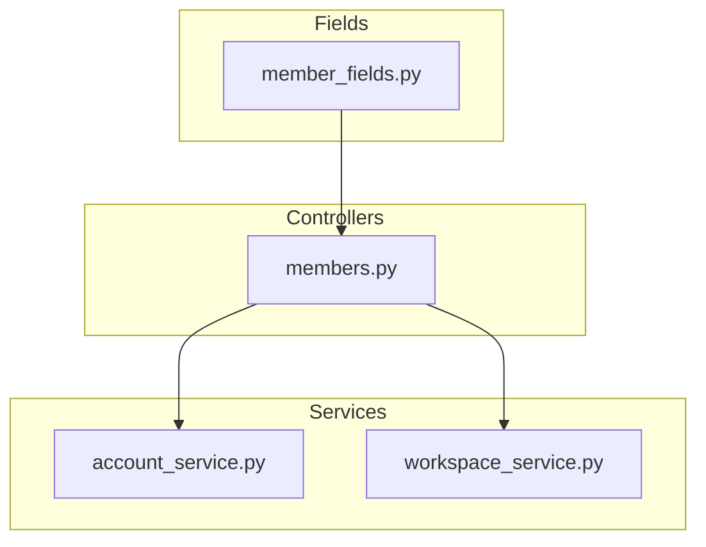
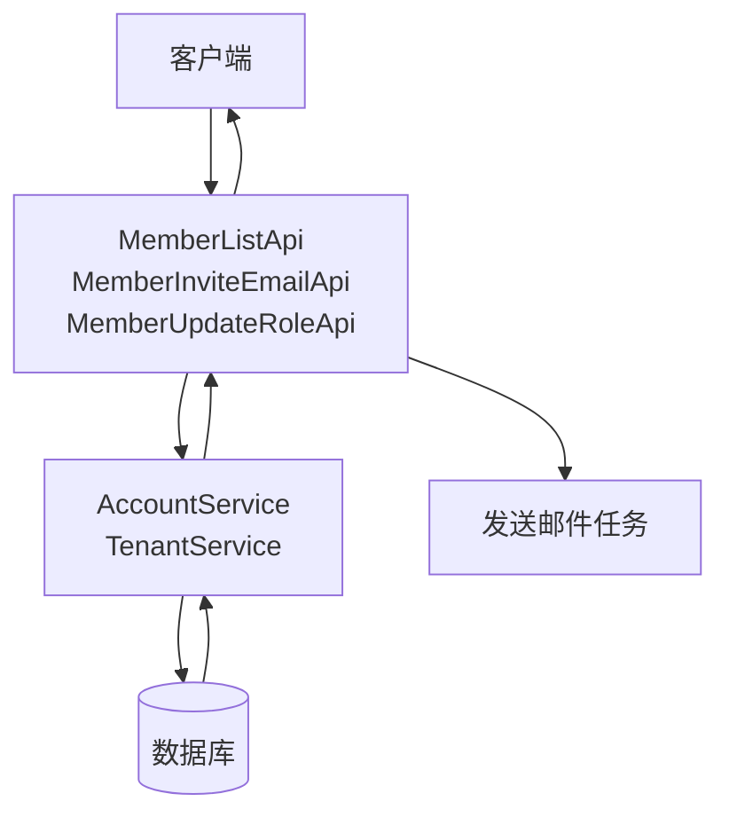
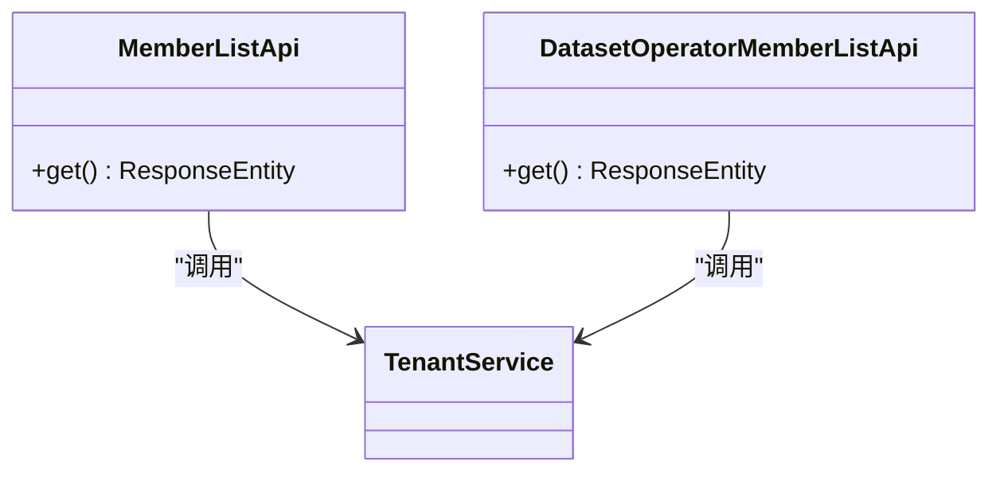
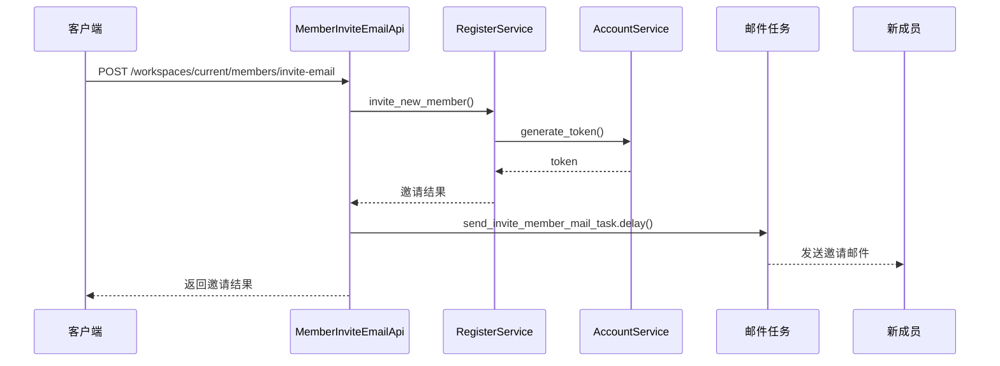
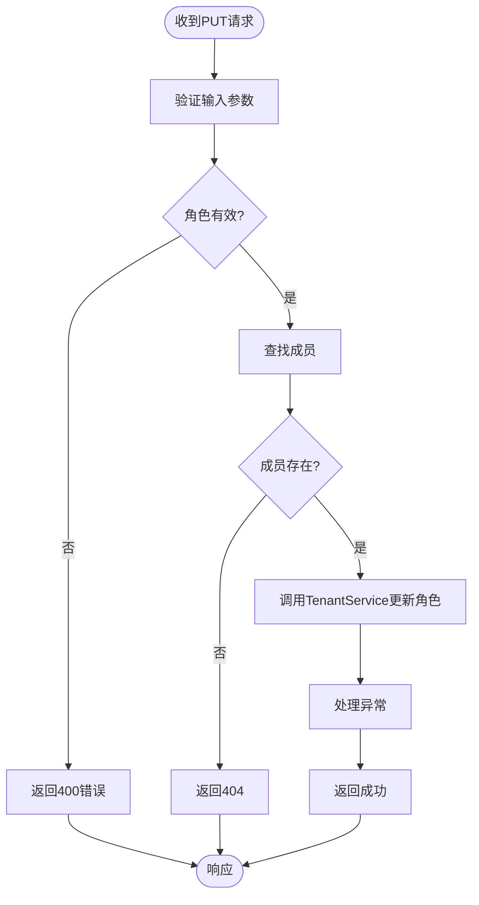
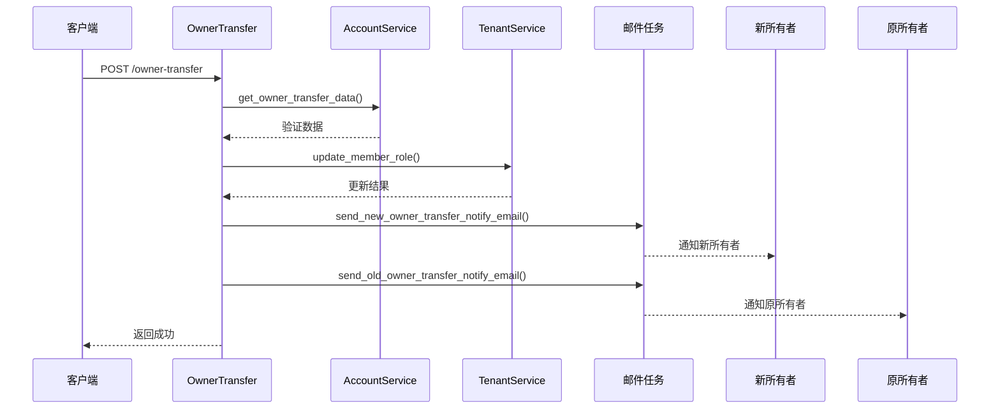
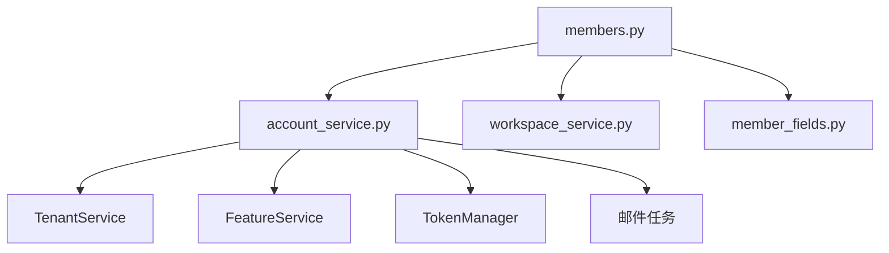

# 成员管理API

<cite>
**本文档中引用的文件**  
- [members.py](file://api/controllers/console/workspace/members.py)
- [account_service.py](file://api/services/account_service.py)
- [workspace_service.py](file://api/services/workspace_service.py)
- [member_fields.py](file://api/fields/member_fields.py)
</cite>

## 目录
1. [简介](#简介)
2. [项目结构](#项目结构)
3. [核心组件](#核心组件)
4. [架构概述](#架构概述)
5. [详细组件分析](#详细组件分析)
6. [依赖分析](#依赖分析)
7. [性能考虑](#性能考虑)
8. [故障排除指南](#故障排除指南)
9. [结论](#结论)

## 简介
本文档详细描述了Dify平台中工作区成员管理的RESTful API接口。涵盖成员邀请、角色分配、权限控制、成员列表查询、所有者转移等功能。重点说明了邀请流程中的邮箱验证机制、角色继承规则、成员状态转换逻辑、邀请链接有效期管理及撤销机制。同时提供常见错误响应的故障排除指南。

## 项目结构
成员管理功能主要分布在控制器、服务层和字段定义模块中，通过分层架构实现职责分离。

**Diagram sources**
- [members.py](file://api/controllers/console/workspace/members.py)
- [account_service.py](file://api/services/account_service.py)
- [workspace_service.py](file://api/services/workspace_service.py)
- [member_fields.py](file://api/fields/member_fields.py)

**Section sources**
- [members.py](file://api/controllers/console/workspace/members.py)
- [account_service.py](file://api/services/account_service.py)

## 核心组件
成员管理API的核心组件包括成员列表查询、成员邀请、角色更新、所有者转移等REST端点，通过服务层与数据库交互，并使用字段定义进行序列化。

**Section sources**
- [members.py](file://api/controllers/console/workspace/members.py#L1-L313)
- [account_service.py](file://api/services/account_service.py#L1-L1386)

## 架构概述
成员管理功能采用典型的MVC架构模式，控制器接收HTTP请求，调用服务层处理业务逻辑，最终通过数据库模型持久化数据。

**Diagram sources**
- [members.py](file://api/controllers/console/workspace/members.py#L1-L313)
- [account_service.py](file://api/services/account_service.py#L1-L1386)

## 详细组件分析

### 成员列表查询分析
提供获取当前工作区所有成员的API接口，返回成员基本信息及角色。

#### 成员列表API

**Diagram sources**
- [members.py](file://api/controllers/console/workspace/members.py#L35-L47)

**Section sources**
- [members.py](file://api/controllers/console/workspace/members.py#L35-L47)

### 成员邀请分析
实现通过邮箱批量邀请新成员的功能，包含邮箱验证和邀请链接生成。

#### 成员邀请流程

**Diagram sources**
- [members.py](file://api/controllers/console/workspace/members.py#L50-L88)
- [account_service.py](file://api/services/account_service.py#L1000-L1100)

**Section sources**
- [members.py](file://api/controllers/console/workspace/members.py#L50-L88)

### 角色管理分析
提供更新成员角色的API接口，实现权限控制功能。

#### 角色更新流程

**Diagram sources**
- [members.py](file://api/controllers/console/workspace/members.py#L130-L150)

**Section sources**
- [members.py](file://api/controllers/console/workspace/members.py#L130-L150)

### 所有者转移分析
实现工作区所有者转移功能，包含安全验证机制。

#### 所有者转移流程

**Diagram sources**
- [members.py](file://api/controllers/console/workspace/members.py#L240-L290)
- [account_service.py](file://api/services/account_service.py#L1200-L1300)

**Section sources**
- [members.py](file://api/controllers/console/workspace/members.py#L240-L290)

## 依赖分析
成员管理功能依赖于账户服务、租户服务和特征服务等多个核心服务组件。

**Diagram sources**
- [members.py](file://api/controllers/console/workspace/members.py)
- [account_service.py](file://api/services/account_service.py)

**Section sources**
- [members.py](file://api/controllers/console/workspace/members.py)
- [account_service.py](file://api/services/account_service.py)

## 性能考虑
- 使用Redis缓存刷新令牌，提高认证性能
- 对关键操作（如登录、密码重置）实施速率限制，防止滥用
- 批量邀请成员时采用异步邮件发送，避免阻塞主请求
- 数据库查询优化，减少不必要的JOIN操作

## 故障排除指南
针对成员管理API的常见错误响应提供详细的故障排除建议。

### 常见错误响应
| 错误码 | 错误类型 | 原因 | 解决方案 |
|--------|---------|------|----------|
| 403 | 权限不足 | 当前用户无权执行操作 | 检查用户角色是否具有相应权限 |
| 409 | 成员已存在 | 要邀请的邮箱已存在于工作区 | 使用现有成员或邀请其他邮箱 |
| 422 | 邮箱格式无效 | 提供的邮箱地址格式不正确 | 验证邮箱地址格式是否符合标准 |
| 400 | 无效角色 | 指定的角色不存在或不允许 | 检查角色名称是否正确且允许分配 |
| 429 | 请求过于频繁 | 超出速率限制 | 等待一段时间后重试 |

**Section sources**
- [members.py](file://api/controllers/console/workspace/members.py)
- [account_service.py](file://api/services/account_service.py)

## 结论
Dify的成员管理API提供了完整的工作区成员管理功能，包括成员邀请、角色分配、权限控制和所有者转移等核心功能。通过清晰的RESTful设计和安全的验证机制，确保了工作区成员管理的安全性和易用性。API设计考虑了性能和可扩展性，适合企业级应用。