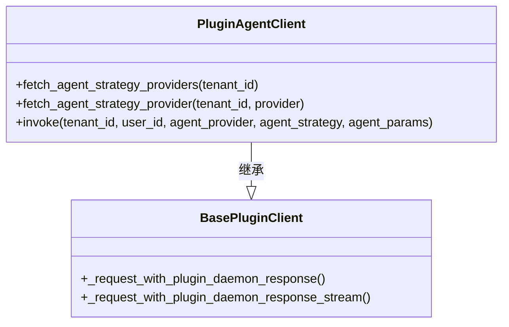
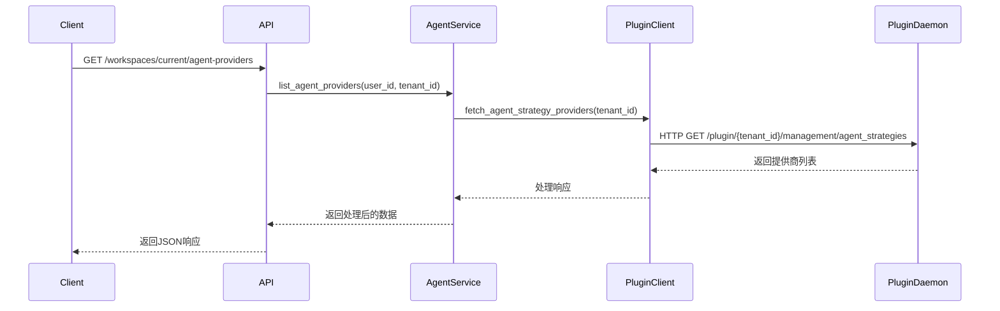
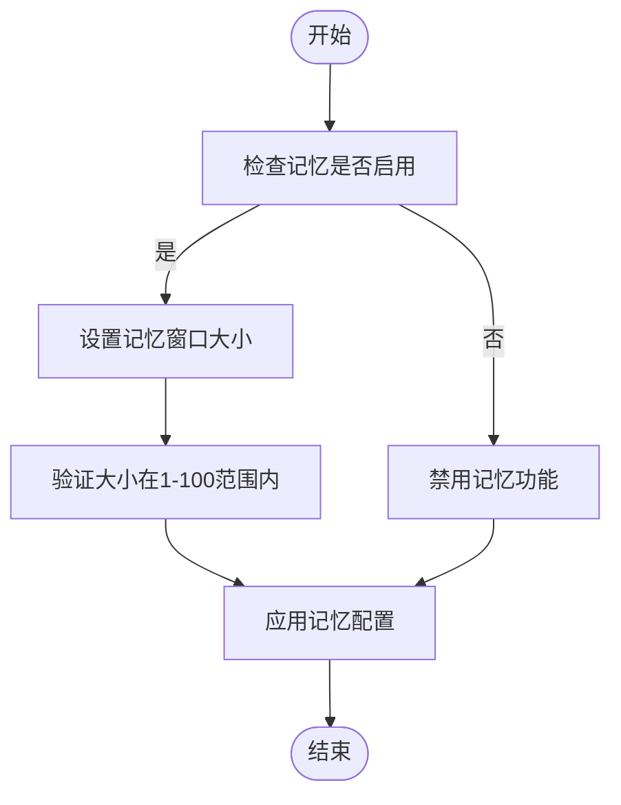
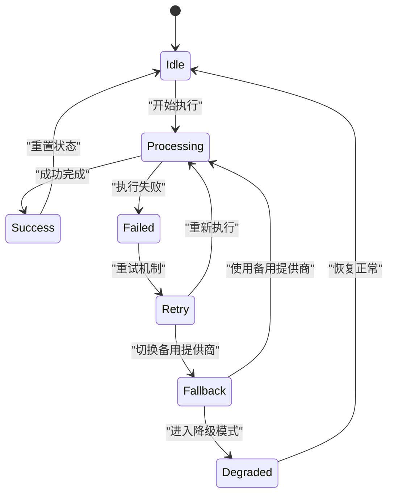

# 智能体提供商API

<cite>
**本文档中引用的文件**
- [agent_providers.py](file://api/controllers/console/workspace/agent_providers.py)
- [agent_service.py](file://api/services/agent_service.py)
- [agent.py](file://api/core/plugin/impl/agent.py)
- [provider_entities.py](file://api/core/entities/provider_entities.py)
</cite>

## 目录
1. [简介](#简介)
2. [核心组件](#核心组件)
3. [智能体提供商配置](#智能体提供商配置)
4. [插件管理](#插件管理)
5. [执行策略设置](#执行策略设置)
6. [上下文与记忆机制](#上下文与记忆机制)
7. [超时与错误恢复](#超时与错误恢复)
8. [故障排除指南](#故障排除指南)

## 简介
Dify工作区智能体提供商API为开发者提供了配置和管理智能体功能的RESTful接口。该API支持智能体与工具提供商的集成，允许配置函数调用能力、ReAct执行模式、上下文管理及记忆机制。通过本API，用户可以获取智能体提供商列表、查询特定提供商详情，并进行相关配置操作。

## 核心组件

智能体提供商API的核心功能由多个关键组件构成，包括控制器层、服务层和插件客户端。控制器层负责处理HTTP请求并返回响应；服务层封装业务逻辑；插件客户端则与底层插件系统通信以获取提供商信息。

**Section sources**
- [agent_providers.py](file://api/controllers/console/workspace/agent_providers.py)
- [agent_service.py](file://api/services/agent_service.py)
- [agent.py](file://api/core/plugin/impl/agent.py)

## 智能体提供商配置

### 获取智能体提供商列表
此端点用于获取当前工作区可用的智能体提供商列表。

- **HTTP方法**: `GET`
- **URL路径**: `/workspaces/current/agent-providers`
- **请求头**: 
  - `Authorization: Bearer <access_token>`
- **请求体**: 无
- **响应格式**: JSON数组，包含每个提供商的基本信息

```json
[
  {
    "plugin_id": "test_plugin",
    "declaration": {
      "identity": {
        "name": "provider_name"
      },
      "strategies": [
        {
          "identity": {
            "name": "strategy_name",
            "provider": "provider_name"
          }
        }
      ]
    }
  }
]
```

### 获取特定智能体提供商
此端点用于获取指定名称的智能体提供商详细信息。

- **HTTP方法**: `GET`
- **URL路径**: `/workspaces/current/agent-provider/<path:provider_name>`
- **请求头**: 
  - `Authorization: Bearer <access_token>`
- **请求体**: 无
- **响应格式**: JSON对象，包含提供商的完整声明和策略信息

```json
{
  "plugin_id": "test_plugin",
  "declaration": {
    "identity": {
      "name": "provider_name"
    },
    "strategies": [
      {
        "identity": {
          "name": "strategy_name",
          "provider": "provider_name"
        },
        "parameters": [
          {
            "name": "param_name",
            "type": "text_input",
            "required": true,
            "label": {
              "en-US": "Parameter Name",
              "zh-CN": "参数名称"
            }
          }
        ]
      }
    ]
  }
}
```

**Section sources**
- [agent_providers.py](file://api/controllers/console/workspace/agent_providers.py#L15-L35)
- [agent_service.py](file://api/services/agent_service.py#L150-L175)

## 插件管理

插件管理功能通过`PluginAgentClient`类实现，该类继承自`BasePluginClient`，提供与插件守护进程通信的能力。

### 插件客户端功能
- `fetch_agent_strategy_providers`: 获取租户下的所有智能体策略提供商
- `fetch_agent_strategy_provider`: 获取特定智能体策略提供商
- `invoke`: 调用智能体执行

这些方法通过HTTP请求与插件守护进程交互，使用transformer函数处理响应数据，确保提供商名称格式统一为`plugin_id/provider_name`。



**Diagram sources**
- [agent.py](file://api/core/plugin/impl/agent.py#L15-L117)

**Section sources**
- [agent.py](file://api/core/plugin/impl/agent.py#L15-L117)

## 执行策略设置

执行策略设置允许用户配置智能体的行为模式，包括函数调用能力和ReAct执行模式。

### 函数调用配置
通过智能体提供商的参数定义，可以配置函数调用所需的参数。参数类型包括：
- `SECRET_INPUT`: 密钥输入
- `TEXT_INPUT`: 文本输入
- `SELECT`: 选择框
- `BOOLEAN`: 布尔值
- `APP_SELECTOR`: 应用选择器
- `MODEL_SELECTOR`: 模型选择器
- `TOOLS_SELECTOR`: 工具选择器

### ReAct执行模式
ReAct（Reasoning and Acting）模式是默认的智能体执行策略，它允许智能体在推理和行动之间交替进行。该模式通过`agent_mode`字段标识，其值通常为`react`。



**Diagram sources**
- [agent_service.py](file://api/services/agent_service.py#L150-L175)
- [agent.py](file://api/core/plugin/impl/agent.py#L15-L45)

**Section sources**
- [agent_service.py](file://api/services/agent_service.py#L150-L175)

## 上下文与记忆机制

### 上下文管理
上下文管理通过`contexts`模块实现，使用线程局部存储来维护请求上下文。`wrapper.py`中的上下文变量确保在多线程环境中正确隔离不同请求的数据。

### 记忆机制
记忆机制允许智能体在对话过程中保持状态。通过配置记忆窗口大小（window size），可以控制智能体记住的历史消息数量。窗口大小的有效范围为1-100条消息，默认值为50。



**Diagram sources**
- [wrapper.py](file://api/contexts/wrapper.py#L42-L64)
- [memory-config.tsx](file://web/app/components/workflow/nodes/_base/components/memory-config.tsx#L46-L163)

**Section sources**
- [wrapper.py](file://api/contexts/wrapper.py#L42-L64)

## 超时与错误恢复

### 超时设置
超时设置包括连接超时、读取超时和写入超时三个部分：
- **连接超时**: 最大300秒
- **读取超时**: 最大600秒
- **写入超时**: 最大600秒

当用户未指定超时时，系统将使用默认值。

### 错误恢复策略
错误恢复策略包括：
1. 客户端重试机制
2. 后备提供商切换
3. 降级模式执行
4. 详细的错误日志记录

对于插件调用失败的情况，系统会记录详细的错误信息，包括错误类型、时间成本和原始输出。



**Diagram sources**
- [timeout.tsx](file://web/app/components/workflow/nodes/http/components/timeout/index.tsx#L0-L102)

**Section sources**
- [timeout.tsx](file://web/app/components/workflow/nodes/http/components/timeout/index.tsx#L0-L102)

## 故障排除指南

### 常见错误响应

#### 403 权限不足
**原因**: 用户未通过身份验证或无权访问当前工作区  
**解决方案**: 
- 确保请求包含有效的Bearer Token
- 检查用户是否已初始化账户
- 验证用户是否属于目标租户

#### 400 配置无效
**原因**: 请求参数格式不正确或缺少必需字段  
**解决方案**:
- 验证所有必需参数是否存在
- 检查参数类型是否匹配（如字符串、布尔值等）
- 确认参数值在允许范围内

#### 422 执行失败
**原因**: 智能体执行过程中发生错误  
**解决方案**:
- 检查插件提供商是否正常运行
- 验证提供的参数是否符合要求
- 查看详细的错误日志以定位问题

### 调试工具
使用以下cURL示例测试API连接性：

```bash
# 获取智能体提供商列表
curl -X GET "http://localhost:5001/workspaces/current/agent-providers" \
  -H "Authorization: Bearer your-access-token" \
  -H "Content-Type: application/json"

# 获取特定智能体提供商
curl -X GET "http://localhost:5001/workspaces/current/agent-provider/test_plugin/test_provider" \
  -H "Authorization: Bearer your-access-token" \
  -H "Content-Type: application/json"
```

Python客户端代码示例：

```python
import requests

class DifyAgentClient:
    def __init__(self, base_url, access_token):
        self.base_url = base_url
        self.headers = {
            "Authorization": f"Bearer {access_token}",
            "Content-Type": "application/json"
        }
    
    def list_agent_providers(self):
        url = f"{self.base_url}/workspaces/current/agent-providers"
        response = requests.get(url, headers=self.headers)
        response.raise_for_status()
        return response.json()
    
    def get_agent_provider(self, provider_name):
        url = f"{self.base_url}/workspaces/current/agent-provider/{provider_name}"
        response = requests.get(url, headers=self.headers)
        response.raise_for_status()
        return response.json()

# 使用示例
client = DifyAgentClient("http://localhost:5001", "your-access-token")
providers = client.list_agent_providers()
print(providers)
```

**Section sources**
- [agent_providers.py](file://api/controllers/console/workspace/agent_providers.py)
- [agent_service.py](file://api/services/agent_service.py)
- [agent.py](file://api/core/plugin/impl/agent.py)