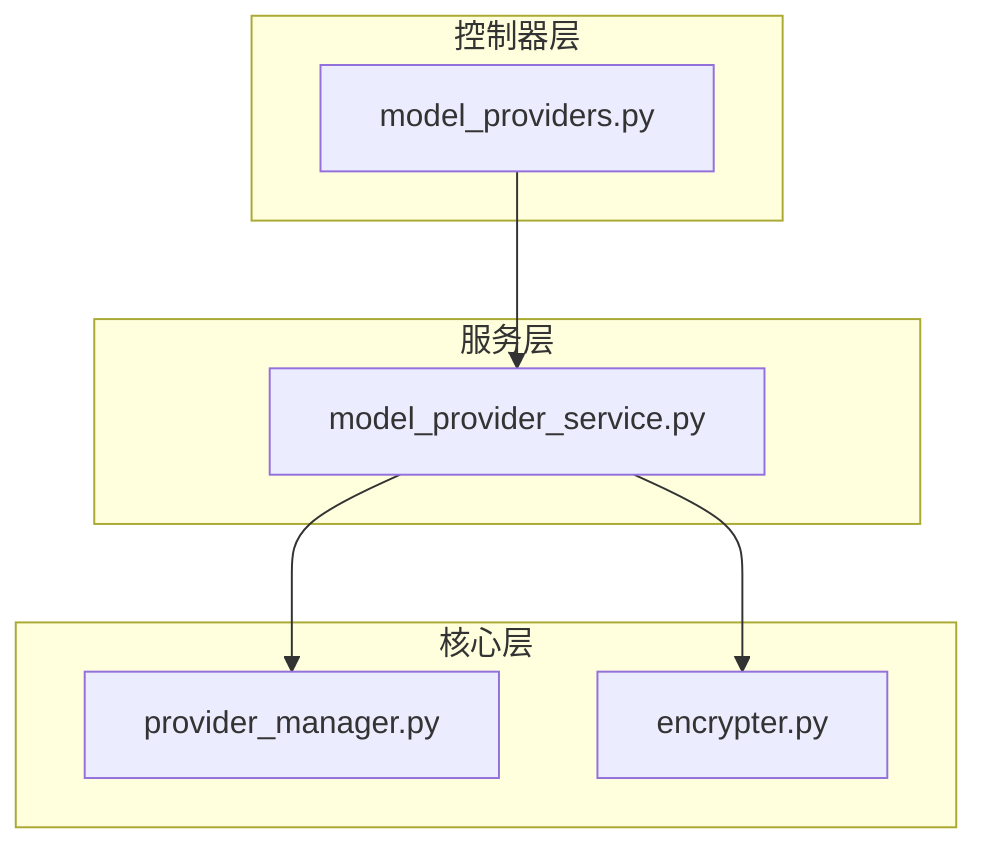
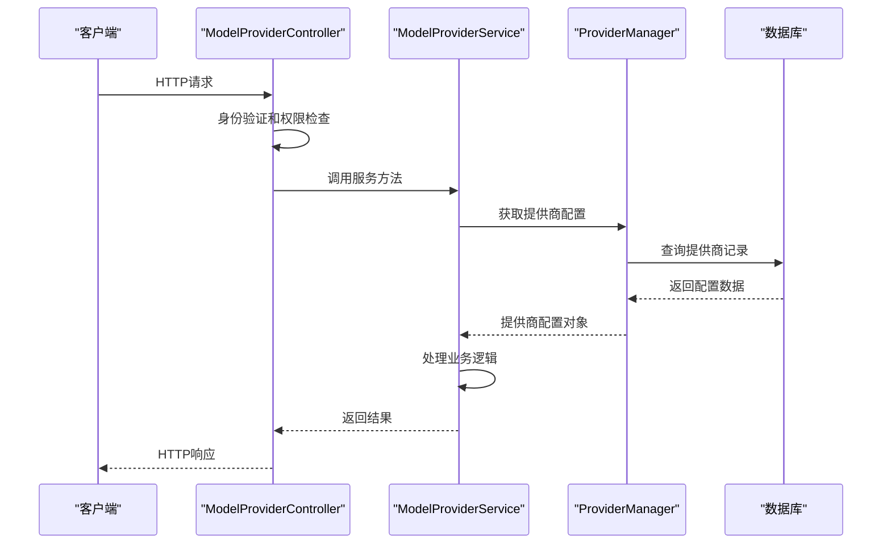
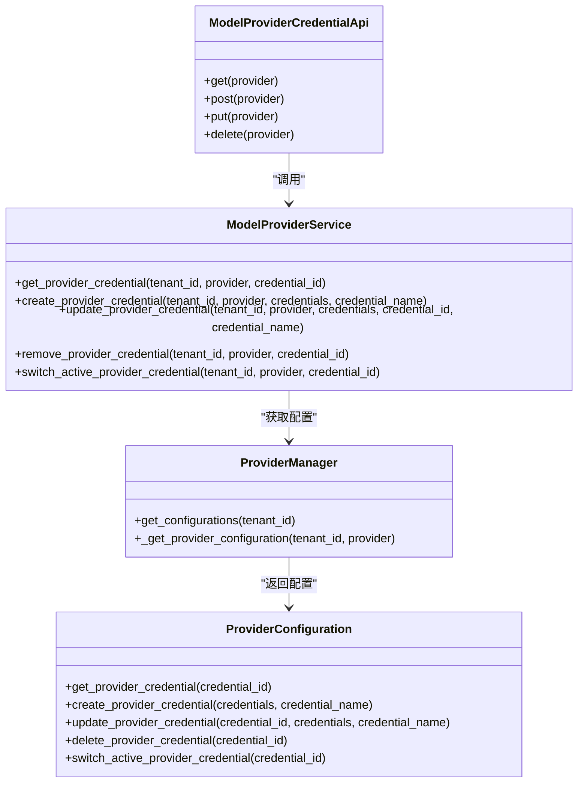
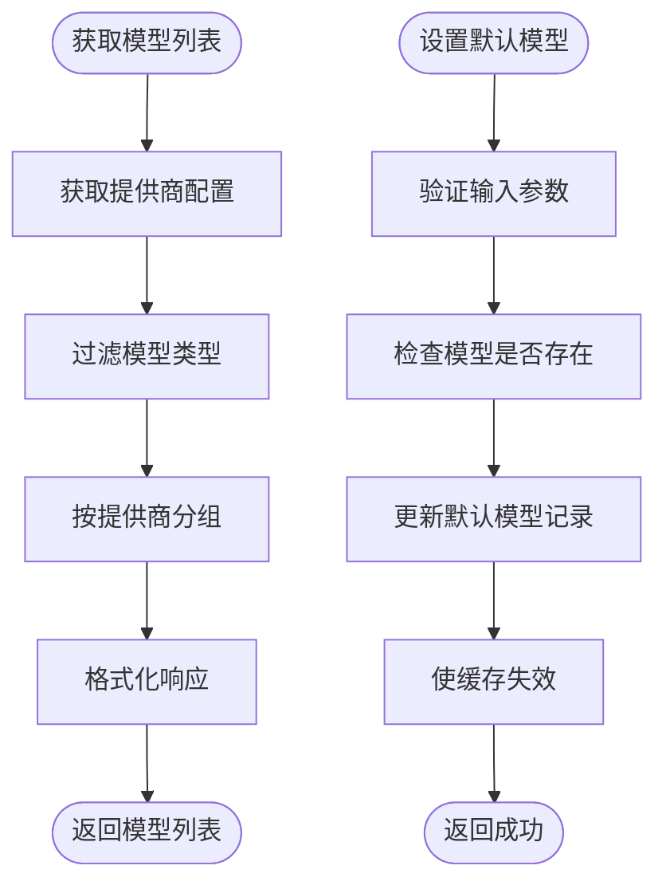
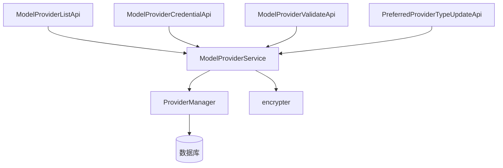

# 模型提供商API

<cite>
**本文档中引用的文件**  
- [model_providers.py](file://api/controllers/console/workspace/model_providers.py)
- [model_provider_service.py](file://api/services/model_provider_service.py)
- [provider_manager.py](file://api/core/provider_manager.py)
- [encrypter.py](file://api/core/helper/encrypter.py)
</cite>

## 目录
1. [简介](#简介)
2. [项目结构](#项目结构)
3. [核心组件](#核心组件)
4. [架构概述](#架构概述)
5. [详细组件分析](#详细组件分析)
6. [依赖分析](#依赖分析)
7. [性能考虑](#性能考虑)
8. [故障排除指南](#故障排除指南)
9. [结论](#结论)

## 简介
Dify工作区模型提供商API为管理AI模型提供商的配置、凭据和默认设置提供了全面的RESTful接口。该API支持多模型提供商环境下的优先级排序和故障转移机制，允许用户通过编程方式配置OpenAI、Anthropic等主流模型提供商的API密钥。系统实现了模型凭据的加密存储与轮换策略，并具备模型能力（如聊天、补全、嵌入）的探测和验证流程。API设计遵循安全最佳实践，包含详细的错误响应机制，便于快速诊断和解决常见问题。

## 项目结构
Dify的模型提供商API主要分布在`api/controllers/console/workspace/`目录下，核心逻辑由`model_providers.py`文件实现。服务层位于`api/services/`目录的`model_provider_service.py`中，而底层配置管理则由`api/core/provider_manager.py`提供支持。模型凭据的加密功能通过`api/core/helper/encrypter.py`实现。整个系统采用分层架构，控制器负责HTTP请求处理，服务层封装业务逻辑，核心模块管理数据持久化和提供商配置。

**图示来源**  
- [model_providers.py](file://api/controllers/console/workspace/model_providers.py#L1-L264)
- [model_provider_service.py](file://api/services/model_provider_service.py#L1-L557)
- [provider_manager.py](file://api/core/provider_manager.py#L1-L1146)
- [encrypter.py](file://api/core/helper/encrypter.py)

**章节来源**  
- [model_providers.py](file://api/controllers/console/workspace/model_providers.py#L1-L264)
- [model_provider_service.py](file://api/services/model_provider_service.py#L1-L557)

## 核心组件
模型提供商API的核心组件包括模型提供商列表、凭据管理、验证接口和默认模型设置。`ModelProviderListApi`提供获取可用模型提供商及其配置信息的功能。`ModelProviderCredentialApi`支持凭据的增删改查操作，仅管理员或所有者可执行修改。`ModelProviderValidateApi`用于在保存前验证提供商凭据的有效性。`PreferredProviderTypeUpdateApi`允许切换系统或自定义提供商的优先级。所有操作均需通过身份验证和工作区初始化检查。

**章节来源**  
- [model_providers.py](file://api/controllers/console/workspace/model_providers.py#L1-L264)
- [model_provider_service.py](file://api/services/model_provider_service.py#L1-L557)

## 架构概述
Dify模型提供商API采用典型的三层架构：控制器层处理HTTP请求，服务层封装业务逻辑，核心层管理数据和提供商配置。当收到API请求时，控制器首先进行权限和初始化检查，然后调用`ModelProviderService`执行具体操作。服务层通过`ProviderManager`访问数据库中的提供商配置，并利用`encrypter`模块进行凭据的加密和解密。整个流程确保了凭据的安全存储和高效访问。

**图示来源**  
- [model_providers.py](file://api/controllers/console/workspace/model_providers.py#L1-L264)
- [model_provider_service.py](file://api/services/model_provider_service.py#L1-L557)
- [provider_manager.py](file://api/core/provider_manager.py#L1-L1146)

## 详细组件分析

### 模型提供商凭据管理
模型提供商凭据管理组件负责处理提供商API密钥的安全存储和验证。系统支持为同一提供商配置多个凭据，并可设置默认使用的凭据。凭据信息在存储前经过加密处理，确保安全性。管理员可以创建、更新、删除和切换活动凭据。

#### 凭据管理类图

**图示来源**  
- [model_providers.py](file://api/controllers/console/workspace/model_providers.py#L1-L264)
- [model_provider_service.py](file://api/services/model_provider_service.py#L1-L557)
- [provider_manager.py](file://api/core/provider_manager.py#L1-L1146)

**章节来源**  
- [model_providers.py](file://api/controllers/console/workspace/model_providers.py#L1-L264)
- [model_provider_service.py](file://api/services/model_provider_service.py#L1-L557)

### 模型列表获取与默认模型设置
该组件负责获取可用模型列表和管理默认模型配置。系统根据提供商类型和模型能力返回相应的模型信息，并支持设置特定模型类型的默认模型。当没有显式设置默认模型时，系统会自动选择一个可用模型作为默认值。

#### 模型管理流程图

**图示来源**  
- [model_provider_service.py](file://api/services/model_provider_service.py#L1-L557)
- [provider_manager.py](file://api/core/provider_manager.py#L1-L1146)

**章节来源**  
- [model_provider_service.py](file://api/services/model_provider_service.py#L1-L557)
- [provider_manager.py](file://api/core/provider_manager.py#L1-L1146)

## 依赖分析
模型提供商API的组件间依赖关系清晰，遵循单一职责原则。控制器层依赖服务层，服务层依赖核心管理器，形成稳定的调用链。`ModelProviderService`作为中间层，隔离了HTTP接口与底层数据访问的耦合。`ProviderManager`负责与数据库交互，封装了复杂的配置查询逻辑。加密模块作为独立的工具类，被服务层调用以确保凭据安全。

**图示来源**  
- [model_providers.py](file://api/controllers/console/workspace/model_providers.py#L1-L264)
- [model_provider_service.py](file://api/services/model_provider_service.py#L1-L557)
- [provider_manager.py](file://api/core/provider_manager.py#L1-L1146)
- [encrypter.py](file://api/core/helper/encrypter.py)

**章节来源**  
- [model_providers.py](file://api/controllers/console/workspace/model_providers.py#L1-L264)
- [model_provider_service.py](file://api/services/model_provider_service.py#L1-L557)
- [provider_manager.py](file://api/core/provider_manager.py#L1-L1146)

## 性能考虑
模型提供商API在性能方面进行了多项优化。`ProviderManager`使用Redis缓存模型负载均衡配置，减少数据库查询次数。提供商配置在初始化时批量加载，避免了多次数据库访问。凭据解密结果也被缓存，提高重复访问的效率。对于模型列表获取等高频操作，系统采用预加载和过滤策略，确保响应速度。建议在生产环境中合理配置Redis缓存大小，以平衡内存使用和性能需求。

## 故障排除指南
本节提供常见错误响应的详细故障排除步骤。

### 403 权限不足
当收到403响应时，表示当前用户没有执行该操作的权限。只有工作区的管理员或所有者才能修改模型提供商配置。请确认当前登录用户具有足够的权限。

**章节来源**  
- [model_providers.py](file://api/controllers/console/workspace/model_providers.py#L1-L264)

### 400 凭据无效
400错误通常由格式错误的请求体引起。请检查JSON格式是否正确，必填字段是否缺失。对于凭据更新操作，确保提供的凭据字段符合提供商的要求。

**章节来源**  
- [model_providers.py](file://api/controllers/console/workspace/model_providers.py#L1-L264)
- [model_provider_service.py](file://api/services/model_provider_service.py#L1-L557)

### 422 模型不支持
422状态码表示请求的模型不被提供商支持。请通过`GET /workspaces/current/model-providers`接口获取提供商支持的模型列表，确认所请求的模型名称和类型正确无误。

**章节来源**  
- [model_provider_service.py](file://api/services/model_provider_service.py#L1-L557)
- [provider_manager.py](file://api/core/provider_manager.py#L1-L1146)

### 凭据验证失败
当凭据验证返回错误时，可能是API密钥已过期或权限不足。建议重新生成API密钥并确保其具有必要的权限。对于自定义提供商，请确认端点URL和认证方式配置正确。

**章节来源**  
- [model_provider_service.py](file://api/services/model_provider_service.py#L1-L557)
- [provider_manager.py](file://api/core/provider_manager.py#L1-L1146)

## 结论
Dify工作区模型提供商API提供了一套完整且安全的接口，用于管理AI模型提供商的配置和凭据。通过清晰的分层架构和严格的权限控制，系统确保了配置管理的安全性和可靠性。加密存储、凭据验证和默认模型管理等功能，为多提供商环境下的模型使用提供了坚实基础。建议开发者充分利用API的验证功能，在生产部署前充分测试配置的正确性。