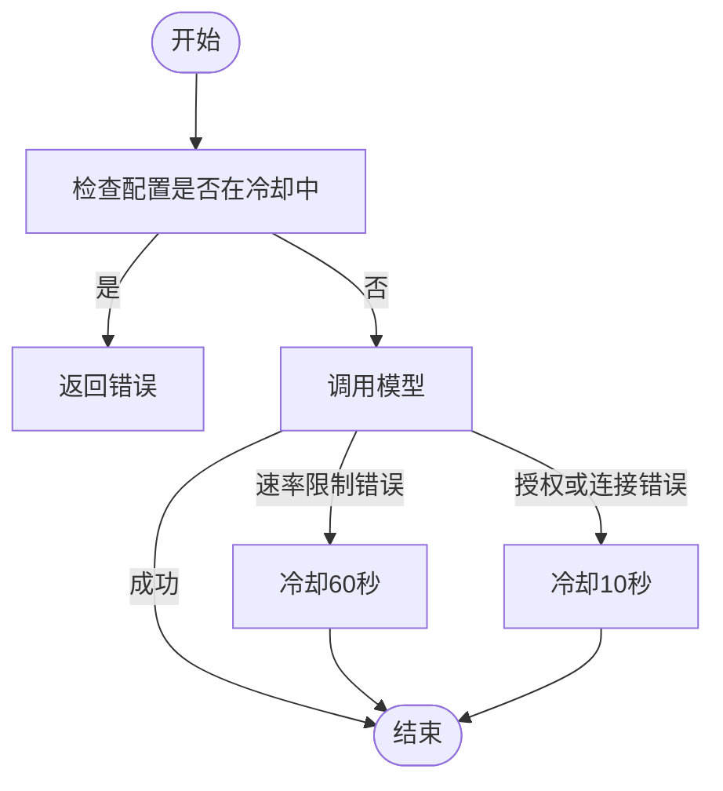
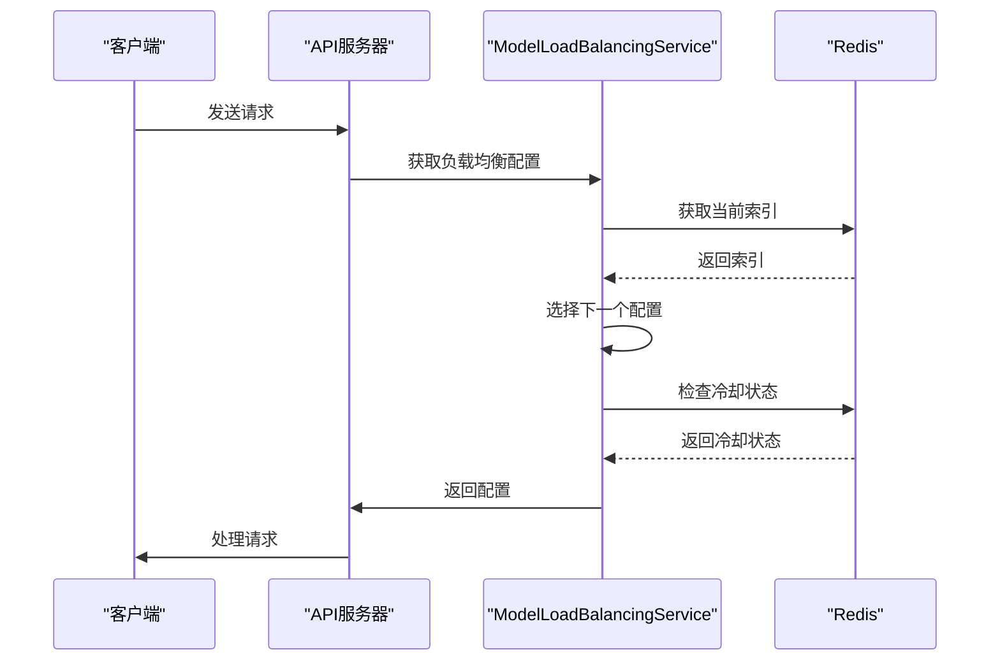

# 负载均衡配置API

<cite>
**本文档中引用的文件**  
- [load_balancing_config.py](file://api/controllers/console/workspace/load_balancing_config.py)
- [models.py](file://api/controllers/console/workspace/models.py)
- [model_load_balancing_service.py](file://api/services/model_load_balancing_service.py)
- [provider.py](file://api/models/provider.py)
- [model_manager.py](file://api/core/model_manager.py)
</cite>

## 目录
1. [简介](#简介)
2. [核心端点](#核心端点)
3. [模型负载均衡策略](#模型负载均衡策略)
4. [权重分配与故障转移](#权重分配与故障转移)
5. [健康检查机制](#健康检查机制)
6. [实时生效机制与流量分配算法](#实时生效机制与流量分配算法)
7. [API使用示例](#api使用示例)
8. [故障排除指南](#故障排除指南)

## 简介

Dify工作区负载均衡配置API允许用户为同一模型的不同提供商配置负载均衡策略。该API支持动态权重调整、故障转移设置和健康检查，确保模型服务的高可用性和性能优化。通过RESTful接口，用户可以管理负载均衡配置，包括创建、更新、删除和验证配置。

**Section sources**
- [load_balancing_config.py](file://api/controllers/console/workspace/load_balancing_config.py#L0-L125)
- [models.py](file://api/controllers/console/workspace/models.py#L0-L555)

## 核心端点

### 获取负载均衡配置
- **HTTP方法**: `GET`
- **URL路径**: `/workspaces/current/model-providers/{provider}/models/credentials`
- **请求头**: `Authorization: Bearer <access_token>`
- **响应格式**: 
  ```json
  {
    "credentials": {},
    "current_credential_id": "string",
    "current_credential_name": "string",
    "load_balancing": {
      "enabled": "boolean",
      "configs": [
        {
          "id": "string",
          "name": "string",
          "credentials": {},
          "credential_id": "string",
          "enabled": "boolean",
          "in_cooldown": "boolean",
          "ttl": "integer"
        }
      ]
    },
    "available_credentials": []
  }
  ```

### 更新负载均衡配置
- **HTTP方法**: `POST`
- **URL路径**: `/workspaces/current/model-providers/{provider}/models`
- **请求头**: `Authorization: Bearer <access_token>`
- **请求体模式**:
  ```json
  {
    "model": "string",
    "model_type": "string",
    "load_balancing": {
      "enabled": "boolean",
      "configs": [
        {
          "id": "string",
          "name": "string",
          "credentials": {},
          "credential_id": "string",
          "enabled": "boolean"
        }
      ]
    },
    "config_from": "string"
  }
  ```
- **响应格式**: `{"result": "success"}`

### 验证负载均衡凭证
- **HTTP方法**: `POST`
- **URL路径**: `/workspaces/current/model-providers/{provider}/models/load-balancing-configs/credentials-validate`
- **请求头**: `Authorization: Bearer <access_token>`
- **请求体模式**:
  ```json
  {
    "model": "string",
    "model_type": "string",
    "credentials": {}
  }
  ```
- **响应格式**: 
  ```json
  {
    "result": "success|error",
    "error": "string"
  }
  ```

**Section sources**
- [models.py](file://api/controllers/console/workspace/models.py#L132-L164)
- [load_balancing_config.py](file://api/controllers/console/workspace/load_balancing_config.py#L0-L33)

## 模型负载均衡策略

Dify的负载均衡策略基于轮询（Round Robin）算法，结合故障转移和健康检查机制。当启用负载均衡时，系统会根据配置的权重分配流量到不同的模型提供商。每个配置的权重总和必须为100，否则会返回422错误。

负载均衡配置存储在`load_balancing_model_configs`表中，包含以下字段：
- `id`: 配置的唯一标识符
- `tenant_id`: 工作区ID
- `provider_name`: 提供商名称
- `model_name`: 模型名称
- `model_type`: 模型类型
- `name`: 配置名称
- `encrypted_config`: 加密的凭证配置
- `enabled`: 配置是否启用

**Section sources**
- [provider.py](file://api/models/provider.py#L240-L262)
- [model_load_balancing_service.py](file://api/services/model_load_balancing_service.py#L26-L618)

## 权重分配与故障转移

### 权重分配
权重分配通过`update_load_balancing_configs`方法实现。用户可以为每个配置指定权重，系统会根据权重比例分配流量。权重总和必须为100，否则会触发验证错误。

### 故障转移
当某个提供商的模型服务不可用时，系统会自动将其置于冷却状态（cooldown），并在指定时间内不再分配流量。冷却时间由`cooldown`方法设置，默认为60秒。冷却状态存储在Redis中，键名为`model_lb_index:cooldown:{tenant_id}:{provider}:{model_type}:{model}:{config_id}`。



**Diagram sources**
- [model_manager.py](file://api/core/model_manager.py#L500-L585)

**Section sources**
- [model_load_balancing_service.py](file://api/services/model_load_balancing_service.py#L309-L341)
- [model_manager.py](file://api/core/model_manager.py#L500-L585)

## 健康检查机制

健康检查通过`in_cooldown`方法实现，系统会定期检查每个配置的冷却状态。如果配置在冷却中，则不会被选中用于处理请求。冷却状态的TTL（生存时间）可以通过`get_config_in_cooldown_and_ttl`方法获取。

- **健康检查频率**: 每次请求时检查
- **健康检查阈值**: 冷却时间60秒（速率限制错误）或10秒（授权或连接错误）

**Section sources**
- [model_manager.py](file://api/core/model_manager.py#L560-L585)

## 实时生效机制与流量分配算法

### 实时生效机制
负载均衡配置的更改会立即生效，无需重启服务。系统通过Redis缓存当前的负载均衡索引，确保在高并发场景下的一致性。

### 流量分配算法
流量分配采用轮询算法，结合权重和冷却状态。系统会从`load_balancing_configs`中选择下一个可用的配置，跳过在冷却中的配置。如果所有配置都在冷却中，则返回错误。



**Diagram sources**
- [model_manager.py](file://api/core/model_manager.py#L500-L585)

**Section sources**
- [model_load_balancing_service.py](file://api/services/model_load_balancing_service.py#L26-L618)

## API使用示例

### curl示例
```bash
# 获取负载均衡配置
curl -X GET "http://localhost:5001/workspaces/current/model-providers/openai/models/credentials?model=gpt-4&model_type=text-generation" \
  -H "Authorization: Bearer <access_token>"

# 更新负载均衡配置
curl -X POST "http://localhost:5001/workspaces/current/model-providers/openai/models" \
  -H "Authorization: Bearer <access_token>" \
  -H "Content-Type: application/json" \
  -d '{
    "model": "gpt-4",
    "model_type": "text-generation",
    "load_balancing": {
      "enabled": true,
      "configs": [
        {
          "id": "config1",
          "name": "primary",
          "credentials": {"api_key": "sk-xxx"},
          "enabled": true
        },
        {
          "id": "config2",
          "name": "backup",
          "credentials": {"api_key": "sk-yyy"},
          "enabled": true
        }
      ]
    }
  }'
```

### Python客户端代码示例
```python
import requests

# 获取负载均衡配置
def get_load_balancing_config(provider, model, model_type, access_token):
    url = f"http://localhost:5001/workspaces/current/model-providers/{provider}/models/credentials"
    params = {"model": model, "model_type": model_type}
    headers = {"Authorization": f"Bearer {access_token}"}
    response = requests.get(url, params=params, headers=headers)
    return response.json()

# 更新负载均衡配置
def update_load_balancing_config(provider, model, model_type, configs, access_token):
    url = f"http://localhost:5001/workspaces/current/model-providers/{provider}/models"
    data = {
        "model": model,
        "model_type": model_type,
        "load_balancing": {
            "enabled": True,
            "configs": configs
        }
    }
    headers = {"Authorization": f"Bearer {access_token}", "Content-Type": "application/json"}
    response = requests.post(url, json=data, headers=headers)
    return response.json()
```

**Section sources**
- [models.py](file://api/controllers/console/workspace/models.py#L132-L164)
- [load_balancing_config.py](file://api/controllers/console/workspace/load_balancing_config.py#L0-L33)

## 故障排除指南

### 403权限不足
- **原因**: 用户没有管理员或所有者权限
- **解决方案**: 确保使用具有管理员或所有者角色的账户进行操作

### 400配置冲突
- **原因**: 请求体中缺少必要字段或字段格式错误
- **解决方案**: 检查请求体是否包含所有必需字段，并确保字段类型正确

### 422权重总和不为100
- **原因**: 负载均衡配置的权重总和不等于100
- **解决方案**: 调整权重分配，确保总和为100

### 凭证验证失败
- **原因**: 提供的API密钥或其他凭证无效
- **解决方案**: 使用`credentials-validate`端点验证凭证，并确保凭证正确无误

**Section sources**
- [load_balancing_config.py](file://api/controllers/console/workspace/load_balancing_config.py#L30-L71)
- [model_load_balancing_service.py](file://api/services/model_load_balancing_service.py#L26-L618)