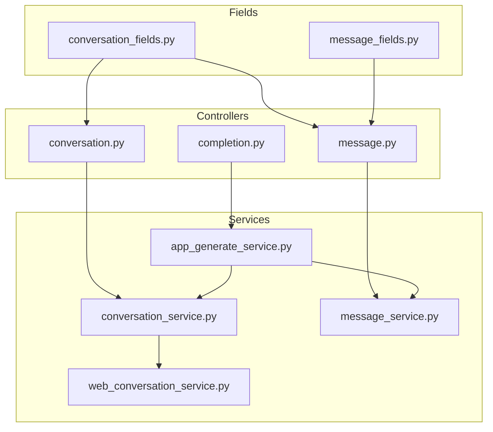
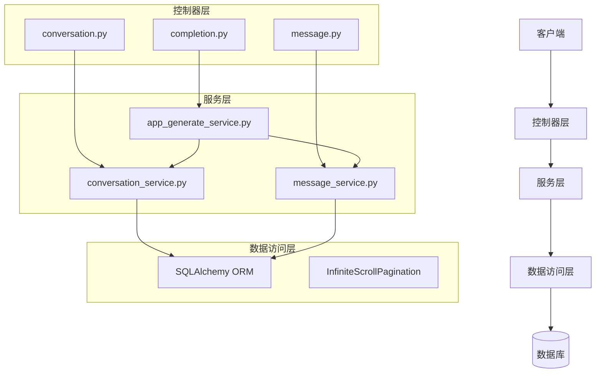
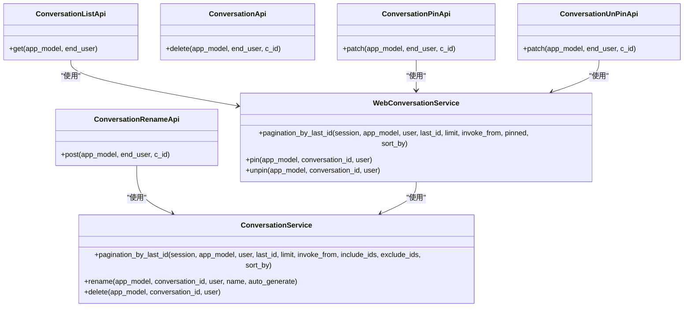
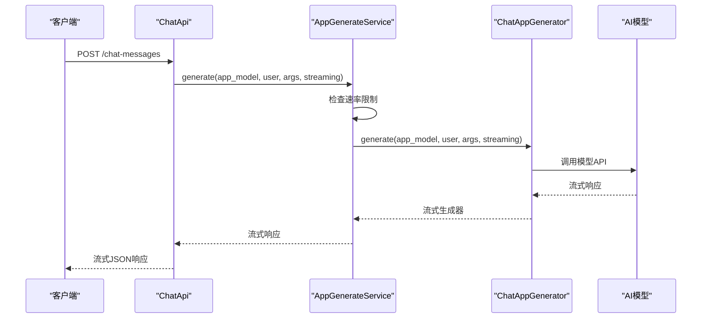
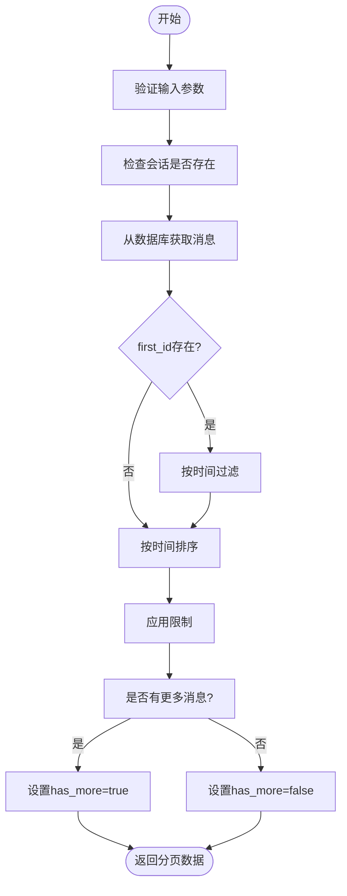
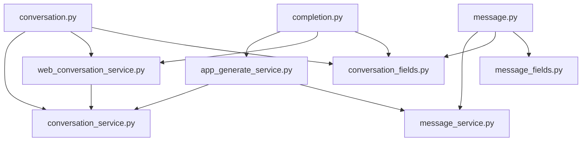

# 对话API

<cite>
**本文档中引用的文件**  
- [conversation.py](file://api/controllers/web/conversation.py)
- [message.py](file://api/controllers/web/message.py)
- [completion.py](file://api/controllers/web/completion.py)
- [conversation_fields.py](file://api/fields/conversation_fields.py)
- [message_fields.py](file://api/fields/message_fields.py)
- [conversation_service.py](file://api/services/conversation_service.py)
- [message_service.py](file://api/services/message_service.py)
- [app_generate_service.py](file://api/services/app_generate_service.py)
- [web_conversation_service.py](file://api/services/web_conversation_service.py)
</cite>

## 目录
1. [简介](#简介)
2. [项目结构](#项目结构)
3. [核心组件](#核心组件)
4. [架构概述](#架构概述)
5. [详细组件分析](#详细组件分析)
6. [依赖分析](#依赖分析)
7. [性能考虑](#性能考虑)
8. [故障排除指南](#故障排除指南)
9. [结论](#结论)

## 简介
Dify对话API提供了一套完整的RESTful接口，用于管理基于AI的应用程序中的对话交互。该API支持聊天和补全两种应用模式，允许开发者通过编程方式创建、管理和监控对话会话。API设计围绕会话管理、消息传递、历史记录检索和对话状态持久化等核心功能展开。系统通过清晰的端点分离不同类型的请求，如`/chat-messages`用于聊天应用，`/completion-messages`用于补全应用。API还集成了速率限制、流式响应和错误处理等高级功能，确保了高并发场景下的稳定性和可靠性。前端调试界面的功能实现直接依赖于这些API端点，使得开发者能够实时测试和优化对话应用。

## 项目结构
Dify的对话API主要位于`api/controllers/web/`目录下，由多个专门的控制器文件组成，每个文件负责处理特定类型的请求。`conversation.py`处理会话的创建、重命名和删除等管理操作；`message.py`负责消息的获取、反馈和建议问题生成；`completion.py`则处理核心的消息生成请求，包括聊天和补全两种模式。数据模型和响应格式在`api/fields/`目录下的`conversation_fields.py`和`message_fields.py`中定义，使用Flask-RESTX的字段系统来确保API响应的一致性和可预测性。业务逻辑服务层位于`api/services/`目录，如`conversation_service.py`和`message_service.py`，它们封装了与数据库交互和核心业务规则的复杂性。这种分层架构将请求处理、数据验证、业务逻辑和数据访问清晰地分离，提高了代码的可维护性和可测试性。

**Diagram sources**
- [conversation.py](file://api/controllers/web/conversation.py)
- [message.py](file://api/controllers/web/message.py)
- [completion.py](file://api/controllers/web/completion.py)
- [conversation_fields.py](file://api/fields/conversation_fields.py)
- [message_fields.py](file://api/fields/message_fields.py)
- [conversation_service.py](file://api/services/conversation_service.py)
- [message_service.py](file://api/services/message_service.py)
- [app_generate_service.py](file://api/services/app_generate_service.py)
- [web_conversation_service.py](file://api/services/web_conversation_service.py)

**Section sources**
- [conversation.py](file://api/controllers/web/conversation.py)
- [message.py](file://api/controllers/web/message.py)
- [completion.py](file://api/controllers/web/completion.py)

## 核心组件
对话API的核心组件包括会话管理、消息生成、历史记录检索和状态持久化。会话管理通过`ConversationListApi`和`ConversationApi`等控制器实现，支持分页、筛选和删除操作。消息生成是API的核心功能，由`ChatApi`和`CompletionApi`处理，它们调用`AppGenerateService`来启动AI模型的推理过程。历史记录检索通过`MessageListApi`实现，支持基于游标的无限滚动分页，确保在处理大量消息时的性能。状态持久化通过`ConversationService`中的`get_conversational_variable`和`update_conversation_variable`方法实现，允许在会话中存储和更新自定义变量。所有这些组件都通过Flask-RESTX框架进行路由和请求验证，并使用统一的错误处理机制来提供一致的客户端体验。

**Section sources**
- [conversation.py](file://api/controllers/web/conversation.py)
- [message.py](file://api/controllers/web/message.py)
- [completion.py](file://api/controllers/web/completion.py)
- [conversation_service.py](file://api/services/conversation_service.py)
- [message_service.py](file://api/services/message_service.py)
- [app_generate_service.py](file://api/services/app_generate_service.py)

## 架构概述
Dify对话API采用分层架构，从上到下分为控制器层、服务层和数据访问层。控制器层（`api/controllers/web/`）负责接收HTTP请求，进行参数解析和验证，并将请求委派给相应的服务。服务层（`api/services/`）包含核心业务逻辑，如会话管理、消息生成和变量持久化。这一层与具体的Web框架解耦，提高了代码的可重用性。数据访问层由SQLAlchemy ORM和自定义的`InfiniteScrollPagination`工具组成，负责与数据库进行交互。API的入口点通过Flask-RESTX的`api.add_resource`方法注册，将URL路径映射到具体的资源类。这种架构确保了关注点的分离，使得每个组件都有明确的职责，便于开发和维护。

**Diagram sources**
- [conversation.py](file://api/controllers/web/conversation.py)
- [message.py](file://api/controllers/web/message.py)
- [completion.py](file://api/controllers/web/completion.py)
- [conversation_service.py](file://api/services/conversation_service.py)
- [message_service.py](file://api/services/message_service.py)
- [app_generate_service.py](file://api/services/app_generate_service.py)

## 详细组件分析

### 会话管理分析
会话管理组件负责对话会话的生命周期，包括创建、查询、更新和删除。`ConversationListApi`提供了一个分页端点，支持基于最后一条会话ID的无限滚动分页，允许客户端高效地加载大量会话。`ConversationRenameApi`和`ConversationPinApi`等端点允许用户重命名和置顶会话。这些操作都通过`ConversationService`和`WebConversationService`服务类实现，后者专门处理与Web界面相关的功能，如会话置顶。会话数据的响应格式由`conversation_fields.py`中的`simple_conversation_fields`和`conversation_with_summary_fields`等字段定义，确保了API响应的一致性。

**Diagram sources**
- [conversation.py](file://api/controllers/web/conversation.py)
- [conversation_service.py](file://api/services/conversation_service.py)
- [web_conversation_service.py](file://api/services/web_conversation_service.py)

**Section sources**
- [conversation.py](file://api/controllers/web/conversation.py)
- [conversation_service.py](file://api/services/conversation_service.py)
- [web_conversation_service.py](file://api/services/web_conversation_service.py)

### 消息生成分析
消息生成组件是对话API的核心，负责处理用户的输入并生成AI的响应。`ChatApi`和`CompletionApi`是两个主要的控制器，分别处理聊天和补全模式的请求。它们都调用`AppGenerateService.generate`方法，该方法根据应用模式选择合适的生成器（如`ChatAppGenerator`或`CompletionAppGenerator`）。API支持流式响应（streaming）和阻塞响应（blocking）两种模式，客户端可以通过`response_mode`参数进行选择。`AppGenerateService`还实现了速率限制功能，通过`system_rate_limiter`和`RateLimit`类来防止滥用。错误处理机制完善，能够捕获并转换来自底层模型的各种异常，如`ProviderTokenNotInitError`和`QuotaExceededError`。

**Diagram sources**
- [completion.py](file://api/controllers/web/completion.py)
- [app_generate_service.py](file://api/services/app_generate_service.py)

**Section sources**
- [completion.py](file://api/controllers/web/completion.py)
- [app_generate_service.py](file://api/services/app_generate_service.py)

### 历史记录与状态分析
历史记录与状态管理组件负责检索对话历史和管理会话状态。`MessageListApi`提供了基于游标的分页功能，通过`first_id`参数实现无限滚动，客户端可以加载指定会话的早期消息。`get_suggested_questions_after_answer`方法在消息服务中实现，用于生成AI建议的后续问题，这依赖于LLM的特定提示。对话变量的持久化通过`ConversationService`中的`get_conversational_variable`和`update_conversation_variable`方法实现。这些变量存储在`ConversationVariable`数据库模型中，并通过`variable_factory`进行类型验证和转换，确保数据的完整性和类型安全。

**Diagram sources**
- [message.py](file://api/controllers/web/message.py)
- [message_service.py](file://api/services/message_service.py)
- [conversation_service.py](file://api/services/conversation_service.py)

**Section sources**
- [message.py](file://api/controllers/web/message.py)
- [message_service.py](file://api/services/message_service.py)
- [conversation_service.py](file://api/services/conversation_service.py)

## 依赖分析
对话API的组件之间存在清晰的依赖关系。控制器层依赖于服务层来执行业务逻辑，服务层又依赖于数据访问层来持久化数据。`AppGenerateService`是核心服务，被`ChatApi`和`CompletionApi`直接调用，它又依赖于`ConversationService`和`MessageService`来管理会话和消息状态。`WebConversationService`依赖于`ConversationService`，并添加了Web特定的功能，如会话置顶。字段定义文件（`conversation_fields.py`和`message_fields.py`）被所有控制器使用，以确保API响应格式的一致性。这种依赖结构确保了代码的模块化，使得组件可以独立测试和替换。

**Diagram sources**
- [conversation.py](file://api/controllers/web/conversation.py)
- [message.py](file://api/controllers/web/message.py)
- [completion.py](file://api/controllers/web/completion.py)
- [conversation_service.py](file://api/services/conversation_service.py)
- [message_service.py](file://api/services/message_service.py)
- [app_generate_service.py](file://api/services/app_generate_service.py)
- [web_conversation_service.py](file://api/services/web_conversation_service.py)
- [conversation_fields.py](file://api/fields/conversation_fields.py)
- [message_fields.py](file://api/fields/message_fields.py)

**Section sources**
- [conversation.py](file://api/controllers/web/conversation.py)
- [message.py](file://api/controllers/web/message.py)
- [completion.py](file://api/controllers/web/completion.py)
- [conversation_service.py](file://api/services/conversation_service.py)
- [message_service.py](file://api/services/message_service.py)
- [app_generate_service.py](file://api/services/app_generate_service.py)
- [web_conversation_service.py](file://api/services/web_conversation_service.py)
- [conversation_fields.py](file://api/fields/conversation_fields.py)
- [message_fields.py](file://api/fields/message_fields.py)

## 性能考虑
对话API在设计时充分考虑了性能因素。分页机制采用基于游标（cursor-based）的无限滚动，而不是基于页码（page-based）的分页，避免了在大数据集上使用`OFFSET`带来的性能问题。`InfiniteScrollPagination`工具通过比较时间戳来高效地检索下一页数据。消息生成支持流式响应，允许AI模型在生成内容的同时立即向客户端发送数据，减少了用户的等待感知时间。`AppGenerateService`中的速率限制机制不仅防止了滥用，也保护了后端资源。数据库查询经过优化，使用了适当的索引和`select`语句来最小化数据加载量。对于建议问题的生成，系统会缓存结果或限制调用频率，以平衡功能性和性能。

## 故障排除指南
当使用对话API时，可能会遇到各种错误。`NotChatAppError`和`NotCompletionAppError`表示请求的应用模式不匹配，请检查应用的`mode`配置。`ProviderNotInitializeError`通常意味着模型提供商的API密钥未正确配置。`ProviderQuotaExceededError`表明已超出模型提供商的配额限制。`ConversationNotExistsError`和`MessageNotExistsError`表示请求的资源不存在，可能已被删除。对于流式响应中断，检查网络连接和服务器日志。如果遇到速率限制错误（`InvokeRateLimitError`），请检查应用的每日请求限制。建议使用`curl`命令进行测试，并仔细检查请求头和请求体的格式。

**Section sources**
- [completion.py](file://api/controllers/web/completion.py)
- [conversation.py](file://api/controllers/web/conversation.py)
- [message.py](file://api/controllers/web/message.py)

## 结论
Dify对话API提供了一套强大而灵活的工具，用于构建和管理AI驱动的对话应用。其清晰的RESTful设计、完善的错误处理和可扩展的架构使其成为开发者的理想选择。通过理解其核心组件和依赖关系，开发者可以有效地利用API来实现复杂的对话场景，如支持上下文记忆的聊天机器人。API对流式响应和速率限制的支持确保了在生产环境中的高性能和可靠性。随着Dify平台的不断发展，该API有望引入更多高级功能，进一步简化AI应用的开发流程。