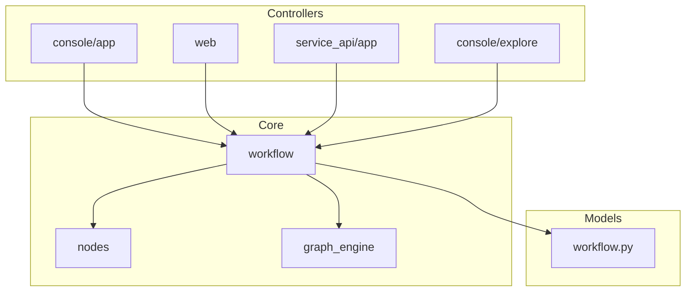
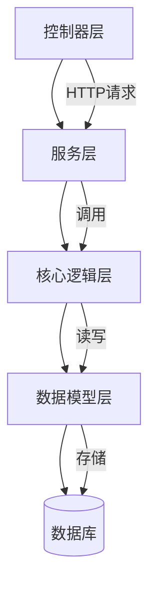
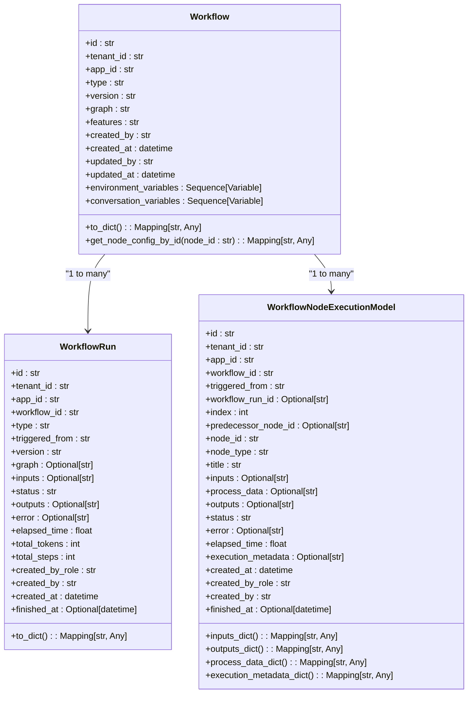
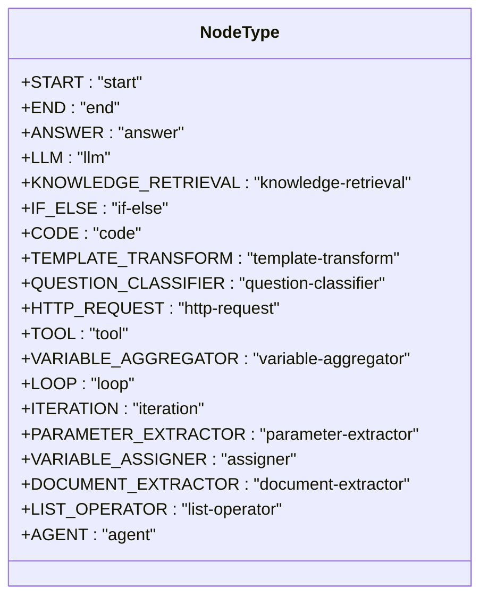
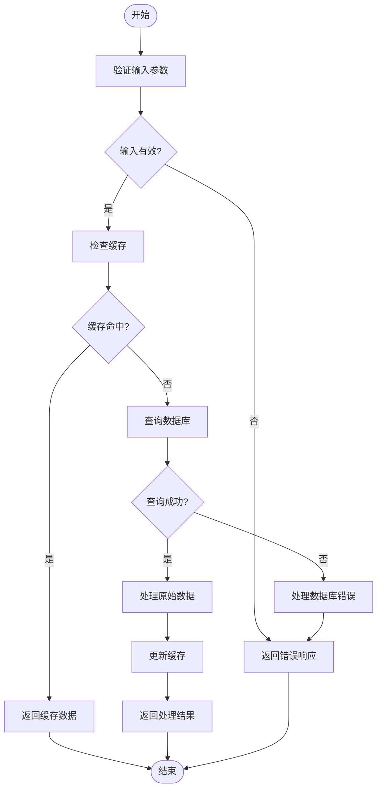
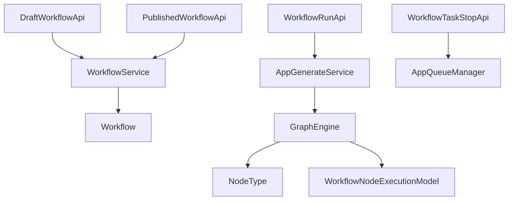

# 工作流API

<cite>
**本文档中引用的文件**  
- [workflow.py](file://api/controllers/console/app/workflow.py)
- [workflow.py](file://api/controllers/web/workflow.py)
- [workflow.py](file://api/controllers/service_api/app/workflow.py)
- [workflow.py](file://api/controllers/console/explore/workflow.py)
- [workflow.py](file://api/models/workflow.py)
- [enums.py](file://api/core/workflow/nodes/enums.py)
- [graph_engine.py](file://api/core/workflow/graph_engine/graph_engine.py)
</cite>

## 目录
1. [简介](#简介)
2. [项目结构](#项目结构)
3. [核心组件](#核心组件)
4. [架构概述](#架构概述)
5. [详细组件分析](#详细组件分析)
6. [依赖分析](#依赖分析)
7. [性能考虑](#性能考虑)
8. [故障排除指南](#故障排除指南)
9. [结论](#结论)

## 简介
本文档详细介绍了Dify平台中工作流API的设计与实现。该API支持创建、读取、更新、执行和调试工作流，涵盖工作流节点（如LLM、代码、工具、条件分支）的配置、连接和执行逻辑。文档解释了工作流图（graph）的JSON结构定义，包括节点类型、连接关系和变量传递机制。同时，文档还提供了工作流执行的同步和异步调用方式，以及如何获取执行日志和中间结果。此外，文档化了工作流版本控制、草稿保存和发布流程的API，并通过实际的curl示例展示了如何通过API构建一个包含知识库检索、LLM调用和条件判断的复杂工作流。最后，文档解释了工作流执行中的错误处理、超时设置和重试机制，以及这些API如何支持前端工作流编辑器的功能实现。

## 项目结构
Dify的API模块组织清晰，主要分为控制器（controllers）、核心逻辑（core）、模型（models）和工作流相关组件。控制器层负责处理HTTP请求，核心层实现业务逻辑，模型层定义数据结构。工作流相关的控制器分布在`console/app`、`web`、`service_api/app`和`console/explore`目录下，分别处理不同场景下的工作流操作。核心工作流逻辑位于`core/workflow`目录，包括节点定义、图引擎和执行管理。

**图源**  
- [workflow.py](file://api/controllers/console/app/workflow.py)
- [workflow.py](file://api/controllers/web/workflow.py)
- [workflow.py](file://api/controllers/service_api/app/workflow.py)
- [workflow.py](file://api/controllers/console/explore/workflow.py)
- [enums.py](file://api/core/workflow/nodes/enums.py)
- [graph_engine.py](file://api/core/workflow/graph_engine/graph_engine.py)
- [workflow.py](file://api/models/workflow.py)

**节源**  
- [workflow.py](file://api/controllers/console/app/workflow.py)
- [workflow.py](file://api/controllers/web/workflow.py)
- [workflow.py](file://api/controllers/service_api/app/workflow.py)
- [workflow.py](file://api/controllers/console/explore/workflow.py)
- [enums.py](file://api/core/workflow/nodes/enums.py)
- [graph_engine.py](file://api/core/workflow/graph_engine/graph_engine.py)
- [workflow.py](file://api/models/workflow.py)

## 核心组件
工作流API的核心组件包括工作流定义、节点执行、图引擎和版本管理。工作流定义通过JSON结构描述节点和连接，节点执行负责处理每个节点的逻辑，图引擎管理整个工作流的执行流程，版本管理则处理草稿和发布版本的切换。

**节源**  
- [workflow.py](file://api/models/workflow.py)
- [graph_engine.py](file://api/core/workflow/graph_engine/graph_engine.py)

## 架构概述
Dify工作流API采用分层架构，从上到下分为控制器层、服务层、核心逻辑层和数据模型层。控制器层接收HTTP请求并进行初步验证，服务层协调核心逻辑的调用，核心逻辑层实现工作流的执行和管理，数据模型层则负责持久化工作流定义和执行记录。

**图源**  
- [workflow.py](file://api/controllers/console/app/workflow.py)
- [workflow.py](file://api/controllers/web/workflow.py)
- [workflow.py](file://api/controllers/service_api/app/workflow.py)
- [workflow.py](file://api/controllers/console/explore/workflow.py)
- [graph_engine.py](file://api/core/workflow/graph_engine/graph_engine.py)
- [workflow.py](file://api/models/workflow.py)

## 详细组件分析
### 工作流定义分析
工作流定义通过`Workflow`模型进行管理，包含图结构、特征配置、环境变量和会话变量。图结构以JSON格式存储，描述了节点和边的连接关系。

#### 工作流模型

**图源**  
- [workflow.py](file://api/models/workflow.py)

**节源**  
- [workflow.py](file://api/models/workflow.py)

### 节点类型分析
工作流支持多种节点类型，每种类型对应不同的功能和配置。

#### 节点类型枚举

**图源**  
- [enums.py](file://api/core/workflow/nodes/enums.py)

**节源**  
- [enums.py](file://api/core/workflow/nodes/enums.py)

### 执行流程分析
工作流的执行流程由图引擎管理，从起始节点开始，按照连接关系依次执行各个节点。

#### 工作流执行流程

**图源**  
- [graph_engine.py](file://api/core/workflow/graph_engine/graph_engine.py)

**节源**  
- [graph_engine.py](file://api/core/workflow/graph_engine/graph_engine.py)

## 依赖分析
工作流API的各个组件之间存在紧密的依赖关系。控制器层依赖服务层和核心逻辑层，核心逻辑层依赖数据模型层。图引擎作为核心组件，被多个控制器和节点类型所依赖。

**图源**  
- [workflow.py](file://api/controllers/console/app/workflow.py)
- [workflow.py](file://api/controllers/web/workflow.py)
- [workflow.py](file://api/controllers/service_api/app/workflow.py)
- [workflow.py](file://api/controllers/console/explore/workflow.py)
- [graph_engine.py](file://api/core/workflow/graph_engine/graph_engine.py)
- [workflow.py](file://api/models/workflow.py)

**节源**  
- [workflow.py](file://api/controllers/console/app/workflow.py)
- [workflow.py](file://api/controllers/web/workflow.py)
- [workflow.py](file://api/controllers/service_api/app/workflow.py)
- [workflow.py](file://api/controllers/console/explore/workflow.py)
- [graph_engine.py](file://api/core/workflow/graph_engine/graph_engine.py)
- [workflow.py](file://api/models/workflow.py)

## 性能考虑
工作流API在设计时考虑了性能优化，包括使用线程池管理并发执行、缓存工作流定义和执行结果、以及限制最大执行步骤和时间。

**节源**  
- [graph_engine.py](file://api/core/workflow/graph_engine/graph_engine.py)

## 故障排除指南
当工作流执行出现问题时，可以通过查看执行日志和中间结果来定位问题。常见的错误包括节点配置错误、输入参数无效、外部服务调用失败等。

**节源**  
- [workflow.py](file://api/controllers/console/app/workflow.py)
- [workflow.py](file://api/controllers/web/workflow.py)
- [workflow.py](file://api/controllers/service_api/app/workflow.py)
- [workflow.py](file://api/controllers/console/explore/workflow.py)

## 结论
Dify工作流API提供了一套完整的RESTful接口，支持工作流的创建、读取、更新、执行和调试。通过清晰的分层架构和模块化设计，API能够高效地处理复杂的工作流逻辑。文档详细解释了工作流图的JSON结构定义、节点配置和执行逻辑，以及如何通过API构建和管理复杂的工作流。这些API不仅支持后端服务的集成，也为前端工作流编辑器提供了强大的功能支持。