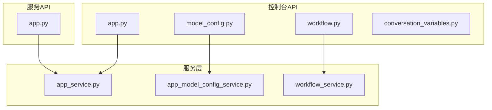
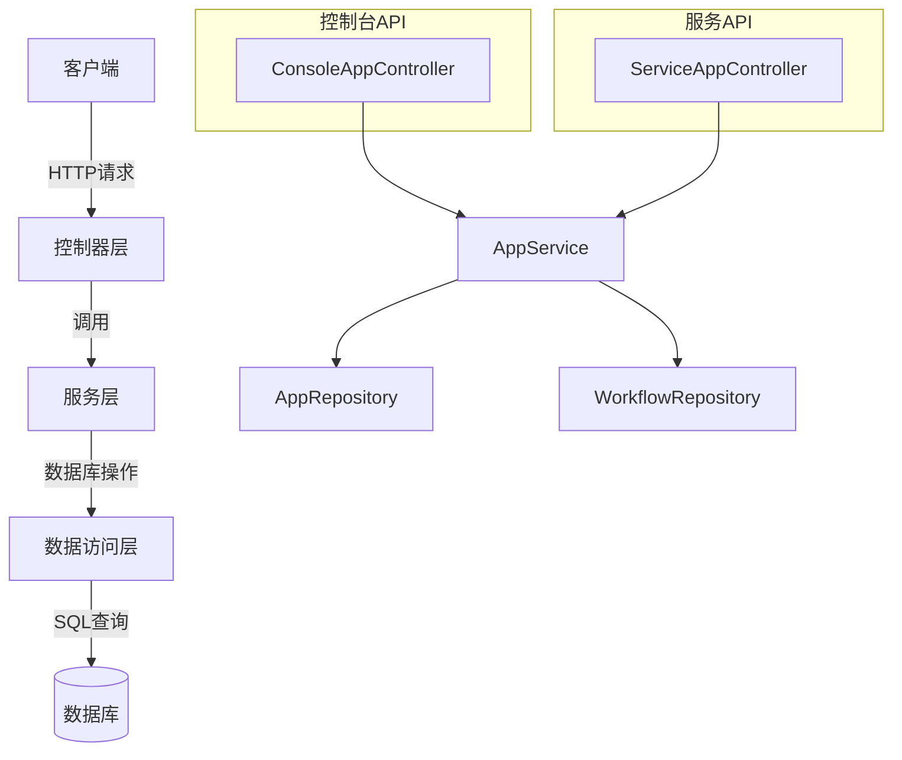
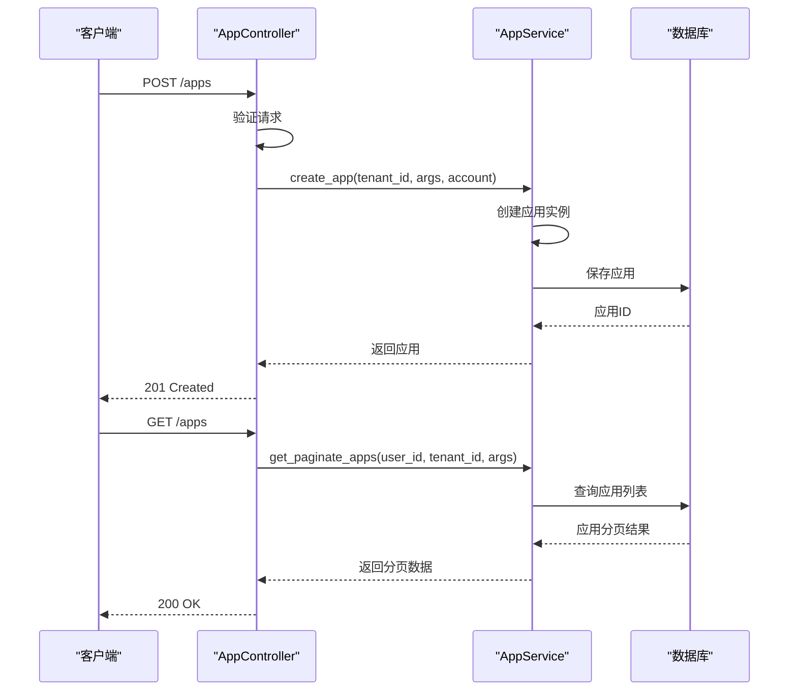
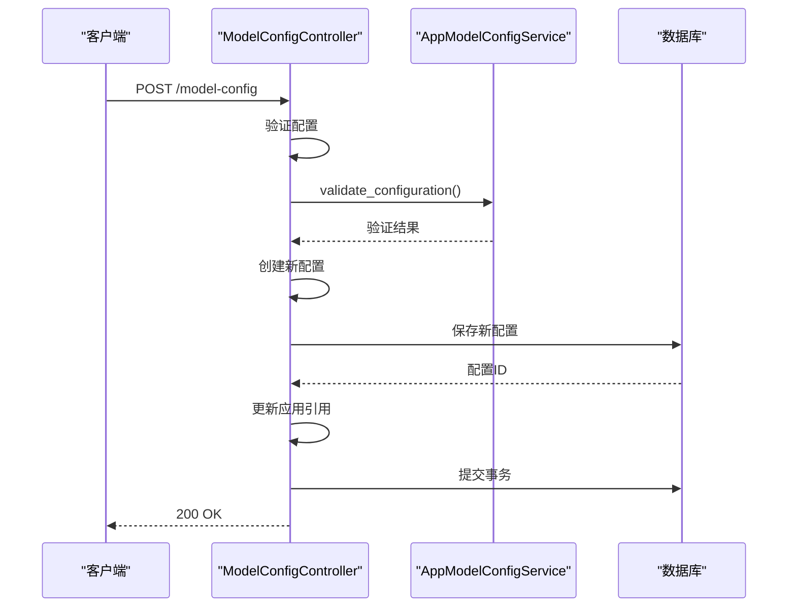
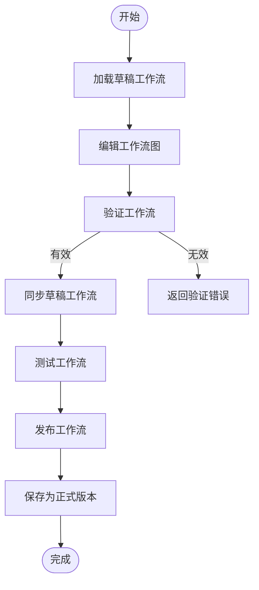
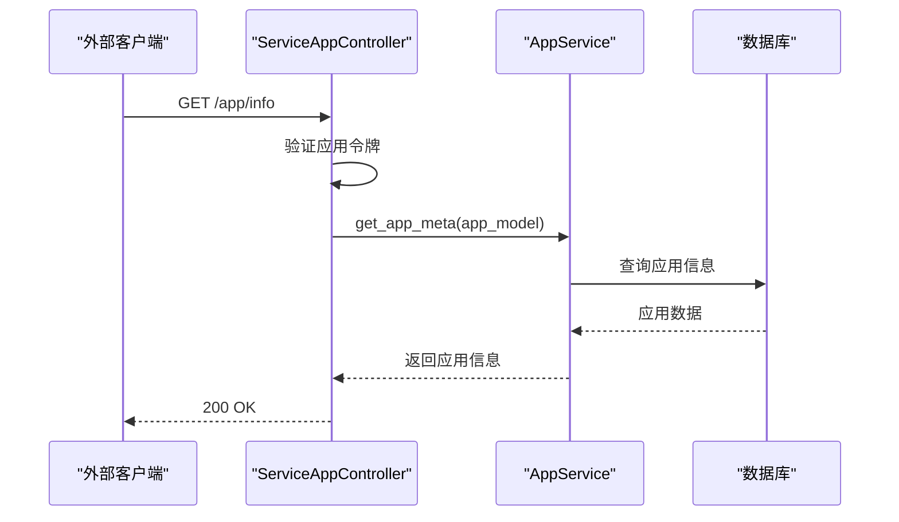
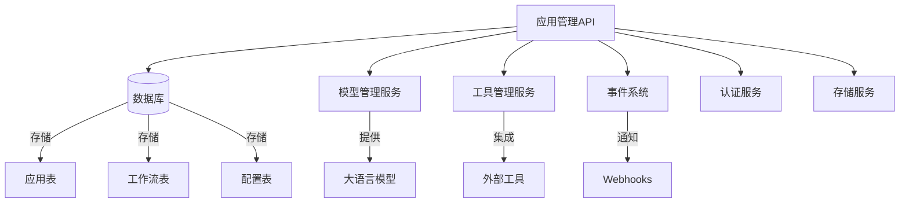

# 应用管理API

<cite>
**本文档中引用的文件**  
- [app.py](file://api/controllers/console/app/app.py)
- [app_service.py](file://api/services/app_service.py)
- [model_config.py](file://api/controllers/console/app/model_config.py)
- [workflow.py](file://api/controllers/console/app/workflow.py)
- [conversation_variables.py](file://api/controllers/console/app/conversation_variables.py)
- [app.py](file://api/controllers/service_api/app/app.py)
</cite>

## 目录
1. [简介](#简介)
2. [项目结构](#项目结构)
3. [核心组件](#核心组件)
4. [架构概述](#架构概述)
5. [详细组件分析](#详细组件分析)
6. [依赖分析](#依赖分析)
7. [性能考虑](#性能考虑)
8. [故障排除指南](#故障排除指南)
9. [结论](#结论)

## 简介
本文档详细介绍了Dify平台的应用管理API，涵盖了应用的创建、读取、更新和删除（CRUD）操作，以及应用配置、工作流定义、对话设置和高级提示模板管理等RESTful接口。文档详细说明了每个端点的HTTP方法、URL路径、请求头（特别是认证令牌）、请求体模式和响应格式。提供了实际的curl示例和Python客户端代码示例，展示如何通过API构建一个完整的对话型AI应用。解释了不同应用类型（如聊天、补全、Agent、工作流）的配置差异和使用场景。文档化了应用发布、版本管理和调试模式的API调用方式。针对常见的错误响应（如400无效配置、404应用不存在）提供了详细的故障排除指南。描述了这些API如何支持前端应用构建器的功能实现。

## 项目结构
Dify应用管理API主要位于`api/controllers/console/app/`和`api/controllers/service_api/app/`目录下。核心功能包括应用的CRUD操作、模型配置管理、工作流管理等。`app.py`文件处理基本的应用操作，`model_config.py`处理模型配置，`workflow.py`处理工作流相关操作。服务API端点位于`service_api/app/`目录下，提供应用参数、元数据和基本信息的读取接口。

**Diagram sources**
- [app.py](file://api/controllers/console/app/app.py)
- [model_config.py](file://api/controllers/console/app/model_config.py)
- [workflow.py](file://api/controllers/console/app/workflow.py)
- [app.py](file://api/controllers/service_api/app/app.py)
- [app_service.py](file://api/services/app_service.py)

**Section sources**
- [app.py](file://api/controllers/console/app/app.py)
- [model_config.py](file://api/controllers/console/app/model_config.py)
- [workflow.py](file://api/controllers/console/app/workflow.py)
- [conversation_variables.py](file://api/controllers/console/app/conversation_variables.py)
- [app.py](file://api/controllers/service_api/app/app.py)

## 核心组件
应用管理API的核心组件包括应用服务（AppService）、工作流服务（WorkflowService）和应用模型配置服务（AppModelConfigService）。AppService负责处理应用的创建、读取、更新和删除操作。WorkflowService管理应用的工作流定义、发布和执行。AppModelConfigService验证和存储应用的模型配置。这些服务通过控制器暴露RESTful接口，供前端应用构建器和外部客户端调用。

**Section sources**
- [app_service.py](file://api/services/app_service.py)
- [workflow_service.py](file://api/services/workflow_service.py)
- [app_model_config_service.py](file://api/services/app_model_config_service.py)

## 架构概述
Dify应用管理API采用分层架构，包括控制器层、服务层和数据访问层。控制器层处理HTTP请求和响应，服务层实现业务逻辑，数据访问层与数据库交互。API分为控制台API和服务API两类：控制台API用于应用构建和管理，需要管理员权限；服务API用于应用运行时信息获取，通过应用令牌认证。这种架构分离了应用构建和运行时关注点，提高了系统的安全性和可维护性。

**Diagram sources**
- [app.py](file://api/controllers/console/app/app.py)
- [app.py](file://api/controllers/service_api/app/app.py)
- [app_service.py](file://api/services/app_service.py)
- [models/model.py](file://api/models/model.py)

## 详细组件分析

### 应用CRUD操作分析
应用CRUD操作通过`AppListApi`和`AppApi`类实现。`GET /apps`端点获取应用列表，支持分页、过滤和排序。`POST /apps`端点创建新应用，需要提供应用名称、模式等信息。`GET /apps/<uuid:app_id>`获取特定应用的详细信息。`PUT /apps/<uuid:app_id>`更新应用配置。`DELETE /apps/<uuid:app_id>`删除应用。这些操作都需要用户具有编辑者权限。

**Diagram sources**
- [app.py](file://api/controllers/console/app/app.py#L99-L134)
- [app_service.py](file://api/services/app_service.py#L30-L428)

**Section sources**
- [app.py](file://api/controllers/console/app/app.py)
- [app_service.py](file://api/services/app_service.py)

### 应用配置管理分析
应用配置管理通过`ModelConfigResource`类实现。`POST /apps/<uuid:app_id>/model-config`端点用于更新应用的模型配置。该操作会验证配置的有效性，然后创建新的应用模型配置记录。对于Agent模式的应用，还会处理工具参数的加密和解密。配置更新后会触发`app_model_config_was_updated`事件，通知系统其他部分配置已更改。

**Diagram sources**
- [model_config.py](file://api/controllers/console/app/model_config.py#L0-L147)
- [app_model_config_service.py](file://api/services/app_model_config_service.py)

**Section sources**
- [model_config.py](file://api/controllers/console/app/model_config.py)
- [app_model_config_service.py](file://api/services/app_model_config_service.py)

### 工作流管理分析
工作流管理是Dify应用的核心功能之一，通过`DraftWorkflowApi`、`PublishedWorkflowApi`等类实现。开发者可以在草稿工作流上进行调试和修改，然后发布为正式版本。`POST /apps/<uuid:app_id>/workflow/draft/sync`同步草稿工作流，`POST /apps/<uuid:app_id>/workflow/publish`发布工作流。工作流包含节点图、功能配置和环境变量等信息。

**Diagram sources**
- [workflow.py](file://api/controllers/console/app/workflow.py#L0-L799)
- [workflow_service.py](file://api/services/workflow_service.py)

**Section sources**
- [workflow.py](file://api/controllers/console/app/workflow.py)
- [workflow_service.py](file://api/services/workflow_service.py)

### 服务API分析
服务API提供应用运行时信息的读取接口，通过应用令牌认证，无需用户登录。`GET /app/parameters`获取应用的输入参数和配置。`GET /app/meta`获取应用的元数据，包括使用的工具图标等。`GET /app/info`获取应用的基本信息，如名称、描述和模式。这些接口支持前端应用和外部系统集成。

**Diagram sources**
- [app.py](file://api/controllers/service_api/app/app.py#L0-L95)
- [app_service.py](file://api/services/app_service.py)

**Section sources**
- [app.py](file://api/controllers/service_api/app/app.py)
- [app_service.py](file://api/services/app_service.py)

## 依赖分析
应用管理API依赖于多个内部服务和外部组件。核心依赖包括数据库服务（用于持久化应用数据）、模型管理服务（用于获取和验证AI模型配置）、工具管理服务（用于处理集成工具）和事件系统（用于通知配置变更）。API还依赖于身份验证和授权系统，确保只有授权用户才能执行管理操作。

**Diagram sources**
- [app_service.py](file://api/services/app_service.py)
- [models/model.py](file://api/models/model.py)
- [core/model_manager.py](file://api/core/model_manager.py)
- [core/tools/tool_manager.py](file://api/core/tools/tool_manager.py)

**Section sources**
- [app_service.py](file://api/services/app_service.py)
- [models/model.py](file://api/models/model.py)

## 性能考虑
应用管理API在设计时考虑了性能优化。应用列表查询使用分页和索引，避免全表扫描。配置更新采用新建记录而非更新旧记录的策略，简化了版本管理和回滚操作。工作流执行使用异步任务队列，避免阻塞API响应。缓存机制用于频繁访问的数据，如应用元信息和模型配置。对于大规模应用部署，建议监控数据库查询性能和API响应时间。

## 故障排除指南
常见问题包括400错误（无效请求）、401错误（未授权）、404错误（资源不存在）和500错误（服务器内部错误）。400错误通常由请求体格式错误或验证失败引起，应检查请求参数是否符合API规范。401错误表示认证失败，应检查API令牌或用户权限。404错误表示请求的资源不存在，应验证资源ID是否正确。500错误需要查看服务器日志以确定根本原因。

**Section sources**
- [error.py](file://api/controllers/console/error.py)
- [app.py](file://api/controllers/console/app/app.py)
- [app_service.py](file://api/services/app_service.py)

## 结论
Dify应用管理API提供了一套完整的RESTful接口，用于创建、配置和管理AI应用。API设计清晰，功能全面，支持从简单聊天机器人到复杂工作流的各种应用类型。通过合理的权限控制和认证机制，确保了系统的安全性。API的分层架构和模块化设计使其易于维护和扩展。开发者可以利用这些API构建自定义的应用管理工具，或将其集成到现有的开发工作流中。