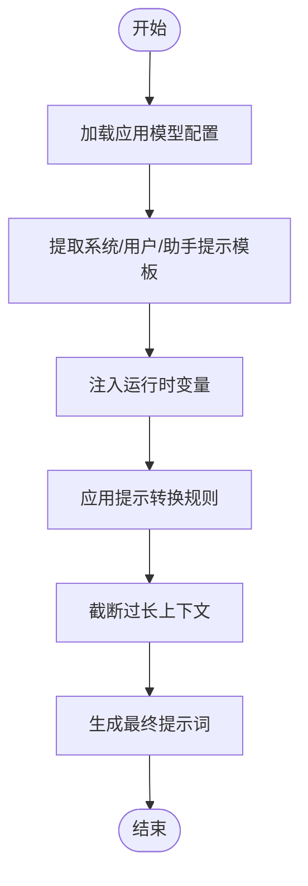
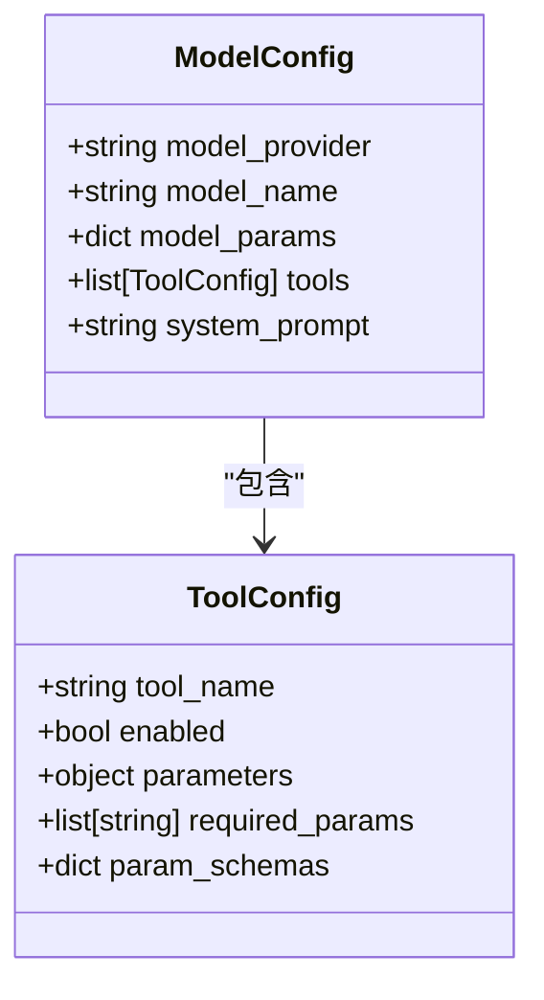

# 模型配置API

<cite>
**本文档中引用的文件**  
- [app_model_config_service.py](file://api/services/app_model_config_service.py)
- [model_entities.py](file://api/core/entities/model_entities.py)
- [prompt_transform.py](file://api/core/prompt/prompt_transform.py)
- [advanced_prompt_template_service.py](file://api/services/advanced_prompt_template_service.py)
- [tool_manager.py](file://api/core/tools/tool_manager.py)
- [llm_generator.py](file://api/core/llm_generator/llm_generator.py)
- [model_providers](file://api/core/model_runtime/model_providers)
- [parameter_entities.py](file://api/core/entities/parameter_entities.py)
- [app_config.py](file://api/core/app/app_config/app_config.py)
- [workflow_service.py](file://api/services/workflow_service.py)
</cite>

## 目录
1. [简介](#简介)
2. [模型配置核心参数](#模型配置核心参数)
3. [提示词模板配置](#提示词模板配置)
4. [工具集成与参数配置](#工具集成与参数配置)
5. [API使用示例](#api使用示例)
6. [配置验证与错误处理](#配置验证与错误处理)
7. [前端模型配置面板支持](#前端模型配置面板支持)
8. [结论](#结论)

## 简介
Dify模型配置API为开发者提供了动态配置应用所使用的语言模型（LLM）及其相关参数的能力。通过该API，可以灵活调整模型提供商、模型名称、生成参数、提示词模板以及外部工具集成，从而实现对聊天应用行为的精细化控制。本API是Dify平台实现可配置化AI应用的核心组件之一。

**Section sources**
- [app_model_config_service.py](file://api/services/app_model_config_service.py#L1-L50)
- [app_config.py](file://api/core/app/app_config/app_config.py#L1-L30)

## 模型配置核心参数
模型配置API允许通过结构化参数定义语言模型的行为。核心配置项包括模型提供商、模型名称和生成参数。

### 模型提供商与模型名称
支持多种主流模型提供商，如OpenAI、Anthropic、Azure等。每个提供商下可选择具体的模型实例（如gpt-4、claude-3-opus等）。配置通过`ModelProviderConfiguration`实体进行管理，确保认证信息与模型能力的正确映射。

### 生成参数调优
关键生成参数包括：
- **温度（temperature）**：控制输出的随机性，取值范围0.0-2.0
- **最大生成长度（max_tokens）**：限制模型单次响应的最大token数
- **top_p**：核采样参数，控制词汇选择的多样性
- **presence_penalty** 和 **frequency_penalty**：调节重复内容的惩罚力度

这些参数通过`ModelConfiguration`对象进行封装，并在调用LLM运行时进行校验和传递。

**Section sources**
- [model_entities.py](file://api/core/entities/model_entities.py#L25-L120)
- [parameter_entities.py](file://api/core/entities/parameter_entities.py#L15-L60)
- [llm_generator.py](file://api/core/llm_generator/llm_generator.py#L45-L80)

## 提示词模板配置
Dify支持高级提示词工程，允许分别定义系统提示、用户提示和助手提示。

### 系统提示（System Prompt）
系统提示用于设定AI的角色、行为准则和知识边界。可在API中通过`system_prompt`字段进行配置，支持变量注入（如{{current_time}}）以实现动态上下文感知。

### 用户提示与助手提示
用户提示模板定义了如何将用户输入转化为模型可理解的格式，而助手提示则提供响应格式的指导。两者均支持多轮对话上下文的拼接逻辑。

### 高级提示转换
通过`AdvancedPromptTransform`机制，API支持复杂的提示词逻辑处理，包括：
- 历史消息的智能截断与摘要
- 工具调用上下文的自动注入
- 多模态输入的格式化处理



**Diagram sources**
- [prompt_transform.py](file://api/core/prompt/prompt_transform.py#L30-L150)
- [advanced_prompt_template_service.py](file://api/services/advanced_prompt_template_service.py#L20-L75)

**Section sources**
- [prompt_transform.py](file://api/core/prompt/prompt_transform.py#L1-L200)
- [advanced_prompt_template_service.py](file://api/services/advanced_prompt_template_service.py#L1-L100)

## 工具集成与参数配置
Dify模型配置API支持将外部工具集成到LLM的执行流程中。

### 工具类型
支持的工具类型包括：
- **搜索工具**：接入网络或知识库搜索能力
- **代码执行工具**：安全沙箱内的代码解释器
- **API调用工具**：连接第三方服务接口
- **自定义插件工具**：基于MCP协议的扩展功能

### 工具参数配置
每个工具可通过JSON Schema定义其参数结构。API允许在应用配置中预设工具参数的默认值、范围限制和验证规则。工具调用权限也可通过配置进行细粒度控制。



**Diagram sources**
- [tool_manager.py](file://api/core/tools/tool_manager.py#L40-L90)
- [model_entities.py](file://api/core/entities/model_entities.py#L80-L110)

**Section sources**
- [tool_manager.py](file://api/core/tools/tool_manager.py#L1-L150)
- [model_entities.py](file://api/core/entities/model_entities.py#L50-L150)

## API使用示例
以下示例展示如何通过curl命令动态调整聊天应用的模型配置。

### 更新模型参数
```bash
curl -X POST "http://localhost:5001/v1/apps/{app_id}/model-config" \
  -H "Authorization: Bearer {token}" \
  -H "Content-Type: application/json" \
  -d '{
    "model": {
      "provider": "openai",
      "name": "gpt-4-turbo",
      "mode": "chat",
      "completion_params": {
        "temperature": 0.7,
        "max_tokens": 1024,
        "top_p": 0.9
      }
    },
    "prompt_template": {
      "system": "你是一个专业的客服助手，回答要简洁明了。",
      "user": "{{query}}",
      "assistant": ""
    },
    "tools": [
      {
        "tool_name": "web_search",
        "enabled": true,
        "parameters": {
          "search_depth": "advanced"
        }
      }
    ]
  }'
```

### 响应示例
成功配置后返回：
```json
{
  "result": "success",
  "data": {
    "model_config_id": "config-abc123",
    "updated_at": "2024-01-01T00:00:00Z"
  }
}
```

**Section sources**
- [app_model_config_service.py](file://api/services/app_model_config_service.py#L100-L300)
- [workflow_service.py](file://api/services/workflow_service.py#L50-L120)

## 配置验证与错误处理
API在接收配置请求时执行严格的验证流程。

### 验证流程
1. 检查模型提供商和模型名称的有效性
2. 校验生成参数的数值范围
3. 验证提示模板的语法正确性
4. 确认工具参数符合预定义Schema

### 错误响应
当配置无效时，API返回详细的错误信息：
```json
{
  "error": {
    "type": "invalid_model_params",
    "message": "max_tokens值超出范围，必须在1-4096之间",
    "details": {
      "field": "max_tokens",
      "received": 5000,
      "valid_range": [1, 4096]
    }
  }
}
```
默认值处理机制确保即使部分参数缺失，系统也能使用安全的默认配置继续运行。

**Section sources**
- [app_model_config_service.py](file://api/services/app_model_config_service.py#L200-L400)
- [parameter_entities.py](file://api/core/entities/parameter_entities.py#L60-L100)

## 前端模型配置面板支持
模型配置API为前端提供了完整的数据接口，支撑可视化配置面板的实现。

### 配置数据结构
API返回结构化的配置元数据，包括：
- 支持的模型列表及能力描述
- 参数的UI控件类型（滑块、下拉框等）
- 工具的图标和说明文本
- 提示模板的编辑建议

### 实时预览功能
前端可通过调用预览端点，在不保存配置的情况下测试模型行为变化，提升用户体验。

**Section sources**
- [app_model_config_service.py](file://api/services/app_model_config_service.py#L300-L500)
- [model_providers](file://api/core/model_runtime/model_providers#L1-L100)

## 结论
Dify模型配置API提供了一套完整、灵活且安全的机制，用于动态管理AI应用的核心行为。通过统一的接口，开发者可以精确控制语言模型的选择、生成参数、提示词工程和工具集成，满足多样化的应用场景需求。该API的设计兼顾了易用性与扩展性，为构建可配置的智能应用奠定了坚实基础。