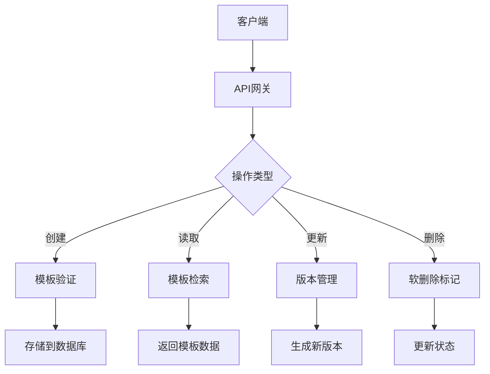
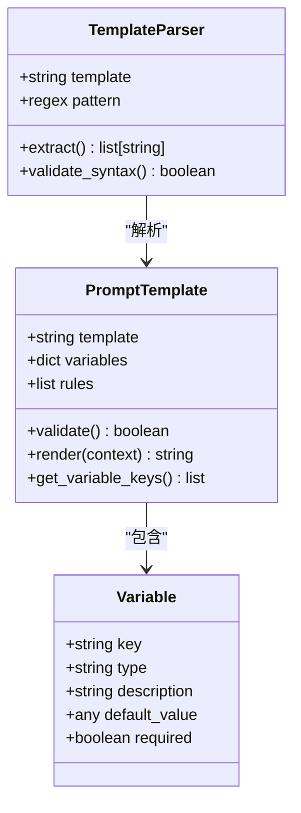
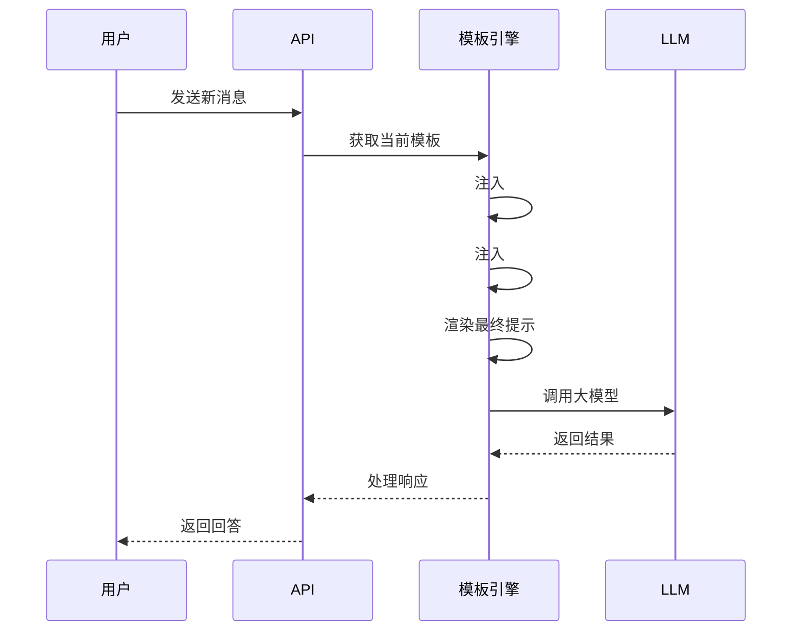
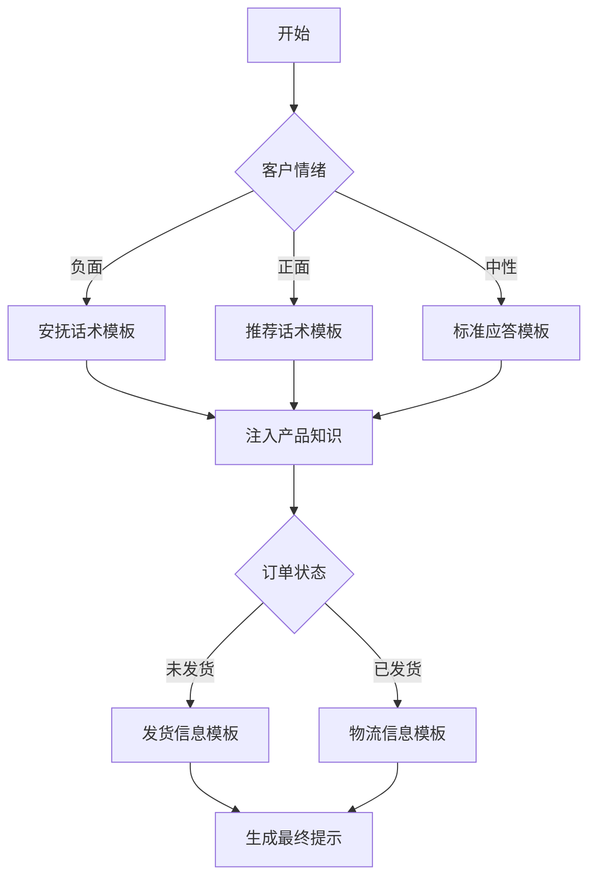
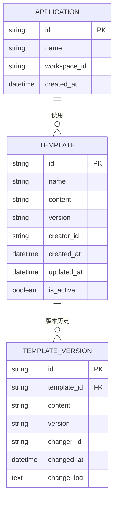
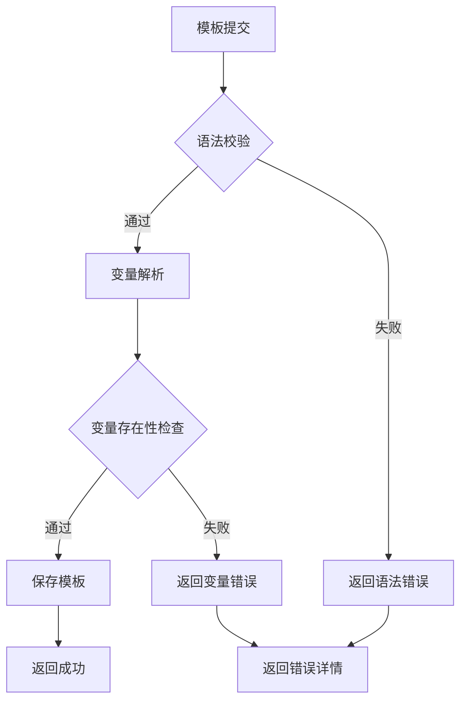

# 高级提示模板API

<cite>
**本文档中引用的文件**  
- [advanced_prompt_template_service.py](file://api/services/advanced_prompt_template_service.py)
- [prompt_transform.py](file://api/core/prompt/prompt_transform.py)
- [advanced_prompt_transform.py](file://api/core/prompt/advanced_prompt_transform.py)
- [variables.py](file://api/core/variables/variables.py)
- [app_model_config_service.py](file://api/services/app_model_config_service.py)
- [prompt_template_parser.py](file://api/core/prompt/utils/prompt_template_parser.py)
- [simple_prompt_transform.py](file://api/core/prompt/simple_prompt_transform.py)
</cite>

## 目录
1. [简介](#简介)
2. [核心功能概述](#核心功能概述)
3. [高级提示模板CRUD操作](#高级提示模板crud操作)
4. [提示模板语法与变量系统](#提示模板语法与变量系统)
5. [多轮对话与上下文管理](#多轮对话与上下文管理)
6. [条件逻辑与动态流程控制](#条件逻辑与动态流程控制)
7. [版本管理与跨应用复用](#版本管理与跨应用复用)
8. [错误处理机制](#错误处理机制)
9. [与前端提示词IDE的集成](#与前端提示词ide的集成)
10. [实际应用示例：客服机器人](#实际应用示例客服机器人)

## 简介

Dify的高级提示模板API为开发者提供了强大的自然语言提示工程能力，支持通过程序化方式创建、管理和使用复杂的提示模板。该API是Dify平台智能化能力的核心组成部分，允许用户定义包含变量注入、条件判断和多轮对话逻辑的高级提示结构。通过该API，可以实现高度定制化的AI应用行为控制，适用于客服机器人、智能助手、内容生成等多种场景。

**Section sources**
- [advanced_prompt_template_service.py](file://api/services/advanced_prompt_template_service.py#L1-L50)

## 核心功能概述

高级提示模板API提供了一套完整的提示工程解决方案，主要包括以下核心功能：
- 支持创建和管理可复用的提示模板
- 实现变量动态注入和类型校验
- 支持多轮对话上下文管理
- 提供条件分支和流程控制能力
- 实现模板版本管理和跨应用共享
- 集成语法校验和错误处理机制

这些功能共同构成了一个完整的提示词开发工作流，从模板设计到部署使用的全过程都得到了系统支持。

**Section sources**
- [advanced_prompt_template_service.py](file://api/services/advanced_prompt_template_service.py#L50-L100)
- [prompt_transform.py](file://api/core/prompt/prompt_transform.py#L1-L30)

## 高级提示模板CRUD操作

### 创建提示模板
通过POST请求创建新的高级提示模板，需要提供模板名称、内容、适用模型等元数据。系统会自动进行语法校验和变量解析。

### 读取提示模板
支持按ID、应用模式、模型类型等多种条件查询提示模板。提供分页查询和详细信息获取接口。

### 更新提示模板
允许对现有模板进行内容和配置的更新，系统会自动处理版本递增和变更记录。

### 删除提示模板
支持软删除机制，保留历史版本记录，确保已有应用的稳定性。



**Diagram sources**
- [advanced_prompt_template_service.py](file://api/services/advanced_prompt_template_service.py#L100-L200)
- [app_model_config_service.py](file://api/services/app_model_config_service.py#L50-L80)

**Section sources**
- [advanced_prompt_template_service.py](file://api/services/advanced_prompt_template_service.py#L100-L250)

## 提示模板语法与变量系统

### 模板语法规范
高级提示模板遵循严格的语法规则：
- 变量必须用`{{}}`包围
- 变量名只能包含字母、数字和下划线
- 变量名长度不超过30个字符
- 变量名必须以字母或下划线开头

### 支持的变量类型
- **自定义变量**：`{{customer_name}}`, `{{order_id}}`
- **系统变量**：`{{#query#}}`, `{{#context#}}`, `{{#histories#}}`
- **嵌套变量**：`{{#knowledge.product_info#}}`

### 变量注入机制
系统在运行时自动解析模板中的变量占位符，并从上下文环境中注入实际值。支持类型校验和默认值设置。



**Diagram sources**
- [prompt_template_parser.py](file://api/core/prompt/utils/prompt_template_parser.py#L1-L50)
- [variables.py](file://api/core/variables/variables.py#L1-L40)

**Section sources**
- [prompt_template_parser.py](file://api/core/prompt/utils/prompt_template_parser.py#L1-L100)
- [variables.py](file://api/core/variables/variables.py#L1-L100)

## 多轮对话与上下文管理

### 对话历史集成
通过`{{#histories#}}`特殊变量自动注入对话历史记录，支持自定义历史格式和长度控制。

### 上下文感知
`{{#context#}}`变量用于注入相关知识库内容，实现基于上下文的回答生成。

### 记忆机制
系统自动维护对话状态，支持跨轮次的变量持久化和引用。



**Diagram sources**
- [simple_prompt_transform.py](file://api/core/prompt/simple_prompt_transform.py#L100-L150)
- [advanced_prompt_transform.py](file://api/core/prompt/advanced_prompt_transform.py#L50-L100)

**Section sources**
- [simple_prompt_transform.py](file://api/core/prompt/simple_prompt_transform.py#L50-L200)
- [advanced_prompt_transform.py](file://api/core/prompt/advanced_prompt_transform.py#L1-L150)

## 条件逻辑与动态流程控制

### 条件判断
支持在提示模板中定义条件逻辑，根据变量值动态选择不同的提示内容。

### 流程分支
通过预定义的规则引擎，实现基于输入内容的流程跳转和处理策略选择。

### 动态模板组合
支持将多个模板片段按条件组合，生成最终的提示内容。



**Diagram sources**
- [advanced_prompt_transform.py](file://api/core/prompt/advanced_prompt_transform.py#L150-L200)
- [prompt_transform.py](file://api/core/prompt/prompt_transform.py#L80-L120)

**Section sources**
- [advanced_prompt_transform.py](file://api/core/prompt/advanced_prompt_transform.py#L150-L250)

## 版本管理与跨应用复用

### 版本控制
每个提示模板都有独立的版本号，支持版本回滚和变更对比。

### 应用间共享
通过模板库机制，实现不同应用间的提示模板共享和复用。

### 变更管理
记录每次修改的操作人、时间和变更内容，确保可追溯性。



**Diagram sources**
- [advanced_prompt_template_service.py](file://api/services/advanced_prompt_template_service.py#L250-L300)
- [app_model_config_service.py](file://api/services/app_model_config_service.py#L100-L150)

**Section sources**
- [advanced_prompt_template_service.py](file://api/services/advanced_prompt_template_service.py#L250-L350)

## 错误处理机制

### 语法校验
在模板创建和更新时进行严格的语法检查，包括变量格式、括号匹配等。

### 变量验证
检查模板中引用的变量是否在上下文中存在，避免未定义变量错误。

### 运行时异常
捕获模板渲染过程中的各种异常，提供详细的错误信息和定位。



**Diagram sources**
- [prompt_template_parser.py](file://api/core/prompt/utils/prompt_template_parser.py#L50-L80)
- [variables.py](file://api/core/variables/variables.py#L80-L120)

**Section sources**
- [prompt_template_parser.py](file://api/core/prompt/utils/prompt_template_parser.py#L50-L100)
- [variables.py](file://api/core/variables/variables.py#L80-L150)

## 与前端提示词IDE的集成

### 实时预览
API支持实时模板渲染，为前端IDE提供即时预览功能。

### 语法高亮
通过API返回的变量信息，实现编辑器中的语法高亮和自动补全。

### 错误提示
将语法校验结果反馈给前端，实现实时错误提示和修复建议。

### 版本对比
提供版本差异对比接口，支持在IDE中直观展示模板变更。

**Section sources**
- [advanced_prompt_template_service.py](file://api/services/advanced_prompt_template_service.py#L350-L400)
- [prompt_transform.py](file://api/core/prompt/prompt_transform.py#L150-L200)

## 实际应用示例：客服机器人

### 场景描述
为电商平台的客服机器人创建一个高级提示模板，包含客户信息、产品知识和回复策略。

### API调用示例
```bash
curl -X POST 'http://localhost:5001/app/prompt-templates' \
  -H 'Authorization: Bearer <your_token>' \
  -H 'Content-Type: application/json' \
  -d '{
    "app_mode": "chat",
    "model_mode": "completion",
    "has_context": true,
    "model_name": "gpt-3.5-turbo",
    "template": "客户信息：{{customer_name}}，会员等级：{{vip_level}}\n\n产品知识：{{#knowledge.product_info#}}\n\n对话历史：{{#histories#}}\n\n最新问题：{{#query#}}\n\n回复策略：根据客户等级提供差异化服务，VIP客户优先处理。"
  }'
```

### 模板特点
- 动态注入客户信息和产品知识
- 自动包含对话历史和当前问题
- 基于客户等级的差异化服务策略
- 支持后续扩展更多业务规则

**Section sources**
- [advanced_prompt_template_service.py](file://api/services/advanced_prompt_template_service.py#L400-L450)
- [simple_prompt_transform.py](file://api/core/prompt/simple_prompt_transform.py#L200-L250)