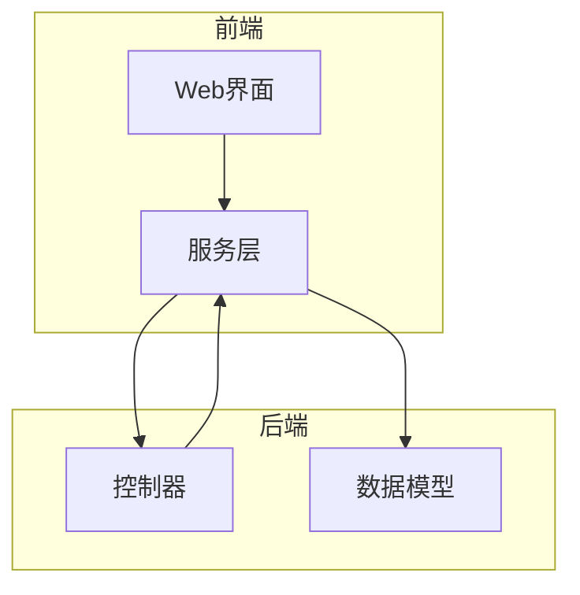
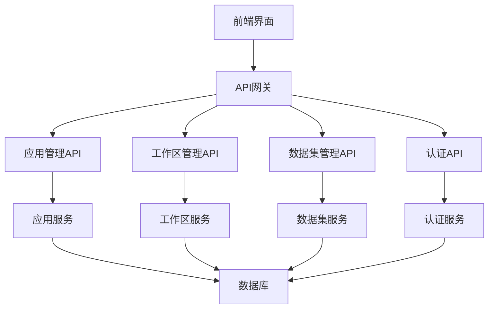
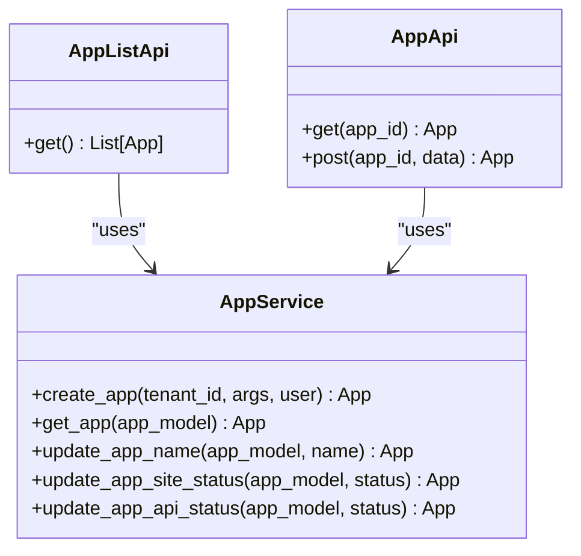
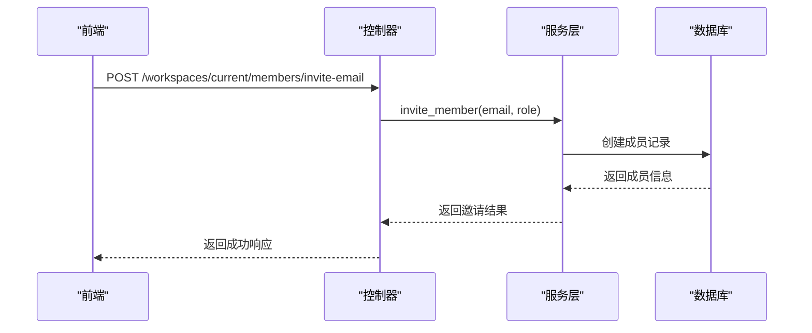
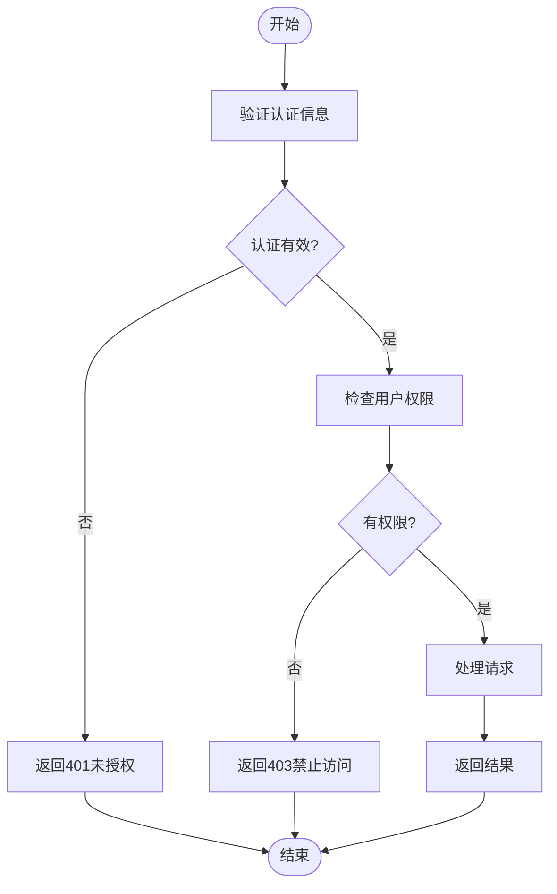
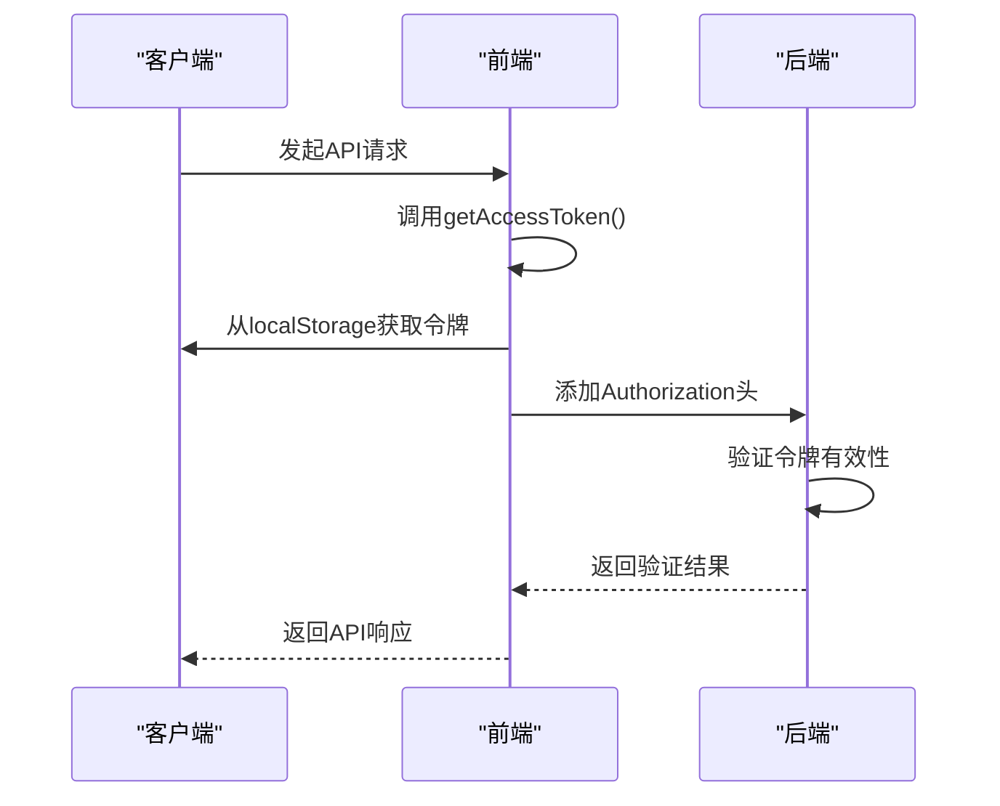
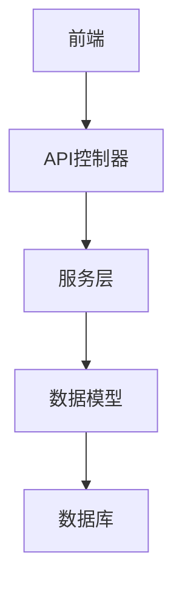

# 控制台API

<cite>
**本文档中引用的文件**
- [apikey.py](file://api/controllers/console/apikey.py)
- [workspace.py](file://api/controllers/console/workspace/workspace.py)
- [datasets.py](file://api/controllers/console/datasets/datasets.py)
- [app.py](file://api/controllers/console/app/app.py)
- [auth.py](file://api/controllers/console/auth/login.py)
- [service_api.py](file://api/controllers/service_api/index.py)
- [fetch.ts](file://web/service/fetch.ts)
- [common.ts](file://web/service/common.ts)
- [apps.ts](file://web/service/apps.ts)
- [datasets.ts](file://web/service/datasets.ts)
</cite>

## 目录
1. [简介](#简介)
2. [项目结构](#项目结构)
3. [核心组件](#核心组件)
4. [架构概述](#架构概述)
5. [详细组件分析](#详细组件分析)
6. [依赖分析](#依赖分析)
7. [性能考虑](#性能考虑)
8. [故障排除指南](#故障排除指南)
9. [结论](#结论)
10. [附录](#附录)（如有必要）

## 简介
本文档详细描述了Dify控制台API，涵盖应用管理、认证、数据集操作和工作区管理等RESTful接口。文档详细说明了每个端点的HTTP方法、URL路径、请求头（特别是认证令牌）、请求体模式和响应格式。提供了实际的curl示例和Python客户端代码示例。解释了API密钥的生成和使用方式，以及基于角色的访问控制机制。文档化了分页、排序和过滤参数的使用方法。针对常见的错误响应（如401未授权、403禁止访问、429速率限制）提供了详细的故障排除指南。描述了这些API如何支持前端控制台界面的功能实现。

## 项目结构
Dify项目的API控制器主要位于`api/controllers/console`目录下，分为多个模块：应用（app）、认证（auth）、数据集（datasets）、工作区（workspace）等。每个模块包含相应的API端点实现。服务层位于`api/services`目录下，提供业务逻辑处理。前端代码位于`web`目录下，通过TypeScript调用API接口。



**Diagram sources**
- [app.py](file://api/controllers/console/app/app.py)
- [workspace.py](file://api/controllers/console/workspace/workspace.py)
- [datasets.py](file://api/controllers/console/datasets/datasets.py)

**Section sources**
- [app.py](file://api/controllers/console/app/app.py#L1-L50)
- [workspace.py](file://api/controllers/console/workspace/workspace.py#L1-L50)
- [datasets.py](file://api/controllers/console/datasets/datasets.py#L1-L50)

## 核心组件
Dify控制台API的核心组件包括应用管理、工作区管理、数据集管理和认证系统。应用管理API允许创建、更新和删除应用，以及管理应用的站点和API状态。工作区管理API提供工作区成员管理、模型提供商配置和插件管理功能。数据集管理API支持数据集的创建、更新、删除和查询操作。认证系统基于API密钥和Bearer令牌实现安全访问控制。

**Section sources**
- [app.py](file://api/controllers/console/app/app.py#L99-L373)
- [workspace.py](file://api/controllers/console/workspace/workspace.py#L304-L312)
- [datasets.py](file://api/controllers/console/datasets/datasets.py#L779-L808)

## 架构概述
Dify控制台API采用分层架构设计，前端通过RESTful API与后端交互。后端使用Flask框架实现API控制器，服务层处理业务逻辑，数据访问层与数据库交互。API密钥用于服务间通信的身份验证，而用户会话通过Bearer令牌进行管理。系统实现了基于角色的访问控制，确保不同权限级别的用户只能访问其授权的资源。



**Diagram sources**
- [app.py](file://api/controllers/console/app/app.py#L99-L373)
- [workspace.py](file://api/controllers/console/workspace/workspace.py#L304-L312)
- [datasets.py](file://api/controllers/console/datasets/datasets.py#L779-L808)

## 详细组件分析

### 应用管理分析
应用管理API提供完整的应用生命周期管理功能，包括创建、读取、更新和删除操作。通过`/apps`端点可以列出所有应用，`/apps/<uuid:app_id>`端点用于获取特定应用的详细信息。应用的站点状态和API状态可以通过专门的端点进行启用或禁用。

#### 应用管理类图


**Diagram sources**
- [app.py](file://api/controllers/console/app/app.py#L99-L373)

**Section sources**
- [app.py](file://api/controllers/console/app/app.py#L99-L373)

### 工作区管理分析
工作区管理API提供工作区成员管理、模型提供商配置和插件管理功能。成员管理API支持邀请成员、更新角色和转移工作区所有者。模型提供商API允许配置不同的模型提供商，而插件API支持插件的管理和配置。

#### 工作区管理序列图


**Diagram sources**
- [members.py](file://api/controllers/console/workspace/members.py#L304-L312)

**Section sources**
- [members.py](file://api/controllers/console/workspace/members.py#L304-L312)

### 数据集管理分析
数据集管理API提供完整的数据集生命周期管理功能，包括创建、读取、更新和删除操作。通过`/datasets`端点可以列出所有数据集，`/datasets/<uuid:dataset_id>`端点用于获取特定数据集的详细信息。数据集的使用检查、索引状态和相关应用列表也可以通过专门的端点获取。

#### 数据集管理流程图


**Diagram sources**
- [datasets.py](file://api/controllers/console/datasets/datasets.py#L779-L808)

**Section sources**
- [datasets.py](file://api/controllers/console/datasets/datasets.py#L779-L808)

### 认证机制分析
Dify的认证机制基于API密钥和Bearer令牌。API密钥用于服务间通信的身份验证，而用户会话通过Bearer令牌进行管理。前端通过`getAccessToken`函数获取访问令牌，并在请求头中设置`Authorization: Bearer {token}`。

#### 认证流程序列图


**Diagram sources**
- [fetch.ts](file://web/service/fetch.ts#L67-L115)
- [data_source_bearer_auth.py](file://api/controllers/console/auth/data_source_bearer_auth.py#L0-L31)

**Section sources**
- [fetch.ts](file://web/service/fetch.ts#L67-L115)
- [data_source_bearer_auth.py](file://api/controllers/console/auth/data_source_bearer_auth.py#L0-L31)

## 依赖分析
Dify控制台API的各个组件之间存在明确的依赖关系。控制器层依赖于服务层来处理业务逻辑，服务层又依赖于数据模型层来访问持久化数据。前端服务依赖于API控制器提供的RESTful接口。这种分层架构确保了代码的可维护性和可测试性。



**Diagram sources**
- [app.py](file://api/controllers/console/app/app.py)
- [workspace.py](file://api/controllers/console/workspace/workspace.py)
- [datasets.py](file://api/controllers/console/datasets/datasets.py)

**Section sources**
- [app.py](file://api/controllers/console/app/app.py#L1-L50)
- [workspace.py](file://api/controllers/console/workspace/workspace.py#L1-L50)
- [datasets.py](file://api/controllers/console/datasets/datasets.py#L1-L50)

## 性能考虑
Dify控制台API在设计时考虑了性能因素。对于列表查询操作，API支持分页、排序和过滤参数，以减少数据传输量和提高响应速度。例如，数据集列表API支持`page`、`limit`和`keyword`参数来实现分页和搜索功能。此外，系统实现了适当的缓存策略来提高频繁访问数据的响应速度。

## 故障排除指南
当使用Dify控制台API时，可能会遇到各种错误响应。以下是一些常见错误及其解决方案：

- **401未授权**：确保在请求头中正确设置了`Authorization: Bearer {token}`，并且令牌未过期。
- **403禁止访问**：检查当前用户是否有权限执行该操作，某些操作需要管理员或所有者权限。
- **429速率限制**：API可能对请求频率进行了限制，需要等待一段时间后再重试。
- **404未找到**：检查URL路径是否正确，以及资源ID是否存在。

**Section sources**
- [error.py](file://api/controllers/console/error.py)
- [workspace.py](file://api/controllers/console/workspace/workspace.py#L304-L312)
- [datasets.py](file://api/controllers/console/datasets/datasets.py#L779-L808)

## 结论
Dify控制台API提供了一套完整的RESTful接口，支持应用管理、工作区管理、数据集操作和认证等功能。API设计遵循REST原则，使用标准的HTTP方法和状态码。通过API密钥和基于角色的访问控制，确保了系统的安全性。前端通过TypeScript服务调用这些API，实现了丰富的用户界面功能。文档详细描述了各个API端点的使用方法，为开发者提供了全面的参考。

## 附录

### API端点汇总表
| 模块 | 端点 | 方法 | 描述 |
|------|------|------|------|
| 应用管理 | `/apps` | GET | 获取应用列表 |
| 应用管理 | `/apps/<uuid:app_id>` | GET | 获取应用详情 |
| 应用管理 | `/apps/<uuid:app_id>/site-enable` | POST | 启用/禁用应用站点 |
| 应用管理 | `/apps/<uuid:app_id>/api-enable` | POST | 启用/禁用应用API |
| 工作区管理 | `/workspaces/current/members` | GET | 获取成员列表 |
| 工作区管理 | `/workspaces/current/members/invite-email` | POST | 邀请成员 |
| 数据集管理 | `/datasets` | GET | 获取数据集列表 |
| 数据集管理 | `/datasets/<uuid:dataset_id>` | GET | 获取数据集详情 |
| 数据集管理 | `/datasets/<uuid:dataset_id>/use-check` | GET | 检查数据集是否被使用 |

### Python客户端代码示例
```python
import requests

class DifyClient:
    def __init__(self, base_url, api_key):
        self.base_url = base_url
        self.api_key = api_key
        self.headers = {
            "Authorization": f"Bearer {api_key}",
            "Content-Type": "application/json"
        }
    
    def get_apps(self):
        response = requests.get(f"{self.base_url}/apps", headers=self.headers)
        return response.json()
    
    def create_app(self, name, description=None):
        data = {"name": name}
        if description:
            data["description"] = description
        response = requests.post(f"{self.base_url}/apps", json=data, headers=self.headers)
        return response.json()
    
    def get_datasets(self):
        response = requests.get(f"{self.base_url}/datasets", headers=self.headers)
        return response.json()
```

### curl示例
```bash
# 获取应用列表
curl -X GET "http://localhost:5001/apps" \
  -H "Authorization: Bearer <your_token>" \
  -H "Content-Type: application/json"

# 创建新应用
curl -X POST "http://localhost:5001/apps" \
  -H "Authorization: Bearer <your_token>" \
  -H "Content-Type: application/json" \
  -d '{"name": "My New App", "description": "A test application"}'

# 获取数据集列表
curl -X GET "http://localhost:5001/datasets" \
  -H "Authorization: Bearer <your_token>" \
  -H "Content-Type: application/json"
```