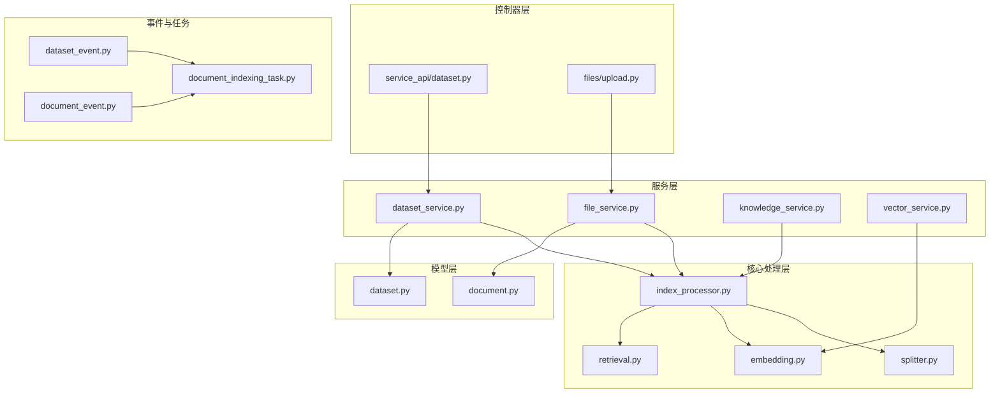
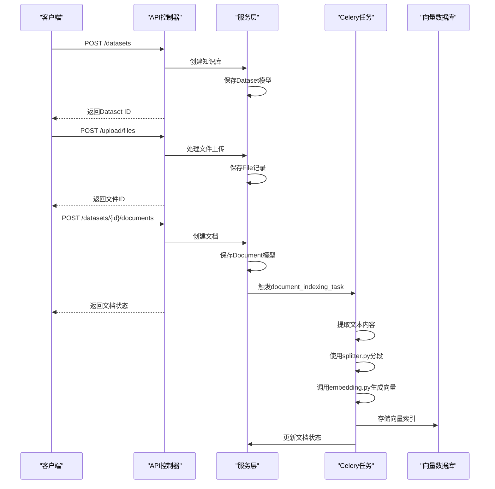
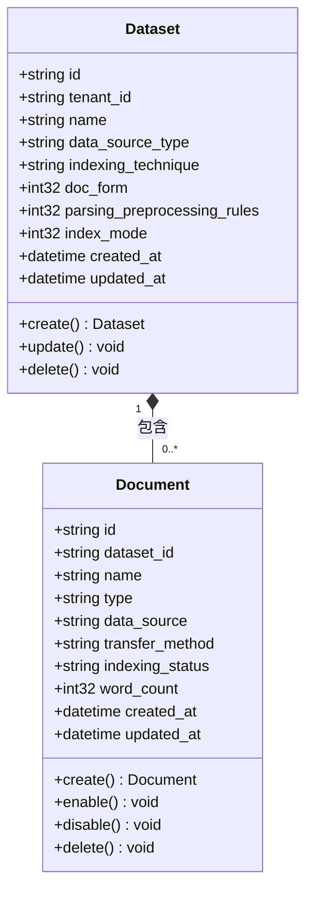
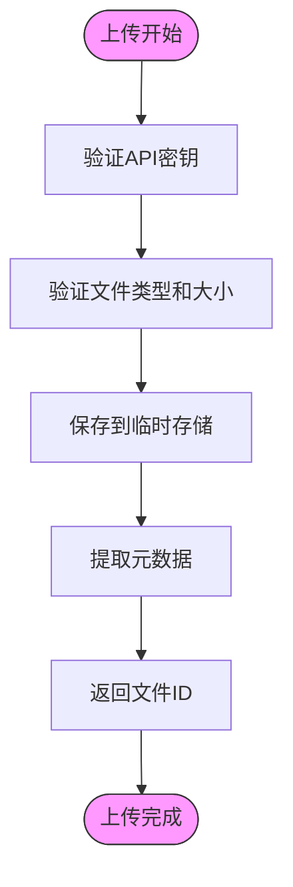
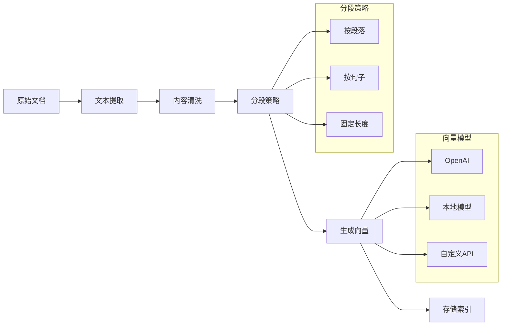
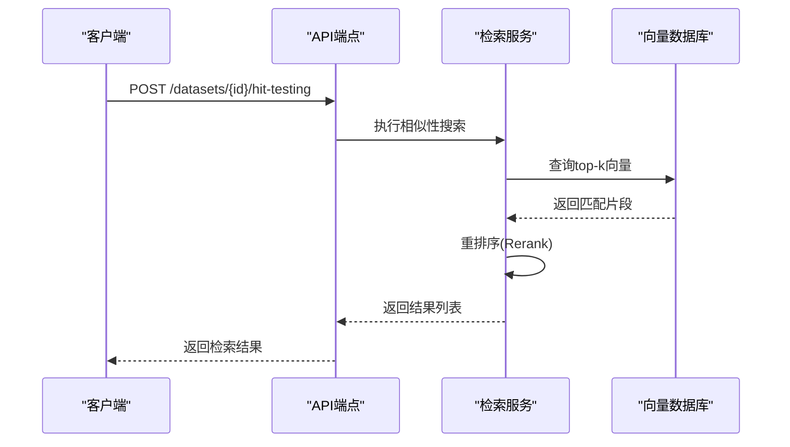
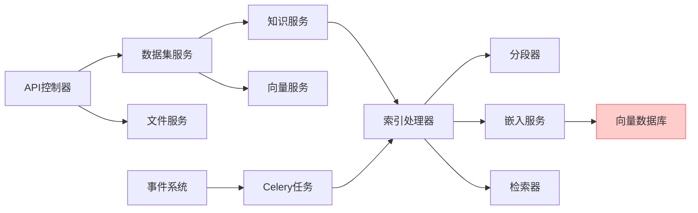

# 数据集API

<cite>
**本文档中引用的文件**  
- [dataset_service.py](file://api/services/dataset_service.py)
- [knowledge_service.py](file://api/services/knowledge_service.py)
- [file_service.py](file://api/services/file_service.py)
- [vector_service.py](file://api/services/vector_service.py)
- [upload.py](file://api/controllers/files/upload.py)
- [dataset_fields.py](file://api/fields/dataset_fields.py)
- [document_fields.py](file://api/fields/document_fields.py)
- [models.py](file://api/models/dataset.py)
- [index_processor.py](file://api/core/rag/index_processor.py)
- [splitter.py](file://api/core/rag/splitter.py)
- [embedding.py](file://api/core/rag/embedding.py)
- [retrieval.py](file://api/core/rag/retrieval.py)
- [events/dataset_event.py](file://api/events/dataset_event.py)
- [events/document_event.py](file://api/events/document_event.py)
- [tasks/document_indexing_task.py](file://api/tasks/document_indexing_task.py)
- [controllers/service_api/dataset.py](file://api/controllers/service_api/dataset.py)
</cite>

## 目录
1. [简介](#简介)
2. [项目结构](#项目结构)
3. [核心组件](#核心组件)
4. [架构概述](#架构概述)
5. [详细组件分析](#详细组件分析)
6. [依赖分析](#依赖分析)
7. [性能考虑](#性能考虑)
8. [故障排除指南](#故障排除指南)
9. [结论](#结论)

## 简介
本文档详细描述了Dify平台中数据集（知识库）相关的RESTful API接口。这些API支持创建知识库、上传文档、文本提取、向量化处理、检索测试以及元数据管理等核心功能，是构建RAG（检索增强生成）应用的基础。

API设计遵循REST原则，支持多格式文档上传（包括PDF、Word、网页等），采用异步处理机制进行文档解析和向量化，并提供状态轮询接口以监控处理进度。文档还涵盖分段策略、嵌入模型选择、检索测试方法及常见错误处理。

## 项目结构
Dify的数据集功能主要分布在`api/controllers`、`api/services`、`api/core/rag`和`api/models`等目录中，形成了清晰的分层架构。

**Diagram sources**
- [controllers/service_api/dataset.py](file://api/controllers/service_api/dataset.py)
- [services/dataset_service.py](file://api/services/dataset_service.py)
- [core/rag/index_processor.py](file://api/core/rag/index_processor.py)

**Section sources**
- [controllers/service_api/dataset.py](file://api/controllers/service_api/dataset.py)
- [services/dataset_service.py](file://api/services/dataset_service.py)
- [core/rag/index_processor.py](file://api/core/rag/index_processor.py)

## 核心组件
数据集API的核心组件包括知识库管理服务、文档上传处理、文本分段器、向量嵌入服务和检索引擎。这些组件协同工作，实现从原始文档到可检索知识库的完整流程。

**Section sources**
- [dataset_service.py](file://api/services/dataset_service.py)
- [knowledge_service.py](file://api/services/knowledge_service.py)
- [index_processor.py](file://api/core/rag/index_processor.py)

## 架构概述
Dify的数据集处理采用事件驱动的异步架构。当用户通过API上传文档后，系统会创建文档记录并触发异步任务进行内容提取、分段和向量化。整个流程通过事件总线解耦，确保高可靠性和可扩展性。

**Diagram sources**
- [upload.py](file://api/controllers/files/upload.py)
- [dataset_service.py](file://api/services/dataset_service.py)
- [document_indexing_task.py](file://api/tasks/document_indexing_task.py)
- [index_processor.py](file://api/core/rag/index_processor.py)

## 详细组件分析

### 知识库管理分析
知识库（Dataset）是文档的逻辑容器，支持多种索引类型和分段配置。

**Diagram sources**
- [models.py](file://api/models/dataset.py)
- [dataset_fields.py](file://api/fields/dataset_fields.py)

**Section sources**
- [dataset_service.py](file://api/services/dataset_service.py)
- [models.py](file://api/models/dataset.py)

### 文档上传与处理分析
文档上传采用多部分表单数据格式，支持多种文件类型。

**Diagram sources**
- [upload.py](file://api/controllers/files/upload.py)
- [file_service.py](file://api/services/file_service.py)

**Section sources**
- [upload.py](file://api/controllers/files/upload.py)
- [file_service.py](file://api/services/file_service.py)

### 文本分段与向量化分析
文本处理流程包括内容提取、清洗、分段和向量化。

**Diagram sources**
- [splitter.py](file://api/core/rag/splitter.py)
- [embedding.py](file://api/core/rag/embedding.py)
- [index_processor.py](file://api/core/rag/index_processor.py)

**Section sources**
- [splitter.py](file://api/core/rag/splitter.py)
- [embedding.py](file://api/core/rag/embedding.py)

### 检索测试分析
提供API用于测试知识库的检索效果。

**Diagram sources**
- [retrieval.py](file://api/core/rag/retrieval.py)
- [controllers/service_api/dataset.py](file://api/controllers/service_api/dataset.py)

**Section sources**
- [retrieval.py](file://api/core/rag/retrieval.py)
- [dataset_service.py](file://api/services/dataset_service.py)

## 依赖分析
数据集功能依赖多个内部服务和外部系统，形成复杂的依赖网络。

**Diagram sources**
- [go.mod](file://pyproject.toml)
- [dataset_service.py](file://api/services/dataset_service.py)
- [index_processor.py](file://api/core/rag/index_processor.py)

**Section sources**
- [dataset_service.py](file://api/services/dataset_service.py)
- [vector_service.py](file://api/services/vector_service.py)
- [index_processor.py](file://api/core/rag/index_processor.py)

## 性能考虑
- **异步处理**：文档索引采用Celery任务队列，避免阻塞API请求
- **批量操作**：支持批量文档创建和索引更新，减少网络开销
- **缓存机制**：频繁访问的数据（如知识库配置）使用Redis缓存
- **流式处理**：大文件采用流式上传和处理，降低内存占用
- **连接池**：数据库和向量数据库连接使用连接池管理

## 故障排除指南
针对常见错误提供解决方案：

### 413 请求体过大
**原因**：上传文件超过服务器限制  
**解决方案**：
- 检查`MAX_CONTENT_LENGTH`配置
- 分割大文件后上传
- 使用分块上传API（如果支持）

### 422 文档处理失败
**原因**：文档格式不支持或内容损坏  
**解决方案**：
- 验证文件格式是否在支持列表中
- 检查文件是否完整无损
- 查看任务日志获取具体错误信息
- 确认文件编码（特别是文本文件）

### 500 向量化错误
**原因**：嵌入模型服务不可用或API密钥无效  
**解决方案**：
- 检查嵌入模型提供商状态
- 验证API密钥和配额
- 确认网络连接正常
- 查看向量数据库连接状态

**Section sources**
- [errors.py](file://api/controllers/common/errors.py)
- [document_indexing_task.py](file://api/tasks/document_indexing_task.py)
- [embedding.py](file://api/core/rag/embedding.py)

## 结论
Dify的数据集API提供了一套完整的知识库管理解决方案，支持从文档上传到智能检索的全流程。通过清晰的REST接口设计和异步处理架构，开发者可以轻松构建高效的RAG应用。建议在生产环境中合理配置分段策略和嵌入模型，以平衡检索精度和系统性能。