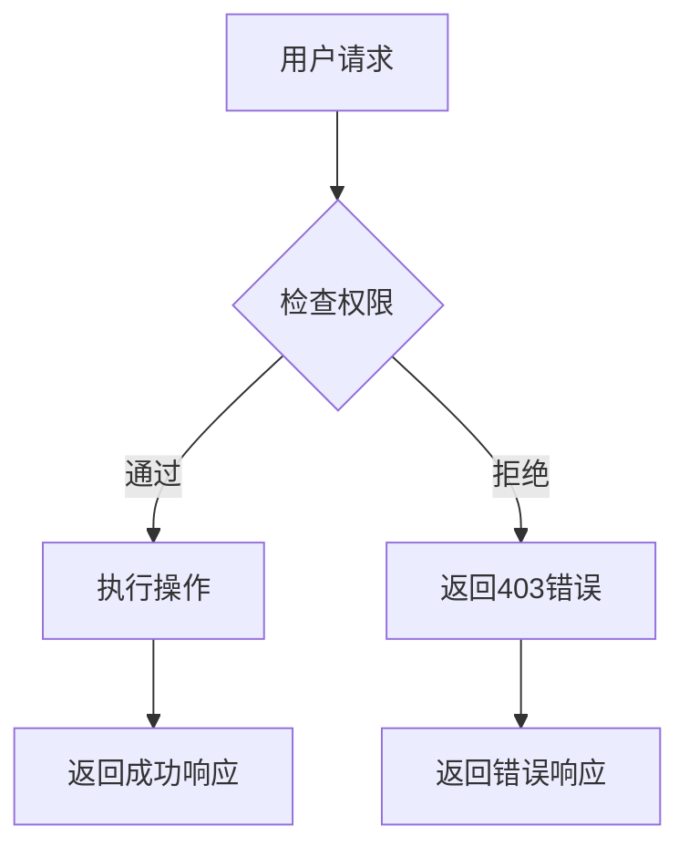

# 数据集管理API

<cite>
**本文档中引用的文件**  
- [dataset_service.py](file://api/services/dataset_service.py)
- [datasets.py](file://api/controllers/console/datasets/datasets.py)
- [wraps.py](file://api/controllers/service_api/wraps.py)
- [dataset.py](file://api/models/dataset.py)
</cite>

## 目录
1. [简介](#简介)
2. [API端点概览](#api端点概览)
3. [数据集CRUD操作](#数据集crud操作)
4. [数据集权限模型](#数据集权限模型)
5. [数据集统计信息](#数据集统计信息)
6. [错误响应与故障排除](#错误响应与故障排除)
7. [代码示例](#代码示例)
8. [结论](#结论)

## 简介
Dify平台提供了一套完整的数据集管理API，允许开发者通过编程方式创建、读取、更新和删除（CRUD）数据集。这些API支持对数据集名称、描述、索引技术、嵌入模型和权限设置等核心字段的全面管理。本API特别适用于需要批量管理多个数据集或将其集成到自动化工作流中的场景。

**Section sources**
- [dataset_service.py](file://api/services/dataset_service.py#L82-L756)

## API端点概览
数据集管理API提供了一系列RESTful端点，用于执行各种操作。主要端点包括：
- `POST /datasets`：创建新的数据集
- `GET /datasets`：列出当前工作区的所有数据集
- `GET /datasets/{dataset_id}`：获取特定数据集的详细信息
- `PATCH /datasets/{dataset_id}`：更新现有数据集的属性
- `DELETE /datasets/{dataset_id}`：删除指定的数据集

这些端点构成了数据集生命周期管理的基础，支持从初始化到最终清理的完整流程。

**Section sources**
- [datasets.py](file://api/controllers/console/datasets/datasets.py#L779-L808)

## 数据集CRUD操作

### 创建数据集 (POST /datasets)
此操作用于创建一个新的数据集。请求体必须包含数据集的名称，并可选择性地包含描述、索引技术、权限设置等字段。

**请求体模式**:
- `name` (字符串, 必需): 数据集的唯一名称。
- `description` (字符串, 可选): 数据集的详细描述。
- `indexing_technique` (字符串, 可选): 索引技术，可以是 "high_quality" 或 "economy"。
- `permission` (字符串, 可选): 数据集的访问权限，如 "only_me", "all_team" 或 "partial_team"。

如果名称已存在，将返回409冲突错误。

### 读取数据集 (GET /datasets 和 GET /datasets/{dataset_id})
`GET /datasets` 端点返回当前租户下所有数据集的分页列表，支持通过搜索参数进行过滤。`GET /datasets/{dataset_id}` 端点则返回指定ID的数据集的完整信息。

**响应格式**:
响应是一个包含数据集对象数组的JSON，每个对象都包含其ID、名称、描述、创建时间、更新时间、索引技术、权限和统计信息。

### 更新数据集 (PATCH /datasets/{dataset_id})
此操作允许修改现有数据集的属性。可以更新的字段与创建时相同。系统会验证用户是否有权修改该数据集。

### 删除数据集 (DELETE /datasets/{dataset_id})
此操作将永久删除指定的数据集及其所有关联文档。执行前会进行权限检查，确保用户有权删除该资源。

**Section sources**
- [dataset_service.py](file://api/services/dataset_service.py#L82-L756)
- [datasets.py](file://api/controllers/console/datasets/datasets.py#L341-L380)

## 数据集权限模型
Dify的数据集权限模型定义了谁可以访问特定的数据集。权限级别包括：
- **仅我 (only_me)**: 只有创建者可以访问。
- **团队共享 (all_team)**: 工作区内的所有成员都可以访问。
- **部分团队 (partial_team)**: 仅限被明确授权的团队成员访问。

权限在创建数据集时设置，并可通过`PATCH`请求更新。系统通过`DatasetService.check_dataset_permission`方法强制执行这些规则，确保只有授权用户才能执行读取、更新或删除操作。



**Diagram sources**
- [dataset_service.py](file://api/services/dataset_service.py#L82-L756)

## 数据集统计信息
通过`GET /datasets/{dataset_id}/queries`等端点，可以获取关于数据集使用情况的详细统计信息。这包括：
- **查询历史**: 获取与特定数据集相关的所有查询记录。
- **关联应用**: 列出所有使用了该数据集的应用。
- **自动禁用日志**: 获取因超出配额而被自动禁用的文档日志。

这些信息对于监控数据集的使用模式和进行容量规划至关重要。

**Section sources**
- [dataset_service.py](file://api/services/dataset_service.py#L82-L756)
- [datasets.py](file://api/controllers/console/datasets/datasets.py#L341-L380)

## 错误响应与故障排除
API在遇到问题时会返回标准的HTTP状态码和详细的错误信息。

### 常见错误
- **409 冲突**: 当尝试创建一个名称已存在的数据集时触发。解决方案是选择一个唯一的名称。
- **404 未找到**: 当请求的`dataset_id`不存在时返回。请检查ID是否正确。
- **403 权限不足**: 当用户试图访问其无权访问的数据集时发生。确保用户具有正确的角色（如所有者或数据集操作员）或已被明确授权。

**Section sources**
- [dataset_service.py](file://api/services/dataset_service.py#L82-L756)
- [datasets.py](file://api/controllers/console/datasets/datasets.py#L341-L380)

## 代码示例

### 使用curl创建数据集
```bash
curl -X POST 'https://api.dify.ai/v1/datasets' \
-H 'Authorization: Bearer <YOUR_API_KEY>' \
-H 'Content-Type: application/json' \
-d '{
  "name": "我的新产品文档",
  "description": "包含所有关于新产品的技术规格和用户手册。",
  "indexing_technique": "high_quality",
  "permission": "all_team"
}'
```

### 使用Python客户端批量创建数据集
```python
from dify_client import Client

client = Client(api_key="<YOUR_API_KEY>")

dataset_names = ["市场报告Q1", "市场报告Q2", "市场报告Q3", "市场报告Q4"]

for name in dataset_names:
    try:
        response = client.create_dataset(
            name=name,
            description=f"{name} 的详细财务和运营数据。",
            permission="partial_team"
        )
        print(f"成功创建数据集: {response['name']}")
    except Exception as e:
        print(f"创建数据集 {name} 失败: {e}")
```

**Section sources**
- [dataset_service.py](file://api/services/dataset_service.py#L82-L756)

## 结论
Dify的数据集管理API为开发者提供了一个强大而灵活的工具集，用于自动化和管理知识库。通过理解CRUD操作、权限模型和错误处理机制，可以有效地集成这些API，构建出高效、可扩展的应用程序。