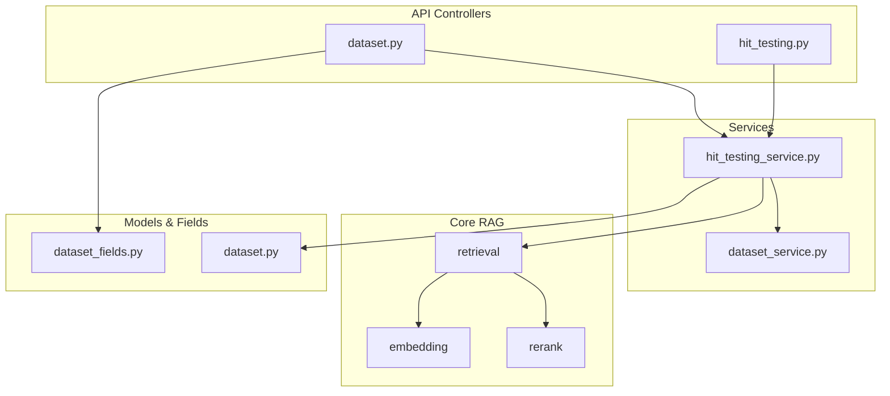
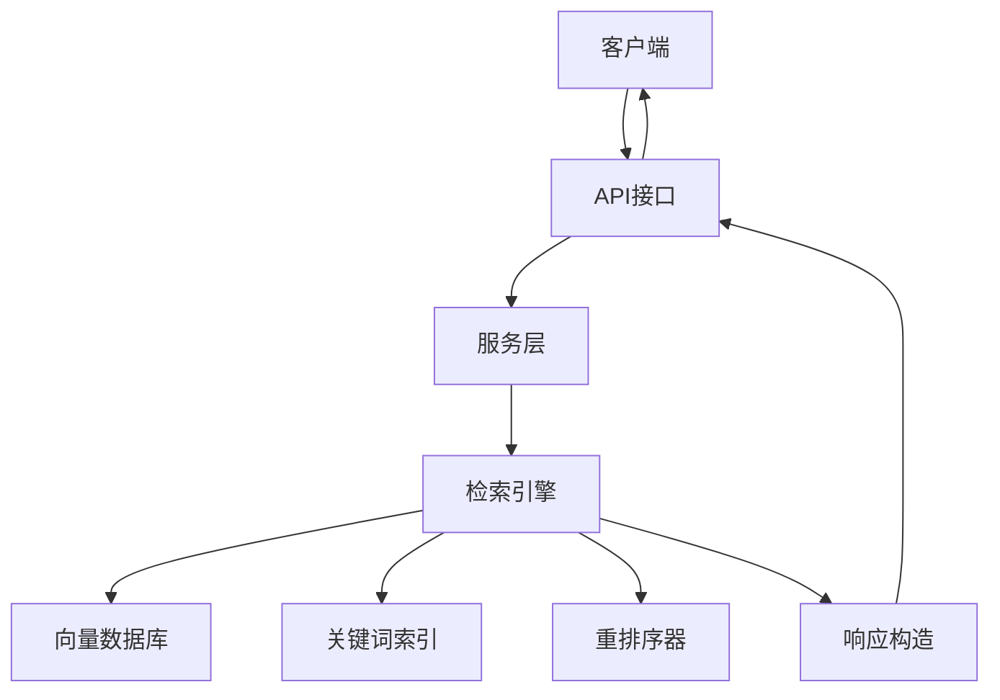
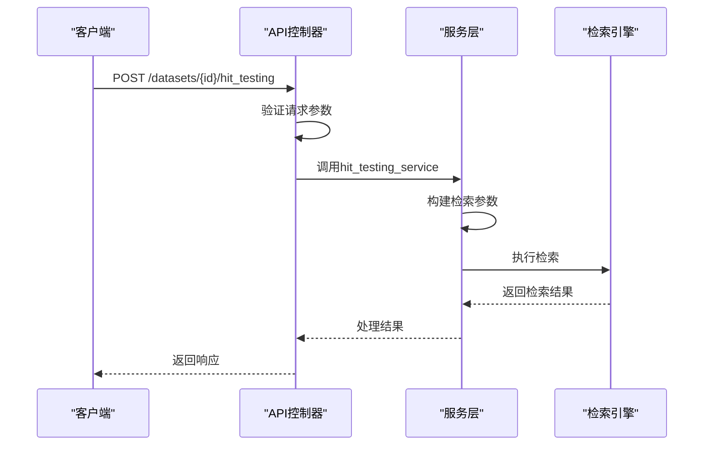
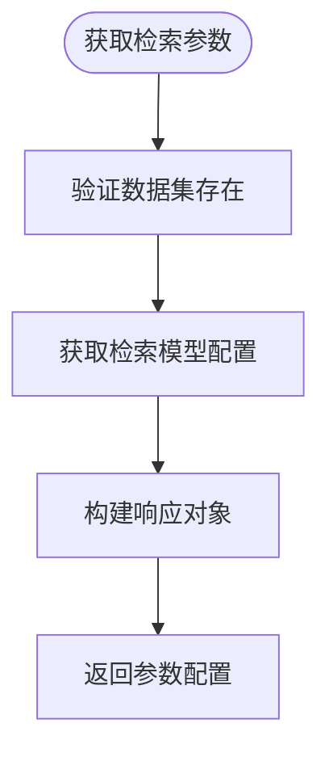
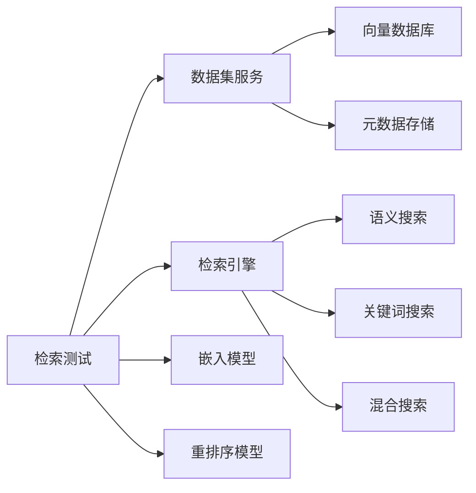

# 检索测试API

<cite>
**本文档中引用的文件**  
- [dataset.py](file://api/controllers/service_api/dataset/dataset.py)
- [hit_testing_service.py](file://api/services/hit_testing_service.py)
- [dataset_fields.py](file://api/fields/dataset_fields.py)
- [dataset_retrieval.py](file://api/core/rag/retrieval/dataset_retrieval.py)
- [dataset_service.py](file://api/services/dataset_service.py)
- [errors.py](file://api/controllers/common/errors.py)
</cite>

## 目录
1. [简介](#简介)
2. [项目结构](#项目结构)
3. [核心组件](#核心组件)
4. [架构概述](#架构概述)
5. [详细组件分析](#详细组件分析)
6. [依赖分析](#依赖分析)
7. [性能考虑](#性能考虑)
8. [故障排除指南](#故障排除指南)
9. [结论](#结论)

## 简介
本文档详细描述了Dify平台中知识库检索功能的测试与验证API。重点涵盖语义搜索、关键词搜索和混合搜索模式的实现机制，以及如何通过API进行检索质量评估。文档详细说明了`POST /datasets/{dataset_id}/hit_testing`和`GET /datasets/{dataset_id}/hit_testing/parameters`等关键端点的使用方法，包括HTTP方法、URL路径、请求头、请求体模式和响应格式。同时提供了元数据过滤、分段策略优化和向量模型选择的实践指导。

## 项目结构
Dify的检索测试功能主要分布在API控制器、核心RAG模块和服务层中。相关代码组织清晰，遵循分层架构设计原则。

**Diagram sources**  
- [dataset.py](file://api/controllers/service_api/dataset/dataset.py)
- [hit_testing_service.py](file://api/services/hit_testing_service.py)
- [dataset_fields.py](file://api/fields/dataset_fields.py)

**Section sources**
- [dataset.py](file://api/controllers/service_api/dataset/dataset.py)
- [hit_testing_service.py](file://api/services/hit_testing_service.py)

## 核心组件
检索测试功能的核心组件包括检索参数配置、多模式搜索执行、结果质量评估和元数据过滤。系统支持语义搜索、关键词搜索和混合搜索三种模式，通过可配置的参数实现灵活的检索行为。

**Section sources**
- [hit_testing_service.py](file://api/services/hit_testing_service.py)
- [dataset_retrieval.py](file://api/core/rag/retrieval/dataset_retrieval.py)

## 架构概述
Dify的检索测试架构采用分层设计，从API接口到核心检索引擎形成清晰的数据流。系统通过统一的API入口接收测试请求，经过服务层协调，调用底层RAG组件执行实际的检索操作。

**Diagram sources**  
- [dataset.py](file://api/controllers/service_api/dataset/dataset.py)
- [hit_testing_service.py](file://api/services/hit_testing_service.py)
- [dataset_retrieval.py](file://api/core/rag/retrieval/dataset_retrieval.py)

## 详细组件分析

### 检索测试端点分析
`POST /datasets/{dataset_id}/hit_testing`端点是检索测试的核心接口，支持多种搜索模式和参数配置。

#### API请求流程

**Diagram sources**  
- [dataset.py](file://api/controllers/service_api/dataset/dataset.py#L100-L200)
- [hit_testing_service.py](file://api/services/hit_testing_service.py#L15-L80)

### 检索参数配置
`GET /datasets/{dataset_id}/hit_testing/parameters`端点提供当前数据集的默认检索参数。

#### 参数获取流程

**Diagram sources**  
- [dataset.py](file://api/controllers/service_api/dataset/dataset.py#L201-L250)
- [dataset_service.py](file://api/services/dataset_service.py#L300-L350)

## 依赖分析
检索测试功能依赖多个核心模块和外部服务，形成复杂的依赖关系网络。

**Diagram sources**  
- [hit_testing_service.py](file://api/services/hit_testing_service.py)
- [dataset_service.py](file://api/services/dataset_service.py)
- [dataset_retrieval.py](file://api/core/rag/retrieval/dataset_retrieval.py)

**Section sources**
- [hit_testing_service.py](file://api/services/hit_testing_service.py)
- [dataset_service.py](file://api/services/dataset_service.py)

## 性能考虑
检索测试功能在设计时考虑了性能优化，包括缓存机制、异步处理和资源限制。

- **缓存策略**：检索结果和模型配置采用适当的缓存机制
- **资源限制**：通过配额管理防止资源滥用
- **并发处理**：支持多请求并发处理
- **超时控制**：设置合理的请求超时时间

## 故障排除指南
针对常见的错误响应提供详细的故障排除指导。

### 常见错误响应

| 错误码 | 错误类型 | 原因 | 解决方案 |
|--------|---------|------|----------|
| 404 | 数据集不存在 | 提供的数据集ID无效或已被删除 | 验证数据集ID的正确性 |
| 400 | 无效查询参数 | 请求参数格式错误或值超出范围 | 检查请求体中的参数配置 |
| 500 | 检索服务错误 | 后端服务异常或依赖服务不可用 | 检查服务状态和日志 |

**Section sources**
- [errors.py](file://api/controllers/common/errors.py)
- [hit_testing_service.py](file://api/services/hit_testing_service.py)

## 结论
Dify的检索测试API提供了全面的知识库检索功能验证能力。通过标准化的API接口，用户可以方便地测试不同搜索模式的效果，优化检索参数配置，并基于测试结果改进知识库的分段策略和向量模型选择。系统的模块化设计和清晰的依赖关系使得功能扩展和维护更加容易。