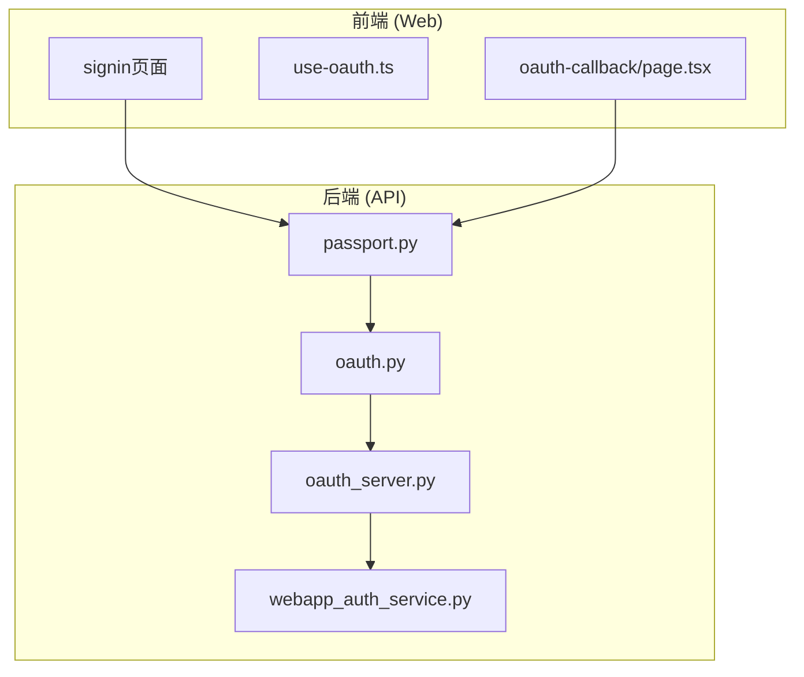
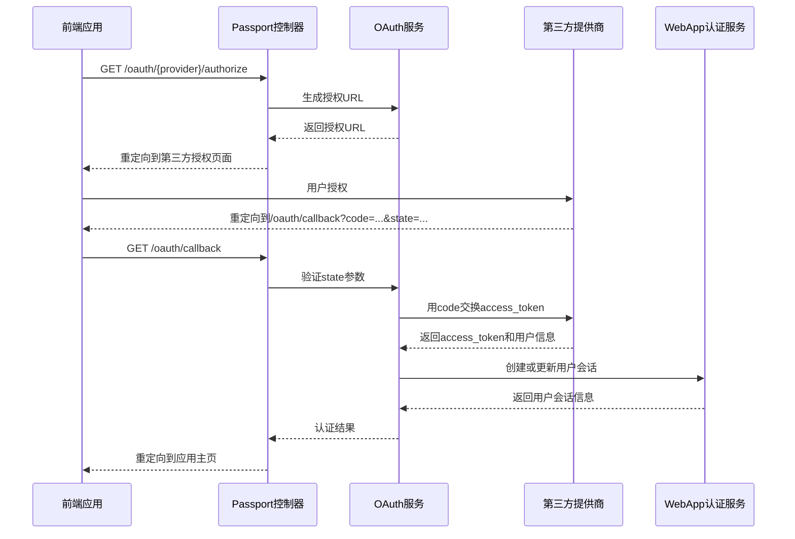
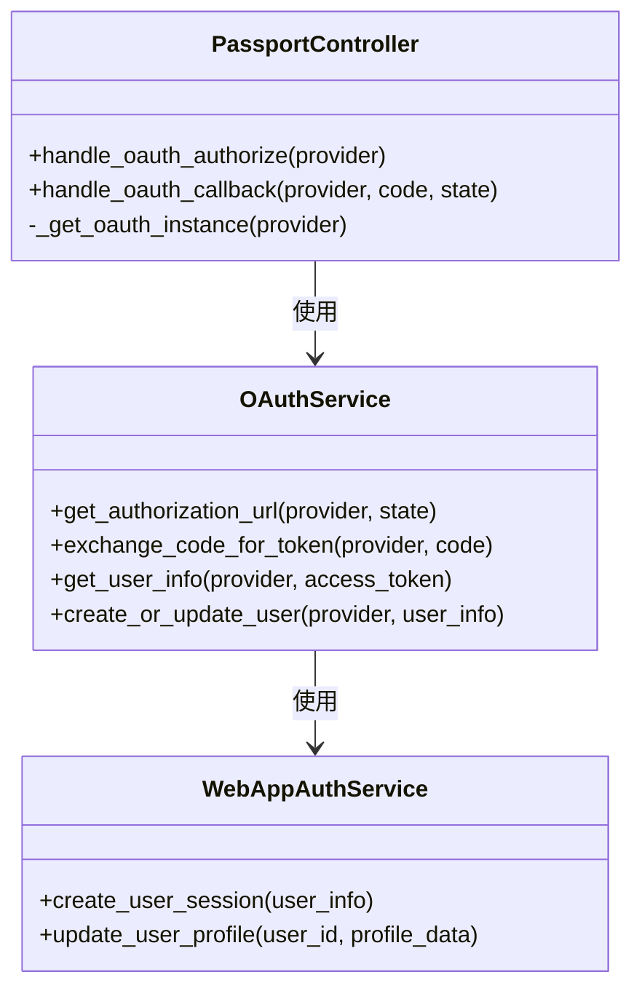
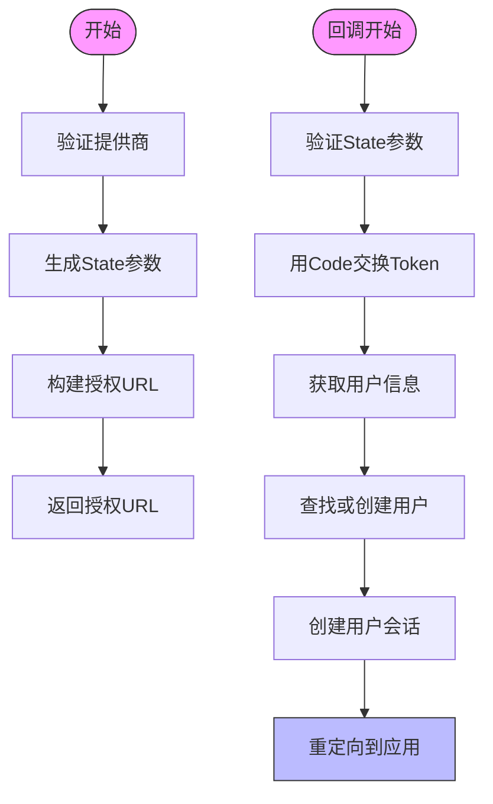
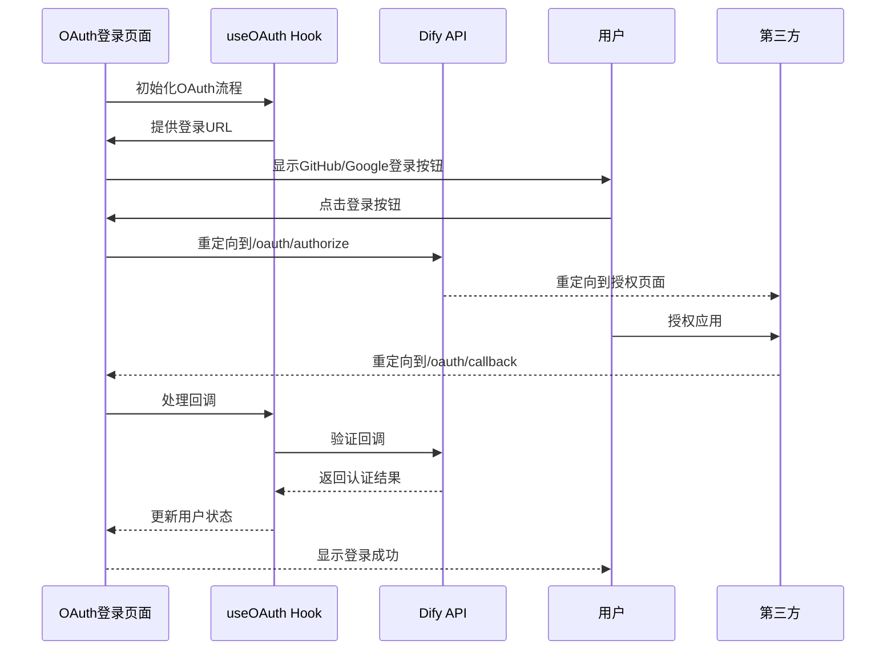
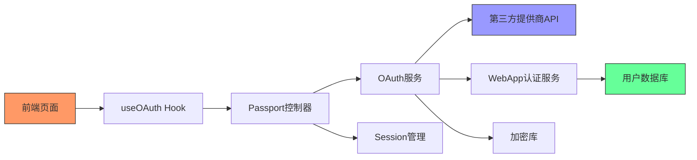

# OAuth认证API

<cite>
**本文档中引用的文件**  
- [oauth.py](file://api/libs/oauth.py)
- [passport.py](file://api/controllers/web/passport.py)
- [oauth_server.py](file://api/services/oauth_server.py)
- [webapp_auth_service.py](file://api/services/webapp_auth_service.py)
- [page.tsx](file://web/app/oauth-callback/page.tsx)
- [use-oauth.ts](file://web/hooks/use-oauth.ts)
- [use-oauth.ts](file://web/service/use-oauth.ts)
</cite>

## 目录
1. [简介](#简介)
2. [项目结构](#项目结构)
3. [核心组件](#核心组件)
4. [架构概述](#架构概述)
5. [详细组件分析](#详细组件分析)
6. [依赖分析](#依赖分析)
7. [性能考虑](#性能考虑)
8. [故障排除指南](#故障排除指南)
9. [结论](#结论)

## 简介
本文档详细说明了Dify平台的OAuth认证API，涵盖与第三方身份提供商（如GitHub、Google）集成的完整流程。文档重点介绍`GET /oauth/{provider}/authorize`端点的实现机制，解释如何生成OAuth授权URL并重定向用户，以及回调处理机制（`GET /oauth/callback`），包括授权码交换访问令牌、获取用户信息和创建本地会话的完整流程。同时提供前端集成示例，展示如何在Next.js应用中实现OAuth登录按钮和回调处理，并详细说明OAuth 2.0授权码流程的安全性考虑。

## 项目结构
Dify的OAuth认证功能分布在API后端和Web前端两个主要部分。后端实现位于`api`目录下的`libs`、`controllers/web`和`services`子目录中，而前端实现位于`web/app`目录下的`oauth-callback`和相关hooks中。

**图示来源**  
- [passport.py](file://api/controllers/web/passport.py)
- [oauth.py](file://api/libs/oauth.py)
- [oauth_server.py](file://api/services/oauth_server.py)
- [webapp_auth_service.py](file://api/services/webapp_auth_service.py)
- [page.tsx](file://web/app/oauth-callback/page.tsx)
- [use-oauth.ts](file://web/hooks/use-oauth.ts)

**本节来源**  
- [api/controllers/web/passport.py](file://api/controllers/web/passport.py)
- [api/libs/oauth.py](file://api/libs/oauth.py)
- [web/app/oauth-callback/page.tsx](file://web/app/oauth-callback/page.tsx)

## 核心组件
Dify的OAuth认证系统由多个核心组件构成，包括OAuth客户端库、认证控制器、OAuth服务层和前端集成模块。这些组件协同工作，实现安全可靠的第三方身份验证流程。

**本节来源**  
- [oauth.py](file://api/libs/oauth.py#L1-L200)
- [passport.py](file://api/controllers/web/passport.py#L1-L150)
- [oauth_server.py](file://api/services/oauth_server.py#L1-L300)

## 架构概述
Dify的OAuth认证架构遵循标准的OAuth 2.0授权码流程，包含前端发起请求、后端处理授权、令牌交换和用户会话创建等关键步骤。系统设计注重安全性，通过state参数防止CSRF攻击，并支持多种第三方身份提供商。

**图示来源**  
- [passport.py](file://api/controllers/web/passport.py#L50-L120)
- [oauth_server.py](file://api/services/oauth_server.py#L50-L200)
- [webapp_auth_service.py](file://api/services/webapp_auth_service.py#L30-L80)

## 详细组件分析

### Passport控制器分析
Passport控制器是OAuth认证流程的入口点，负责处理授权请求和回调。它通过调用OAuth服务层来生成授权URL和处理回调。

**图示来源**  
- [passport.py](file://api/controllers/web/passport.py#L20-L150)
- [oauth_server.py](file://api/services/oauth_server.py#L20-L300)
- [webapp_auth_service.py](file://api/services/webapp_auth_service.py#L20-L100)

### OAuth服务层分析
OAuth服务层封装了与第三方身份提供商交互的复杂逻辑，包括授权URL生成、令牌交换和用户信息获取。

**图示来源**  
- [oauth_server.py](file://api/services/oauth_server.py#L50-L250)
- [oauth.py](file://api/libs/oauth.py#L50-L200)

### 前端集成分析
前端通过自定义hook和页面组件实现OAuth集成，提供用户友好的登录体验。

**图示来源**  
- [use-oauth.ts](file://web/hooks/use-oauth.ts#L10-L100)
- [page.tsx](file://web/app/oauth-callback/page.tsx#L5-L50)
- [passport.py](file://api/controllers/web/passport.py#L80-L120)

**本节来源**  
- [passport.py](file://api/controllers/web/passport.py#L1-L150)
- [oauth_server.py](file://api/services/oauth_server.py#L1-L300)
- [webapp_auth_service.py](file://api/services/webapp_auth_service.py#L1-L100)
- [use-oauth.ts](file://web/hooks/use-oauth.ts#L1-L100)
- [page.tsx](file://web/app/oauth-callback/page.tsx#L1-L50)

## 依赖分析
Dify的OAuth认证系统依赖于多个内部和外部组件，形成了清晰的依赖关系链。

**图示来源**  
- [passport.py](file://api/controllers/web/passport.py)
- [oauth_server.py](file://api/services/oauth_server.py)
- [webapp_auth_service.py](file://api/services/webapp_auth_service.py)
- [oauth.py](file://api/libs/oauth.py)

**本节来源**  
- [api/controllers/web/passport.py](file://api/controllers/web/passport.py)
- [api/services/oauth_server.py](file://api/services/oauth_server.py)
- [api/services/webapp_auth_service.py](file://api/services/webapp_auth_service.py)
- [api/libs/oauth.py](file://api/libs/oauth.py)

## 性能考虑
OAuth认证流程涉及多个网络请求和数据库操作，需要考虑性能优化。建议在生产环境中使用缓存机制来存储常用的提供商配置，并对用户会话进行适当的缓存以减少数据库查询。

## 故障排除指南

### OAuth回调失败
当OAuth回调失败时，可能的原因包括：
- State参数不匹配或已过期
- 授权码无效或已使用
- 网络连接问题导致无法访问第三方API

**本节来源**  
- [passport.py](file://api/controllers/web/passport.py#L100-L130)
- [oauth_server.py](file://api/services/oauth_server.py#L200-L250)

### 授权拒绝
用户拒绝授权时，系统应优雅地处理此情况，向用户显示友好的错误消息，并提供重新尝试的选项。

**本节来源**  
- [passport.py](file://api/controllers/web/passport.py#L130-L150)

### 用户信息获取错误
当从第三方提供商获取用户信息失败时，应记录错误日志并返回适当的错误响应，避免暴露敏感信息。

**本节来源**  
- [oauth_server.py](file://api/services/oauth_server.py#L250-L300)

## 结论
Dify的OAuth认证API提供了一套完整、安全且易于集成的第三方身份验证解决方案。通过遵循标准的OAuth 2.0授权码流程，系统确保了用户数据的安全性，同时提供了灵活的配置选项来支持多种身份提供商。前端和后端的紧密集成使得开发者能够轻松地在应用中实现社交登录功能。