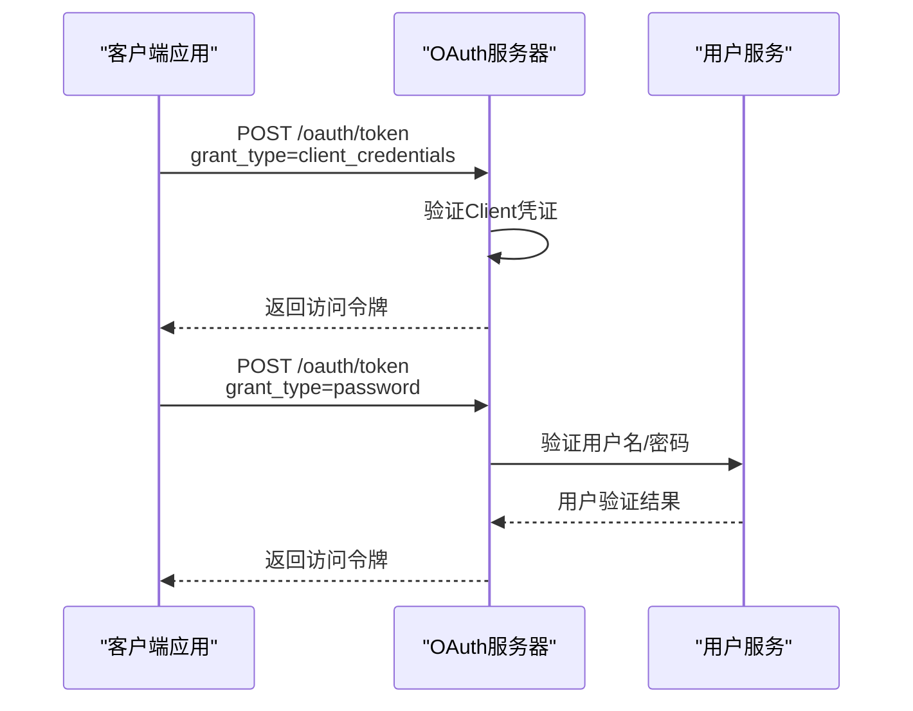
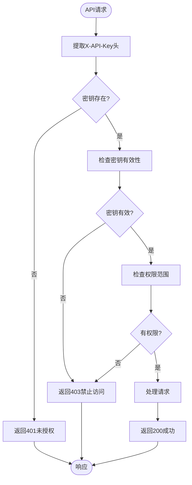

# 企业认证API

<cite>
**本文档引用的文件**
- [oauth_server.py](file://api/controllers/console/auth/oauth_server.py)
- [oauth_server.py](file://api/services/oauth_server.py)
- [apikey.py](file://api/controllers/console/apikey.py)
</cite>

## 目录
1. [简介](#简介)
2. [OAuth服务器认证](#oauth服务器认证)
3. [API密钥认证](#api密钥认证)
4. [企业身份提供商集成](#企业身份提供商集成)
5. [Python客户端示例](#python客户端示例)
6. [故障排除指南](#故障排除指南)
7. [结论](#结论)

## 简介
Dify提供企业级认证API，支持OAuth服务器和API密钥两种认证方式。本文档详细说明了这两种认证机制的配置、管理和使用方法，以及与主流企业身份提供商（如Okta、Azure AD）的集成步骤。文档还包含服务间认证的代码示例和常见问题的解决方案。

## OAuth服务器认证

Dify的OAuth服务器实现遵循OAuth 2.0标准，支持`client_credentials`和`password`授权模式。通过`/oauth/token`端点，企业应用可以获取访问令牌以调用Dify API。

### OAuth客户端管理
企业管理员可以在Dify控制台中创建和管理OAuth客户端。每个客户端都有唯一的Client ID和Client Secret，用于身份验证。客户端配置包括重定向URI、授权范围和令牌有效期等参数。

### 授权模式
#### Client Credentials模式
适用于服务间认证，客户端直接使用Client ID和Client Secret获取访问令牌：
```http
POST /oauth/token
Content-Type: application/x-www-form-urlencoded

grant_type=client_credentials&client_id=CLIENT_ID&client_secret=CLIENT_SECRET
```

#### Password模式
适用于用户直接认证，需要提供用户名和密码：
```http
POST /oauth/token
Content-Type: application/x-www-form-urlencoded

grant_type=password&username=USERNAME&password=PASSWORD&client_id=CLIENT_ID&client_secret=CLIENT_SECRET
```



**Diagram sources**
- [oauth_server.py](file://api/controllers/console/auth/oauth_server.py#L1-L100)
- [oauth_server.py](file://api/services/oauth_server.py#L1-L50)

**Section sources**
- [oauth_server.py](file://api/controllers/console/auth/oauth_server.py#L1-L150)

## API密钥认证

API密钥认证提供了一种简单而安全的服务间认证方式。Dify通过APIKey模型管理和验证API密钥。

### APIKey模型
APIKey模型包含以下属性：
- `key`：加密存储的API密钥
- `tenant_id`：关联的租户ID
- `type`：密钥类型（如"app"、"service"）
- `last_used_at`：最后使用时间
- `is_valid`：有效性状态

### 认证流程
客户端通过`X-API-Key`请求头提供API密钥：
```http
GET /api/v1/apps
X-API-Key: sk-xxxxxxxxxxxxxxxxxxxxxxxx
```

服务器验证密钥的有效性、权限范围和租户关联性。



**Diagram sources**
- [apikey.py](file://api/controllers/console/apikey.py#L1-L80)

**Section sources**
- [apikey.py](file://api/controllers/console/apikey.py#L1-L100)

## 企业身份提供商集成

Dify支持与主流企业身份提供商（IdP）集成，实现单点登录（SSO）和集中式用户管理。

### Okta集成步骤
1. 在Okta管理控制台创建新应用
2. 配置OpenID Connect，设置重定向URI为`https://your-dify-domain/oauth/callback`
3. 获取Client ID和Client Secret
4. 在Dify管理界面配置Okta作为身份提供商
5. 映射用户属性和组权限

### Azure AD集成步骤
1. 在Azure门户注册新应用
2. 配置平台设置，添加Web重定向URI
3. 设置API权限，授予Dify所需范围
4. 在Dify中配置Azure AD连接器
5. 配置声明映射和角色分配

### 最佳实践
- 使用SCIM协议实现用户生命周期同步
- 配置多因素认证（MFA）
- 定期轮换客户端密钥
- 实施最小权限原则
- 监控认证日志和异常活动

**Section sources**
- [oauth_server.py](file://api/controllers/console/auth/oauth_server.py#L50-L120)
- [oauth_server.py](file://api/services/oauth_server.py#L30-L80)

## Python客户端示例

以下示例展示如何使用Python客户端进行服务间认证：

```python
import requests
from typing import Dict, Any

class DifyClient:
    def __init__(self, base_url: str, api_key: str = None, client_id: str = None, client_secret: str = None):
        self.base_url = base_url.rstrip('/')
        self.api_key = api_key
        self.client_id = client_id
        self.client_secret = client_secret
        self.access_token = None
    
    def _get_api_key_headers(self) -> Dict[str, str]:
        """使用API密钥认证"""
        return {"X-API-Key": self.api_key}
    
    def _obtain_client_credentials_token(self) -> str:
        """使用client_credentials模式获取访问令牌"""
        token_url = f"{self.base_url}/oauth/token"
        data = {
            "grant_type": "client_credentials",
            "client_id": self.client_id,
            "client_secret": self.client_secret
        }
        response = requests.post(token_url, data=data)
        response.raise_for_status()
        return response.json()["access_token"]
    
    def _get_oauth_headers(self) -> Dict[str, str]:
        """使用OAuth访问令牌认证"""
        if not self.access_token:
            self.access_token = self._obtain_client_credentials_token()
        return {"Authorization": f"Bearer {self.access_token}"}
    
    def list_apps(self) -> Dict[Any, Any]:
        """列出所有应用"""
        url = f"{self.base_url}/api/v1/apps"
        headers = self._get_api_key_headers()  # 或使用 self._get_oauth_headers()
        response = requests.get(url, headers=headers)
        response.raise_for_status()
        return response.json()

# 使用API密钥认证
client = DifyClient(
    base_url="https://api.dify.ai",
    api_key="sk-xxxxxxxxxxxxxxxxxxxxxxxx"
)
apps = client.list_apps()

# 使用OAuth client_credentials模式
client = DifyClient(
    base_url="https://api.dify.ai",
    client_id="your-client-id",
    client_secret="your-client-secret"
)
apps = client.list_apps()
```

**Section sources**
- [oauth_server.py](file://api/services/oauth_server.py#L1-L100)
- [apikey.py](file://api/controllers/console/apikey.py#L1-L50)

## 故障排除指南

### 常见问题及解决方案

#### 令牌范围不足
**症状**：API调用返回403 Forbidden，错误信息包含"insufficient scope"。
**解决方案**：
1. 检查客户端请求的scope参数
2. 在Dify管理界面确认客户端配置的授权范围
3. 联系管理员扩展客户端权限

#### 客户端凭证无效
**症状**：调用`/oauth/token`返回401 Unauthorized，错误信息为"invalid client credentials"。
**解决方案**：
1. 验证Client ID和Client Secret的正确性
2. 检查凭证是否已过期或被撤销
3. 重新生成客户端凭证

#### API密钥权限错误
**症状**：使用X-API-Key调用API返回403 Forbidden。
**解决方案**：
1. 验证API密钥是否有效且未过期
2. 检查密钥关联的租户和权限范围
3. 确认API端点与密钥权限匹配

#### 重定向URI不匹配
**症状**：OAuth授权流程中断，错误信息为"redirect_uri_mismatch"。
**解决方案**：
1. 检查OAuth客户端配置的重定向URI
2. 确保请求中的重定向URI完全匹配配置值
3. 在开发环境中使用通配符配置（如允许`http://localhost:*`）

#### 令牌过期
**症状**：API调用返回401 Unauthorized，错误信息为"token expired"。
**解决方案**：
1. 实现令牌刷新逻辑
2. 捕获401响应并重新获取令牌
3. 使用短期令牌和刷新令牌机制

**Section sources**
- [oauth_server.py](file://api/controllers/console/auth/oauth_server.py#L100-L200)
- [oauth_server.py](file://api/services/oauth_server.py#L80-L150)
- [apikey.py](file://api/controllers/console/apikey.py#L50-L100)

## 结论
Dify的企业认证API提供了灵活而安全的集成方案，支持OAuth和API密钥两种主流认证方式。通过与企业身份提供商集成，可以实现统一的身份管理和单点登录。文档中提供的最佳实践和故障排除指南有助于确保企业集成的稳定性和安全性。