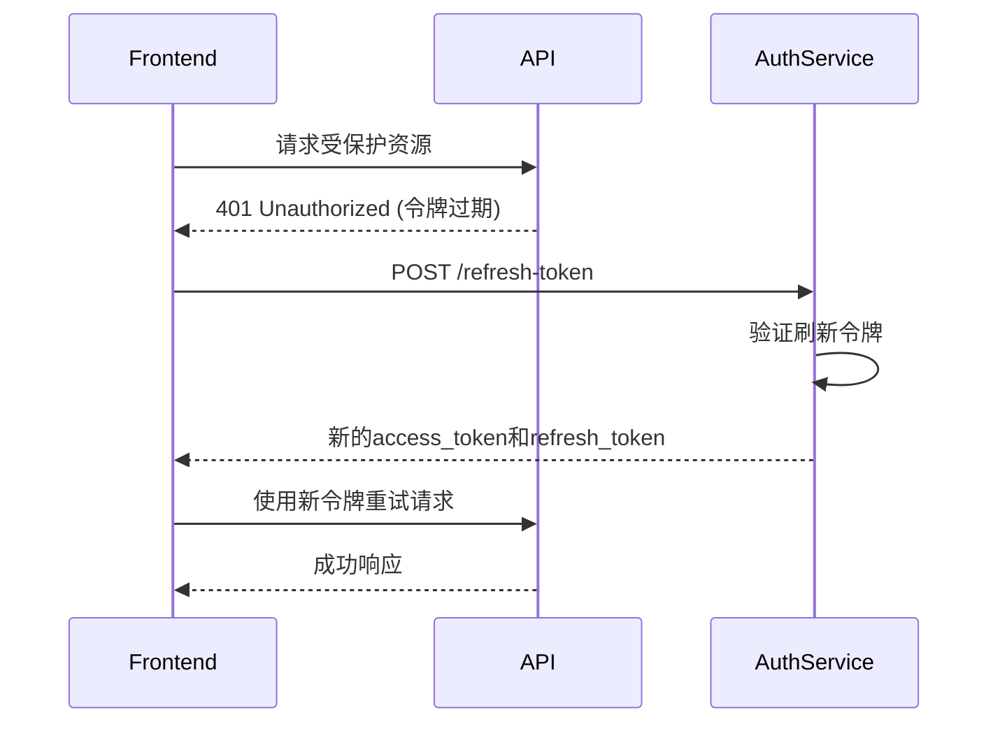

# 基础认证API

<cite>
**本文档引用的文件**  
- [login.py](file://api/controllers/web/login.py)
- [forgot_password.py](file://api/controllers/web/forgot_password.py)
- [passport.py](file://api/controllers/web/passport.py)
- [auth_service.py](file://api/services/webapp_auth_service.py)
- [reset_password_mail_template_zh-CN.html](file://api/templates/reset_password_mail_template_zh-CN.html)
- [refresh-token.ts](file://web/service/refresh-token.ts)
</cite>

## 目录
1. [简介](#简介)
2. [用户登录](#用户登录)
3. [密码找回](#密码找回)
4. [账户激活](#账户激活)
5. [令牌刷新机制](#令牌刷新机制)
6. [使用示例](#使用示例)
7. [错误码与故障排除](#错误码与故障排除)
8. [结论](#结论)

## 简介
本文档详细描述Dify平台的基础认证API，涵盖用户登录、密码找回、账户激活及令牌刷新等核心安全流程。API基于RESTful设计原则，采用JWT进行身份验证，并通过邮件验证机制保障账户安全。所有接口均通过HTTPS加密传输，确保用户凭证和敏感信息的安全性。

## 用户登录
用户通过`POST /login`端点进行身份验证，系统验证凭据后返回访问令牌和刷新令牌。

### 请求格式
```http
POST /login
Content-Type: application/json
```

**请求体参数**
- `email`: 用户注册邮箱（字符串，必需）
- `password`: 用户密码（字符串，必需）

### 响应格式
成功响应返回200状态码及以下JSON结构：

```json
{
  "access_token": "jwt_access_token",
  "refresh_token": "jwt_refresh_token",
  "token_type": "Bearer",
  "expires_in": 3600
}
```

**响应字段说明**
- `access_token`: 用于访问受保护资源的JWT令牌
- `refresh_token`: 用于获取新访问令牌的长期令牌
- `token_type`: 令牌类型，固定为Bearer
- `expires_in`: 访问令牌有效期（秒）

**Section sources**
- [login.py](file://api/controllers/web/login.py#L1-L50)
- [auth_service.py](file://api/services/webapp_auth_service.py#L20-L80)

## 密码找回
通过`POST /forgot-password`实现密码重置功能，包含验证码发送和新密码设置两个阶段。

### 流程说明
1. 用户提交注册邮箱
2. 系统生成6位数字验证码并发送至用户邮箱
3. 用户在前端输入验证码和新密码
4. 系统验证验证码有效性并更新密码

### 验证码发送
```http
POST /forgot-password
Content-Type: application/json
```

**请求体**
```json
{
  "email": "user@example.com"
}
```

系统通过异步任务`mail_reset_password_task`发送包含验证码的邮件，邮件模板位于`reset_password_mail_template_zh-CN.html`。

### 新密码设置
```http
POST /reset-password
Content-Type: application/json
```

**请求体**
```json
{
  "email": "user@example.com",
  "code": "123456",
  "password": "new_secure_password"
}
```

密码更新前会进行强度验证和验证码时效性检查（默认10分钟过期）。

**Section sources**
- [forgot_password.py](file://api/controllers/web/forgot_password.py#L1-L70)
- [mail_reset_password_task.py](file://api/tasks/mail_reset_password_task.py#L10-L40)

## 账户激活
新注册用户需通过`POST /activate`完成账户激活，确保邮箱有效性。

### 激活流程
1. 用户注册后，系统生成唯一激活令牌（有效期24小时）
2. 激活链接通过邮件发送至用户邮箱
3. 用户点击链接触发激活请求
4. 系统验证令牌并更新用户状态为"已激活"

### 激活请求
```http
POST /activate
Content-Type: application/json
```

**请求体**
```json
{
  "token": "activation_token_from_email"
}
```

激活成功后返回200状态码，失败则返回400或404状态码。

**Section sources**
- [passport.py](file://api/controllers/web/passport.py#L80-L120)
- [auth_service.py](file://api/services/webapp_auth_service.py#L100-L150)

## 令牌刷新机制
提供`POST /refresh-token`端点以延长用户会话，避免频繁重新登录。

### 刷新流程
```http
POST /refresh-token
Content-Type: application/json
```

**请求体**
```json
{
  "refresh_token": "user_refresh_token"
}
```

系统验证刷新令牌有效性后，返回新的访问令牌和刷新令牌对。旧的刷新令牌将失效，防止重放攻击。

### 过期策略
- **访问令牌**: 1小时过期，短生命周期降低泄露风险
- **刷新令牌**: 7天过期，可配置的长期令牌
- **令牌吊销**: 密码更改或账户异常时自动使所有刷新令牌失效

前端通过`refresh-token.ts`实现自动刷新逻辑，在访问令牌即将过期时提前获取新令牌。



**Diagram sources**
- [auth_service.py](file://api/services/webapp_auth_service.py#L160-L200)
- [refresh-token.ts](file://web/service/refresh-token.ts#L5-L30)

## 使用示例
### curl命令示例
```bash
# 用户登录
curl -X POST https://api.dify.ai/login \
  -H "Content-Type: application/json" \
  -d '{
    "email": "user@example.com",
    "password": "your_password"
  }'

# 刷新令牌
curl -X POST https://api.dify.ai/refresh-token \
  -H "Content-Type: application/json" \
  -d '{
    "refresh_token": "your_refresh_token"
  }'
```

### Python requests示例
```python
import requests

# 登录获取令牌
response = requests.post(
    'https://api.dify.ai/login',
    json={
        'email': 'user@example.com',
        'password': 'your_password'
    }
)
data = response.json()
access_token = data['access_token']

# 使用访问令牌请求API
headers = {'Authorization': f'Bearer {access_token}'}
response = requests.get('https://api.dify.ai/user/profile', headers=headers)
```

**Section sources**
- [login.py](file://api/controllers/web/login.py#L30-L50)
- [auth_service.py](file://api/services/webapp_auth_service.py#L50-L70)

## 错误码与故障排除
### 常见错误响应
```json
{
  "error": "invalid_credentials",
  "message": "邮箱或密码错误"
}
```

### 错误码指南
| 错误码 | HTTP状态码 | 原因 | 解决方案 |
|--------|------------|------|----------|
| `invalid_credentials` | 401 | 邮箱或密码错误 | 检查输入并重试，或使用密码找回功能 |
| `email_not_found` | 404 | 邮箱未注册 | 确认注册邮箱或完成注册流程 |
| `verification_code_invalid` | 422 | 验证码错误或过期 | 重新发送验证码，确保在10分钟内使用 |
| `account_not_active` | 401 | 账户未激活 | 检查邮箱并完成激活流程 |
| `refresh_token_expired` | 401 | 刷新令牌过期 | 用户需要重新登录 |

### 故障排除场景
- **密码错误**: 系统记录失败尝试次数，连续5次失败后账户锁定15分钟
- **邮箱未收到验证码**: 检查垃圾邮件文件夹，确认邮箱服务器未屏蔽发件人
- **激活链接失效**: 激活令牌24小时后过期，可重新发送激活邮件
- **令牌刷新失败**: 刷新令牌仅能使用一次，使用后立即失效

**Section sources**
- [login.py](file://api/controllers/web/login.py#L50-L80)
- [forgot_password.py](file://api/controllers/web/forgot_password.py#L60-L90)
- [auth_service.py](file://api/services/webapp_auth_service.py#L80-L120)

## 结论
Dify基础认证API提供了安全、可靠的用户身份验证机制，通过JWT令牌、邮件验证和多层错误处理确保系统安全性。建议客户端实现智能令牌刷新策略，优化用户体验，同时遵循最小权限原则，妥善保管认证令牌。