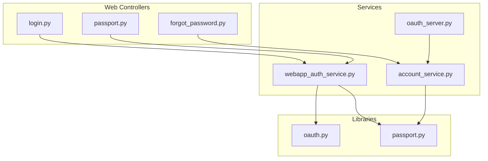
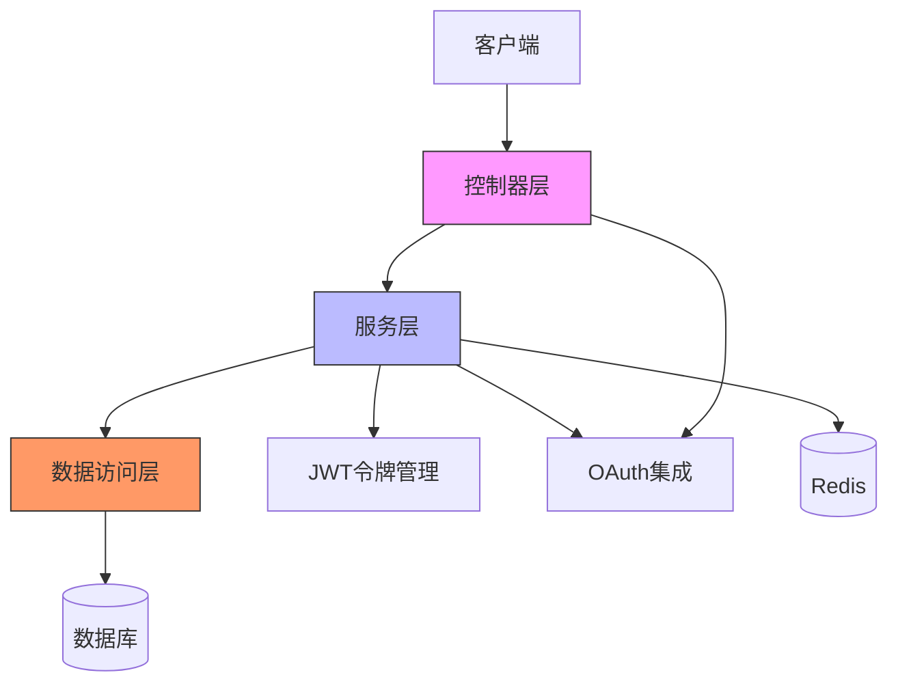
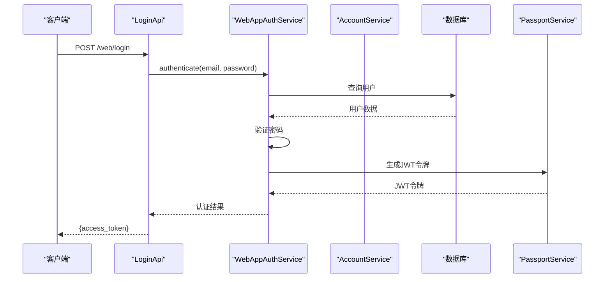
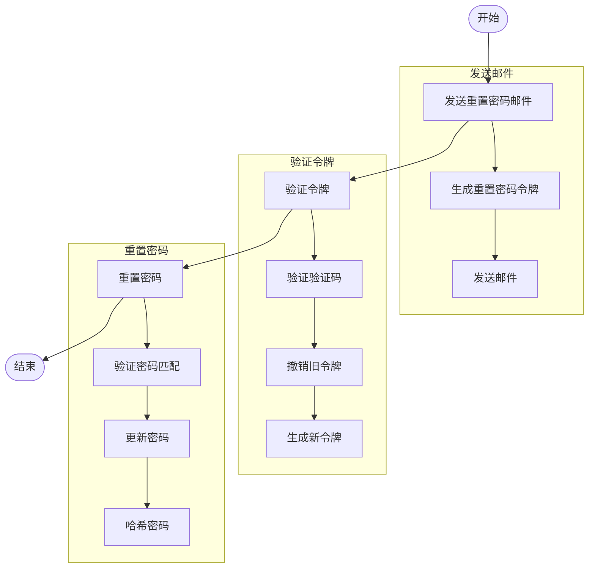
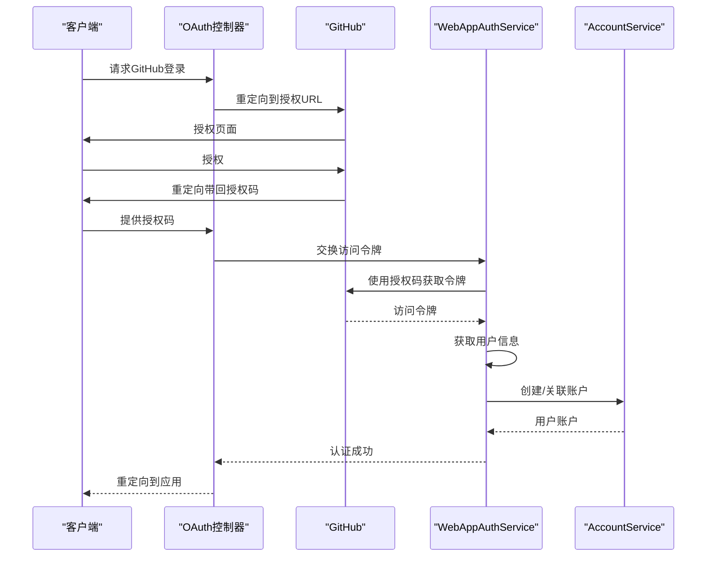
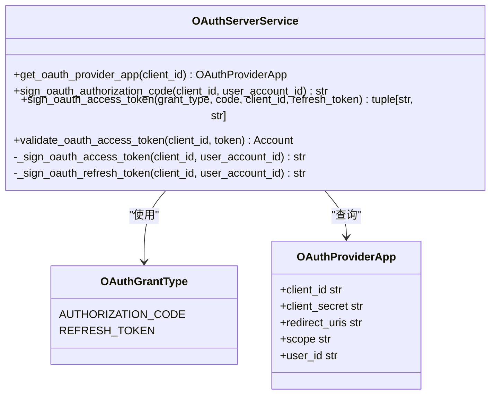
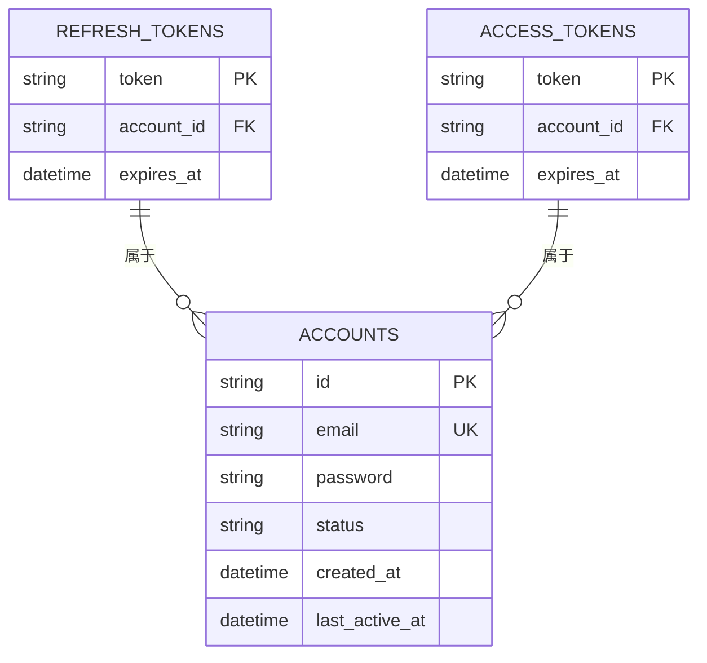
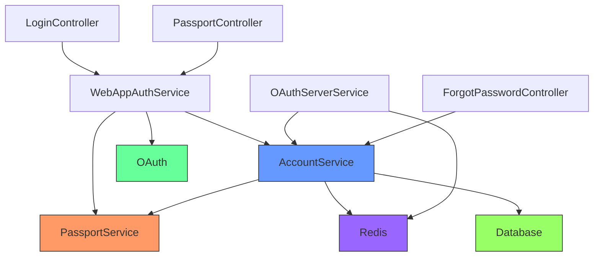

# 认证API

<cite>
**本文档中引用的文件**
- [login.py](file://api/controllers/web/login.py)
- [passport.py](file://api/controllers/web/passport.py)
- [forgot_password.py](file://api/controllers/web/forgot_password.py)
- [webapp_auth_service.py](file://api/services/webapp_auth_service.py)
- [account_service.py](file://api/services/account_service.py)
- [oauth.py](file://api/libs/oauth.py)
- [oauth_server.py](file://api/services/oauth_server.py)
- [passport.py](file://api/libs/passport.py)
</cite>

## 目录
1. [简介](#简介)
2. [项目结构](#项目结构)
3. [核心组件](#核心组件)
4. [架构概述](#架构概述)
5. [详细组件分析](#详细组件分析)
6. [依赖分析](#依赖分析)
7. [性能考虑](#性能考虑)
8. [故障排除指南](#故障排除指南)
9. [结论](#结论)

## 简介
本文档详细介绍了Dify平台的认证API，涵盖了用户登录、密码找回、账户激活、OAuth集成和OAuth服务器配置等RESTful接口。文档详细说明了每个端点的HTTP方法、URL路径、请求头、请求体模式和响应格式，特别是JWT令牌的生成、刷新和验证机制。提供了实际的curl示例和Python客户端代码示例，展示标准密码登录流程和第三方OAuth（如GitHub、Google）集成流程。解释了单点登录（SSO）和企业身份提供商（如Okta、Azure AD）的集成方式。文档化了会话管理、令牌过期策略和安全最佳实践。针对常见的错误响应（如401未授权、403禁止访问、422验证失败）提供了详细的故障排除指南，包括密码错误、验证码失效、OAuth回调失败等场景。

## 项目结构
Dify认证系统主要由以下几个核心模块组成：Web控制器处理HTTP请求，服务层实现业务逻辑，库模块提供通用功能，模型定义数据结构。认证相关的控制器位于`api/controllers/web/`目录下，包括`login.py`、`passport.py`和`forgot_password.py`。服务层位于`api/services/`目录下，包括`webapp_auth_service.py`和`account_service.py`。OAuth相关功能在`api/libs/oauth.py`中实现，OAuth服务器功能在`api/services/oauth_server.py`中实现。JWT令牌管理在`api/libs/passport.py`中实现。

**图示来源**
- [login.py](file://api/controllers/web/login.py)
- [passport.py](file://api/controllers/web/passport.py)
- [forgot_password.py](file://api/controllers/web/forgot_password.py)
- [webapp_auth_service.py](file://api/services/webapp_auth_service.py)
- [account_service.py](file://api/services/account_service.py)
- [oauth.py](file://api/libs/oauth.py)
- [oauth_server.py](file://api/services/oauth_server.py)
- [passport.py](file://api/libs/passport.py)

**节来源**
- [login.py](file://api/controllers/web/login.py)
- [passport.py](file://api/controllers/web/passport.py)
- [forgot_password.py](file://api/controllers/web/forgot_password.py)

## 核心组件
Dify认证系统的核心组件包括用户认证服务、JWT令牌管理、OAuth集成和密码找回功能。`WebAppAuthService`类负责处理Web应用的认证逻辑，包括密码认证、邮箱验证码登录等。`AccountService`类管理用户账户的全生命周期，包括创建、更新、删除和认证。`PassportService`类负责JWT令牌的签发和验证。`OAuth`类提供了与第三方OAuth提供商（如GitHub、Google）集成的能力。`OAuthServerService`类实现了OAuth 2.0服务器功能，允许第三方应用通过OAuth协议访问Dify资源。

**节来源**
- [webapp_auth_service.py](file://api/services/webapp_auth_service.py#L1-L178)
- [account_service.py](file://api/services/account_service.py#L1-L799)
- [passport.py](file://api/libs/passport.py#L1-L24)
- [oauth.py](file://api/libs/oauth.py#L1-L133)
- [oauth_server.py](file://api/services/oauth_server.py#L1-L94)

## 架构概述
Dify认证系统采用分层架构设计，从上到下分为控制器层、服务层和数据访问层。控制器层负责接收HTTP请求并返回响应，服务层实现核心业务逻辑，数据访问层与数据库交互。认证流程通常从控制器开始，控制器调用服务层的方法，服务层可能调用其他服务或直接访问数据库。JWT令牌用于在客户端和服务端之间安全地传递用户身份信息。OAuth集成允许用户使用第三方账户登录，同时OAuth服务器功能允许第三方应用访问Dify资源。

**图示来源**
- [login.py](file://api/controllers/web/login.py)
- [webapp_auth_service.py](file://api/services/webapp_auth_service.py)
- [account_service.py](file://api/services/account_service.py)
- [passport.py](file://api/libs/passport.py)
- [oauth.py](file://api/libs/oauth.py)

## 详细组件分析

### 用户登录分析
用户登录功能通过`/web/login`端点实现，接受POST请求，需要提供邮箱和密码。系统首先验证邮箱格式，然后在数据库中查找对应用户，验证密码是否正确。如果认证成功，系统生成JWT访问令牌并返回给客户端。系统还实现了登录错误率限制，防止暴力破解攻击。

**图示来源**
- [login.py](file://api/controllers/web/login.py#L1-L139)
- [webapp_auth_service.py](file://api/services/webapp_auth_service.py#L1-L178)
- [account_service.py](file://api/services/account_service.py#L1-L799)
- [passport.py](file://api/libs/passport.py#L1-L24)

**节来源**
- [login.py](file://api/controllers/web/login.py#L1-L139)
- [webapp_auth_service.py](file://api/services/webapp_auth_service.py#L1-L178)

### 密码找回分析
密码找回功能通过三个端点实现：`/web/forgot-password`发送重置密码邮件，`/web/forgot-password/validity`验证验证码，`/web/forgot-password/resets`重置密码。系统生成一个包含验证码的令牌，通过邮件发送给用户。用户需要提供邮箱、验证码和令牌来验证身份，然后设置新密码。系统实现了错误率限制，防止滥用。

**图示来源**
- [forgot_password.py](file://api/controllers/web/forgot_password.py#L1-L171)
- [account_service.py](file://api/services/account_service.py#L1-L799)

**节来源**
- [forgot_password.py](file://api/controllers/web/forgot_password.py#L1-L171)
- [account_service.py](file://api/services/account_service.py#L1-L799)

### OAuth集成分析
OAuth集成允许用户使用第三方账户（如GitHub、Google）登录Dify。系统实现了`GitHubOAuth`和`GoogleOAuth`类，遵循OAuth 2.0协议。用户被重定向到第三方授权页面，授权后重定向回Dify，系统使用授权码获取访问令牌，然后获取用户信息并创建或关联账户。

**图示来源**
- [oauth.py](file://api/libs/oauth.py#L1-L133)
- [webapp_auth_service.py](file://api/services/webapp_auth_service.py#L1-L178)
- [account_service.py](file://api/services/account_service.py#L1-L799)

**节来源**
- [oauth.py](file://api/libs/oauth.py#L1-L133)
- [webapp_auth_service.py](file://api/services/webapp_auth_service.py#L1-L178)

### OAuth服务器分析
OAuth服务器功能允许第三方应用通过OAuth 2.0协议访问Dify资源。系统实现了授权码模式和刷新令牌模式。第三方应用首先获取授权码，然后交换访问令牌和刷新令牌。访问令牌用于访问API，刷新令牌用于获取新的访问令牌。

**图示来源**
- [oauth_server.py](file://api/services/oauth_server.py#L1-L94)
- [account_service.py](file://api/services/account_service.py#L1-L799)

**节来源**
- [oauth_server.py](file://api/services/oauth_server.py#L1-L94)

### 会话管理分析
会话管理通过JWT令牌实现，令牌包含用户ID、会话ID、过期时间等信息。系统使用`PassportService`类签发和验证令牌。访问令牌有效期较短，刷新令牌有效期较长。系统还实现了基于Redis的刷新令牌存储，确保令牌的安全性和可撤销性。

**图示来源**
- [passport.py](file://api/libs/passport.py#L1-L24)
- [account_service.py](file://api/services/account_service.py#L1-L799)

**节来源**
- [passport.py](file://api/libs/passport.py#L1-L24)
- [account_service.py](file://api/services/account_service.py#L1-L799)

## 依赖分析
Dify认证系统依赖于多个外部组件和内部服务。主要依赖包括Flask-RESTx用于API路由和文档，SQLAlchemy用于数据库访问，Redis用于缓存和令牌存储，PyJWT用于JWT令牌处理，Requests用于HTTP请求。内部服务之间通过清晰的接口进行通信，确保了系统的模块化和可维护性。

**图示来源**
- [webapp_auth_service.py](file://api/services/webapp_auth_service.py)
- [account_service.py](file://api/services/account_service.py)
- [oauth.py](file://api/libs/oauth.py)
- [oauth_server.py](file://api/services/oauth_server.py)
- [passport.py](file://api/libs/passport.py)

**节来源**
- [webapp_auth_service.py](file://api/services/webapp_auth_service.py)
- [account_service.py](file://api/services/account_service.py)
- [oauth.py](file://api/libs/oauth.py)
- [oauth_server.py](file://api/services/oauth_server.py)
- [passport.py](file://api/libs/passport.py)

## 性能考虑
Dify认证系统在性能方面进行了多项优化。首先，频繁访问的数据（如令牌、会话信息）存储在Redis中，减少了数据库查询次数。其次，密码哈希使用了安全的算法（bcrypt或类似），并在验证时进行了优化。此外，系统实现了适当的缓存策略，如OAuth用户信息缓存。错误率限制使用Redis实现，避免了数据库的频繁写入。JWT令牌验证是无状态的，提高了API的可扩展性。

## 故障排除指南
### 401未授权错误
401错误通常表示认证失败。可能的原因包括：
- JWT令牌无效或已过期
- 提供的邮箱或密码不正确
- 账户被禁用或删除
- OAuth授权码已过期

解决方案：
- 检查JWT令牌是否正确且未过期
- 验证邮箱和密码是否正确
- 检查账户状态
- 重新发起OAuth授权流程

**节来源**
- [login.py](file://api/controllers/web/login.py)
- [passport.py](file://api/libs/passport.py)
- [account_service.py](file://api/services/account_service.py)

### 403禁止访问错误
403错误表示用户没有权限访问资源。可能的原因包括：
- 账户被禁止登录
- 应用访问模式限制
- 企业版功能限制

解决方案：
- 检查账户状态是否为"banned"
- 验证应用的访问模式设置
- 确认用户具有必要的权限

**节来源**
- [login.py](file://api/controllers/web/login.py)
- [webapp_auth_service.py](file://api/services/webapp_auth_service.py)

### 422验证失败错误
422错误表示请求数据验证失败。可能的原因包括：
- 邮箱格式不正确
- 密码不符合复杂性要求
- 必需字段缺失

解决方案：
- 验证邮箱格式是否符合RFC标准
- 检查密码是否满足长度和复杂性要求
- 确保所有必需字段都已提供

**节来源**
- [login.py](file://api/controllers/web/login.py)
- [forgot_password.py](file://api/controllers/web/forgot_password.py)
- [libs/helper.py](file://api/libs/helper.py)

### 密码错误
当用户输入错误密码时，系统会记录登录错误次数。如果错误次数超过限制，账户将被临时锁定。

解决方案：
- 检查`login_error_rate_limit` Redis键
- 等待锁定时间结束后重试
- 通过密码找回功能重置密码

**节来源**
- [account_service.py](file://api/services/account_service.py)
- [webapp_auth_service.py](file://api/services/webapp_auth_service.py)

### 验证码失效
验证码通常在短时间内有效（如10分钟）。如果用户在有效期内未使用，验证码将失效。

解决方案：
- 重新请求新的验证码
- 检查系统时间是否同步
- 确认验证码未被多次使用

**节来源**
- [forgot_password.py](file://api/controllers/web/forgot_password.py)
- [account_service.py](file://api/services/account_service.py)

### OAuth回调失败
OAuth回调失败可能由于：
- 重定向URI不匹配
- 授权码已使用或过期
- 网络问题导致请求失败

解决方案：
- 验证重定向URI是否在应用设置中注册
- 重新发起授权流程
- 检查网络连接和防火墙设置

**节来源**
- [oauth.py](file://api/libs/oauth.py)
- [webapp_auth_service.py](file://api/services/webapp_auth_service.py)

## 结论
Dify认证系统提供了一套完整、安全的用户认证解决方案，支持多种认证方式，包括密码登录、邮箱验证码登录、OAuth集成等。系统采用现代化的架构设计，具有良好的可扩展性和安全性。通过JWT令牌实现无状态认证，通过Redis实现高效的会话管理，通过OAuth支持第三方集成。系统还考虑了性能优化和安全最佳实践，如错误率限制、密码哈希、令牌过期等。整体设计清晰，模块化程度高，便于维护和扩展。