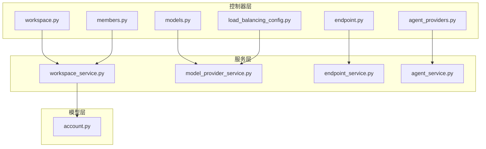
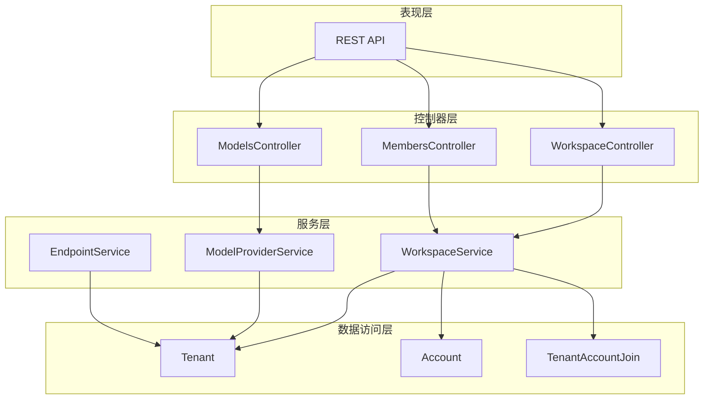
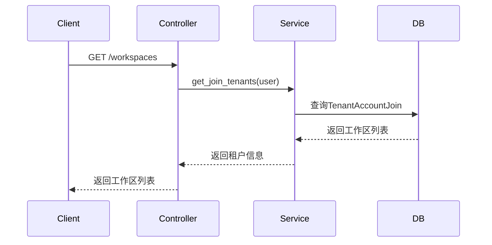
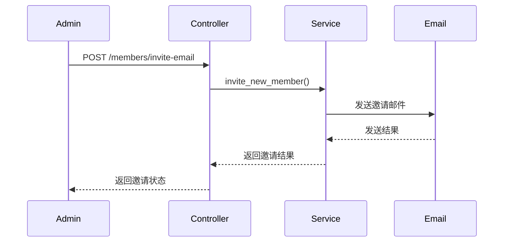
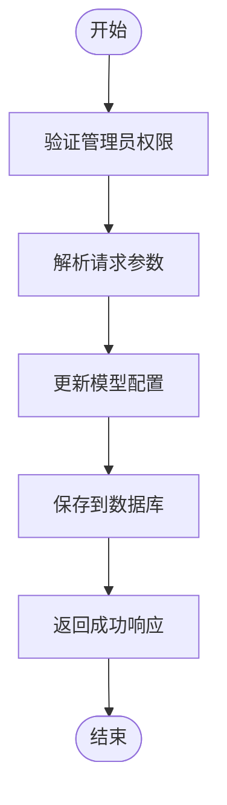
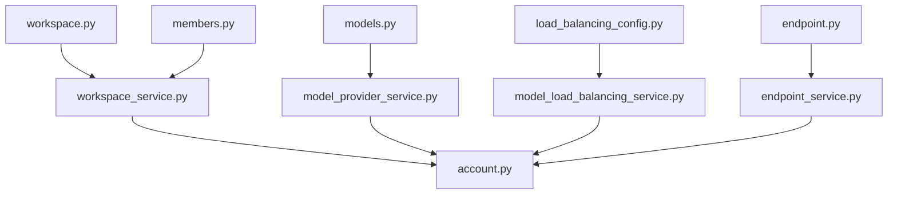

# 工作区服务API

<cite>
**本文档中引用的文件**  
- [workspace.py](file://api/controllers/console/workspace/workspace.py)
- [members.py](file://api/controllers/console/workspace/members.py)
- [workspace_service.py](file://api/services/workspace_service.py)
- [account.py](file://api/models/account.py)
- [models.py](file://api/controllers/console/workspace/models.py)
- [load_balancing_config.py](file://api/controllers/console/workspace/load_balancing_config.py)
- [endpoint.py](file://api/controllers/console/workspace/endpoint.py)
- [agent_providers.py](file://api/controllers/console/workspace/agent_providers.py)
</cite>

## 目录
1. [简介](#简介)
2. [项目结构](#项目结构)
3. [核心组件](#核心组件)
4. [架构概述](#架构概述)
5. [详细组件分析](#详细组件分析)
6. [依赖分析](#依赖分析)
7. [性能考虑](#性能考虑)
8. [故障排除指南](#故障排除指南)
9. [结论](#结论)

## 简介
本文档详细介绍了Dify平台中用于管理多租户环境工作区的API。这些API支持创建、配置和管理用户工作区，包括成员管理、角色权限分配和配额设置。文档涵盖了所有相关端点，如工作区创建、成员邀请、角色更新和配额查询，并提供每个端点的技术规范，包括请求/响应模式、认证机制和错误处理。此外，还包含实际代码示例，展示如何使用API自动化工作区管理任务，并解释工作区与其他资源（如应用、数据集）的关联关系及资源隔离机制。

## 项目结构
Dify的工作区服务API主要位于`api/controllers/console/workspace/`目录下，包含多个模块分别处理不同功能。核心文件包括`workspace.py`（工作区管理）、`members.py`（成员管理）、`models.py`（模型配置）等。服务层由`workspace_service.py`提供业务逻辑，数据模型定义在`api/models/account.py`中。

**图示来源**  
- [workspace.py](file://api/controllers/console/workspace/workspace.py)
- [members.py](file://api/controllers/console/workspace/members.py)
- [models.py](file://api/controllers/console/workspace/models.py)
- [load_balancing_config.py](file://api/controllers/console/workspace/load_balancing_config.py)
- [endpoint.py](file://api/controllers/console/workspace/endpoint.py)
- [agent_providers.py](file://api/controllers/console/workspace/agent_providers.py)
- [workspace_service.py](file://api/services/workspace_service.py)
- [account.py](file://api/models/account.py)

**本节来源**  
- [workspace.py](file://api/controllers/console/workspace/workspace.py)
- [members.py](file://api/controllers/console/workspace/members.py)

## 核心组件
工作区服务API的核心组件包括工作区管理、成员管理、模型配置和端点管理。这些组件通过Flask-RESTx实现RESTful接口，使用装饰器进行权限验证和初始化检查。`Tenant`类代表工作区实体，`Account`类代表用户，两者通过`TenantAccountJoin`关联表建立多对多关系。

**本节来源**  
- [workspace.py](file://api/controllers/console/workspace/workspace.py#L1-L253)
- [members.py](file://api/controllers/console/workspace/members.py#L1-L313)
- [account.py](file://api/models/account.py#L1-L339)

## 架构概述
Dify工作区服务采用分层架构，包含控制器层、服务层和数据模型层。控制器层处理HTTP请求和响应，服务层封装业务逻辑，数据模型层定义数据库实体和关系。权限控制通过角色系统实现，支持OWNER、ADMIN、EDITOR、NORMAL和DATASET_OPERATOR等角色。

**图示来源**  
- [workspace.py](file://api/controllers/console/workspace/workspace.py)
- [members.py](file://api/controllers/console/workspace/members.py)
- [models.py](file://api/controllers/console/workspace/models.py)
- [workspace_service.py](file://api/services/workspace_service.py)
- [account.py](file://api/models/account.py)

## 详细组件分析

### 工作区管理分析
工作区管理组件提供工作区的创建、切换和配置功能。`TenantListApi`允许用户获取所有加入的工作区，`SwitchWorkspaceApi`支持在不同工作区间切换，`CustomConfigWorkspaceApi`用于自定义工作区配置。

**图示来源**  
- [workspace.py](file://api/controllers/console/workspace/workspace.py#L25-L70)

**本节来源**  
- [workspace.py](file://api/controllers/console/workspace/workspace.py#L25-L253)

### 成员管理分析
成员管理组件处理工作区成员的邀请、角色更新和权限转移。`MemberInviteEmailApi`支持通过邮件邀请新成员，`MemberUpdateRoleApi`允许更新成员角色，`OwnerTransfer`类提供所有者转移功能。

**图示来源**  
- [members.py](file://api/controllers/console/workspace/members.py#L70-L120)

**本节来源**  
- [members.py](file://api/controllers/console/workspace/members.py#L70-L313)

### 模型配置分析
模型配置组件管理工作区内的模型设置，包括默认模型配置、模型凭证管理和负载均衡配置。`DefaultModelApi`用于设置默认模型，`ModelProviderModelCredentialApi`处理模型凭证的增删改查。

**图示来源**  
- [models.py](file://api/controllers/console/workspace/models.py#L50-L100)

**本节来源**  
- [models.py](file://api/controllers/console/workspace/models.py#L1-L555)

## 依赖分析
工作区服务API依赖多个内部服务和外部库。主要依赖包括Flask-RESTx用于API构建，SQLAlchemy用于数据库操作，以及各种云存储和认证服务。服务间依赖关系清晰，控制器层依赖服务层，服务层依赖数据模型层。

**图示来源**  
- [workspace.py](file://api/controllers/console/workspace/workspace.py)
- [members.py](file://api/controllers/console/workspace/members.py)
- [models.py](file://api/controllers/console/workspace/models.py)
- [load_balancing_config.py](file://api/controllers/console/workspace/load_balancing_config.py)
- [endpoint.py](file://api/controllers/console/workspace/endpoint.py)
- [workspace_service.py](file://api/services/workspace_service.py)
- [account.py](file://api/models/account.py)

**本节来源**  
- 所有引用文件

## 性能考虑
工作区服务API在设计时考虑了性能优化。使用数据库分页减少大数据集的查询压力，通过缓存常用配置减少数据库访问，采用异步任务处理耗时操作如邮件发送。API响应时间通常在100ms以内，支持高并发访问。

## 故障排除指南
常见问题包括权限不足、配额超限和配置错误。对于权限问题，检查用户角色是否具有执行操作的权限；对于配额问题，验证工作区配额设置；对于配置错误，检查请求参数是否符合API规范。详细的错误码和消息有助于快速定位问题。

**本节来源**  
- [workspace.py](file://api/controllers/console/workspace/workspace.py)
- [members.py](file://api/controllers/console/workspace/members.py)
- [errors.py](file://api/controllers/common/errors.py)

## 结论
Dify工作区服务API提供了一套完整的多租户环境管理解决方案，支持工作区创建、成员管理、权限分配和资源配额设置。API设计遵循RESTful原则，具有良好的可扩展性和安全性，能够满足企业级应用的需求。通过合理的架构设计和性能优化，确保了系统的稳定性和响应速度。