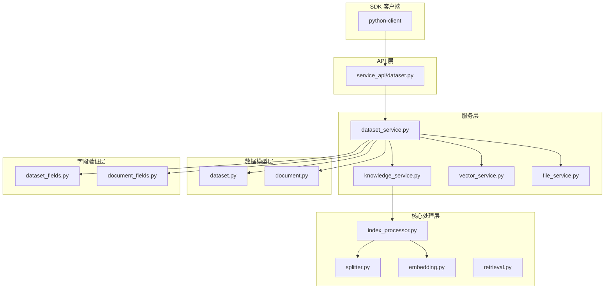
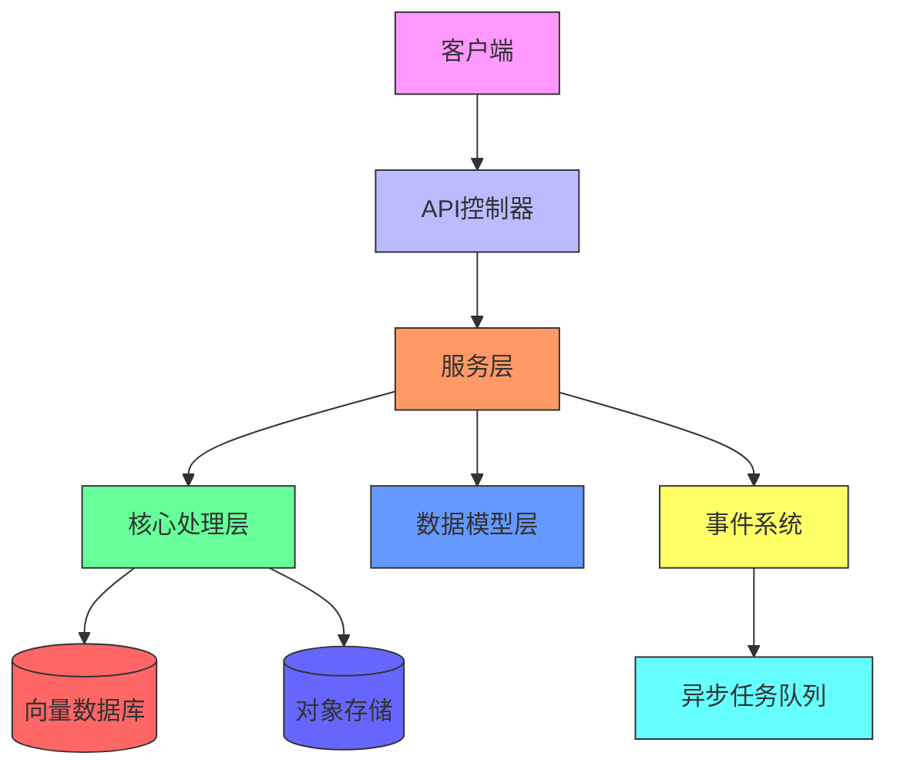
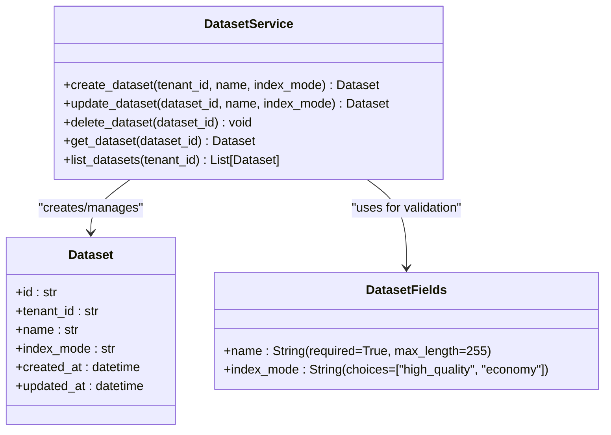
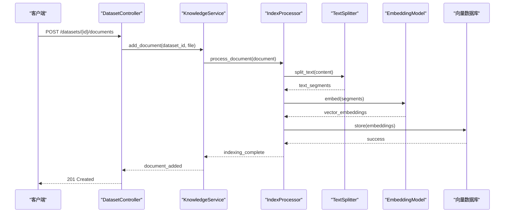
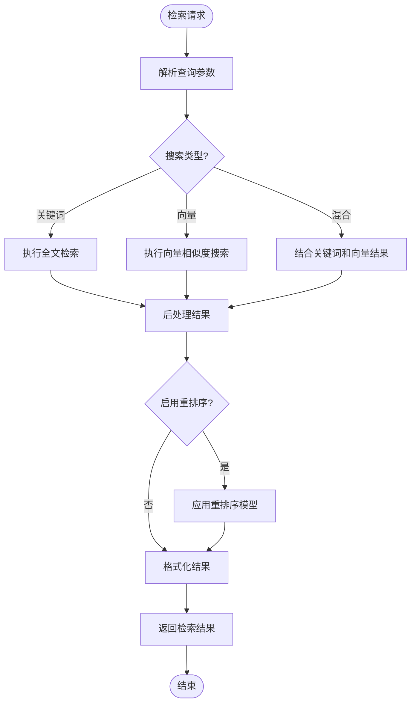
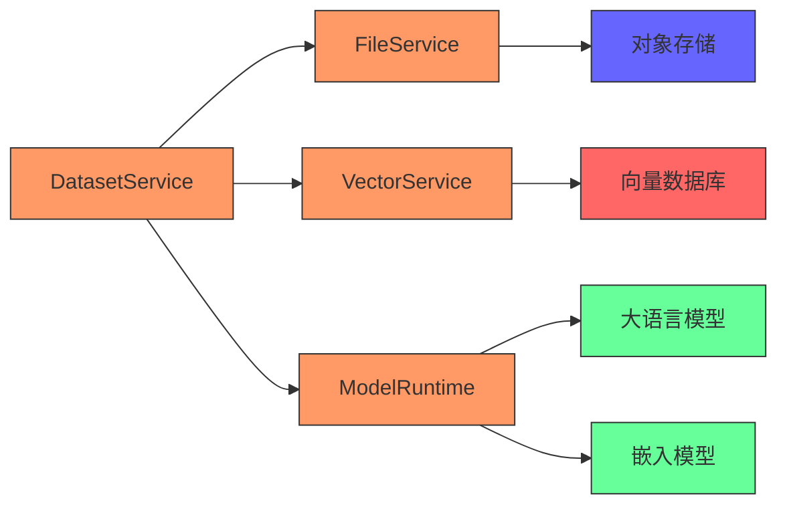

# 数据集服务API

<cite>
**本文档引用的文件**
- [dataset_service.py](file://api/services/dataset_service.py)
- [knowledge_service.py](file://api/services/knowledge_service.py)
- [vector_service.py](file://api/services/vector_service.py)
- [file_service.py](file://api/services/file_service.py)
- [dataset_fields.py](file://api/fields/dataset_fields.py)
- [document_fields.py](file://api/fields/document_fields.py)
- [models/dataset.py](file://api/models/dataset.py)
- [models/document.py](file://api/models/document.py)
- [core/rag/index_processor.py](file://api/core/rag/index_processor.py)
- [core/rag/splitter.py](file://api/core/rag/splitter.py)
- [core/rag/embedding.py](file://api/core/rag/embedding.py)
- [core/rag/retrieval.py](file://api/core/rag/retrieval.py)
- [controllers/service_api/dataset.py](file://api/controllers/service_api/dataset.py)
- [sdks/python-client/dify_client/index.py](file://sdks/python-client/dify_client/index.py)
</cite>

## 目录
1. [简介](#简介)
2. [项目结构](#项目结构)
3. [核心组件](#核心组件)
4. [架构概述](#架构概述)
5. [详细组件分析](#详细组件分析)
6. [依赖分析](#依赖分析)
7. [性能考虑](#性能考虑)
8. [故障排除指南](#故障排除指南)
9. [结论](#结论)

## 简介
本文档旨在为Dify平台的数据集服务API提供权威的技术参考。这些API构成了知识库管理和RAG（检索增强生成）管道的核心，支持创建、更新和删除数据集，以及向数据集中添加、更新和删除文档。文档详细说明了所有相关端点，包括数据集生命周期管理、文档上传、文本分段、向量化和检索配置。通过本指南，开发者可以全面了解如何使用API和SDK来构建高效的知识检索系统。

## 项目结构
Dify的数据集服务分布在多个模块中，形成了清晰的分层架构。核心服务逻辑位于`api/services`目录下，而API控制器则在`api/controllers/service_api`中实现。数据模型定义在`api/models`中，字段验证和序列化由`api/fields`处理。RAG相关的核心处理逻辑（如分块、向量化）位于`api/core/rag`包内。此外，SDK客户端位于`sdks`目录，为不同编程语言提供便捷的API访问方式。

**Diagram sources**
- [controllers/service_api/dataset.py](file://api/controllers/service_api/dataset.py)
- [services/dataset_service.py](file://api/services/dataset_service.py)
- [core/rag/index_processor.py](file://api/core/rag/index_processor.py)

**Section sources**
- [controllers/service_api/dataset.py](file://api/controllers/service_api/dataset.py)
- [services/dataset_service.py](file://api/services/dataset_service.py)
- [core/rag/index_processor.py](file://api/core/rag/index_processor.py)

## 核心组件
数据集服务API的核心组件包括数据集管理服务、知识处理服务、向量服务和文件服务。`dataset_service.py`负责处理数据集的CRUD操作，协调其他服务完成复杂的业务流程。`knowledge_service.py`管理知识文档的生命周期，包括索引的创建和删除。`vector_service.py`处理向量数据库的交互，执行向量化和检索操作。`file_service.py`则负责文件的上传、存储和预处理。这些服务共同构成了RAG管道的基础。

**Section sources**
- [services/dataset_service.py](file://api/services/dataset_service.py)
- [services/knowledge_service.py](file://api/services/knowledge_service.py)
- [services/vector_service.py](file://api/services/vector_service.py)
- [services/file_service.py](file://api/services/file_service.py)

## 架构概述
Dify的数据集服务采用分层架构设计，确保了高内聚和低耦合。API控制器接收外部请求，调用服务层进行业务逻辑处理。服务层协调模型层、核心处理层和外部依赖，完成具体操作。核心处理层包含RAG管道的关键算法，如文本分块和向量嵌入。整个架构通过事件驱动机制（如`events/document_event.py`）实现异步处理，确保高并发下的性能和可靠性。

**Diagram sources**
- [controllers/service_api/dataset.py](file://api/controllers/service_api/dataset.py)
- [services/dataset_service.py](file://api/services/dataset_service.py)
- [core/rag/index_processor.py](file://api/core/rag/index_processor.py)
- [tasks/document_indexing_task.py](file://api/tasks/document_indexing_task.py)

## 详细组件分析

### 数据集管理分析
数据集管理功能通过`dataset_service.py`实现，提供了创建、更新、删除和查询数据集的完整API。服务使用`dataset_fields.py`进行输入验证，确保数据完整性。当创建新数据集时，服务会初始化相关的元数据和配置，并触发后续的索引准备流程。

**Diagram sources**
- [services/dataset_service.py](file://api/services/dataset_service.py)
- [models/dataset.py](file://api/models/dataset.py)
- [fields/dataset_fields.py](file://api/fields/dataset_fields.py)

### 文档处理分析
文档处理流程由`knowledge_service.py`和`index_processor.py`协同完成。上传的文档首先经过预处理，然后根据配置的分块策略进行切分，最后通过嵌入模型向量化并存储到向量数据库中。该过程支持多种文件格式，并可通过异步任务队列处理大型文档。

**Diagram sources**
- [services/knowledge_service.py](file://api/services/knowledge_service.py)
- [core/rag/index_processor.py](file://api/core/rag/index_processor.py)
- [core/rag/splitter.py](file://api/core/rag/splitter.py)
- [core/rag/embedding.py](file://api/core/rag/embedding.py)

### 检索功能分析
检索功能由`retrieval.py`模块实现，支持关键词搜索、向量搜索和混合搜索三种模式。系统根据查询类型选择最优的检索策略，并可配置重排序（rerank）以提高结果相关性。检索API设计灵活，允许客户端指定搜索范围、返回数量和相似度阈值等参数。

**Diagram sources**
- [core/rag/retrieval.py](file://api/core/rag/retrieval.py)
- [core/rag/rerank.py](file://api/core/rag/rerank.py)

**Section sources**
- [core/rag/retrieval.py](file://api/core/rag/retrieval.py)
- [core/rag/rerank.py](file://api/core/rag/rerank.py)

## 依赖分析
数据集服务依赖于多个内部和外部组件。内部依赖包括文件服务、向量服务和模型运行时，外部依赖则涉及对象存储（如AWS S3、阿里云OSS）和向量数据库（如Milvus、Weaviate）。这些依赖通过配置系统（`api/configs`）进行管理，确保了部署的灵活性和可扩展性。

**Diagram sources**
- [services/dataset_service.py](file://api/services/dataset_service.py)
- [services/file_service.py](file://api/services/file_service.py)
- [services/vector_service.py](file://api/services/vector_service.py)
- [core/model_runtime](file://api/core/model_runtime)
- [extensions/storage](file://api/extensions/storage)

**Section sources**
- [services/dataset_service.py](file://api/services/dataset_service.py)
- [services/file_service.py](file://api/services/file_service.py)
- [services/vector_service.py](file://api/services/vector_service.py)

## 性能考虑
数据集服务在设计时充分考虑了性能因素。对于大规模文档处理，系统采用异步任务队列（Celery）来避免阻塞API请求。向量化过程支持批量处理，提高了嵌入模型的利用率。检索服务实现了缓存机制，对高频查询进行结果缓存。此外，分块策略和索引模式的选择直接影响检索性能和准确性，建议根据具体场景进行优化。

## 故障排除指南
当遇到数据集服务问题时，首先检查API响应状态码和错误消息。常见问题包括文件格式不支持、向量数据库连接失败和嵌入模型超时。系统日志（通过`api/extensions/ext_logging.py`配置）记录了详细的处理流程，可用于诊断问题。对于索引失败的文档，可以通过管理API查询其状态并尝试重新索引。

**Section sources**
- [services/dataset_service.py](file://api/services/dataset_service.py)
- [services/knowledge_service.py](file://api/services/knowledge_service.py)
- [tasks/document_indexing_task.py](file://api/tasks/document_indexing_task.py)
- [events/document_event.py](file://api/events/document_event.py)

## 结论
Dify的数据集服务API提供了一套完整的知识库管理解决方案，支持从数据集创建到智能检索的全流程。通过清晰的分层架构和模块化设计，系统实现了高可维护性和可扩展性。开发者可以利用提供的SDK快速集成这些功能，构建强大的RAG应用。未来的工作可以集中在优化默认分块策略、增强检索相关性和提供更细粒度的监控指标上。