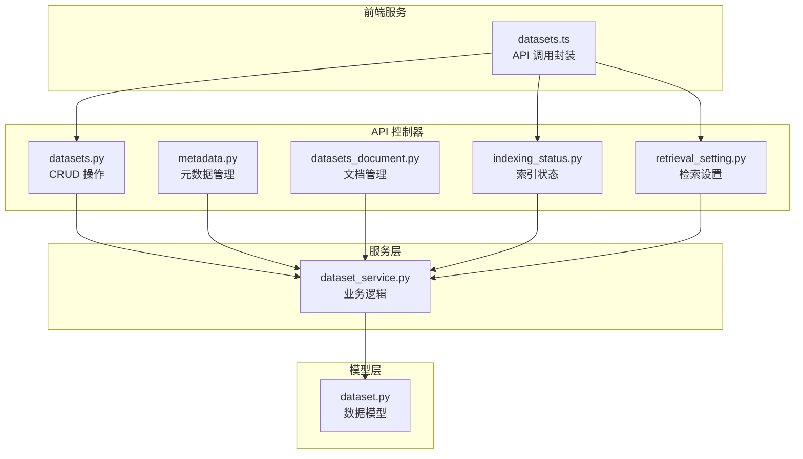
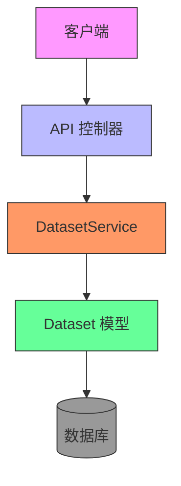
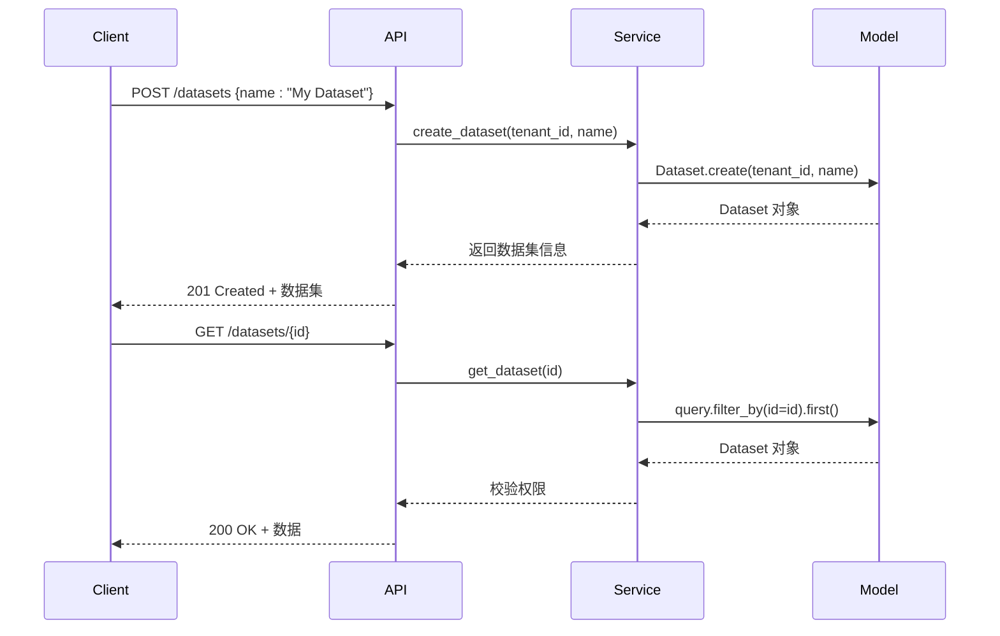
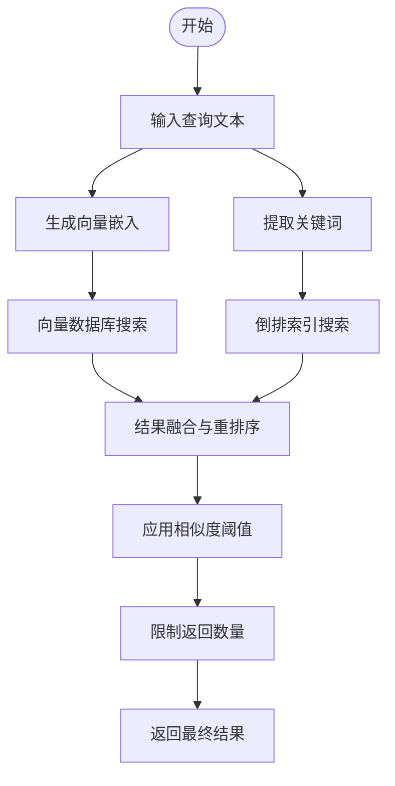
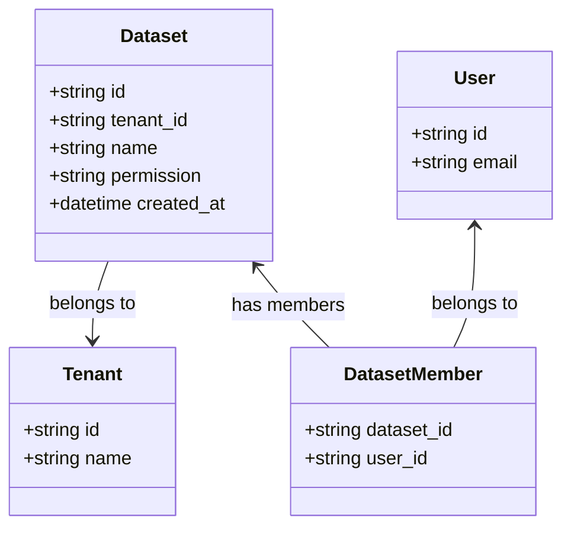
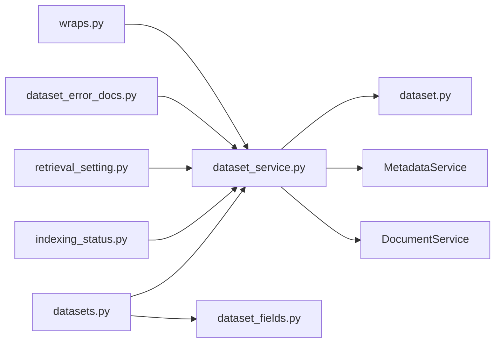

# 数据集管理API

<cite>
**本文档中引用的文件**  
- [dataset.py](file://api/models/dataset.py#L860-L889)
- [datasets.py](file://api/controllers/console/datasets/datasets.py#L341-L380)
- [datasets.py](file://api/controllers/console/datasets/datasets.py#L779-L808)
- [metadata.py](file://api/controllers/console/datasets/metadata.py#L65-L103)
- [dataset_fields.py](file://api/fields/dataset_fields.py)
- [dataset_service.py](file://api/services/dataset_service.py)
- [wraps.py](file://api/controllers/service_api/wraps.py#L291-L310)
- [datasets.ts](file://web/service/datasets.ts)
- [page.tsx](file://web/app/(commonLayout)/datasets/(datasetDetailLayout)/[datasetId]/api/page.tsx)
- [tag_fields.py](file://api/fields/tag_fields.py#L0-L11)
- [dataset_error_docs.py](file://api/controllers/console/datasets/dataset_error_docs.py)
- [indexing_status.py](file://api/controllers/console/datasets/indexing_status.py)
- [retrieval_setting.py](file://api/controllers/console/datasets/retrieval_setting.py)
- [errors.py](file://api/services/errors/dataset.py#L0-L8)
</cite>

## 目录
1. [简介](#简介)
2. [项目结构](#项目结构)
3. [核心组件](#核心组件)
4. [架构概述](#架构概述)
5. [详细组件分析](#详细组件分析)
6. [依赖分析](#依赖分析)
7. [性能考虑](#性能考虑)
8. [故障排除指南](#故障排除指南)
9. [结论](#结论)

## 简介
本文档详细描述了 Dify 平台中数据集管理的 API 接口，涵盖数据集的全生命周期操作（创建、读取、更新、删除），包括配置选项、权限控制、多租户隔离、错误处理及统计信息获取。文档还提供了 Python SDK 使用示例，并解释了数据集与应用程序之间的关联机制。

## 项目结构
Dify 的数据集管理功能主要分布在 `api/controllers/console/datasets/` 目录下，涉及多个子模块如 `datasets.py`、`metadata.py`、`datasets_document.py` 等。核心模型定义位于 `api/models/dataset.py`，服务逻辑封装在 `services/dataset_service.py`，前端调用接口定义于 `web/service/datasets.ts`。

**Diagram sources**  
- [datasets.py](file://api/controllers/console/datasets/datasets.py#L341-L380)
- [dataset_service.py](file://api/services/dataset_service.py)
- [dataset.py](file://api/models/dataset.py#L860-L889)
- [datasets.ts](file://web/service/datasets.ts)

**Section sources**
- [datasets.py](file://api/controllers/console/datasets/datasets.py#L341-L380)
- [dataset.py](file://api/models/dataset.py#L860-L889)

## 核心组件

数据集管理的核心组件包括：
- **DatasetService**：提供数据集的创建、查询、权限校验、使用检查等服务。
- **Dataset 模型**：定义数据集的数据库结构，包含名称、描述、权限、索引技术等字段。
- **DatasetApiResource**：为服务 API 提供认证和访问控制。
- **前端 datasets.ts**：封装 REST API 调用，供 Web 界面使用。

**Section sources**
- [dataset_service.py](file://api/services/dataset_service.py)
- [dataset.py](file://api/models/dataset.py#L860-L889)
- [datasets.ts](file://web/service/datasets.ts)

## 架构概述

Dify 的数据集管理采用典型的三层架构：表现层（API 控制器）、业务逻辑层（服务）、数据访问层（模型）。通过 `DatasetService` 统一处理所有业务规则，确保数据一致性与安全性。多租户环境下通过 `tenant_id` 实现数据隔离。

**Diagram sources**  
- [datasets.py](file://api/controllers/console/datasets/datasets.py#L341-L380)
- [dataset_service.py](file://api/services/dataset_service.py)
- [dataset.py](file://api/models/dataset.py#L860-L889)

## 详细组件分析

### 数据集 CRUD 分析

#### 创建数据集
通过 `POST /datasets` 创建新数据集，需提供名称，系统自动分配 ID 并绑定当前租户。

#### 获取数据集
通过 `GET /datasets/{dataset_id}` 获取指定数据集详情，需通过权限校验。

#### 更新数据集
通过 `PATCH /datasets/{dataset_id}` 更新数据集属性，如名称、描述、检索模型等。

#### 删除数据集
通过 `DELETE /datasets/{dataset_id}` 删除数据集，若被应用引用则拒绝删除。

**Diagram sources**  
- [datasets.py](file://api/controllers/console/datasets/datasets.py#L341-L380)
- [dataset_service.py](file://api/services/dataset_service.py)
- [dataset.py](file://api/models/dataset.py#L860-L889)

**Section sources**
- [datasets.py](file://api/controllers/console/datasets/datasets.py#L341-L380)
- [dataset_service.py](file://api/services/dataset_service.py)

### 检索配置分析

数据集支持多种检索模式，可通过 `retrieval_model` 字段配置：
- **关键词检索**：基于倒排索引的精确匹配
- **向量检索**：基于嵌入向量的语义搜索
- **混合检索**：结合关键词与向量结果进行重排序

相似度阈值、返回数量等参数可在 `retrieval_model` 配置对象中设置。

**Diagram sources**  
- [retrieval_setting.py](file://api/controllers/console/datasets/retrieval_setting.py)
- [dataset_service.py](file://api/services/dataset_service.py)

**Section sources**
- [retrieval_setting.py](file://api/controllers/console/datasets/retrieval_setting.py)

### 多租户与权限分析

每个数据集关联一个 `tenant_id`，确保跨租户数据隔离。用户权限通过 `DatasetService.check_dataset_permission()` 校验，支持所有者与成员访问控制。

**Diagram sources**  
- [dataset.py](file://api/models/dataset.py#L860-L889)
- [dataset_service.py](file://api/services/dataset_service.py)

**Section sources**
- [dataset.py](file://api/models/dataset.py#L860-L889)

## 依赖分析

数据集管理模块依赖以下核心组件：
- **数据库模型**：`Dataset`, `DatasetQuery`, `DatasetKeywordTable`
- **服务层**：`DatasetService`, `MetadataService`
- **权限系统**：`login_required`, `account_initialization_required`
- **事件系统**：文档删除、索引更新等事件触发器

**Diagram sources**  
- [datasets.py](file://api/controllers/console/datasets/datasets.py#L341-L380)
- [dataset_service.py](file://api/services/dataset_service.py)
- [dataset.py](file://api/models/dataset.py#L860-L889)
- [wraps.py](file://api/controllers/service_api/wraps.py#L291-L310)

**Section sources**
- [datasets.py](file://api/controllers/console/datasets/datasets.py#L341-L380)
- [dataset_service.py](file://api/services/dataset_service.py)

## 性能考虑

- **索引异步处理**：文档索引通过 Celery 任务队列异步执行，避免阻塞 API。
- **缓存机制**：频繁访问的数据集元数据可缓存以提升响应速度。
- **分页查询**：`/queries` 和 `/documents` 接口支持分页，防止大数据集加载超时。
- **批量操作**：支持批量文档上传与索引，减少网络往返。

## 故障排除指南

常见问题及解决方案：

| 错误类型 | HTTP 状态码 | 原因 | 解决方案 |
|--------|------------|------|---------|
| DatasetNameDuplicateError | 409 Conflict | 数据集名称重复 | 更改名称后重试 |
| DatasetInUseError | 400 Bad Request | 数据集被应用引用 | 先解除应用关联再删除 |
| NotFound | 404 Not Found | 数据集 ID 不存在 | 检查 ID 是否正确 |
| Forbidden | 403 Forbidden | 无访问权限 | 确认用户属于该租户或有成员权限 |
| QuotaExceededError | 402 Payment Required | 超出配额限制 | 升级订阅计划 |

**Section sources**
- [errors.py](file://api/services/errors/dataset.py#L0-L8)
- [datasets.py](file://api/controllers/console/datasets/datasets.py#L341-L380)

## 结论

Dify 的数据集管理 API 提供了完整的 CRUD 功能、灵活的检索配置、严格的权限控制和多租户支持。通过清晰的分层架构和事件驱动机制，确保了系统的可维护性与扩展性。开发者可通过 REST API 或 Python SDK 高效集成数据集功能，构建智能应用。