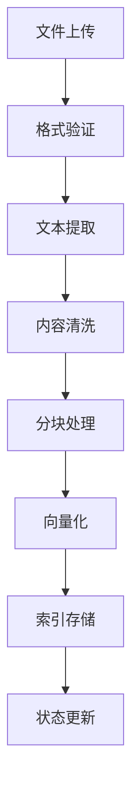
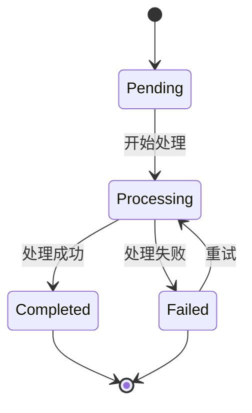

# 文档管理API

<cite>
**本文档中引用的文件**  
- [upload.py](file://api/controllers/files/upload.py)
- [file_manager.py](file://api/core/file/file_manager.py)
- [models.py](file://api/core/file/models.py)
- [enums.py](file://api/core/file/enums.py)
- [constants.py](file://api/core/file/constants.py)
- [tool_file_parser.py](file://api/core/file/tool_file_parser.py)
- [helpers.py](file://api/core/file/helpers.py)
</cite>

## 目录
1. [简介](#简介)
2. [文档上传API](#文档上传api)
3. [文档处理流程](#文档处理流程)
4. [文档状态管理](#文档状态管理)
5. [文档分段与索引](#文档分段与索引)
6. [文档管理API端点](#文档管理api端点)
7. [错误处理机制](#错误处理机制)
8. [代码示例](#代码示例)
9. [结论](#结论)

## 简介
Dify文档管理API提供了一套完整的文档上传、处理和管理解决方案，支持多种文件格式的智能解析与向量化。该系统专为构建基于知识库的AI应用而设计，能够高效处理PDF、Word、Excel、HTML等常见文档格式，并通过先进的文本提取、内容清洗和分块策略实现高质量的知识索引。

**文档上传功能**通过安全的签名验证机制确保文件传输的安全性，同时支持大文件上传和元数据附加。文档处理管道集成了文本提取、语义分块和向量化等核心能力，确保文档内容能够被AI模型有效理解和利用。

本API广泛应用于智能问答、知识检索和自动化文档分析等场景，为开发者提供了灵活且强大的文档管理能力。

## 文档上传API

文档上传API提供了安全可靠的文件上传机制，支持插件使用场景下的文件上传。该API通过HMAC签名验证确保请求的完整性和安全性，防止未授权访问。

### 支持的文件格式
系统支持以下主要文件类型：
- **文档类**：PDF、Word（.docx）、Excel（.xlsx）、HTML、TXT
- **图像类**：PNG、JPG、JPEG、GIF、WEBP
- **音频类**：MP3、WAV、AAC、FLAC
- **视频类**：MP4、AVI、MOV、WMV

文件类型通过`FileType`枚举定义，包括`DOCUMENT`、`IMAGE`、`AUDIO`、`VIDEO`和`CUSTOM`五种基本类型。

### 上传参数
上传请求需要包含以下参数：

| 参数 | 类型 | 必需 | 描述 |
|------|------|------|------|
| `file` | FileStorage | 是 | 要上传的文件对象 |
| `timestamp` | string | 是 | 用于签名验证的Unix时间戳 |
| `nonce` | string | 是 | 用于签名验证的随机字符串 |
| `sign` | string | 是 | HMAC签名，用于请求验证 |
| `tenant_id` | string | 是 | 租户标识符 |
| `user_id` | string | 否 | 用户标识符 |

### 大小限制
系统对上传文件的大小进行了限制，具体限制值由配置决定。当文件超过允许的最大大小时，会抛出`FileTooLargeError`异常。

### 元数据附加
上传过程中会自动提取并存储以下元数据：
- 文件名（filename）
- MIME类型（mimetype）
- 文件大小（size）
- 文件扩展名（extension）
- 租户ID（tenant_id）
- 用户ID（user_id）

**Section sources**
- [upload.py](file://api/controllers/files/upload.py#L1-L130)
- [models.py](file://api/core/file/models.py#L1-L149)
- [enums.py](file://api/core/file/enums.py#L1-L57)

## 文档处理流程

Dify的文档处理管道采用多阶段处理架构，确保文档内容能够被高效、准确地转换为AI可理解的知识表示。

### 处理流程概览


**Diagram sources**
- [tool_file_parser.py](file://api/core/file/tool_file_parser.py)
- [file_manager.py](file://api/core/file/file_manager.py#L1-L161)

### 文本提取
系统使用专门的工具文件解析器（`ToolFileParser`）从上传的文件中提取原始文本内容。对于不同类型的文件，采用相应的解析策略：
- **PDF文件**：使用PDF解析库提取文本和元数据
- **Office文档**：通过文档处理库读取Word、Excel等内容
- **HTML文件**：解析HTML结构，提取正文内容
- **图像文件**：结合OCR技术提取图像中的文字

### 内容清洗
提取的原始文本会经过清洗处理，包括：
- 移除多余的空白字符和换行符
- 过滤特殊符号和乱码
- 标准化编码格式
- 识别并保留重要结构信息（如标题、段落）

### 分块策略
系统支持多种分块策略，确保文本块的语义完整性和处理效率。

#### 固定大小分块
将文档按固定字符数（如512字符）进行分割，适用于结构简单的文档。

#### 语义分块
基于自然语言处理技术，识别语义边界进行智能分割：
- 在段落结束处优先分割
- 避免在句子中间断开
- 保持主题的完整性
- 支持重叠分块以保留上下文

分块策略由`FileUploadConfig`中的配置决定，可通过`allowed_file_types`和`allowed_file_extensions`进行精细化控制。

### 向量化过程
分块后的文本通过嵌入模型（Embedding Model）转换为向量表示：
1. 将每个文本块作为输入传递给嵌入模型
2. 获取高维向量表示（通常为384-1536维）
3. 存储向量及其对应的元数据
4. 建立向量索引以支持快速相似性搜索

向量化过程由`vector_service`管理，确保向量的一致性和准确性。

**Section sources**
- [file_manager.py](file://api/core/file/file_manager.py#L1-L161)
- [tool_file_parser.py](file://api/core/file/tool_file_parser.py)
- [models.py](file://api/core/file/models.py#L1-L149)

## 文档状态管理

文档在系统中的生命周期通过状态机进行管理，确保处理过程的可追踪性和可靠性。

### 状态定义
文档支持以下状态：
- **待处理（Pending）**：文档已上传但尚未开始处理
- **处理中（Processing）**：文档正在被解析和处理
- **已完成（Completed）**：文档处理成功，已准备好用于检索
- **失败（Failed）**：文档处理过程中出现错误

状态信息存储在文档元数据中，可通过API查询获取。

### 状态转换


**Diagram sources**
- [file_manager.py](file://api/core/file/file_manager.py#L1-L161)
- [models.py](file://api/core/file/models.py#L1-L149)

状态转换由后台任务系统驱动，当文档上传完成后，会触发相应的处理任务。处理进度可以通过轮询或事件通知机制进行监控。

**Section sources**
- [file_manager.py](file://api/core/file/file_manager.py#L1-L161)
- [models.py](file://api/core/file/models.py#L1-L149)

## 文档分段与索引

文档分段是知识库构建的核心环节，直接影响检索质量和效率。

### 分段概念
文档分段（Segment）指将文档内容分割成有意义的单元，每个分段包含：
- 原始文本内容
- 向量化表示
- 元数据（来源文档、位置信息等）
- 状态标识

分段管理由`segment_fields`和`dataset_service`协同完成，确保分段数据的一致性和完整性。

### 分页索引
对于大文档，系统采用分页索引机制：
- 按分段ID进行排序和分页
- 支持按状态、创建时间等条件过滤
- 提供高效的分页查询接口
- 支持批量操作（启用、禁用、删除）

分页查询通过`infinite_scroll_pagination`工具实现，支持无限滚动和传统分页两种模式。

### 索引操作
系统提供完整的索引管理API：
- **创建索引**：为新文档创建向量索引
- **更新索引**：当文档内容变更时更新索引
- **删除索引**：从向量数据库中移除文档索引
- **恢复索引**：重新建立已删除文档的索引

索引操作由`document_indexing_task`和`vector_service`协同管理，确保索引的一致性和可靠性。

**Section sources**
- [models.py](file://api/core/file/models.py#L1-L149)
- [file_manager.py](file://api/core/file/file_manager.py#L1-L161)
- [tasks/document_indexing_task.py](file://api/tasks/document_indexing_task.py)

## 文档管理API端点

系统提供了一系列RESTful API端点用于文档的全生命周期管理。

### API端点列表
| 端点 | 方法 | 描述 |
|------|------|------|
| `/files/upload/for-plugin` | POST | 上传文件用于插件使用 |
| `/datasets/{dataset_id}/documents` | POST | 创建新文档 |
| `/datasets/{dataset_id}/documents/{document_id}` | PUT | 更新文档 |
| `/datasets/{dataset_id}/documents/{document_id}` | DELETE | 删除文档 |
| `/datasets/{dataset_id}/documents` | GET | 查询文档列表 |
| `/datasets/{dataset_id}/segments` | GET | 获取文档分段 |

### 创建文档
创建文档时需要提供：
- 数据集ID
- 文档名称
- 文件来源（URL或上传文件）
- 处理配置（分块策略、向量化模型等）

### 更新文档
支持更新文档的以下属性：
- 名称
- 描述
- 处理配置
- 状态（启用/禁用）

### 删除文档
删除文档会触发级联操作：
1. 从向量数据库中移除索引
2. 删除存储的文件
3. 清理相关元数据
4. 更新数据集统计信息

删除操作由`clean_document_task`异步执行，确保系统的稳定性和可靠性。

**Section sources**
- [upload.py](file://api/controllers/files/upload.py#L1-L130)
- [service_api/dataset/document.py](file://api/controllers/service_api/dataset/document.py)
- [models.py](file://api/core/file/models.py#L1-L149)

## 错误处理机制

系统实现了全面的错误处理机制，确保在各种异常情况下能够提供清晰的反馈和恢复能力。

### 常见错误类型
| 错误类型 | HTTP状态码 | 描述 |
|---------|-----------|------|
| `FileTooLargeError` | 413 | 文件超过大小限制 |
| `UnsupportedFileTypeError` | 415 | 不支持的文件类型 |
| `Forbidden` | 403 | 签名验证失败或权限不足 |
| `ValidationError` | 400 | 请求参数验证失败 |

### 错误处理策略
#### 文件解析失败
当文件解析失败时：
1. 记录详细的错误日志
2. 更新文档状态为"失败"
3. 提供具体的错误原因
4. 支持重新上传和处理

#### 编码问题
对于编码问题的处理：
- 自动检测文件编码
- 尝试多种编码格式进行解析
- 提供编码转换选项
- 记录原始编码信息

#### 索引超时
针对索引超时的应对策略：
- 设置合理的超时阈值
- 支持断点续处理
- 提供进度监控接口
- 实现自动重试机制

错误处理由`common/errors.py`统一管理，确保错误信息的一致性和可读性。

**Section sources**
- [upload.py](file://api/controllers/files/upload.py#L1-L130)
- [controllers/common/errors.py](file://api/controllers/common/errors.py)
- [core/errors/error.py](file://api/core/errors/error.py)

## 代码示例

以下示例展示如何使用文档管理API上传文件并监控处理进度。

### 文件上传示例
```python
import requests
import hashlib
import hmac
import time

def upload_file(file_path, tenant_id, user_id, secret_key):
    # 准备请求参数
    timestamp = str(int(time.time()))
    nonce = "random_nonce_string"
    
    # 生成签名
    sign_content = f"{file_path}{timestamp}{nonce}{tenant_id}{user_id}"
    sign = hmac.new(
        secret_key.encode(),
        sign_content.encode(),
        hashlib.sha256
    ).hexdigest()
    
    # 构建请求
    url = "http://localhost:5001/files/upload/for-plugin"
    files = {'file': open(file_path, 'rb')}
    params = {
        'timestamp': timestamp,
        'nonce': nonce,
        'sign': sign,
        'tenant_id': tenant_id,
        'user_id': user_id
    }
    
    # 发送请求
    response = requests.post(url, files=files, params=params)
    
    if response.status_code == 201:
        return response.json()
    else:
        raise Exception(f"Upload failed: {response.text}")
```

### 监控处理进度
```python
import time
import requests

def monitor_processing(document_id, dataset_id, api_key):
    url = f"http://localhost:5001/datasets/{dataset_id}/documents/{document_id}"
    headers = {"Authorization": f"Bearer {api_key}"}
    
    while True:
        response = requests.get(url, headers=headers)
        data = response.json()
        
        status = data.get("indexing_status")
        print(f"当前状态: {status}")
        
        if status == "completed":
            print("文档处理完成！")
            break
        elif status == "failed":
            print(f"处理失败: {data.get('error')}")
            break
            
        time.sleep(5)  # 每5秒检查一次
```

**Section sources**
- [upload.py](file://api/controllers/files/upload.py#L1-L130)
- [file_manager.py](file://api/core/file/file_manager.py#L1-L161)

## 结论

Dify文档管理API提供了一套完整、安全、高效的文档处理解决方案。通过精心设计的API接口和强大的后台处理能力，开发者可以轻松实现文档的上传、处理和管理。

系统的核心优势包括：
- **多格式支持**：涵盖常见的文档、图像、音频和视频格式
- **安全传输**：基于HMAC的签名验证机制确保文件上传安全
- **智能处理**：结合固定大小和语义分块策略，提高知识检索质量
- **完整生命周期管理**：从上传到索引的全流程状态跟踪
- **弹性扩展**：支持大文档的分页处理和索引

通过合理利用这些功能，开发者可以构建出高性能的知识库应用，为AI模型提供高质量的上下文信息。