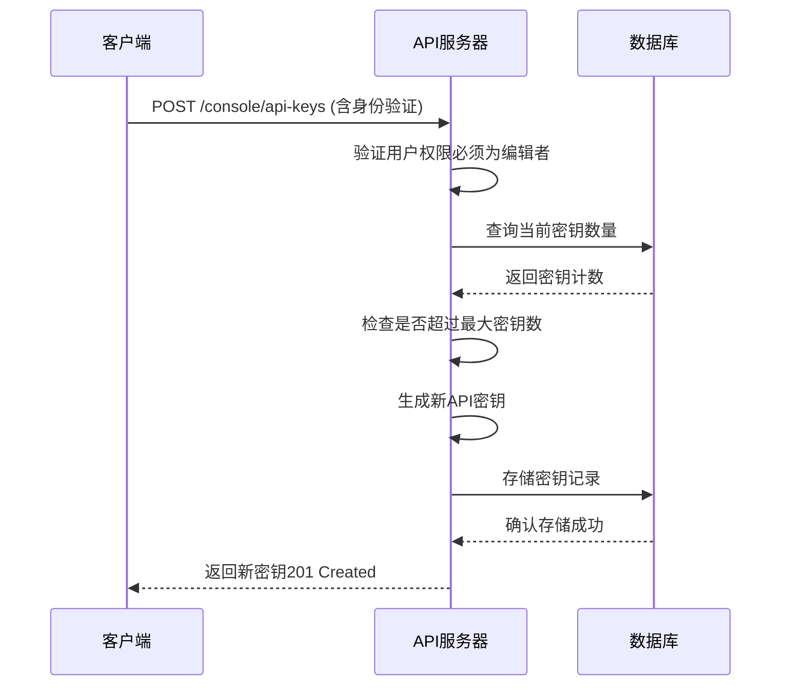
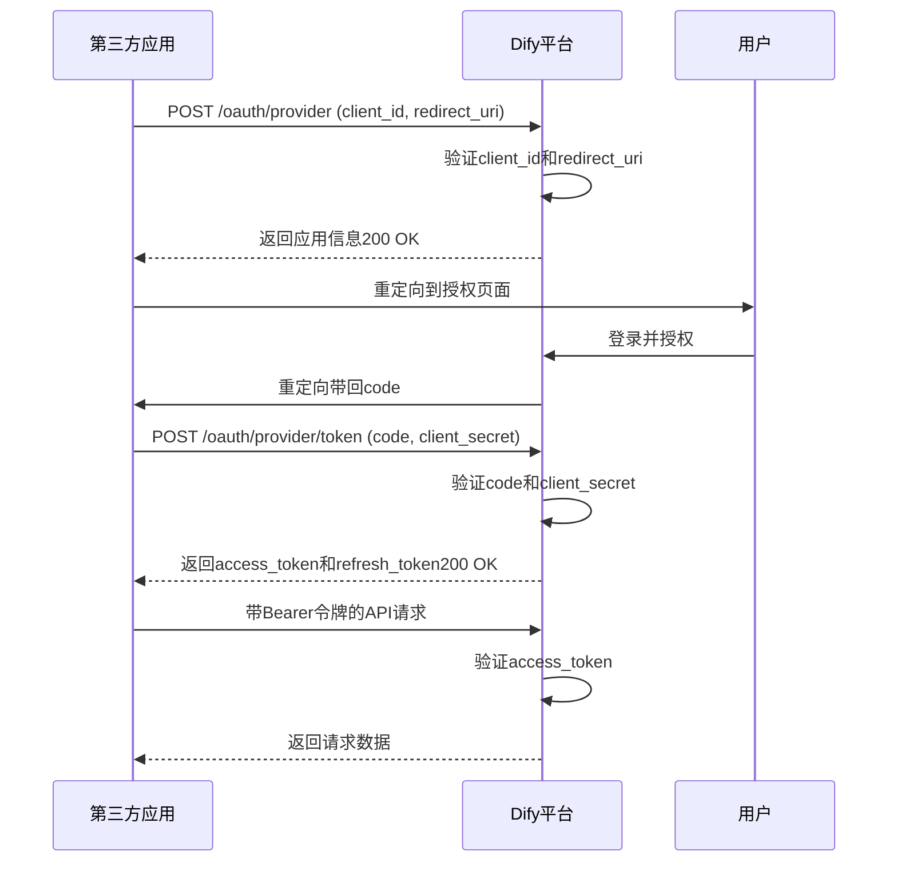
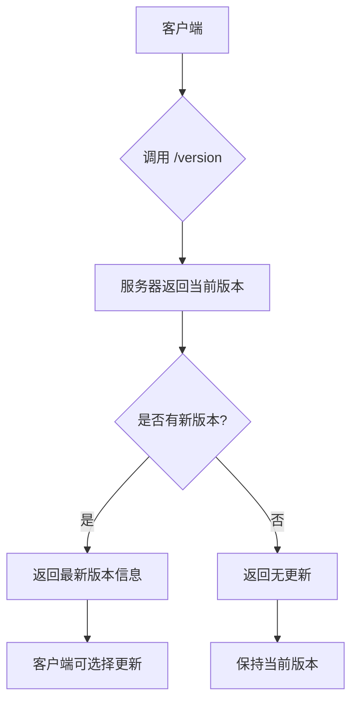
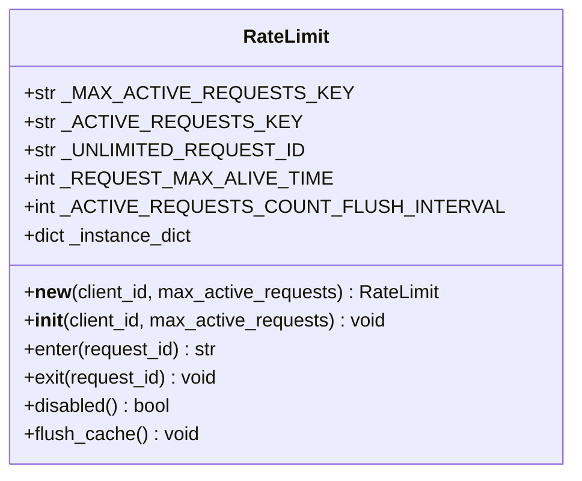
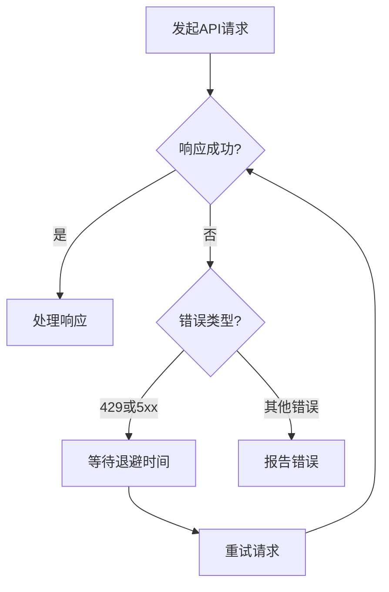

# 服务API

<cite>
**本文档中引用的文件**  
- [apikey.py](file://api/controllers/console/apikey.py)
- [oauth_server.py](file://api/controllers/console/auth/oauth_server.py)
- [rate_limit.py](file://api/core/app/features/rate_limiting/rate_limit.py)
- [api_key_auth_service.py](file://api/services/auth/api_key_auth_service.py)
- [version.py](file://api/controllers/console/version.py)
- [external_api.py](file://api/libs/external_api.py)
- [client.py](file://sdks/python-client/dify_client/client.py)
- [index.js](file://sdks/nodejs-client/index.js)
- [dify-client.php](file://sdks/php-client/dify-client.php)
</cite>

## 目录
1. [简介](#简介)
2. [认证机制](#认证机制)
3. [API端点规范](#api端点规范)
4. [客户端实现示例](#客户端实现示例)
5. [API版本控制与变更日志](#api版本控制与变更日志)
6. [速率限制与配额管理](#速率限制与配额管理)
7. [故障恢复模式](#故障恢复模式)
8. [使用监控](#使用监控)

## 简介
Dify服务API为第三方系统集成提供了强大且安全的接口。本API支持多种认证方式，包括API密钥和OAuth2，并设计用于在生产环境中可靠运行。API涵盖应用管理、数据集操作、工作流执行等核心功能，支持高并发和大规模部署。通过本API，开发者可以将Dify的AI能力无缝集成到自己的系统中。

## 认证机制

### API密钥认证
Dify支持基于API密钥的认证机制，用于服务间通信和自动化脚本。API密钥通过控制台生成，与特定资源（如应用或工作区）绑定。

API密钥的创建和管理由`apikey.py`中的`BaseApiKeyListResource`类处理。每个资源类型（如应用）最多可创建10个API密钥。密钥生成时会自动添加前缀（如`app-`），并存储在数据库中。



**Diagram sources**  
- [apikey.py](file://api/controllers/console/apikey.py#L73-L109)

**Section sources**  
- [apikey.py](file://api/controllers/console/apikey.py#L73-L148)

### OAuth2认证
Dify实现了OAuth2授权框架，支持第三方应用安全访问用户资源。OAuth2流程包括客户端注册、用户授权和令牌获取。

OAuth2服务由`oauth_server.py`中的`OAuthServerAppApi`、`OAuthServerUserAuthorizeApi`和`OAuthServerUserTokenApi`类实现。认证流程遵循标准OAuth2协议，使用Bearer令牌进行访问控制。



**Diagram sources**  
- [oauth_server.py](file://api/controllers/console/auth/oauth_server.py#L65-L201)

**Section sources**  
- [oauth_server.py](file://api/controllers/console/auth/oauth_server.py#L34-L201)

## API端点规范

### 应用API
- **端点**: `/api/v1/apps`
- **方法**: GET, POST
- **认证**: API密钥或OAuth2 Bearer令牌
- **请求参数**:
  - `name` (string): 应用名称
  - `description` (string): 应用描述
- **响应代码**:
  - 200: 成功获取应用列表
  - 201: 成功创建新应用
  - 400: 请求参数无效
  - 401: 认证失败
  - 403: 权限不足
  - 429: 请求过于频繁
  - 500: 服务器内部错误
- **数据模式**: 返回应用对象数组，包含ID、名称、创建时间等字段

### 数据集API
- **端点**: `/api/v1/datasets`
- **方法**: GET, POST, PUT, DELETE
- **认证**: API密钥或OAuth2 Bearer令牌
- **功能**: 创建、读取、更新和删除数据集
- **特殊参数**: 支持分页查询和过滤

### 工作流API
- **端点**: `/api/v1/workflows`
- **方法**: POST
- **认证**: API密钥或OAuth2 Bearer令牌
- **请求体**: 包含工作流定义的JSON
- **响应**: 工作流执行结果或错误信息

## 客户端实现示例

### Python客户端
```python
from dify_client import Client

# 初始化客户端
client = Client(api_key="your-api-key", base_url="https://api.dify.ai")

# 调用API
response = client.apps.list()
print(response)
```

**Section sources**  
- [client.py](file://sdks/python-client/dify_client/client.py)

### Node.js客户端
```javascript
const { DifyClient } = require('dify-client');

// 初始化客户端
const client = new DifyClient({
  apiKey: 'your-api-key',
  baseURL: 'https://api.dify.ai'
});

// 调用API
client.apps.list().then(console.log);
```

**Section sources**  
- [index.js](file://sdks/nodejs-client/index.js)

### PHP客户端
```php
<?php
require_once 'dify-client.php';

// 初始化客户端
$client = new DifyClient([
    'api_key' => 'your-api-key',
    'base_url' => 'https://api.dify.ai'
]);

// 调用API
$response = $client->apps()->list();
print_r($response);
?>
```

**Section sources**  
- [dify-client.php](file://sdks/php-client/dify-client.php)

## API版本控制与变更日志

### 版本控制策略
Dify采用语义化版本控制（Semantic Versioning），API版本通过URL路径指定（如`/api/v1/`）。主版本号变更表示不兼容的API修改，次版本号变更表示向后兼容的功能新增，修订号变更表示向后兼容的问题修正。

版本信息通过`version.py`中的`VersionApi`提供，客户端可以查询当前版本和最新版本信息。



**Diagram sources**  
- [version.py](file://api/controllers/console/version.py#L39-L63)

**Section sources**  
- [version.py](file://api/controllers/console/version.py#L39-L63)

### 变更日志
Dify维护详细的变更日志，记录每个版本的功能更新、性能改进和错误修复。变更日志可通过API获取，帮助开发者了解API变化并及时调整集成代码。

## 速率限制与配额管理

### 速率限制实现
Dify使用基于Redis的速率限制机制，防止API被滥用。速率限制由`rate_limit.py`中的`RateLimit`类实现，采用单例模式确保每个客户端ID对应一个速率限制实例。

速率限制基于并发请求数，而不是请求频率。当活动请求数达到上限时，新请求将被拒绝并返回429状态码。



**Diagram sources**  
- [rate_limit.py](file://api/core/app/features/rate_limiting/rate_limit.py#L0-L89)

**Section sources**  
- [rate_limit.py](file://api/core/app/features/rate_limiting/rate_limit.py#L0-L89)

### 配额管理
除了速率限制，Dify还实施配额管理，限制特定资源的使用量。配额检查在`wraps.py`中的装饰器中实现，涵盖成员数、应用数、向量存储空间和文档上传配额。

当用户达到配额限制时，API将返回403状态码和相应的错误信息。

## 故障恢复模式

### 重试逻辑
建议客户端实现指数退避重试逻辑，处理临时性故障。对于429（请求过多）和5xx（服务器错误）响应，客户端应等待一段时间后重试。



### 断路器模式
在高可用性要求的场景中，建议使用断路器模式。当API连续失败达到阈值时，断路器跳闸，直接返回错误而不发起实际请求，避免雪崩效应。经过冷却期后，断路器半开，尝试少量请求以检测服务是否恢复。

## 使用监控
Dify记录详细的API使用日志，包括请求时间、客户端ID、操作类型和响应状态。这些日志可用于分析使用模式、检测异常行为和优化性能。速率限制日志在数据库的`rate_limit_logs`表中，包含租户ID、订阅计划、操作类型和创建时间。