# API客户端

<cite>
**本文档中引用的文件**  
- [fetch.ts](file://web/service/fetch.ts)
- [base.ts](file://web/service/base.ts)
- [refresh-token.ts](file://web/service/refresh-token.ts)
- [config/index.ts](file://web/config/index.ts)
- [use-base.ts](file://web/service/use-base.ts)
- [use-common.ts](file://web/service/use-common.ts)
- [use-apps.ts](file://web/service/use-apps.ts)
- [use-models.ts](file://web/service/use-models.ts)
- [use-workflow.ts](file://web/service/use-workflow.ts)
</cite>

## 目录
1. [简介](#简介)
2. [项目结构](#项目结构)
3. [核心组件](#核心组件)
4. [架构概述](#架构概述)
5. [详细组件分析](#详细组件分析)
6. [依赖分析](#依赖分析)
7. [性能考虑](#性能考虑)
8. [故障排除指南](#故障排除指南)
9. [结论](#结论)

## 简介
Dify前端API客户端是连接前端界面与后端服务的核心通信层，基于Fetch API封装，提供统一的RESTful API调用、WebSocket连接管理和实时数据同步机制。该客户端实现了类型安全、请求缓存、错误重试和认证管理等高级功能，确保前后端通信的可靠性、安全性和高性能。本文档详细阐述其设计原理、实现机制和最佳实践。

## 项目结构
Dify前端API客户端主要位于`web/service`目录下，采用模块化设计，各组件职责分明，便于维护和扩展。


**图示来源**
- [fetch.ts](file://web/service/fetch.ts#L1-L209)
- [base.ts](file://web/service/base.ts#L1-L607)
- [refresh-token.ts](file://web/service/refresh-token.ts#L1-L93)

**本节来源**
- [web/service](file://web/service)
- [fetch.ts](file://web/service/fetch.ts#L1-L209)

## 核心组件
Dify前端API客户端的核心组件包括请求封装层、认证管理层、流式响应处理器和React Query集成层。这些组件协同工作，提供高效、安全的API通信能力。

**本节来源**
- [fetch.ts](file://web/service/fetch.ts#L1-L209)
- [base.ts](file://web/service/base.ts#L1-L607)
- [refresh-token.ts](file://web/service/refresh-token.ts#L1-L93)

## 架构概述
Dify前端API客户端采用分层架构，从底层的Fetch API封装到上层的业务逻辑API，每一层都有明确的职责。


**图示来源**
- [base.ts](file://web/service/base.ts#L1-L607)
- [fetch.ts](file://web/service/fetch.ts#L1-L209)
- [refresh-token.ts](file://web/service/refresh-token.ts#L1-L93)

## 详细组件分析

### 请求封装策略
Dify前端API客户端基于`ky`库对Fetch API进行封装，提供了统一的请求配置、拦截器和错误处理机制。

#### 请求拦截与响应处理
客户端通过`ky`的钩子（hooks）机制实现请求拦截和响应处理，确保每个请求都携带正确的认证信息，并对响应进行统一处理。


**图示来源**
- [fetch.ts](file://web/service/fetch.ts#L1-L209)

#### 错误重试与认证管理
客户端实现了智能的令牌刷新机制，当API请求因令牌过期返回401状态码时，自动尝试刷新令牌并重试请求，避免用户频繁重新登录。


**图示来源**
- [base.ts](file://web/service/base.ts#L1-L607)
- [refresh-token.ts](file://web/service/refresh-token.ts#L1-L93)

**本节来源**
- [fetch.ts](file://web/service/fetch.ts#L1-L209)
- [base.ts](file://web/service/base.ts#L1-L607)
- [refresh-token.ts](file://web/service/refresh-token.ts#L1-L93)

### RESTful API调用模式
Dify前端API客户端提供了标准化的RESTful API调用方法，包括`get`、`post`、`put`、`del`等，支持公共API和市场API的区分。

#### API调用方法
客户端通过`base.ts`文件导出了一系列便捷的API调用方法，简化了RESTful操作。

| 方法 | 描述 | 示例 |
|------|------|------|
| `get<T>(url, options, otherOptions)` | 发起GET请求 | `get('/apps')` |
| `post<T>(url, options, otherOptions)` | 发起POST请求 | `post('/apps', { body: appData })` |
| `put<T>(url, options, otherOptions)` | 发起PUT请求 | `put('/apps/1', { body: updatedApp })` |
| `del<T>(url, options, otherOptions)` | 发起DELETE请求 | `del('/apps/1')` |
| `getPublic<T>(url, ...)` | 发起公共API的GET请求 | `getPublic('/apps/1/chat')` |
| `postPublic<T>(url, ...)` | 发起公共API的POST请求 | `postPublic('/apps/1/chat-messages', { body: message })` |

**本节来源**
- [base.ts](file://web/service/base.ts#L1-L607)

### WebSocket连接与实时数据同步
虽然Dify主要使用HTTP长轮询和SSE（Server-Sent Events）实现实时通信，但其设计模式为WebSocket集成提供了良好的基础。

#### 流式响应处理
对于需要实时接收数据的场景（如聊天消息流），客户端使用`ssePost`方法处理SSE流式响应。

```mermaid
flowchart TD
Start([发起SSE请求]) --> PreRequest["设置请求头和认证"]
PreRequest --> SendRequest["发送POST请求"]
SendRequest --> CheckResponse["检查响应状态"]
CheckResponse --> |状态码200| HandleStream["处理流式响应"]
CheckResponse --> |状态码401| RefreshToken["刷新访问令牌"]
RefreshToken --> RetryRequest["重试SSE请求"]
HandleStream --> ReadStream["读取响应流"]
ReadStream --> DecodeData["解码数据块"]
DecodeData --> ParseEvent["解析事件类型"]
ParseEvent --> |event=message| EmitData["触发onData回调"]
ParseEvent --> |event=message_end| Complete["触发onCompleted回调"]
ParseEvent --> |event=agent_thought| EmitThought["触发onThought回调"]
ParseEvent --> |event=workflow_started| EmitWorkflowStart["触发onWorkflowStarted回调"]
ParseEvent --> |其他事件| HandleOtherEvent["处理其他事件"]
HandleOtherEvent --> Continue["继续读取流"]
Continue --> ReadStream
EmitData --> Continue
EmitThought --> Continue
EmitWorkflowStart --> Continue
Complete --> End([流结束])
```



**图示来源**
- [base.ts](file://web/service/base.ts#L1-L607)

**本节来源**
- [base.ts](file://web/service/base.ts#L1-L607)

### 类型安全实现
Dify前端API客户端通过TypeScript泛型和接口定义，实现了严格的类型安全，确保API调用的正确性。

#### 泛型请求方法
所有API方法都使用泛型`<T>`，确保返回数据的类型安全。

```typescript
export const get = <T>(url: string, options = {}, otherOptions?: IOtherOptions) => {
  return request<T>(url, Object.assign({}, options, { method: 'GET' }), otherOptions)
}
```

#### 接口定义
通过导入类型定义，确保请求和响应数据的结构正确。

```typescript
import type { App } from '@/types/app'
import type { AppListResponse } from '@/models/app'

export const useAppFullList = () => {
  return useQuery<AppListResponse>({
    queryKey: useAppFullListKey,
    queryFn: () => get<AppListResponse>('/apps', { params: { page: 1, limit: 100 } }),
  })
}
```

**本节来源**
- [base.ts](file://web/service/base.ts#L1-L607)
- [use-apps.ts](file://web/service/use-apps.ts#L1-L42)

### 请求缓存策略
Dify前端API客户端结合React Query实现了强大的请求缓存机制，减少不必要的网络请求，提升应用性能。

#### React Query集成
通过`useQuery`和`useMutation`等React Query钩子，实现数据的自动缓存、失效和同步。


**图示来源**
- [use-apps.ts](file://web/service/use-apps.ts#L1-L42)
- [use-models.ts](file://web/service/use-models.ts#L1-L156)

**本节来源**
- [use-base.ts](file://web/service/use-base.ts#L1-L27)
- [use-apps.ts](file://web/service/use-apps.ts#L1-L42)
- [use-models.ts](file://web/service/use-models.ts#L1-L156)

### 性能优化技巧
Dify前端API客户端通过多种技术手段优化性能，包括请求合并、分页处理、超时控制和错误处理。

#### 请求合并与分页
通过在请求参数中指定分页信息，避免一次性加载过多数据。

```typescript
get<AppListResponse>('/apps', { params: { page: 1, limit: 100 } })
```

#### 超时控制
设置全局请求超时时间，避免请求长时间挂起。

```typescript
const TIME_OUT = 100000 // 100秒
```

#### 错误处理
统一的错误处理机制，通过Toast组件向用户展示错误信息。

```typescript
const afterResponseErrorCode = (otherOptions: IOtherOptions): AfterResponseHook => {
  return async (_request, _options, response) => {
    // ... 处理错误响应
    Toast.notify({ type: 'error', message: data.message })
  }
}
```

**本节来源**
- [fetch.ts](file://web/service/fetch.ts#L1-L209)
- [base.ts](file://web/service/base.ts#L1-L607)

## 依赖分析
Dify前端API客户端依赖于多个外部库和内部模块，形成了清晰的依赖关系。


**图示来源**
- [fetch.ts](file://web/service/fetch.ts#L1-L209)
- [base.ts](file://web/service/base.ts#L1-L607)
- [config/index.ts](file://web/config/index.ts#L1-L288)

**本节来源**
- [fetch.ts](file://web/service/fetch.ts#L1-L209)
- [base.ts](file://web/service/base.ts#L1-L607)
- [config/index.ts](file://web/config/index.ts#L1-L288)

## 性能考虑
Dify前端API客户端在设计时充分考虑了性能因素，通过缓存、分页、超时控制等机制确保应用的响应速度和用户体验。

- **缓存策略**: 利用React Query的缓存机制，减少重复请求。
- **分页处理**: 对列表数据进行分页，避免一次性加载大量数据。
- **超时控制**: 设置合理的请求超时时间，防止请求长时间挂起。
- **错误重试**: 智能的令牌刷新和请求重试机制，提高请求成功率。
- **流式处理**: 对于大数据流，采用流式处理，避免内存溢出。

## 故障排除指南
当API客户端出现问题时，可以按照以下步骤进行排查：

1. **检查网络连接**: 确保客户端能够正常访问后端API。
2. **检查认证令牌**: 查看localStorage中的`console_token`是否有效。
3. **查看浏览器控制台**: 检查是否有JavaScript错误或网络请求错误。
4. **检查API端点**: 确认请求的URL是否正确。
5. **检查请求参数**: 确认请求的参数和请求体是否符合API要求。
6. **查看后端日志**: 如果可能，查看后端服务的日志以获取更多信息。

**本节来源**
- [base.ts](file://web/service/base.ts#L1-L607)
- [fetch.ts](file://web/service/fetch.ts#L1-L209)

## 结论
Dify前端API客户端是一个功能强大、设计精良的通信层，它通过封装Fetch API、集成React Query、实现智能认证管理，为前端应用提供了稳定、高效、安全的后端服务访问能力。其模块化设计、类型安全实现和丰富的功能特性，使得开发者能够专注于业务逻辑的实现，而无需担心底层通信的复杂性。