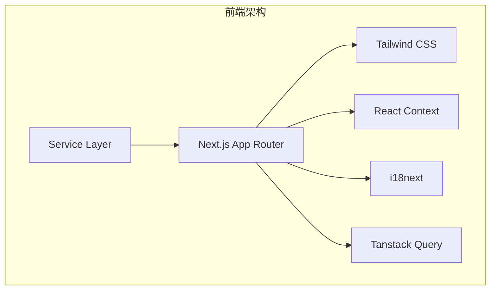
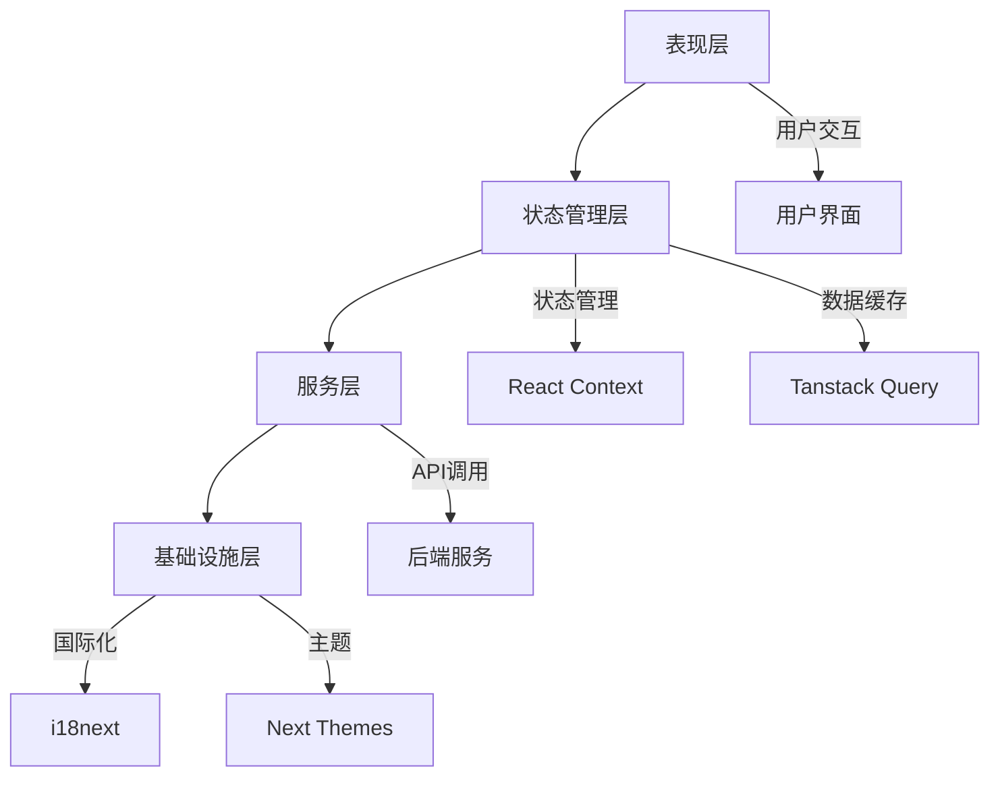
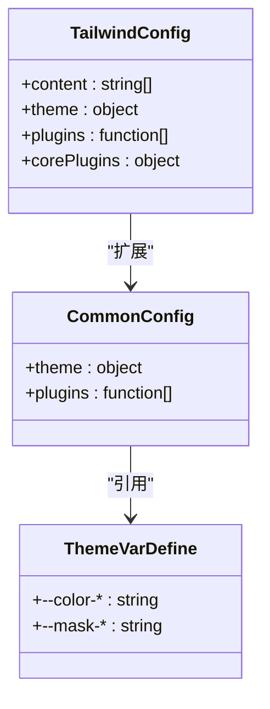
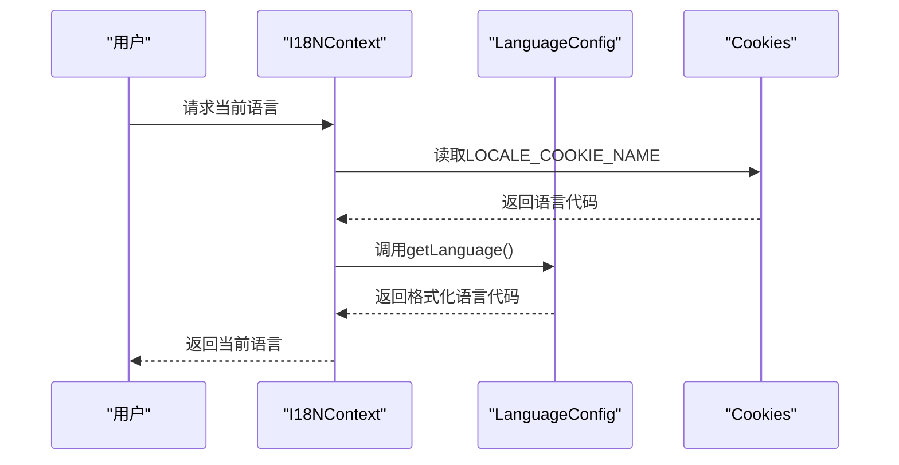
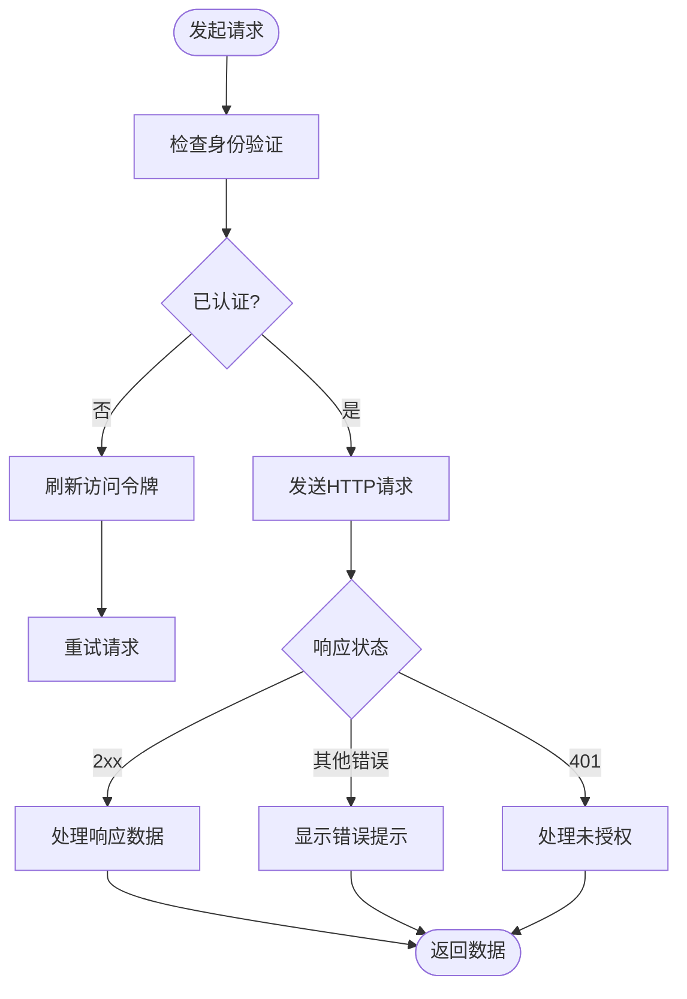

# 前端架构

<cite>
**本文档中引用的文件**  
- [next.config.js](file://web/next.config.js)
- [tailwind.config.js](file://web/tailwind.config.js)
- [tailwind-common-config.ts](file://web/tailwind-common-config.ts)
- [layout.tsx](file://web/app/layout.tsx)
- [i18n.ts](file://web/context/i18n.ts)
- [index.ts](file://web/i18n-config/index.ts)
- [language.ts](file://web/i18n-config/language.ts)
- [base.ts](file://web/service/base.ts)
- [fetch.ts](file://web/service/fetch.ts)
</cite>

## 目录
1. [项目结构](#项目结构)
2. [核心组件](#核心组件)
3. [架构概述](#架构概述)
4. [详细组件分析](#详细组件分析)
5. [依赖分析](#依赖分析)
6. [性能考虑](#性能考虑)
7. [故障排除指南](#故障排除指南)
8. [结论](#结论)

## 项目结构

Dify前端项目基于Next.js构建，采用现代化的前端技术栈。项目根目录下的`web`文件夹包含所有前端代码，遵循Next.js的约定式路由结构。主要目录包括：

- `app`：基于Next.js App Router的页面和布局组件
- `components`：可复用的UI组件库
- `context`：React Context提供者和钩子
- `hooks`：自定义React钩子
- `i18n`：多语言资源文件，按语言区域划分
- `i18n-config`：国际化配置和工具
- `service`：API客户端和服务层
- `styles`：全局样式和SCSS文件
- `themes`：主题相关的CSS变量定义
- `utils`：通用工具函数



**Diagram sources**
- [next.config.js](file://web/next.config.js#L1-L140)
- [tailwind.config.js](file://web/tailwind.config.js#L1-L12)

**Section sources**
- [next.config.js](file://web/next.config.js#L1-L140)
- [tailwind.config.js](file://web/tailwind.config.js#L1-L12)

## 核心组件

Dify前端架构的核心组件包括基于Next.js的路由系统、Tailwind CSS样式系统、React Context状态管理、i18next国际化框架和自定义API客户端。这些组件共同构成了现代化的前端开发体验，提供了高效的开发流程和优秀的用户体验。

**Section sources**
- [next.config.js](file://web/next.config.js#L1-L140)
- [tailwind.config.js](file://web/tailwind.config.js#L1-L12)
- [layout.tsx](file://web/app/layout.tsx#L1-L97)

## 架构概述

Dify前端采用分层架构设计，从上到下分为表现层、状态管理层、服务层和基础设施层。表现层由Next.js页面和组件构成，状态管理层使用React Context和Tanstack Query管理全局状态和数据缓存，服务层封装了与后端API的交互逻辑，基础设施层提供了国际化、主题切换等基础功能。



**Diagram sources**
- [layout.tsx](file://web/app/layout.tsx#L1-L97)
- [context](file://web/context#L1-L48)

## 详细组件分析

### 组件体系设计原则

Dify的组件体系遵循原子设计原则，将UI组件分为原子、分子、有机体和模板四个层次。原子组件是最基本的UI元素，如按钮、输入框；分子组件由多个原子组件组合而成，如搜索框；有机体组件由多个分子组件构成，如导航栏；模板组件定义页面的整体布局结构。

#### 样式系统（Tailwind CSS）



**Diagram sources**
- [tailwind.config.js](file://web/tailwind.config.js#L1-L12)
- [tailwind-common-config.ts](file://web/tailwind-common-config.ts#L1-L142)

### 国际化支持实现

Dify的国际化支持基于i18next框架实现，通过React Context提供语言切换功能。系统支持多种语言，包括简体中文、繁体中文、英语、日语等，并提供了完整的多语言资源文件管理机制。



**Diagram sources**
- [i18n.ts](file://web/context/i18n.ts#L1-L48)
- [index.ts](file://web/i18n-config/index.ts#L1-L29)
- [language.ts](file://web/i18n-config/language.ts#L1-L122)

### API客户端实现

Dify的API客户端封装了与后端服务的数据交互逻辑，提供了统一的请求接口和错误处理机制。客户端支持普通请求、流式请求（SSE）和文件上传等多种通信模式，并集成了身份验证、错误提示和自动重试功能。



**Diagram sources**
- [base.ts](file://web/service/base.ts#L1-L606)
- [fetch.ts](file://web/service/fetch.ts#L1-L208)

## 依赖分析

Dify前端项目依赖于多个现代前端库和框架，形成了完整的开发技术栈。核心依赖包括Next.js作为应用框架，Tailwind CSS作为样式系统，React Context作为状态管理方案，i18next作为国际化解决方案，以及Tanstack Query作为数据获取和缓存工具。

```mermaid
dependency-graph
Next.js --> React
Next.js --> TailwindCSS
Next.js --> ReactContext
Next.js --> TanstackQuery
i18next --> React
TanstackQuery --> React
ReactContext --> React
```

**Diagram sources**
- [package.json](file://web/package.json)
- [next.config.js](file://web/next.config.js#L1-L140)

## 性能考虑

Dify前端在性能优化方面采取了多项措施。通过Next.js的PWA插件实现离线访问和资源缓存，配置了不同类型资源的缓存策略。使用代码分割和懒加载减少初始加载时间，通过静态资源预加载提升页面加载速度。同时，利用Tailwind CSS的JIT模式减少CSS文件体积，提高渲染性能。

## 故障排除指南

当遇到前端问题时，可以按照以下步骤进行排查：首先检查网络请求是否正常，查看浏览器开发者工具中的网络面板；其次确认身份验证状态，检查localStorage中的令牌是否有效；然后查看控制台是否有JavaScript错误；最后检查环境变量配置是否正确。对于国际化相关问题，需要确认语言资源文件是否完整，以及语言切换逻辑是否正确执行。

**Section sources**
- [base.ts](file://web/service/base.ts#L1-L606)
- [fetch.ts](file://web/service/fetch.ts#L1-L208)

## 结论

Dify前端架构基于Next.js构建，采用了现代化的前端技术栈，提供了良好的开发体验和用户体验。通过合理的组件体系设计、完善的状态管理机制、强大的国际化支持和高效的API客户端，实现了功能丰富且性能优良的前端应用。未来可以进一步优化代码分割策略，提升首屏加载速度，并加强可访问性支持，使应用更加友好和包容。