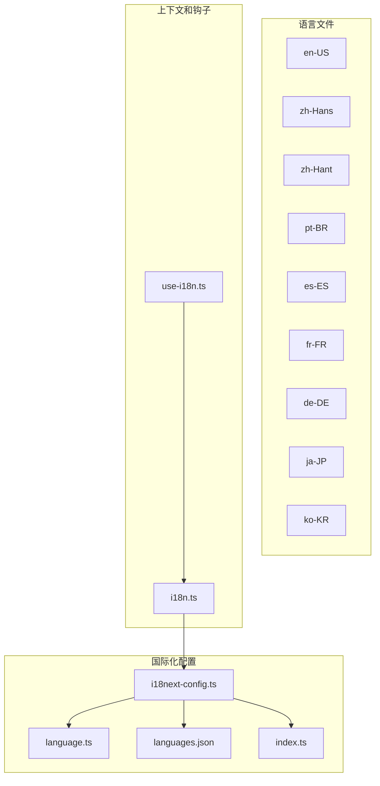
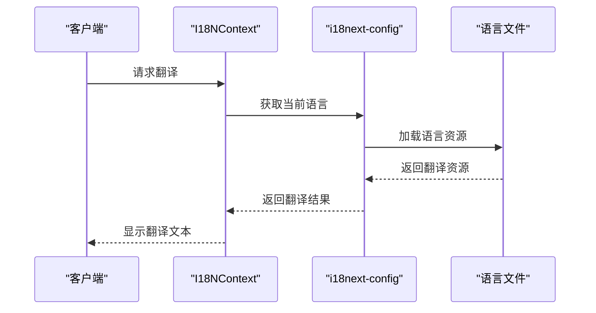
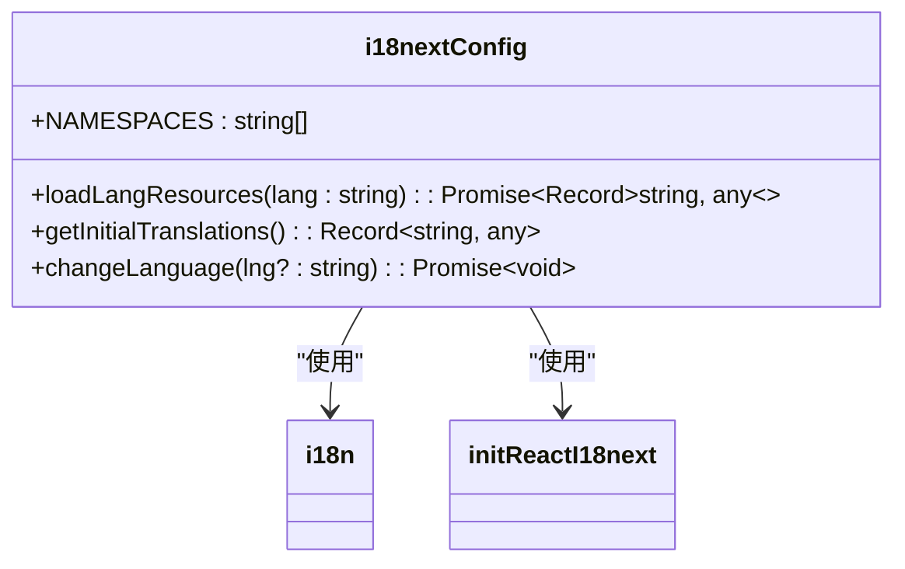
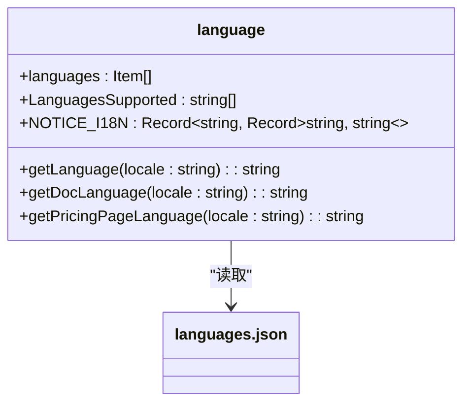
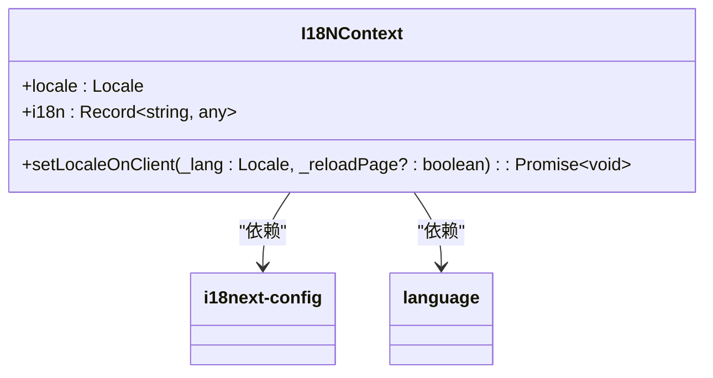
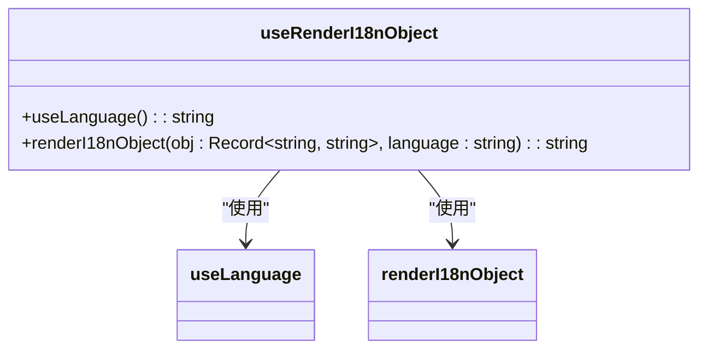
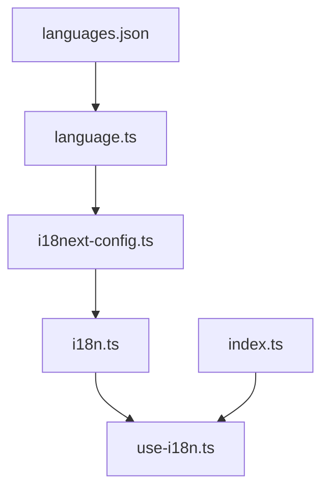

# 国际化支持

<cite>
**本文档中引用的文件**
- [i18next-config.ts](file://web/i18n-config/i18next-config.ts)
- [language.ts](file://web/i18n-config/language.ts)
- [languages.json](file://web/i18n-config/languages.json)
- [i18n.ts](file://web/context/i18n.ts)
- [use-i18n.ts](file://web/hooks/use-i18n.ts)
- [index.ts](file://web/i18n-config/index.ts)
</cite>

## 目录
1. [简介](#简介)
2. [项目结构](#项目结构)
3. [核心组件](#核心组件)
4. [架构概述](#架构概述)
5. [详细组件分析](#详细组件分析)
6. [依赖分析](#依赖分析)
7. [性能考虑](#性能考虑)
8. [故障排除指南](#故障排除指南)
9. [结论](#结论)
10. [附录](#附录)（如有必要）

## 简介
Dify 前端采用 i18next 作为国际化框架，实现了完整的多语言支持。该系统支持多种语言，包括英语、简体中文、繁体中文、葡萄牙语、西班牙语、法语、德语、日语、韩语等。国际化实现方案包括语言文件的组织结构、动态加载策略和语言切换机制。系统还支持文本翻译、日期时间格式化、数字格式化等本地化功能。通过配置管理，可以方便地更新语言包和添加新语言。

## 项目结构
Dify 前端的国际化相关文件主要位于 `web/i18n` 和 `web/i18n-config` 目录下。`web/i18n` 目录包含各个语言的翻译文件，每个语言对应一个子目录，如 `en-US`、`zh-Hans` 等。每个子目录包含多个命名空间的翻译文件，如 `app.ts`、`common.ts` 等。`web/i18n-config` 目录包含国际化配置文件，如 `i18next-config.ts`、`language.ts` 等。

**Diagram sources**
- [i18next-config.ts](file://web/i18n-config/i18next-config.ts)
- [language.ts](file://web/i18n-config/language.ts)
- [languages.json](file://web/i18n-config/languages.json)
- [index.ts](file://web/i18n-config/index.ts)
- [i18n.ts](file://web/context/i18n.ts)
- [use-i18n.ts](file://web/hooks/use-i18n.ts)

**Section sources**
- [i18next-config.ts](file://web/i18n-config/i18next-config.ts)
- [language.ts](file://web/i18n-config/language.ts)
- [languages.json](file://web/i18n-config/languages.json)
- [index.ts](file://web/i18n-config/index.ts)
- [i18n.ts](file://web/context/i18n.ts)
- [use-i18n.ts](file://web/hooks/use-i18n.ts)

## 核心组件
Dify 前端的国际化核心组件包括 `i18next-config.ts`、`language.ts`、`languages.json`、`i18n.ts` 和 `use-i18n.ts`。这些组件共同实现了多语言支持的功能。

**Section sources**
- [i18next-config.ts](file://web/i18n-config/i18next-config.ts)
- [language.ts](file://web/i18n-config/language.ts)
- [languages.json](file://web/i18n-config/languages.json)
- [i18n.ts](file://web/context/i18n.ts)
- [use-i18n.ts](file://web/hooks/use-i18n.ts)

## 架构概述
Dify 前端的国际化架构基于 i18next 框架，通过动态加载语言文件和按需加载策略，实现了高效的多语言支持。系统在初始化时加载默认语言（英语和简体中文）的资源，其他语言在需要时动态加载。

**Diagram sources**
- [i18next-config.ts](file://web/i18n-config/i18next-config.ts)
- [i18n.ts](file://web/context/i18n.ts)

## 详细组件分析
### i18next-config.ts 分析
`i18next-config.ts` 文件是国际化配置的核心，负责初始化 i18next 实例和管理语言资源的加载。

**Diagram sources**
- [i18next-config.ts](file://web/i18n-config/i18next-config.ts)

### language.ts 分析
`language.ts` 文件定义了支持的语言列表和相关工具函数。

**Diagram sources**
- [language.ts](file://web/i18n-config/language.ts)
- [languages.json](file://web/i18n-config/languages.json)

### i18n.ts 分析
`i18n.ts` 文件定义了国际化上下文，用于在组件树中传递当前语言和翻译函数。

**Diagram sources**
- [i18n.ts](file://web/context/i18n.ts)
- [i18next-config.ts](file://web/i18n-config/i18next-config.ts)
- [language.ts](file://web/i18n-config/language.ts)

### use-i18n.ts 分析
`use-i18n.ts` 文件提供了自定义钩子，用于在组件中获取翻译函数。

**Diagram sources**
- [use-i18n.ts](file://web/hooks/use-i18n.ts)
- [index.ts](file://web/i18n-config/index.ts)

**Section sources**
- [i18next-config.ts](file://web/i18n-config/i18next-config.ts)
- [language.ts](file://web/i18n-config/language.ts)
- [languages.json](file://web/i18n-config/languages.json)
- [i18n.ts](file://web/context/i18n.ts)
- [use-i18n.ts](file://web/hooks/use-i18n.ts)

## 依赖分析
Dify 前端的国际化组件之间存在明确的依赖关系。`i18next-config.ts` 依赖于 `languages.json` 和 `language.ts`，`i18n.ts` 依赖于 `i18next-config.ts` 和 `language.ts`，`use-i18n.ts` 依赖于 `index.ts`。

**Diagram sources**
- [languages.json](file://web/i18n-config/languages.json)
- [language.ts](file://web/i18n-config/language.ts)
- [i18next-config.ts](file://web/i18n-config/i18next-config.ts)
- [i18n.ts](file://web/context/i18n.ts)
- [use-i18n.ts](file://web/hooks/use-i18n.ts)
- [index.ts](file://web/i18n-config/index.ts)

**Section sources**
- [languages.json](file://web/i18n-config/languages.json)
- [language.ts](file://web/i18n-config/language.ts)
- [i18next-config.ts](file://web/i18n-config/i18next-config.ts)
- [i18n.ts](file://web/context/i18n.ts)
- [use-i18n.ts](file://web/hooks/use-i18n.ts)
- [index.ts](file://web/i18n-config/index.ts)

## 性能考虑
Dify 前端的国际化实现考虑了性能优化。系统在初始化时只加载默认语言的资源，其他语言在需要时动态加载，避免了加载所有语言资源导致的性能问题。

## 故障排除指南
如果遇到国际化相关的问题，可以检查以下几点：
- 确认语言文件是否存在且格式正确
- 确认 `languages.json` 中的语言配置是否正确
- 确认 `i18next-config.ts` 中的命名空间配置是否正确
- 确认 `i18n.ts` 中的上下文传递是否正确

**Section sources**
- [i18next-config.ts](file://web/i18n-config/i18next-config.ts)
- [language.ts](file://web/i18n-config/language.ts)
- [languages.json](file://web/i18n-config/languages.json)
- [i18n.ts](file://web/context/i18n.ts)

## 结论
Dify 前端的国际化支持通过 i18next 框架实现了完整的多语言功能。系统采用动态加载策略，提高了性能。通过合理的文件组织和依赖管理，确保了代码的可维护性。

## 附录
### 翻译键命名规范
- 使用小写字母和连字符分隔单词
- 避免使用特殊字符
- 保持键名简洁明了

### 占位符使用
- 使用 `{{variable}}` 语法
- 在翻译文件中定义占位符
- 在代码中传递实际值

### 复数形式处理
- 使用 i18next 的复数功能
- 在翻译文件中定义单数和复数形式
- 根据数量自动选择正确的形式

### RTL（从右到左）语言支持
- 使用 CSS 的 `direction` 属性
- 在 RTL 语言中设置 `direction: rtl`
- 确保布局在 RTL 语言中正确显示