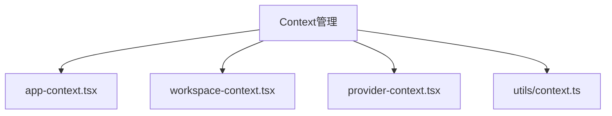
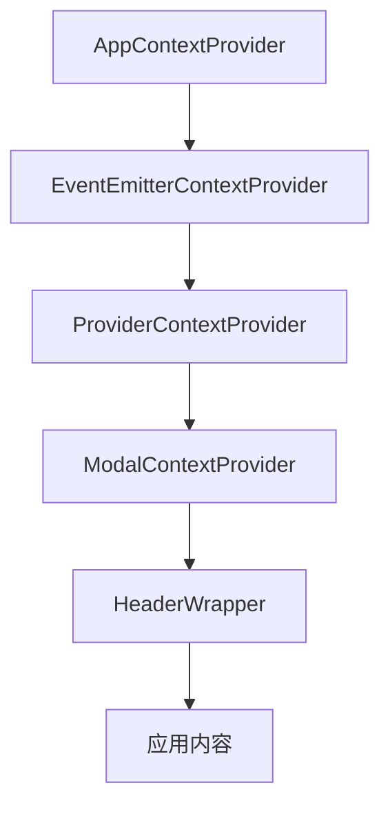
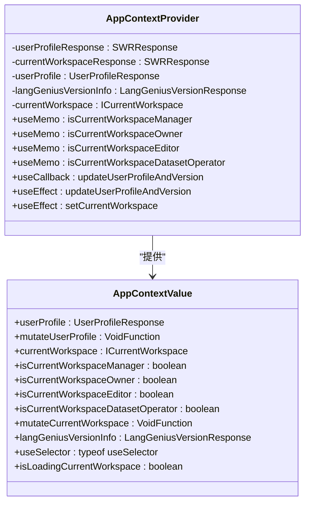
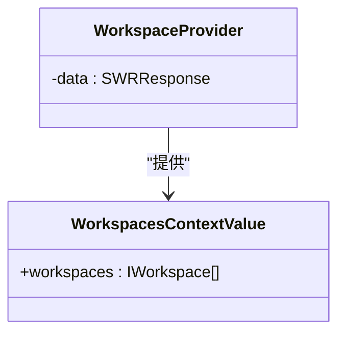
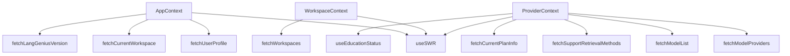

# Context实现

<cite>
**本文档中引用的文件**
- [app-context.tsx](file://web/context/app-context.tsx)
- [workspace-context.tsx](file://web/context/workspace-context.tsx)
- [provider-context.tsx](file://web/context/provider-context.tsx)
- [layout.tsx](file://web/app/account/(commonLayout)/layout.tsx)
</cite>

## 目录
1. [引言](#引言)
2. [项目结构](#项目结构)
3. [核心组件](#核心组件)
4. [架构概述](#架构概述)
5. [详细组件分析](#详细组件分析)
6. [依赖分析](#依赖分析)
7. [性能考虑](#性能考虑)
8. [故障排除指南](#故障排除指南)
9. [结论](#结论)

## 引言
Dify前端采用React Context机制实现全局状态管理，通过AppContext、WorkspaceContext和ProviderContext三个核心上下文对象，有效解决了组件间状态共享和props层层传递的问题。本文深入解析这三个Context的设计原理和具体实现。

## 项目结构
Dify前端的状态管理相关代码主要位于`web/context`目录下，包含多个Context实现文件。这些Context通过Provider组件进行嵌套封装，为整个应用提供统一的状态管理机制。



**Diagram sources**
- [app-context.tsx](file://web/context/app-context.tsx)
- [workspace-context.tsx](file://web/context/workspace-context.tsx)
- [provider-context.tsx](file://web/context/provider-context.tsx)

**Section sources**
- [app-context.tsx](file://web/context/app-context.tsx)
- [workspace-context.tsx](file://web/context/workspace-context.tsx)
- [provider-context.tsx](file://web/context/provider-context.tsx)

## 核心组件
Dify前端的状态管理核心由三个Context构成：AppContext负责管理用户个人资料和当前工作区信息，WorkspaceContext管理所有工作区列表，ProviderContext则负责模型提供商和系统配额等关键数据的管理。

**Section sources**
- [app-context.tsx](file://web/context/app-context.tsx#L1-L144)
- [workspace-context.tsx](file://web/context/workspace-context.tsx#L1-L36)
- [provider-context.tsx](file://web/context/provider-context.tsx#L1-L249)

## 架构概述
Dify前端采用多层Context嵌套的架构模式，通过在应用根组件中按特定顺序嵌套Provider组件，实现了状态管理的分层和解耦。



**Diagram sources**
- [layout.tsx](file://web/app/account/(commonLayout)/layout.tsx#L1-L34)

## 详细组件分析

### AppContext分析
AppContext是Dify前端最核心的状态管理Context，负责管理用户个人资料、当前工作区信息和系统版本等全局状态。



**Diagram sources**
- [app-context.tsx](file://web/context/app-context.tsx#L1-L144)

**Section sources**
- [app-context.tsx](file://web/context/app-context.tsx#L1-L144)

### WorkspaceContext分析
WorkspaceContext专门用于管理用户所属的所有工作区列表，为工作区切换等功能提供数据支持。



**Diagram sources**
- [workspace-context.tsx](file://web/context/workspace-context.tsx#L1-L36)

**Section sources**
- [workspace-context.tsx](file://web/context/workspace-context.tsx#L1-L36)

### ProviderContext分析
ProviderContext负责管理模型提供商配置、系统配额和计费信息等关键数据，是Dify模型管理功能的核心。

```mermaid
classDiagram
class ProviderContextState {
+modelProviders : ModelProvider[]
+refreshModelProviders : () => void
+textGenerationModelList : Model[]
+supportRetrievalMethods : RETRIEVE_METHOD[]
+isAPIKeySet : boolean
+plan : {type : BasicPlan, usage : UsagePlanInfo, total : UsagePlanInfo}
+isFetchedPlan : boolean
+enableBilling : boolean
+onPlanInfoChanged : () => void
+enableReplaceWebAppLogo : boolean
+modelLoadBalancingEnabled : boolean
+datasetOperatorEnabled : boolean
+enableEducationPlan : boolean
+isEducationWorkspace : boolean
+isEducationAccount : boolean
+allowRefreshEducationVerify : boolean
+educationAccountExpireAt : number | null
+isLoadingEducationAccountInfo : boolean
+isFetchingEducationAccountInfo : boolean
+webappCopyrightEnabled : boolean
+licenseLimit : {workspace_members : {size : number, limit : number}}
+refreshLicenseLimit : () => void
+isAllowTransferWorkspace : boolean
}
class ProviderContextProvider {
-providersData : SWRResponse
-textGenerationModelList : SWRResponse
-supportRetrievalMethods : SWRResponse
-plan : defaultPlan
-isFetchedPlan : boolean
-enableBilling : boolean
-enableReplaceWebAppLogo : boolean
-modelLoadBalancingEnabled : boolean
-datasetOperatorEnabled : boolean
-webappCopyrightEnabled : boolean
-licenseLimit : {workspace_members : {size : number, limit : number}}
-enableEducationPlan : boolean
-isEducationWorkspace : boolean
-educationAccountInfo : SWRResponse
-isAllowTransferWorkspace : boolean
+useEffect : fetchPlan
+useEffect : anthropic quota notice
}
ProviderContextProvider --> ProviderContextState : "提供"
```

**Diagram sources**
- [provider-context.tsx](file://web/context/provider-context.tsx#L1-L249)

**Section sources**
- [provider-context.tsx](file://web/context/provider-context.tsx#L1-L249)

## 依赖分析
Dify前端的Context实现依赖于多个第三方库和内部服务，形成了完整的状态管理生态系统。



**Diagram sources**
- [app-context.tsx](file://web/context/app-context.tsx#L1-L144)
- [workspace-context.tsx](file://web/context/workspace-context.tsx#L1-L36)
- [provider-context.tsx](file://web/context/provider-context.tsx#L1-L249)

**Section sources**
- [app-context.tsx](file://web/context/app-context.tsx#L1-L144)
- [workspace-context.tsx](file://web/context/workspace-context.tsx#L1-L36)
- [provider-context.tsx](file://web/context/provider-context.tsx#L1-L249)

## 性能考虑
Dify前端的Context实现采用了多项性能优化策略，包括使用use-context-selector库进行状态选择器优化，避免不必要的组件重新渲染；通过SWR库实现数据的缓存和自动刷新，减少网络请求次数；以及合理设置Context的粒度，避免单一Context过大导致的性能问题。

## 故障排除指南
当遇到Context相关问题时，可按照以下步骤进行排查：首先检查Provider组件是否正确嵌套，确保Context能够在组件树中正确传递；其次验证状态初始化值是否合理，避免出现undefined或null导致的运行时错误；然后检查useSelector的使用是否正确，确保选择器函数不会产生不必要的重新渲染；最后确认网络请求是否正常，特别是依赖SWR获取数据的Context。

**Section sources**
- [app-context.tsx](file://web/context/app-context.tsx#L1-L144)
- [workspace-context.tsx](file://web/context/workspace-context.tsx#L1-L36)
- [provider-context.tsx](file://web/context/provider-context.tsx#L1-L249)

## 结论
Dify前端通过精心设计的Context架构，实现了高效、可维护的状态管理。AppContext、WorkspaceContext和ProviderContext三个核心Context各司其职，通过合理的嵌套和依赖关系，为整个应用提供了稳定的状态管理基础。这种设计不仅解决了props层层传递的问题，还提高了代码的可测试性和可维护性，是React应用状态管理的优秀实践案例。