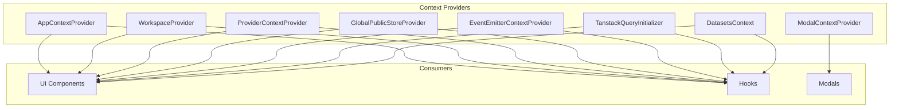
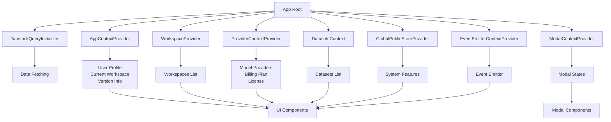
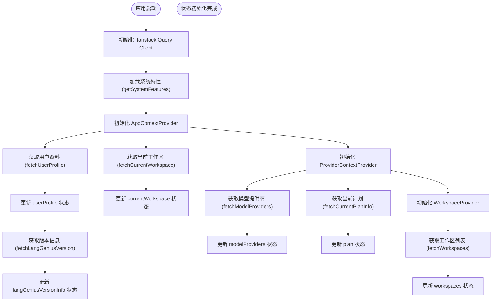
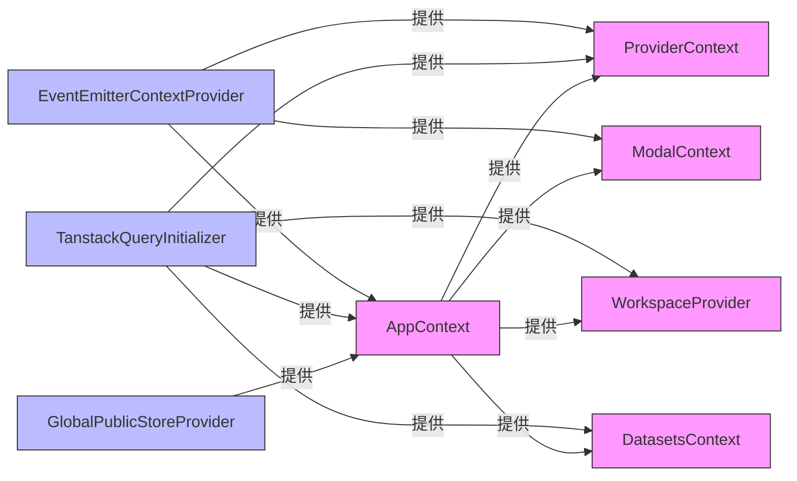

# 全局状态管理

<cite>
**本文档中引用的文件**  
- [app-context.tsx](file://web/context/app-context.tsx)
- [workspace-context.tsx](file://web/context/workspace-context.tsx)
- [provider-context.tsx](file://web/context/provider-context.tsx)
- [global-public-context.tsx](file://web/context/global-public-context.tsx)
- [i18n.ts](file://web/context/i18n.ts)
- [modal-context.tsx](file://web/context/modal-context.tsx)
- [event-emitter.tsx](file://web/context/event-emitter.tsx)
- [query-client.tsx](file://web/context/query-client.tsx)
- [datasets-context.tsx](file://web/context/datasets-context.tsx)
</cite>

## 目录
1. [简介](#简介)
2. [项目结构](#项目结构)
3. [核心组件](#核心组件)
4. [架构概述](#架构概述)
5. [详细组件分析](#详细组件分析)
6. [依赖分析](#依赖分析)
7. [性能考虑](#性能考虑)
8. [故障排除指南](#故障排除指南)
9. [结论](#结论)

## 简介
Dify 前端采用基于 React Context 的全局状态管理方案，通过多个专用 Context 实现不同维度的状态隔离与共享。该方案以 `use-context-selector` 为核心库，结合 SWR 数据获取、Zustand 轻量状态及事件发射器模式，构建了一个高效、可维护的前端状态管理体系。本文档详细阐述 AppContext、WorkspaceContext、ProviderContext 等核心 Context 的实现原理、职责划分、数据流控制及使用模式。

## 项目结构
Dify 前端的全局状态管理逻辑集中于 `web/context` 目录下，每个 Context 文件负责特定领域的状态管理，实现了关注点分离。



**Diagram sources**
- [app-context.tsx](file://web/context/app-context.tsx#L1-L144)
- [workspace-context.tsx](file://web/context/workspace-context.tsx#L1-L36)
- [provider-context.tsx](file://web/context/provider-context.tsx#L1-L249)
- [global-public-context.tsx](file://web/context/global-public-context.tsx#L1-L46)
- [modal-context.tsx](file://web/context/modal-context.tsx#L1-L397)
- [event-emitter.tsx](file://web/context/event-emitter.tsx#L1-L28)
- [query-client.tsx](file://web/context/query-client.tsx#L1-L23)
- [datasets-context.tsx](file://web/context/datasets-context.tsx#L1-L21)

**Section sources**
- [app-context.tsx](file://web/context/app-context.tsx#L1-L144)
- [workspace-context.tsx](file://web/context/workspace-context.tsx#L1-L36)
- [provider-context.tsx](file://web/context/provider-context.tsx#L1-L249)
- [global-public-context.tsx](file://web/context/global-public-context.tsx#L1-L46)
- [modal-context.tsx](file://web/context/modal-context.tsx#L1-L397)
- [event-emitter.tsx](file://web/context/event-emitter.tsx#L1-L28)
- [query-client.tsx](file://web/context/query-client.tsx#L1-L23)
- [datasets-context.tsx](file://web/context/datasets-context.tsx#L1-L21)

## 核心组件
Dify 前端的全局状态管理由多个核心 Context 组成，每个 Context 承担特定的职责。`AppContext` 管理用户和工作区的核心信息，`WorkspaceContext` 提供工作区列表，`ProviderContext` 管理模型提供商和计费计划，`GlobalPublicStoreProvider` 处理系统级公共配置，`ModalContext` 统一管理模态框的显示与交互，`EventEmitterContext` 实现跨组件通信，`TanstackQueryInitializer` 提供数据获取能力，`DatasetsContext` 管理数据集状态。

**Section sources**
- [app-context.tsx](file://web/context/app-context.tsx#L1-L144)
- [workspace-context.tsx](file://web/context/workspace-context.tsx#L1-L36)
- [provider-context.tsx](file://web/context/provider-context.tsx#L1-L249)
- [global-public-context.tsx](file://web/context/global-public-context.tsx#L1-L46)
- [modal-context.tsx](file://web/context/modal-context.tsx#L1-L397)
- [event-emitter.tsx](file://web/context/event-emitter.tsx#L1-L28)
- [query-client.tsx](file://web/context/query-client.tsx#L1-L23)
- [datasets-context.tsx](file://web/context/datasets-context.tsx#L1-L21)

## 架构概述
Dify 的全局状态管理架构采用分层和模块化设计，通过多个 Context 提供不同粒度的状态访问。



**Diagram sources**
- [app-context.tsx](file://web/context/app-context.tsx#L1-L144)
- [workspace-context.tsx](file://web/context/workspace-context.tsx#L1-L36)
- [provider-context.tsx](file://web/context/provider-context.tsx#L1-L249)
- [global-public-context.tsx](file://web/context/global-public-context.tsx#L1-L46)
- [modal-context.tsx](file://web/context/modal-context.tsx#L1-L397)
- [event-emitter.tsx](file://web/context/event-emitter.tsx#L1-L28)
- [query-client.tsx](file://web/context/query-client.tsx#L1-L23)
- [datasets-context.tsx](file://web/context/datasets-context.tsx#L1-L21)

## 详细组件分析
本节深入分析 Dify 前端各个全局状态管理组件的实现细节。

### AppContext 分析
`AppContext` 是 Dify 前端最核心的上下文之一，负责管理当前用户和工作区的全局状态。

#### AppContext 类图
```mermaid
classDiagram
class AppContextValue {
+userProfile : UserProfileResponse
+mutateUserProfile : VoidFunction
+currentWorkspace : ICurrentWorkspace
+isCurrentWorkspaceManager : boolean
+isCurrentWorkspaceOwner : boolean
+isCurrentWorkspaceEditor : boolean
+isCurrentWorkspaceDatasetOperator : boolean
+mutateCurrentWorkspace : VoidFunction
+langGeniusVersionInfo : LangGeniusVersionResponse
+useSelector : typeof useSelector
+isLoadingCurrentWorkspace : boolean
}
class AppContextProvider {
-userProfileResponse : SWRResponse
-currentWorkspaceResponse : SWRResponse
-userProfile : UserProfileResponse
-langGeniusVersionInfo : LangGeniusVersionResponse
-currentWorkspace : ICurrentWorkspace
-isCurrentWorkspaceManager : boolean
-isCurrentWorkspaceOwner : boolean
-isCurrentWorkspaceEditor : boolean
-isCurrentWorkspaceDatasetOperator : boolean
-updateUserProfileAndVersion() : void
-mutateUserProfile() : void
-mutateCurrentWorkspace() : void
}
AppContextProvider --> AppContextValue : "provides"
AppContextProvider --> "SWR" : "uses"
AppContextProvider --> "useContextSelector" : "uses"
```

**Diagram sources**
- [app-context.tsx](file://web/context/app-context.tsx#L1-L144)

**Section sources**
- [app-context.tsx](file://web/context/app-context.tsx#L1-L144)

### ProviderContext 分析
`ProviderContext` 负责管理模型提供商、计费计划和系统功能等全局配置状态。

#### ProviderContext 类图
```mermaid
classDiagram
class ProviderContextState {
+modelProviders : ModelProvider[]
+refreshModelProviders : () => void
+textGenerationModelList : Model[]
+supportRetrievalMethods : RETRIEVE_METHOD[]
+isAPIKeySet : boolean
+plan : { type : BasicPlan, usage : UsagePlanInfo, total : UsagePlanInfo }
+isFetchedPlan : boolean
+enableBilling : boolean
+onPlanInfoChanged : () => void
+enableReplaceWebAppLogo : boolean
+modelLoadBalancingEnabled : boolean
+datasetOperatorEnabled : boolean
+enableEducationPlan : boolean
+isEducationWorkspace : boolean
+isEducationAccount : boolean
+allowRefreshEducationVerify : boolean
+educationAccountExpireAt : number | null
+isLoadingEducationAccountInfo : boolean
+isFetchingEducationAccountInfo : boolean
+webappCopyrightEnabled : boolean
+licenseLimit : { workspace_members : { size : number, limit : number } }
+refreshLicenseLimit : () => void
+isAllowTransferWorkspace : boolean
}
class ProviderContextProvider {
-providersData : SWRResponse
-textGenerationModelList : SWRResponse
-supportRetrievalMethods : SWRResponse
-plan : State
-isFetchedPlan : State
-enableBilling : State
-enableReplaceWebAppLogo : State
-modelLoadBalancingEnabled : State
-datasetOperatorEnabled : State
-webappCopyrightEnabled : State
-licenseLimit : State
-enableEducationPlan : State
-isEducationWorkspace : State
-educationAccountInfo : SWRResponse
-isAllowTransferWorkspace : State
-fetchPlan() : void
}
ProviderContextProvider --> ProviderContextState : "provides"
ProviderContextProvider --> "SWR" : "uses"
ProviderContextProvider --> "useContextSelector" : "uses"
```

**Diagram sources**
- [provider-context.tsx](file://web/context/provider-context.tsx#L1-L249)

**Section sources**
- [provider-context.tsx](file://web/context/provider-context.tsx#L1-L249)

### 全局状态初始化流程
Dify 前端的全局状态初始化遵循一个清晰的流程，确保应用启动时关键数据已就绪。



**Diagram sources**
- [app-context.tsx](file://web/context/app-context.tsx#L1-L144)
- [provider-context.tsx](file://web/context/provider-context.tsx#L1-L249)
- [workspace-context.tsx](file://web/context/workspace-context.tsx#L1-L36)

### Context 依赖关系与数据流
Dify 的 Context 之间存在明确的依赖关系，数据流清晰可控。



**Diagram sources**
- [app-context.tsx](file://web/context/app-context.tsx#L1-L144)
- [provider-context.tsx](file://web/context/provider-context.tsx#L1-L249)
- [workspace-context.tsx](file://web/context/workspace-context.tsx#L1-L36)
- [modal-context.tsx](file://web/context/modal-context.tsx#L1-L397)
- [datasets-context.tsx](file://web/context/datasets-context.tsx#L1-L21)
- [global-public-context.tsx](file://web/context/global-public-context.tsx#L1-L46)
- [query-client.tsx](file://web/context/query-client.tsx#L1-L23)
- [event-emitter.tsx](file://web/context/event-emitter.tsx#L1-L28)

## 依赖分析
Dify 前端全局状态管理依赖于多个第三方库和内部服务，形成了一个稳定的技术栈。

```mermaid
graph TD
A[use-context-selector] --> B[React Context]
C[SWR] --> D[数据获取]
E[Zustand] --> F[轻量状态管理]
G[ahooks] --> H[useEventEmitter]
I[@tanstack/react-query] --> J[数据同步与缓存]
K[Lodash] --> L[工具函数]
B --> M[AppContext]
B --> N[ProviderContext]
B --> O[ModalContext]
B --> P[EventEmitterContext]
D --> M
D --> N
D --> O
F --> Q[GlobalPublicStore]
H --> P
J --> R[TanstackQueryInitializer]
L --> M & N & O
style A fill:#f96,stroke:#333
style C fill:#f96,stroke:#333
style E fill:#f96,stroke:#333
style G fill:#f96,stroke:#333
style I fill:#f96,stroke:#333
style K fill:#f96,stroke:#333
```

**Diagram sources**
- [app-context.tsx](file://web/context/app-context.tsx#L1-L144)
- [provider-context.tsx](file://web/context/provider-context.tsx#L1-L249)
- [modal-context.tsx](file://web/context/modal-context.tsx#L1-L397)
- [event-emitter.tsx](file://web/context/event-emitter.tsx#L1-L28)
- [query-client.tsx](file://web/context/query-client.tsx#L1-L23)
- [global-public-context.tsx](file://web/context/global-public-context.tsx#L1-L46)

**Section sources**
- [app-context.tsx](file://web/context/app-context.tsx#L1-L144)
- [provider-context.tsx](file://web/context/provider-context.tsx#L1-L249)
- [modal-context.tsx](file://web/context/modal-context.tsx#L1-L397)
- [event-emitter.tsx](file://web/context/event-emitter.tsx#L1-L28)
- [query-client.tsx](file://web/context/query-client.tsx#L1-L23)
- [global-public-context.tsx](file://web/context/global-public-context.tsx#L1-L46)

## 性能考虑
Dify 的全局状态管理方案在性能方面进行了多项优化，以确保应用的流畅性。

- **选择性订阅**: 通过 `useContextSelector` 实现细粒度的状态订阅，避免不必要的组件重渲染。
- **数据缓存**: 利用 SWR 和 @tanstack/react-query 的内置缓存机制，减少重复的网络请求。
- **懒加载**: 模态框组件通过 `next/dynamic` 实现动态导入，减少初始包体积。
- **状态隔离**: 不同 Context 管理独立的状态域，降低状态更新的传播范围。
- **防抖与节流**: 在状态更新和副作用处理中合理使用防抖和节流技术。

## 故障排除指南
本节提供 Dify 前端全局状态管理常见问题的排查方法。

**Section sources**
- [app-context.tsx](file://web/context/app-context.tsx#L1-L144)
- [provider-context.tsx](file://web/context/provider-context.tsx#L1-L249)
- [modal-context.tsx](file://web/context/modal-context.tsx#L1-L397)

## 结论
Dify 前端的全局状态管理方案通过精心设计的 Context 架构，成功实现了状态的模块化、可维护性和高性能。该方案结合了 React Context、SWR、Zustand 和 use-context-selector 等多种技术，既保证了状态管理的灵活性，又兼顾了性能优化。通过清晰的职责划分和数据流控制，Dify 构建了一个健壮且可扩展的前端状态管理体系，为复杂应用的开发提供了坚实的基础。