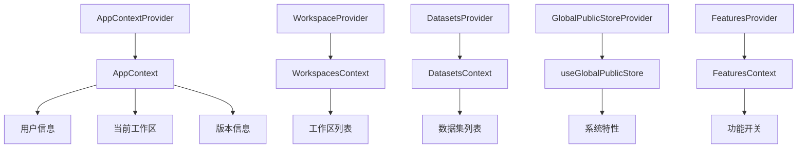
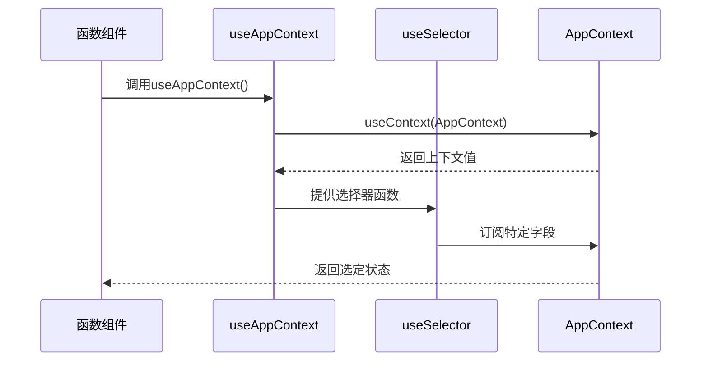
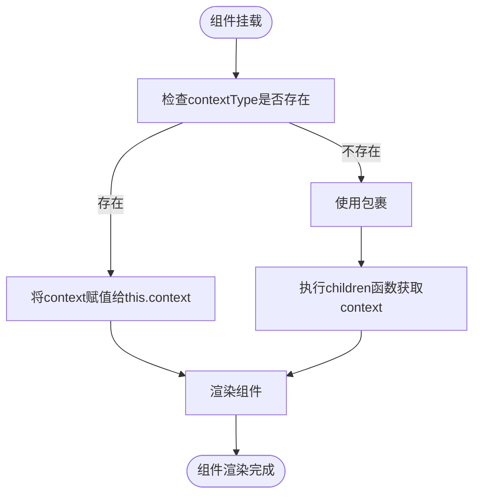
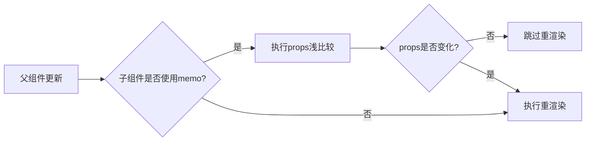
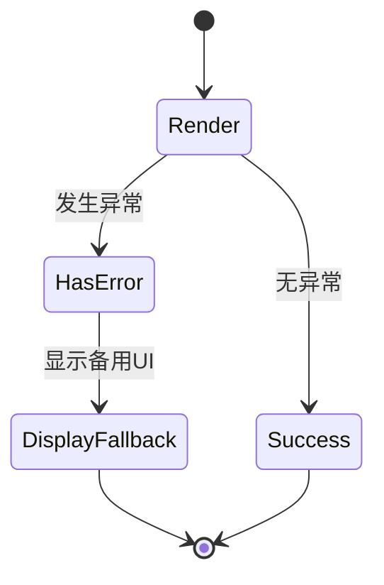
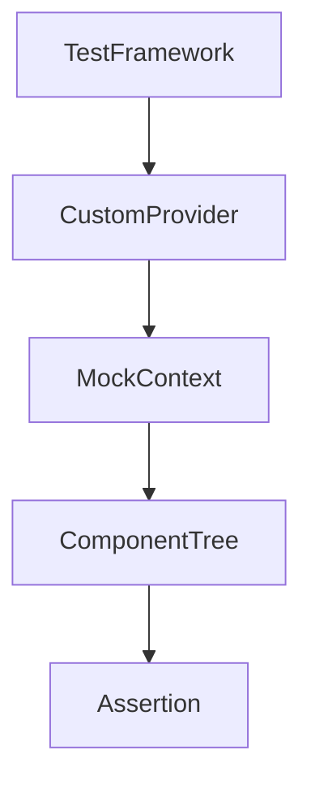

# 最佳实践

<cite>
**本文档中引用的文件**  
- [app-context.tsx](file://web/context/app-context.tsx)
- [workspace-context.tsx](file://web/context/workspace-context.tsx)
- [datasets-context.tsx](file://web/context/datasets-context.tsx)
- [global-public-context.tsx](file://web/context/global-public-context.tsx)
- [context.ts](file://web/utils/context.ts)
- [error-boundary.tsx](file://web/app/components/base/markdown/error-boundary.tsx)
</cite>

## 目录
1. [简介](#简介)
2. [全局状态管理架构](#全局状态管理架构)
3. [Context消费者组件实现范例](#context消费者组件实现范例)
4. [性能优化技巧](#性能优化技巧)
5. [错误边界设置与异常处理](#错误边界设置与异常处理)
6. [状态重置与清理机制](#状态重置与清理机制)
7. [测试策略](#测试策略)
8. [总结](#总结)

## 简介
Dify前端采用React Context结合use-context-selector库实现全局状态管理，通过自定义创建函数封装上下文逻辑，支持细粒度订阅和高效状态更新。系统在多个核心模块中实现了独立的Context，如应用上下文、工作区上下文、数据集上下文等，确保状态隔离与可维护性。

## 全局状态管理架构



**Diagram sources**
- [app-context.tsx](file://web/context/app-context.tsx#L1-L144)
- [workspace-context.tsx](file://web/context/workspace-context.tsx#L1-L36)
- [datasets-context.tsx](file://web/context/datasets-context.tsx#L1-L21)
- [global-public-context.tsx](file://web/context/global-public-context.tsx#L1-L46)

**Section sources**
- [app-context.tsx](file://web/context/app-context.tsx#L1-L144)
- [workspace-context.tsx](file://web/context/workspace-context.tsx#L1-L36)
- [datasets-context.tsx](file://web/context/datasets-context.tsx#L1-L21)

## Context消费者组件实现范例

### 函数组件使用方式
通过自定义Hook `useAppContext` 消费AppContext中的状态，结合useSelector实现细粒度订阅：



**Diagram sources**
- [app-context.tsx](file://web/context/app-context.tsx#L1-L144)

**Section sources**
- [app-context.tsx](file://web/context/app-context.tsx#L1-L144)

### 类组件使用方式
类组件可通过`static contextType`指定Context类型，或使用`Consumer`组件包裹：



**Diagram sources**
- [app-context.tsx](file://web/context/app-context.tsx#L1-L144)

**Section sources**
- [app-context.tsx](file://web/context/app-context.tsx#L1-L144)

## 性能优化技巧

### 使用React.memo避免不必要重渲染
对Context消费者组件使用React.memo进行浅比较，防止父组件更新导致的无效重渲染：



**Section sources**
- [web/app/components/workflow/nodes/iteration/panel.tsx](file://web/app/components/workflow/nodes/iteration/panel.tsx#L1-L123)
- [web/app/components/workflow/nodes/loop/panel.tsx](file://web/app/components/workflow/nodes/loop/panel.tsx#L1-L117)

### 利用useContextSelector实现细粒度订阅
通过`useSelector`函数订阅Context中的特定字段，避免订阅整个上下文对象：

```typescript
// 示例：仅订阅用户信息中的name字段
const userName = useSelector(state => state.userProfile.name)
```

该机制基于`use-context-selector`库实现，确保只有当所选字段变化时才触发组件更新。

**Section sources**
- [app-context.tsx](file://web/context/app-context.tsx#L1-L144)
- [utils/context.ts](file://web/utils/context.ts#L1-L45)

## 错误边界设置与异常处理

### 错误边界组件实现
Dify在复杂渲染组件周围使用ErrorBoundary捕获JavaScript错误，提供降级UI：



**Diagram sources**
- [error-boundary.tsx](file://web/app/components/base/markdown/error-boundary.tsx#L1-L32)

**Section sources**
- [error-boundary.tsx](file://web/app/components/base/markdown/error-boundary.tsx#L1-L32)

### 异常处理策略
- **ECharts渲染错误**：捕获运行时错误，显示"Wrong option"提示
- **SVG内容错误**：捕获解析异常，防止页面崩溃
- **控制台日志**：记录错误详情便于调试
- **用户提示**：显示友好错误信息并建议查看控制台

## 状态重置与清理机制

### 用户登出时的状态清理
当用户登出时，应重置所有全局状态：
- 清空用户信息（userProfile）
- 重置工作区信息（currentWorkspace）
- 清除系统特性缓存（systemFeatures）
- 重置版本信息（langGeniusVersionInfo）

### 切换工作区时的状态更新
切换工作区时触发以下操作：
- 更新currentWorkspace状态
- 重新获取该工作区下的数据集列表
- 根据新工作区角色更新权限状态
- 触发相关数据的重新获取（mutate函数）

**Section sources**
- [app-context.tsx](file://web/context/app-context.tsx#L1-L144)
- [workspace-context.tsx](file://web/context/workspace-context.tsx#L1-L36)
- [datasets-context.tsx](file://web/context/datasets-context.tsx#L1-L21)

## 测试策略

### 单元测试中模拟Context值
使用React Testing Library的`wrapper`选项提供Mock Context：

```typescript
const mockContextValue = {
  userProfile: { id: '1', name: 'Test User' },
  currentWorkspace: { id: 'w1', name: 'Test Workspace' }
}

const wrapper = ({ children }) => (
  <AppContext.Provider value={mockContextValue}>
    {children}
  </AppContext.Provider>
)

render(<MyComponent />, { wrapper })
```

### 集成测试中的Context模拟
在集成测试中，可使用自定义Provider包装组件树，注入测试数据：



**Section sources**
- [app-context.tsx](file://web/context/app-context.tsx#L1-L144)
- [global-public-context.tsx](file://web/context/global-public-context.tsx#L1-L46)

## 总结
Dify前端通过精心设计的Context架构实现了高效、可维护的全局状态管理。采用use-context-selector库实现细粒度订阅，结合React.memo优化渲染性能。通过ErrorBoundary保障复杂组件的稳定性，并在用户登出或切换工作区时提供完整的状态清理机制。测试策略充分考虑了Context依赖的模拟需求，确保了代码的可测试性。