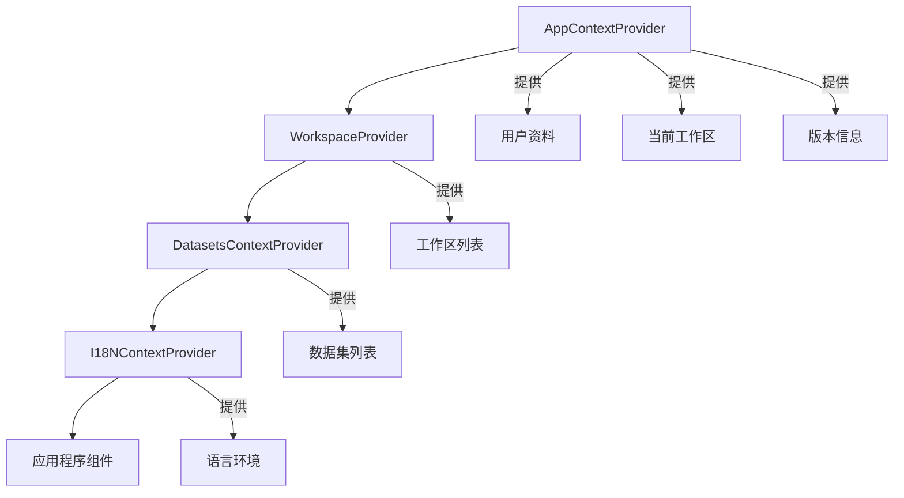
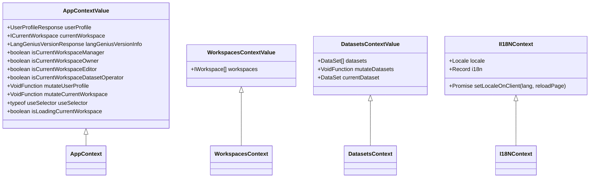
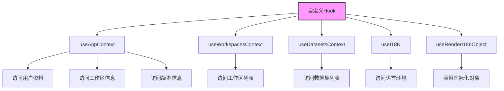

# 状态更新机制

<cite>
**本文档引用的文件**
- [app-context.tsx](file://web/context/app-context.tsx)
- [workspace-context.tsx](file://web/context/workspace-context.tsx)
- [datasets-context.tsx](file://web/context/datasets-context.tsx)
- [i18n.ts](file://web/context/i18n.ts)
- [use-i18n.ts](file://web/hooks/use-i18n.ts)
</cite>

## 目录
1. [简介](#简介)
2. [全局状态管理架构](#全局状态管理架构)
3. [状态更新触发机制](#状态更新触发机制)
4. [Context中的状态管理策略](#context中的状态管理策略)
5. [异步状态更新与性能优化](#异步状态更新与性能优化)
6. [自定义Hook设计与封装](#自定义hook设计与封装)
7. [错误处理与状态一致性保障](#错误处理与状态一致性保障)
8. [总结](#总结)

## 简介
Dify前端采用基于React Context和useSWR的全局状态管理机制，通过分层Context结构实现应用级、工作区级和数据集级的状态隔离与共享。系统通过自定义Hook封装状态读取和更新逻辑，提供简洁的API接口，同时结合useReducer和useState实现不同类型的状态管理需求。

## 全局状态管理架构
Dify前端采用多层级Context架构实现全局状态管理，主要包括应用上下文、工作区上下文、数据集上下文和国际化上下文。各Context通过Provider组件在组件树中逐层注入，确保状态在应用中的可访问性和一致性。

**图示来源**
- [app-context.tsx](file://web/context/app-context.tsx#L1-L144)
- [workspace-context.tsx](file://web/context/workspace-context.tsx#L1-L36)
- [datasets-context.tsx](file://web/context/datasets-context.tsx#L1-L21)
- [i18n.ts](file://web/context/i18n.ts#L1-L48)

**本节来源**
- [app-context.tsx](file://web/context/app-context.tsx#L1-L144)
- [workspace-context.tsx](file://web/context/workspace-context.tsx#L1-L36)

## 状态更新触发机制
Dify前端状态更新主要通过三种方式触发：用户交互、API响应和路由变化。系统利用useSWR的自动数据获取和缓存机制，在API响应时自动更新状态，同时通过useEffect监听路由变化实现状态同步。

用户交互触发的状态更新通过事件处理器调用mutate函数实现，该函数由useSWR提供，用于手动触发数据重新获取和状态更新。API响应通过fetcher函数的返回值直接更新状态，而路由变化则通过useEffect监听location变化来触发相关状态的重新获取。

**本节来源**
- [app-context.tsx](file://web/context/app-context.tsx#L100-L140)
- [workspace-context.tsx](file://web/context/workspace-context.tsx#L20-L30)

## Context中的状态管理策略
Dify根据状态类型和使用场景选择useState或useReducer进行状态管理。对于简单状态（如数据集列表、工作区列表），采用useState配合useSWR实现；对于复杂状态逻辑，则通过useSelector实现细粒度的状态选择。

在AppContext中，系统使用useState管理用户资料、工作区信息和版本信息等状态，同时利用useMemo计算派生状态（如isCurrentWorkspaceManager、isCurrentWorkspaceOwner等角色判断）。这种策略既保证了状态更新的响应性，又避免了不必要的重新渲染。

**图示来源**
- [app-context.tsx](file://web/context/app-context.tsx#L30-L80)
- [workspace-context.tsx](file://web/context/workspace-context.tsx#L10-L15)
- [datasets-context.tsx](file://web/context/datasets-context.tsx#L10-L15)
- [i18n.ts](file://web/context/i18n.ts#L10-L20)

**本节来源**
- [app-context.tsx](file://web/context/app-context.tsx#L30-L144)
- [datasets-context.tsx](file://web/context/datasets-context.tsx#L1-L21)

## 异步状态更新与性能优化
Dify前端通过useSWR实现异步状态更新的自动管理，包括数据获取、缓存、重新验证和错误处理。系统采用批量更新策略，将多个状态更新操作合并为单次更新，减少组件重新渲染次数。

性能优化方面，系统实现了防抖和节流机制，特别是在处理频繁的状态更新请求时。通过useCallback缓存事件处理器，避免因组件重新渲染导致的函数重新创建。同时，利用useMemo对计算派生状态进行缓存，仅在依赖项变化时重新计算。

在AppContext中，updateUserProfileAndVersion函数使用useCallback进行缓存，并在useEffect中作为依赖项，确保仅在必要时执行用户资料和版本信息的更新操作，有效避免了不必要的网络请求和状态更新。

**本节来源**
- [app-context.tsx](file://web/context/app-context.tsx#L90-L120)

## 自定义Hook设计与封装
Dify通过自定义Hook封装复杂的状态管理逻辑，提供简洁易用的API接口。系统定义了useAppContext、useWorkspacesContext、useDatasetsContext和useI18N等Hook，分别用于访问不同层级的Context状态。

这些自定义Hook基于useContext实现，隐藏了Context对象的直接引用，提高了代码的可维护性和可测试性。例如，useAppContext返回AppContext的值，允许组件直接访问用户资料、工作区信息等全局状态，而无需关心Context的创建和提供细节。

**图示来源**
- [app-context.tsx](file://web/context/app-context.tsx#L141-L144)
- [workspace-context.tsx](file://web/context/workspace-context.tsx#L34-L36)
- [datasets-context.tsx](file://web/context/datasets-context.tsx#L19-L21)
- [i18n.ts](file://web/context/i18n.ts#L24-L47)
- [use-i18n.ts](file://web/hooks/use-i18n.ts#L1-L9)

**本节来源**
- [app-context.tsx](file://web/context/app-context.tsx#L141-L144)
- [workspace-context.tsx](file://web/context/workspace-context.tsx#L34-L36)
- [datasets-context.tsx](file://web/context/datasets-context.tsx#L19-L21)
- [i18n.ts](file://web/context/i18n.ts#L24-L47)
- [use-i18n.ts](file://web/hooks/use-i18n.ts#L1-L9)

## 错误处理与状态一致性保障
Dify前端在状态更新过程中实施了完善的错误处理机制，确保系统稳定性和状态一致性。在AppContext中，系统通过try-catch捕获用户资料更新过程中的异常，并在发生错误时恢复到初始状态，防止应用因状态异常而崩溃。

状态一致性通过useSWR的mutate机制保障，该机制确保状态更新与数据获取的原子性。当API响应失败时，mutate函数不会更新状态，保持现有状态的一致性。同时，系统在useEffect中监听数据变化，确保UI状态与后端数据保持同步。

对于关键状态（如用户身份验证信息），系统设置了默认的占位符值（userProfilePlaceholder），在数据获取失败或未初始化时提供安全的默认状态，避免组件因访问undefined属性而报错。

**本节来源**
- [app-context.tsx](file://web/context/app-context.tsx#L105-L115)

## 总结
Dify前端通过精心设计的全局状态管理机制，实现了高效、可靠的状态更新和数据流控制。系统采用分层Context架构，结合useSWR的自动数据管理能力，通过自定义Hook提供简洁的API接口。在性能优化方面，系统实施了批量更新、防抖节流等策略，确保应用的响应性和流畅性。同时，完善的错误处理机制和状态一致性保障措施，确保了系统在各种场景下的稳定运行。