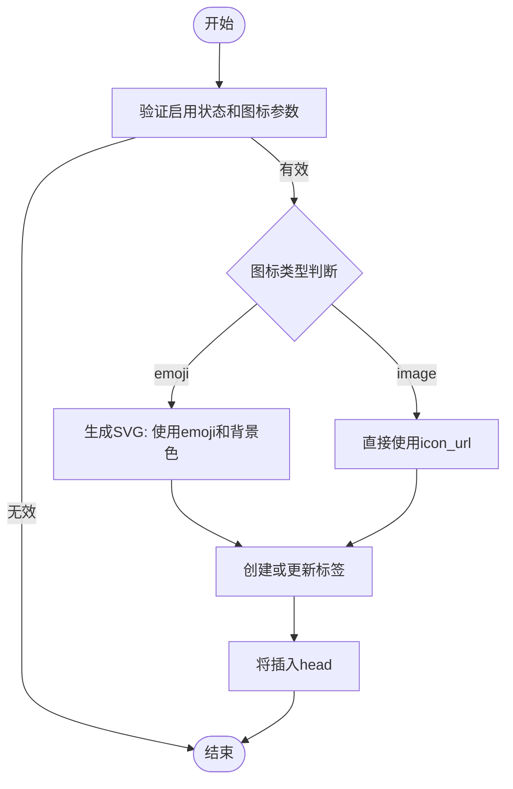
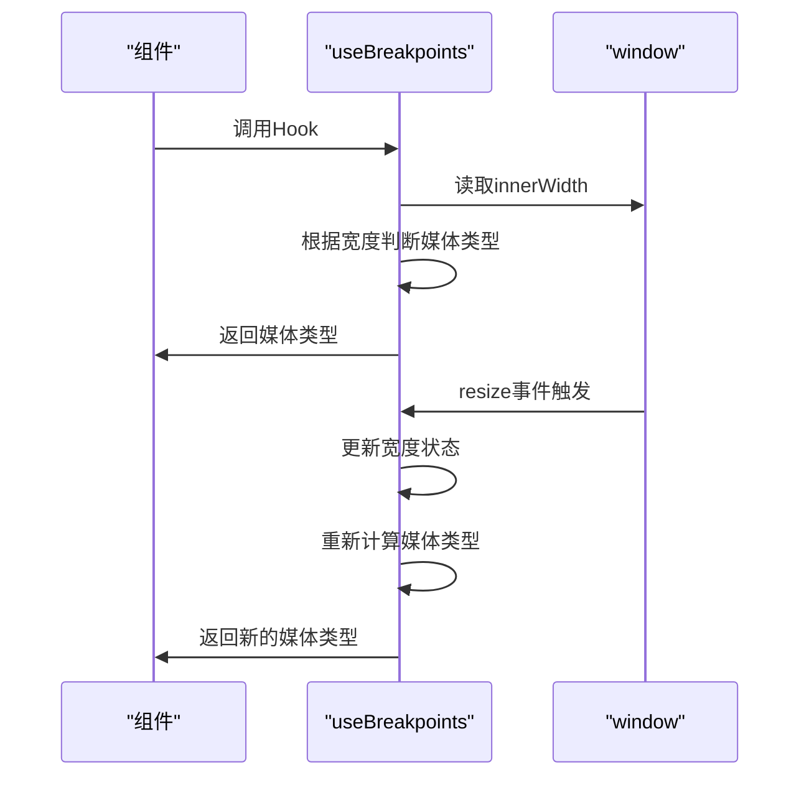
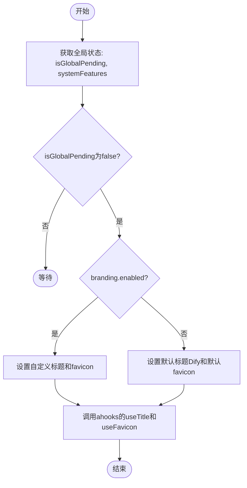
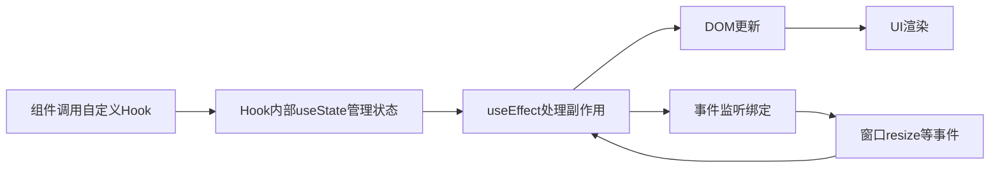

# 局部状态管理

<cite>
**本文档中引用的文件**  
- [use-app-favicon.ts](file://web/hooks/use-app-favicon.ts)
- [use-breakpoints.ts](file://web/hooks/use-breakpoints.ts)
- [use-document-title.ts](file://web/hooks/use-document-title.ts)
- [global-public-context.tsx](file://web/context/global-public-context.tsx)
- [common.ts](file://web/service/common.ts)
- [feature.ts](file://web/types/feature.ts)
</cite>

## 目录
1. [简介](#简介)
2. [核心自定义Hook分析](#核心自定义hook分析)
3. [局部状态数据流与副作用处理](#局部状态数据流与副作用处理)
4. [自定义Hook设计原则与复用策略](#自定义hook设计原则与复用策略)
5. [性能优化方法](#性能优化方法)
6. [最佳实践](#最佳实践)
7. [测试方法](#测试方法)

## 简介
Dify前端采用基于自定义Hook和组件内部状态的局部状态管理方案，通过React Hooks实现跨组件的状态逻辑复用。该方案聚焦于UI层面的状态管理，如文档标题、响应式断点、浏览器标签图标等，避免过度依赖全局状态管理工具，提升组件独立性和可维护性。

## 核心自定义Hook分析

### useAppFavicon
该Hook用于动态设置网页的浏览器标签图标（favicon），支持emoji和图片两种类型。根据传入的图标类型、内容和背景色生成SVG格式的图标并注入到页面head中。

**Diagram sources**  
- [use-app-favicon.ts](file://web/hooks/use-app-favicon.ts#L1-L44)

**Section sources**  
- [use-app-favicon.ts](file://web/hooks/use-app-favicon.ts#L1-L44)

### useBreakpoints
该Hook用于监听窗口尺寸变化，返回当前设备类型（mobile、tablet、pc）。通过`innerWidth`判断当前媒体类型，并在组件挂载时添加窗口大小变化监听器，实现响应式布局支持。

**Diagram sources**  
- [use-breakpoints.ts](file://web/hooks/use-breakpoints.ts#L1-L29)

**Section sources**  
- [use-breakpoints.ts](file://web/hooks/use-breakpoints.ts#L1-L29)

### useDocumentTitle
该Hook用于动态设置页面标题和favicon。依赖全局公共状态`useGlobalPublicStore`中的系统特性（systemFeatures）和挂起状态（isGlobalPending），根据品牌化配置决定显示Dify默认标题还是自定义标题。

**Diagram sources**  
- [use-document-title.ts](file://web/hooks/use-document-title.ts#L1-L24)
- [global-public-context.tsx](file://web/context/global-public-context.tsx#L1-L46)

**Section sources**  
- [use-document-title.ts](file://web/hooks/use-document-title.ts#L1-L24)
- [global-public-context.tsx](file://web/context/global-public-context.tsx#L1-L46)

## 局部状态数据流与副作用处理
Dify的局部状态数据流遵循React单向数据流原则，状态变更通过Hook内部的`useState`和`useEffect`处理。副作用主要集中在DOM操作（如修改document.title、添加<link>标签）和事件监听（如resize事件）。所有副作用均在`useEffect`中正确清理，防止内存泄漏。

**Diagram sources**  
- [use-breakpoints.ts](file://web/hooks/use-breakpoints.ts#L1-L29)
- [use-document-title.ts](file://web/hooks/use-document-title.ts#L1-L24)

## 自定义Hook设计原则与复用策略
Dify的自定义Hook遵循单一职责原则，每个Hook只负责一个特定功能。通过参数化设计提高复用性，如`useAppFavicon`接受`enable`、`icon_type`等选项。Hook之间通过依赖注入方式组合，如`useDocumentTitle`依赖`useGlobalPublicStore`获取全局配置。

**Section sources**  
- [use-app-favicon.ts](file://web/hooks/use-app-favicon.ts#L1-L44)
- [use-document-title.ts](file://web/hooks/use-document-title.ts#L1-L24)
- [global-public-context.tsx](file://web/context/global-public-context.tsx#L1-L46)

## 性能优化方法
- **减少重渲染**：`useBreakpoints`仅返回媒体类型字符串而非完整对象，避免不必要的引用变化。
- **副作用优化**：`useAsyncEffect`用于异步操作，避免阻塞主线程。
- **依赖数组精确控制**：所有`useEffect`和`useAsyncEffect`都明确指定依赖项，防止不必要的执行。
- **事件监听器清理**：在`useEffect`的清理函数中移除事件监听器，防止内存泄漏。

**Section sources**  
- [use-breakpoints.ts](file://web/hooks/use-breakpoints.ts#L1-L29)
- [use-app-favicon.ts](file://web/hooks/use-app-favicon.ts#L1-L44)

## 最佳实践
- **状态拆分**：将不同关注点的状态分离到不同Hook中，如标题和图标分别管理。
- **依赖管理**：明确声明Hook的所有外部依赖，便于测试和复用。
- **内存泄漏预防**：所有副作用产生的资源（如事件监听器）必须在清理函数中释放。
- **调试技巧**：利用React DevTools检查Hook状态，通过`console.log`调试副作用执行。

**Section sources**  
- [use-breakpoints.ts](file://web/hooks/use-breakpoints.ts#L1-L29)
- [use-document-title.ts](file://web/hooks/use-document-title.ts#L1-L24)
- [use-app-favicon.ts](file://web/hooks/use-app-favicon.ts#L1-L44)

## 测试方法
Dify为自定义Hook提供了单元测试文件，如`use-breakpoints.spec.ts`和`use-document-title.spec.ts`。测试策略包括：
- 模拟窗口大小变化，验证`useBreakpoints`返回正确的媒体类型。
- 模拟全局状态变化，验证`useDocumentTitle`正确更新页面标题。
- 验证副作用函数的调用次数和参数正确性。

**Section sources**  
- [use-breakpoints.spec.ts](file://web/hooks/use-breakpoints.spec.ts)
- [use-document-title.spec.ts](file://web/hooks/use-document-title.spec.ts)