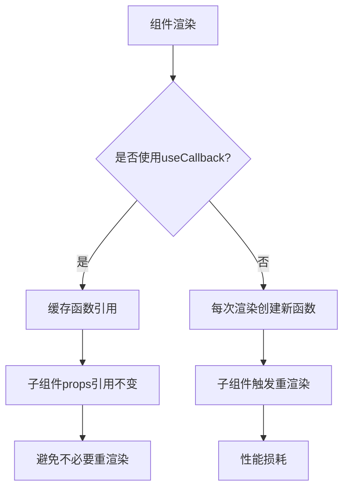
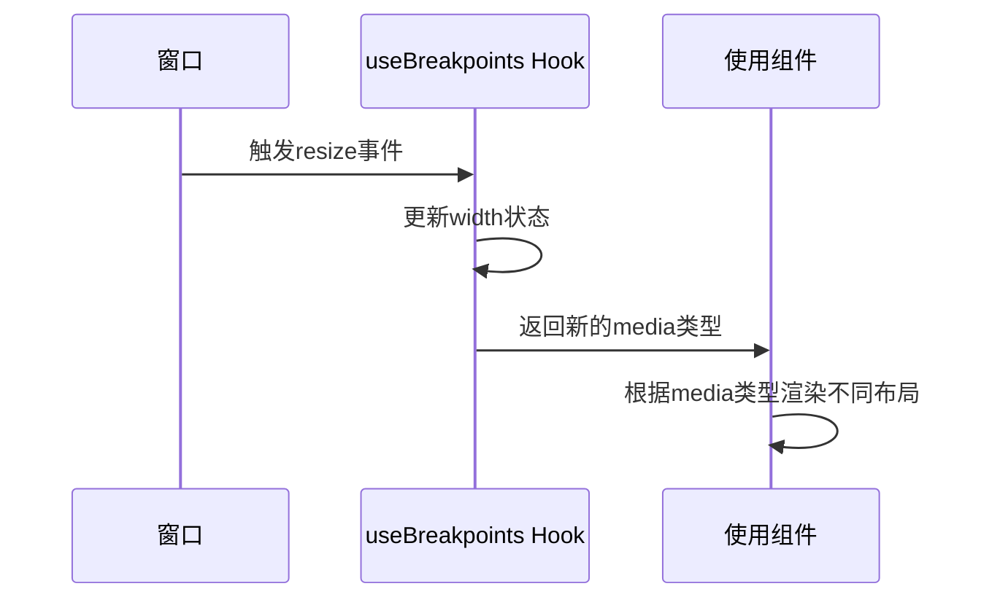
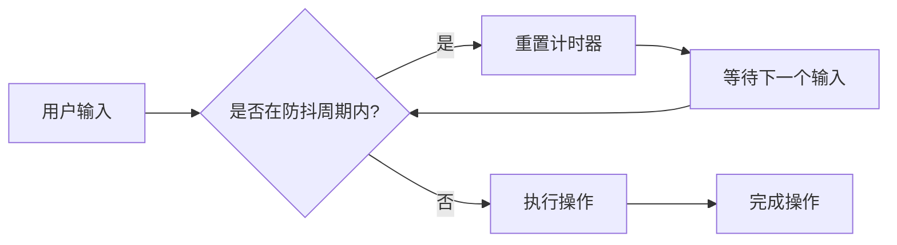
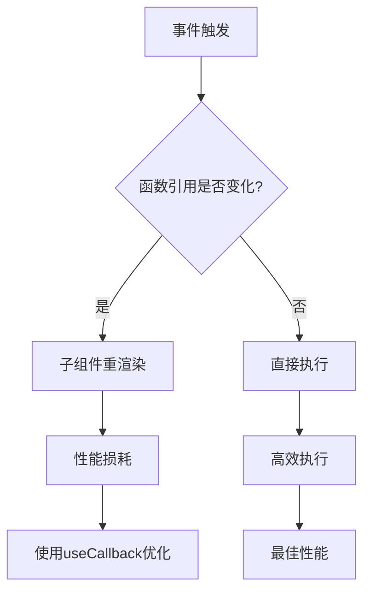
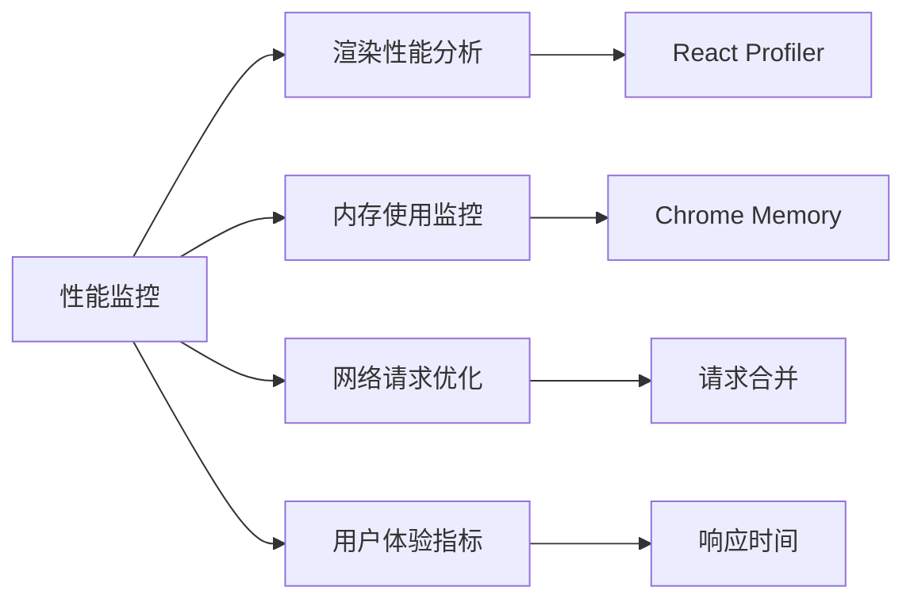

# 性能优化

<cite>
**本文档引用的文件**  
- [use-breakpoints.ts](file://web/hooks/use-breakpoints.ts)
- [format.ts](file://web/utils/format.ts)
- [semver.ts](file://web/utils/semver.ts)
- [use-format-time-from-now.ts](file://web/hooks/use-format-time-from-now.ts)
- [use-timestamp.ts](file://web/hooks/use-timestamp.ts)
- [cooldown-timer.tsx](file://web/app/components/header/account-setting/model-provider-page/provider-added-card/cooldown-timer.tsx)
- [use-validate.ts](file://web/app/components/header/account-setting/key-validator/hooks.ts)
- [code-block.tsx](file://web/app/components/base/markdown-blocks/code-block.tsx)
</cite>

## 目录
1. [简介](#简介)
2. [局部状态管理优化](#局部状态管理优化)
3. [响应式Hook性能优化](#响应式hook性能优化)
4. [防抖与节流在状态更新中的应用](#防抖与节流在状态更新中的应用)
5. [事件处理与引用相等性优化](#事件处理与引用相等性优化)
6. [性能监控与测试实践](#性能监控与测试实践)
7. [结论](#结论)

## 简介
Dify前端系统通过合理使用React Hooks和性能优化技术，有效提升了应用的响应速度和用户体验。本文档重点介绍在Dify项目中实现的性能优化策略，包括局部状态管理、响应式Hook设计、防抖节流技术应用以及事件处理优化等方面。通过分析实际代码实现，展示如何识别和解决性能瓶颈，为开发者提供可复用的最佳实践。

## 局部状态管理优化

在Dify前端中，通过`useMemo`和`useCallback`等Hook有效避免了不必要的重渲染。例如，在工作流组件中，通过`useCallback`缓存事件处理函数，确保函数引用的稳定性，避免因函数重新创建导致子组件不必要的更新。



**Diagram sources**  
- [use-workflow.ts](file://web/app/components/workflow/hooks/use-workflow.ts#L177-L231)
- [use-config.ts](file://web/app/components/workflow/nodes/parameter-extractor/use-config.ts#L207-L249)

**Section sources**  
- [use-workflow.ts](file://web/app/components/workflow/hooks/use-workflow.ts#L177-L231)
- [use-config.ts](file://web/app/components/workflow/nodes/parameter-extractor/use-config.ts#L207-L249)

## 响应式Hook性能优化

Dify通过自定义Hook实现高效的响应式功能。以`useBreakpoints`为例，该Hook监听窗口大小变化，根据屏幕宽度返回对应的设备类型，实现了响应式布局的高效管理。

```typescript
const useBreakpoints = () => {
  const [width, setWidth] = React.useState(globalThis.innerWidth)
  const media = (() => {
    if (width <= 640)
      return MediaType.mobile
    if (width <= 768)
      return MediaType.tablet
    return MediaType.pc
  })()

  React.useEffect(() => {
    const handleWindowResize = () => setWidth(window.innerWidth)
    window.addEventListener('resize', handleWindowResize)
    return () => window.removeEventListener('resize', handleWindowResize)
  }, [])

  return media
}
```

该实现通过`useEffect`仅在组件挂载时添加事件监听器，并在卸载时正确清理，避免了内存泄漏。同时，使用`useState`存储窗口宽度，确保在窗口大小变化时能够正确触发组件更新。



**Diagram sources**  
- [use-breakpoints.ts](file://web/hooks/use-breakpoints.ts#L0-L29)

**Section sources**  
- [use-breakpoints.ts](file://web/hooks/use-breakpoints.ts#L0-L29)

## 防抖与节流在状态更新中的应用

Dify在多个场景中应用防抖和节流技术来优化性能。在API密钥验证场景中，使用`useDebounceFn`实现输入验证的防抖处理，避免频繁的API调用。

```typescript
const { run } = useDebounceFn(async (validateCallback: ValidateCallback) => {
  // 验证逻辑
}, { wait: 1000 })
```

该实现将验证操作延迟1秒执行，如果在1秒内有新的输入，则重新计时，有效减少了不必要的验证请求。同样，在图表组件中，使用节流技术限制重绘频率：

```typescript
const debouncedResize = useCallback(() => {
  if (resizeTimerRef.current)
    clearTimeout(resizeTimerRef.current)

  resizeTimerRef.current = setTimeout(() => {
    if (chartInstanceRef.current)
      chartInstanceRef.current.resize()
    resizeTimerRef.current = null
  }, 200)
}, [])
```

通过200毫秒的延迟，避免了在窗口快速调整大小时频繁触发图表重绘，显著提升了性能。



**Diagram sources**  
- [hooks.ts](file://web/app/components/header/account-setting/key-validator/hooks.ts#L0-L30)
- [code-block.tsx](file://web/app/components/base/markdown-blocks/code-block.tsx#L93-L140)

**Section sources**  
- [hooks.ts](file://web/app/components/header/account-setting/key-validator/hooks.ts#L0-L30)
- [code-block.tsx](file://web/app/components/base/markdown-blocks/code-block.tsx#L93-L140)

## 事件处理与引用相等性优化

在Dify中，通过合理使用引用相等性优化事件处理性能。例如，在时间格式化Hook中，使用`useCallback`确保格式化函数的引用稳定性：

```typescript
const formatTime = useCallback((value: number, format: string) => {
  return dayjs.unix(value).tz(timezone).format(format)
}, [timezone])
```

由于`timezone`来自上下文，将其作为依赖项，确保在时区变化时函数能够正确更新，而在其他情况下保持引用不变。这种优化避免了因函数引用变化导致的子组件不必要的重渲染。

在冷却计时器组件中，使用`useLatest`保存最新的回调函数引用，确保在异步操作完成时能够调用最新的回调：

```typescript
const onFinishRef = useLatest(onFinish)
```

这种方式解决了闭包中可能引用过时回调的问题，同时保持了性能优化的优势。



**Diagram sources**  
- [use-timestamp.ts](file://web/hooks/use-timestamp.ts#L0-L25)
- [cooldown-timer.tsx](file://web/app/components/header/account-setting/model-provider-page/provider-added-card/cooldown-timer.tsx#L0-L43)

**Section sources**  
- [use-timestamp.ts](file://web/hooks/use-timestamp.ts#L0-L25)
- [cooldown-timer.tsx](file://web/app/components/header/account-setting/model-provider-page/provider-added-card/cooldown-timer.tsx#L0-L43)

## 性能监控与测试实践

Dify通过多种方式实现性能监控和测试。在时间处理方面，提供了多个实用函数来格式化和比较版本号：

```typescript
export const formatTime = (seconds: number) => {
  if (!seconds)
    return seconds
  const units = ['sec', 'min', 'h']
  let index = 0
  while (seconds >= 60 && index < units.length) {
    seconds = seconds / 60
    index++
  }
  return `${seconds.toFixed(2)} ${units[index]}`
}

export const compareVersion = (v1: string, v2: string) => {
  return semver.compare(v1, v2)
}
```

这些函数经过优化，避免了不必要的计算和对象创建。在性能测试方面，建议使用以下实践：

1. **组件渲染性能测试**：使用React DevTools的Profiler功能分析组件渲染性能
2. **内存泄漏检测**：通过Chrome DevTools的Memory面板检测事件监听器泄漏
3. **重渲染分析**：使用`why-did-you-render`等工具识别不必要的重渲染
4. **节流防抖验证**：编写单元测试验证防抖节流功能的正确性



**Diagram sources**  
- [format.ts](file://web/utils/format.ts#L0-L58)
- [semver.ts](file://web/utils/semver.ts#L0-L13)

**Section sources**  
- [format.ts](file://web/utils/format.ts#L0-L58)
- [semver.ts](file://web/utils/semver.ts#L0-L13)

## 结论
Dify前端通过综合运用React Hooks、防抖节流、引用相等性等技术，实现了高效的性能优化。关键实践包括：
- 使用`useCallback`和`useMemo`避免不必要的重渲染
- 通过自定义Hook实现高效的响应式功能
- 在适当场景应用防抖和节流技术
- 合理管理事件处理函数的引用相等性
- 建立完善的性能监控和测试体系

这些优化策略不仅提升了用户体验，也为大型React应用的性能优化提供了有价值的参考。