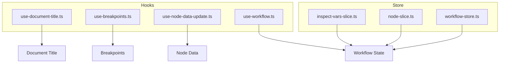
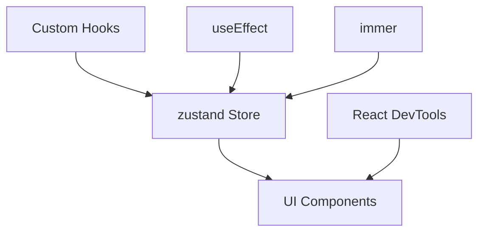
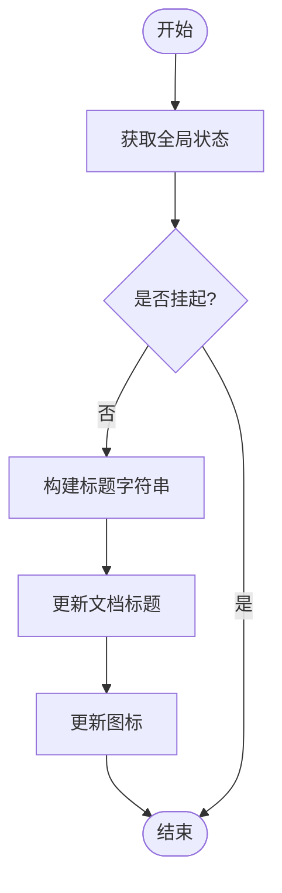
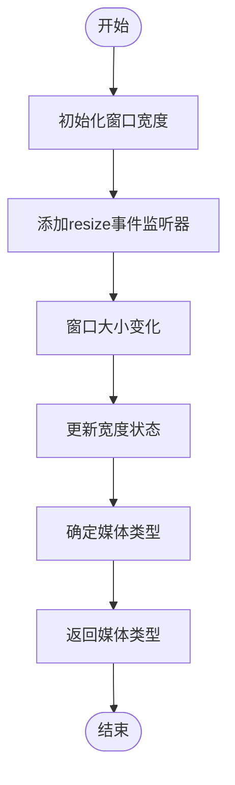
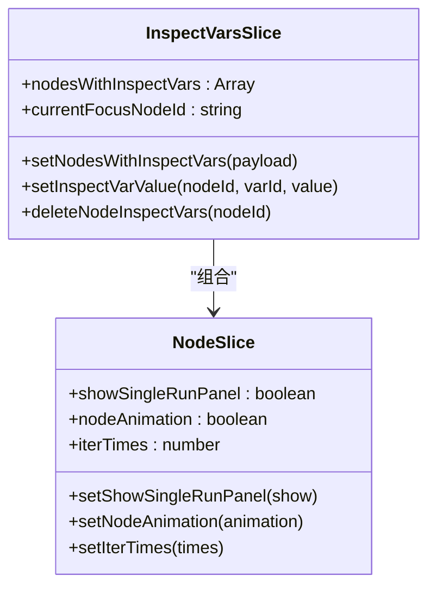
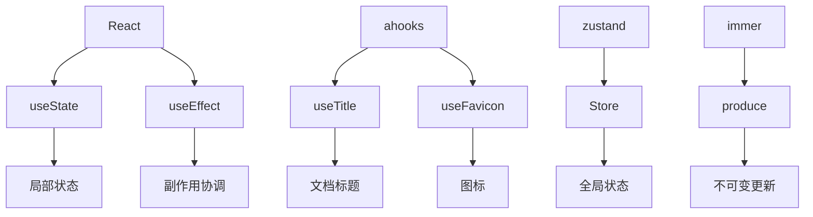

# 状态更新

<cite>
**本文档中引用的文件**  
- [use-document-title.ts](file://web/hooks/use-document-title.ts)
- [use-breakpoints.ts](file://web/hooks/use-breakpoints.ts)
- [web-app-context.tsx](file://web/context/web-app-context.tsx)
- [chat-with-history/hooks.tsx](file://web/app/components/base/chat/chat-with-history/hooks.tsx)
- [mitt-context.tsx](file://web/context/mitt-context.tsx)
- [event-emitter.tsx](file://web/context/event-emitter.tsx)
- [use-node-data-update.ts](file://web/app/components/workflow/hooks/use-node-data-update.ts)
- [use-workflow.ts](file://web/app/components/workflow/hooks/use-workflow.ts)
- [use-one-step-run.ts](file://web/app/components/workflow/nodes/_base/hooks/use-one-step-run.ts)
- [use-inspect-vars-crud.ts](file://web/app/components/workflow/hooks/use-inspect-vars-crud.ts)
- [inspect-vars-slice.ts](file://web/app/components/workflow/store/workflow/debug/inspect-vars-slice.ts)
- [node-slice.ts](file://web/app/components/workflow/store/workflow/node-slice.ts)
- [use-config.ts](file://web/app/components/workflow/nodes/assigner/use-config.ts)
- [use-workflow-node-loop-next.ts](file://web/app/components/workflow/hooks/use-workflow-run-event/use-workflow-node-loop-next.ts)
- [use-workflow-node-loop-finished.ts](file://web/app/components/workflow/hooks/use-workflow-run-event/use-workflow-node-loop-finished.ts)
- [use-interactions.ts](file://web/app/components/workflow/nodes/loop/use-interactions.ts)
</cite>

## 目录
1. [简介](#简介)
2. [项目结构](#项目结构)
3. [核心组件](#核心组件)
4. [架构概述](#架构概述)
5. [详细组件分析](#详细组件分析)
6. [依赖分析](#依赖分析)
7. [性能考虑](#性能考虑)
8. [故障排除指南](#故障排除指南)
9. [结论](#结论)
10. [附录](#附录)（如有必要）

## 简介
本文档详细介绍了Dify前端应用中的状态更新机制，重点阐述了局部状态更新的实现方式和最佳实践。文档深入分析了React状态管理机制（如useState、useReducer）在项目中的具体应用，包括状态更新的异步特性、批量更新机制及其对性能的影响。同时，文档解释了useEffect如何协调状态更新与副作用，并提供了避免无限循环更新的策略。通过useDocumentTitle和useBreakpoints等实际案例，展示了状态更新的完整生命周期。此外，文档还提供了使用React DevTools监控状态变化的调试技巧，以及解决状态滞后、竞态条件等常见问题的方案。

## 项目结构
Dify前端项目采用模块化设计，将状态管理逻辑分散在多个hooks和store文件中。核心状态管理功能主要集中在`web/hooks`和`web/app/components/workflow/store`目录下。`web/hooks`目录包含自定义hooks，如`use-document-title.ts`和`use-breakpoints.ts`，用于处理特定的状态更新需求。`web/app/components/workflow/store`目录则使用zustand库实现全局状态管理，通过slices组织不同的状态逻辑。这种结构使得状态管理既灵活又可维护，支持局部状态更新和全局状态同步。

**图源**
- [use-document-title.ts](file://web/hooks/use-document-title.ts)
- [use-breakpoints.ts](file://web/hooks/use-breakpoints.ts)
- [use-node-data-update.ts](file://web/app/components/workflow/hooks/use-node-data-update.ts)
- [use-workflow.ts](file://web/app/components/workflow/hooks/use-workflow.ts)
- [inspect-vars-slice.ts](file://web/app/components/workflow/store/workflow/debug/inspect-vars-slice.ts)
- [node-slice.ts](file://web/app/components/workflow/store/workflow/node-slice.ts)

**节源**
- [use-document-title.ts](file://web/hooks/use-document-title.ts)
- [use-breakpoints.ts](file://web/hooks/use-breakpoints.ts)
- [use-node-data-update.ts](file://web/app/components/workflow/hooks/use-node-data-update.ts)
- [use-workflow.ts](file://web/app/components/workflow/hooks/use-workflow.ts)
- [inspect-vars-slice.ts](file://web/app/components/workflow/store/workflow/debug/inspect-vars-slice.ts)
- [node-slice.ts](file://web/app/components/workflow/store/workflow/node-slice.ts)

## 核心组件
Dify前端状态更新机制的核心组件包括自定义hooks和zustand store。自定义hooks如`useDocumentTitle`和`useBreakpoints`封装了特定的状态逻辑，使得组件可以轻松地管理文档标题和响应式断点。zustand store则提供了全局状态管理能力，通过`inspect-vars-slice`和`node-slice`等模块化设计，实现了复杂工作流的状态跟踪和更新。这些组件共同构成了一个高效、可扩展的状态管理系统。

**节源**
- [use-document-title.ts](file://web/hooks/use-document-title.ts)
- [use-breakpoints.ts](file://web/hooks/use-breakpoints.ts)
- [inspect-vars-slice.ts](file://web/app/components/workflow/store/workflow/debug/inspect-vars-slice.ts)
- [node-slice.ts](file://web/app/components/workflow/store/workflow/node-slice.ts)

## 架构概述
Dify前端状态管理架构采用分层设计，上层为自定义hooks，下层为zustand store。自定义hooks负责处理组件级别的状态更新，而zustand store则管理全局状态。这种架构使得状态更新既具有局部性，又能够实现跨组件的同步。通过useEffect协调副作用，确保状态更新与UI渲染的一致性。同时，利用immer库的produce函数实现不可变数据更新，提高了状态更新的效率和安全性。

**图源**
- [use-document-title.ts](file://web/hooks/use-document-title.ts)
- [use-breakpoints.ts](file://web/hooks/use-breakpoints.ts)
- [inspect-vars-slice.ts](file://web/app/components/workflow/store/workflow/debug/inspect-vars-slice.ts)
- [node-slice.ts](file://web/app/components/workflow/store/workflow/node-slice.ts)

## 详细组件分析
### useDocumentTitle 分析
`useDocumentTitle`是一个自定义hook，用于动态更新文档标题。它依赖于`useGlobalPublicStore`获取全局状态，并根据应用的品牌设置和当前标题前缀来构建最终的文档标题。该hook利用ahooks库的`useTitle`和`useFavicon`函数，实现了标题和图标的同时更新。通过useEffect监听全局状态变化，确保标题更新的及时性和准确性。

**图源**
- [use-document-title.ts](file://web/hooks/use-document-title.ts)

**节源**
- [use-document-title.ts](file://web/hooks/use-document-title.ts)

### useBreakpoints 分析
`useBreakpoints`是一个用于响应式设计的自定义hook。它通过监听窗口大小变化，动态返回当前的媒体类型（mobile、tablet、pc）。该hook使用useState初始化窗口宽度，并通过useEffect添加和移除resize事件监听器，确保在组件卸载时正确清理事件处理器。通过计算窗口宽度，确定当前的媒体类型，为UI组件提供响应式布局支持。

**图源**
- [use-breakpoints.ts](file://web/hooks/use-breakpoints.ts)

**节源**
- [use-breakpoints.ts](file://web/hooks/use-breakpoints.ts)

### Zustand Store 分析
Zustand store在Dify中用于管理复杂的工作流状态。`inspect-vars-slice`和`node-slice`等slices通过set函数更新状态，利用immer的produce函数实现不可变更新。这种设计模式确保了状态更新的原子性和一致性，避免了直接修改状态带来的副作用。store中的状态更新通常由事件处理器触发，如`handleWorkflowNodeFinished`，这些处理器通过回调函数接收更新数据，并调用相应的store方法更新状态。

**图源**
- [inspect-vars-slice.ts](file://web/app/components/workflow/store/workflow/debug/inspect-vars-slice.ts)
- [node-slice.ts](file://web/app/components/workflow/store/workflow/node-slice.ts)

**节源**
- [inspect-vars-slice.ts](file://web/app/components/workflow/store/workflow/debug/inspect-vars-slice.ts)
- [node-slice.ts](file://web/app/components/workflow/store/workflow/node-slice.ts)

## 依赖分析
Dify前端状态更新机制依赖于多个第三方库和内部模块。主要依赖包括React（useState、useEffect）、ahooks（useTitle、useFavicon）、zustand（全局状态管理）和immer（不可变数据更新）。这些依赖共同支持了状态更新的异步特性、批量更新机制和性能优化。通过合理使用这些工具，Dify实现了高效、可靠的状态管理。

**图源**
- [use-document-title.ts](file://web/hooks/use-document-title.ts)
- [use-breakpoints.ts](file://web/hooks/use-breakpoints.ts)
- [inspect-vars-slice.ts](file://web/app/components/workflow/store/workflow/debug/inspect-vars-slice.ts)
- [node-slice.ts](file://web/app/components/workflow/store/workflow/node-slice.ts)

**节源**
- [use-document-title.ts](file://web/hooks/use-document-title.ts)
- [use-breakpoints.ts](file://web/hooks/use-breakpoints.ts)
- [inspect-vars-slice.ts](file://web/app/components/workflow/store/workflow/debug/inspect-vars-slice.ts)
- [node-slice.ts](file://web/app/components/workflow/store/workflow/node-slice.ts)

## 性能考虑
在Dify中，状态更新的性能优化主要通过以下方式实现：使用useMemo和useCallback避免不必要的重新渲染；利用zustand的selector机制订阅特定状态，减少全局状态更新带来的影响；通过immer的produce函数实现高效的不可变数据更新。此外，合理使用useEffect的依赖数组，确保副作用仅在必要时执行，进一步提升了应用性能。

## 故障排除指南
### 状态滞后问题
状态滞后通常是由于异步更新未正确处理导致的。解决方案包括确保在useEffect中正确设置依赖数组，使用immer的produce函数避免直接修改状态，以及在必要时使用useRef存储最新状态。

### 竞态条件
竞态条件可能发生在多个异步操作同时更新同一状态时。通过使用zustand的原子更新机制和immer的不可变更新，可以有效避免竞态条件。此外，合理设计状态更新逻辑，确保操作的顺序性和一致性，也是预防竞态条件的关键。

### 无限循环更新
无限循环更新通常由useEffect的依赖数组设置不当引起。确保依赖数组中只包含真正需要监听的状态，避免在useEffect中直接更新其依赖的状态，可以有效防止无限循环。

**节源**
- [use-document-title.ts](file://web/hooks/use-document-title.ts)
- [use-breakpoints.ts](file://web/hooks/use-breakpoints.ts)
- [web-app-context.tsx](file://web/context/web-app-context.tsx)
- [chat-with-history/hooks.tsx](file://web/app/components/base/chat/chat-with-history/hooks.tsx)

## 结论
Dify前端状态更新机制通过结合React内置hook、自定义hook和zustand全局状态管理，实现了高效、可靠的状态管理。通过合理的设计和优化，确保了状态更新的及时性、一致性和性能。文档中介绍的最佳实践和调试技巧，为开发者提供了有力的支持，帮助他们构建高质量的前端应用。

## 附录
本文档中提到的所有文件路径均基于``目录。如需进一步了解特定组件的实现细节，建议直接查阅相关源码文件。