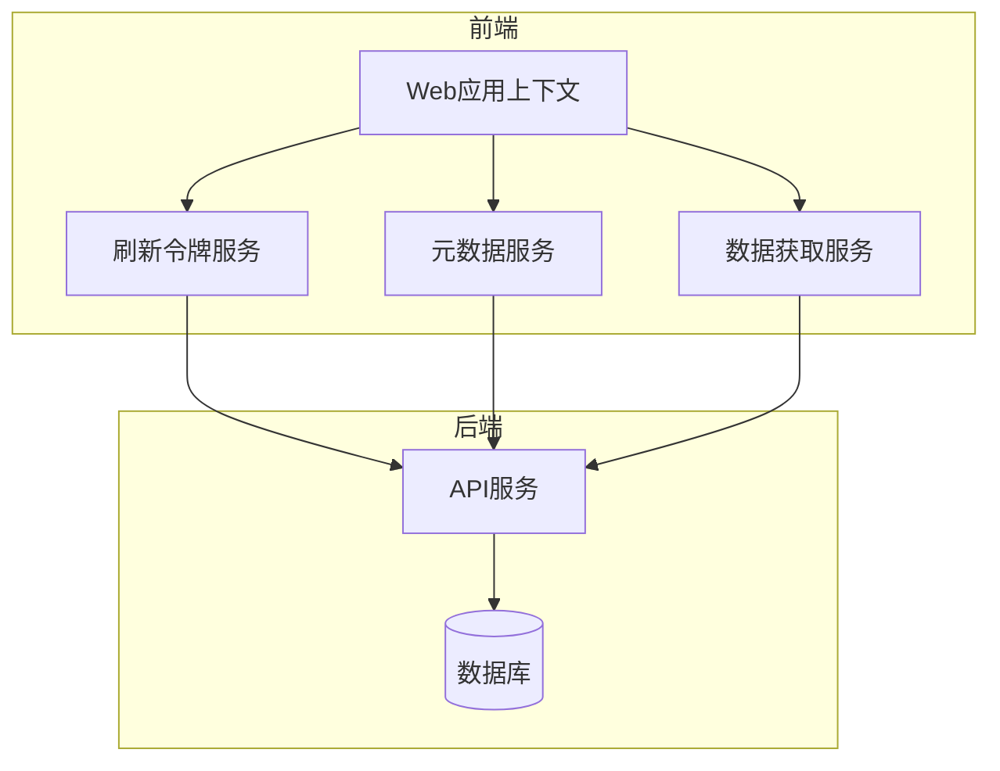
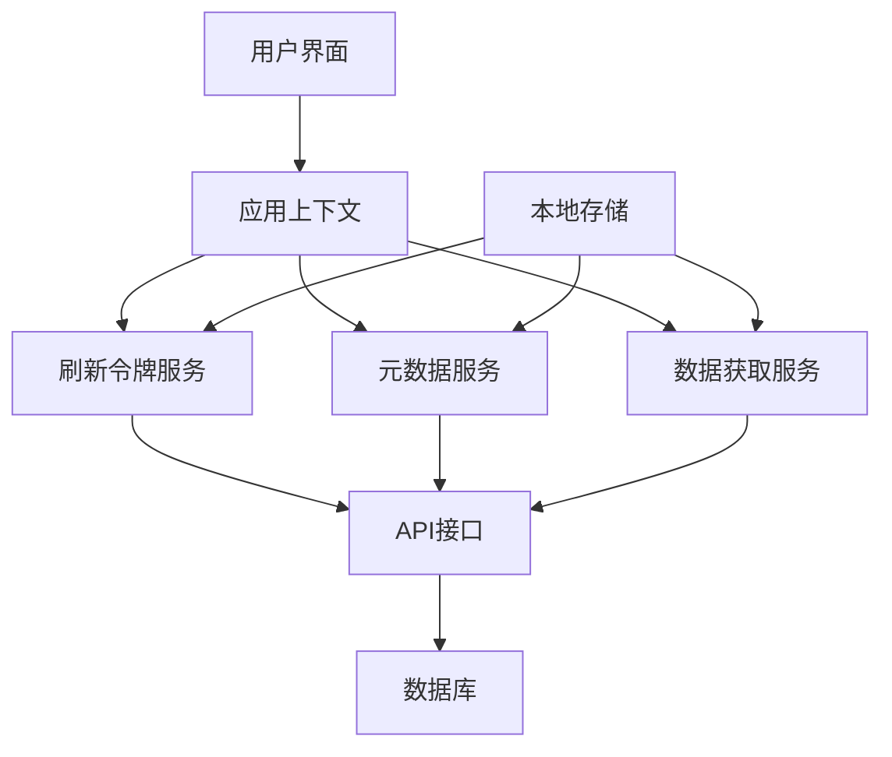
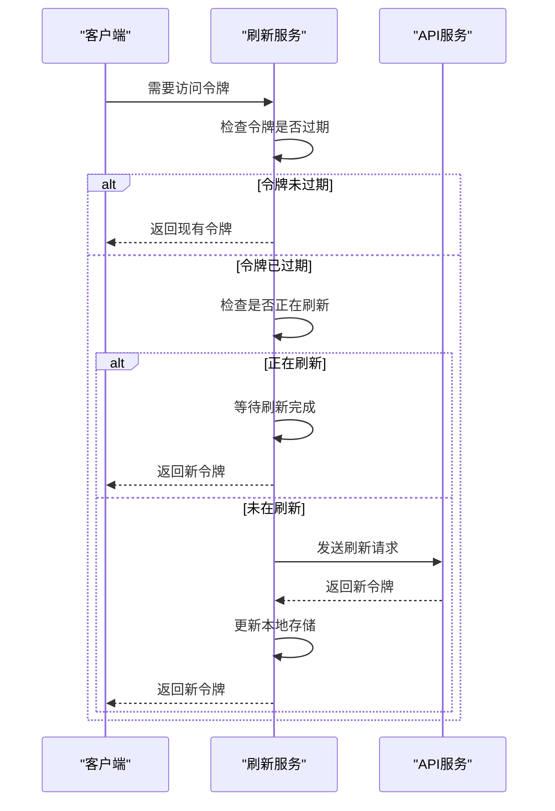
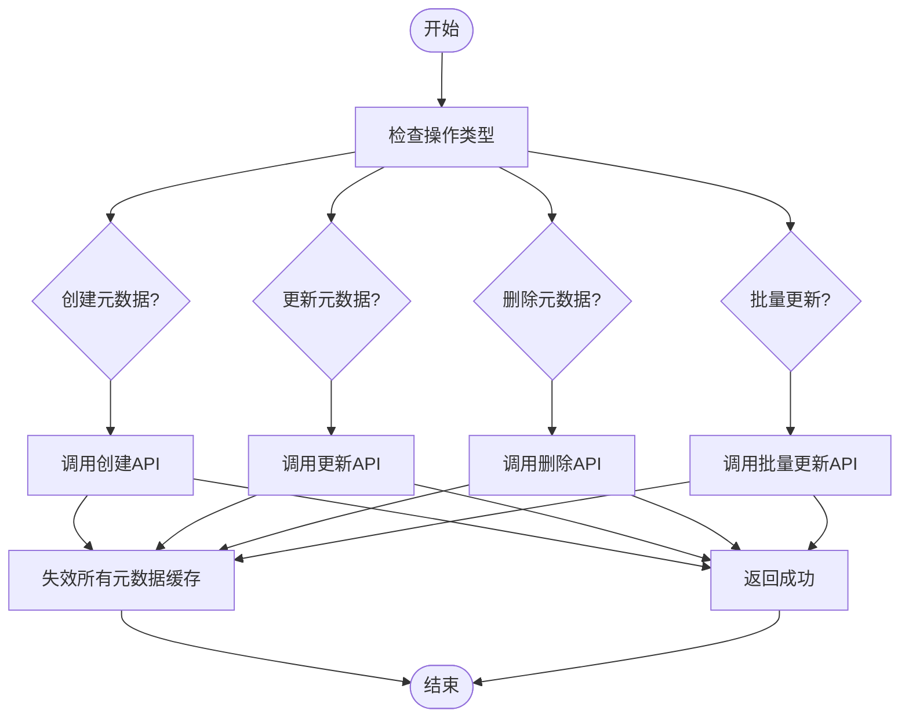
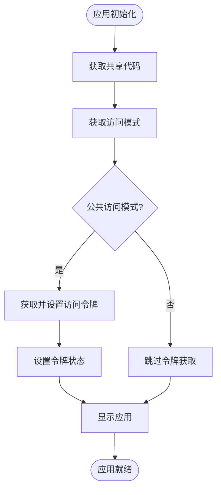
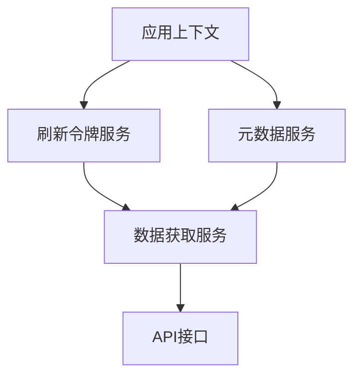

# 同步策略

<cite>
**本文档引用的文件**
- [refresh-token.ts](file://web/service/refresh-token.ts)
- [use-metadata.ts](file://web/service/knowledge/use-metadata.ts)
- [web-app-context.tsx](file://web/context/web-app-context.tsx)
- [use-base.ts](file://web/service/use-base.ts)
- [fetch.ts](file://web/service/fetch.ts)
</cite>

## 目录
1. [简介](#简介)
2. [项目结构](#项目结构)
3. [核心组件](#核心组件)
4. [架构概述](#架构概述)
5. [详细组件分析](#详细组件分析)
6. [依赖分析](#依赖分析)
7. [性能考虑](#性能考虑)
8. [故障排除指南](#故障排除指南)
9. [结论](#结论)

## 简介
本文档详细描述了Dify前端状态同步策略，重点阐述客户端与服务端状态同步机制。文档涵盖了刷新令牌的持久化与自动刷新逻辑、元数据变更的同步处理流程、离线状态下的数据一致性保障、同步冲突检测与解决策略、网络异常时的重试机制以及批量同步性能优化方案。通过实际应用场景示例和最佳实践指导，帮助开发者深入理解Dify的同步机制。

## 项目结构
Dify项目采用前后端分离的架构，前端代码位于`web`目录下，后端API代码位于`api`目录下。前端主要使用React框架构建，通过服务层与后端API进行通信。状态同步相关的核心逻辑主要分布在`web/service`目录下的各个服务文件中。

**Diagram sources**
- [web-app-context.tsx](file://web/context/web-app-context.tsx)
- [refresh-token.ts](file://web/service/refresh-token.ts)
- [use-metadata.ts](file://web/service/knowledge/use-metadata.ts)

**Section sources**
- [web-app-context.tsx](file://web/context/web-app-context.tsx)
- [refresh-token.ts](file://web/service/refresh-token.ts)
- [use-metadata.ts](file://web/service/knowledge/use-metadata.ts)

## 核心组件
Dify前端状态同步的核心组件包括：刷新令牌服务、元数据同步服务、数据获取服务和应用上下文管理。这些组件协同工作，确保客户端与服务端状态的一致性，特别是在令牌管理、元数据变更和数据同步方面。

**Section sources**
- [refresh-token.ts](file://web/service/refresh-token.ts)
- [use-metadata.ts](file://web/service/knowledge/use-metadata.ts)
- [web-app-context.tsx](file://web/context/web-app-context.tsx)

## 架构概述
Dify的同步架构采用分层设计，前端通过服务层与后端API进行通信。服务层封装了所有与后端交互的逻辑，包括令牌刷新、元数据同步和数据获取。应用上下文管理组件负责维护全局状态，并在状态变更时触发相应的同步操作。

**Diagram sources**
- [refresh-token.ts](file://web/service/refresh-token.ts)
- [use-metadata.ts](file://web/service/knowledge/use-metadata.ts)
- [web-app-context.tsx](file://web/context/web-app-context.tsx)

## 详细组件分析

### 刷新令牌服务分析
刷新令牌服务负责管理访问令牌的生命周期，包括令牌的持久化存储、自动刷新和多标签页同步。该服务通过localStorage实现令牌的持久化，并采用互斥锁机制防止多个标签页同时刷新令牌。

**Diagram sources**
- [refresh-token.ts](file://web/service/refresh-token.ts)

**Section sources**
- [refresh-token.ts](file://web/service/refresh-token.ts)

### 元数据同步服务分析
元数据同步服务负责管理数据集元数据的创建、更新、删除和批量操作。该服务采用查询失效策略，在元数据变更后立即失效相关查询缓存，确保后续请求获取最新数据。

**Diagram sources**
- [use-metadata.ts](file://web/service/knowledge/use-metadata.ts)

**Section sources**
- [use-metadata.ts](file://web/service/knowledge/use-metadata.ts)

### 应用上下文管理分析
应用上下文管理组件负责维护Web应用的全局状态，包括共享代码、访问模式和访问令牌。该组件在应用初始化时自动获取并设置访问令牌，确保应用在不同访问模式下都能正常工作。

**Diagram sources**
- [web-app-context.tsx](file://web/context/web-app-context.tsx)

**Section sources**
- [web-app-context.tsx](file://web/context/web-app-context.tsx)

## 依赖分析
Dify前端状态同步组件之间存在明确的依赖关系。应用上下文管理组件依赖于刷新令牌服务和元数据同步服务，而这些服务又依赖于底层的数据获取服务。这种分层依赖结构确保了代码的可维护性和可测试性。

**Diagram sources**
- [web-app-context.tsx](file://web/context/web-app-context.tsx)
- [refresh-token.ts](file://web/service/refresh-token.ts)
- [use-metadata.ts](file://web/service/knowledge/use-metadata.ts)
- [use-base.ts](file://web/service/use-base.ts)

**Section sources**
- [web-app-context.tsx](file://web/context/web-app-context.tsx)
- [refresh-token.ts](file://web/service/refresh-token.ts)
- [use-metadata.ts](file://web/service/knowledge/use-metadata.ts)

## 性能考虑
Dify在状态同步方面进行了多项性能优化。首先，通过查询失效策略而非数据拉取，减少了不必要的网络请求。其次，采用批量操作接口处理大量元数据变更，显著降低了请求次数。最后，通过本地存储持久化访问令牌，避免了频繁的令牌刷新操作。

## 故障排除指南
当遇到状态同步问题时，可以按照以下步骤进行排查：
1. 检查浏览器控制台是否有网络错误或JavaScript错误
2. 确认localStorage中的令牌是否有效
3. 检查API请求是否返回预期的响应
4. 验证查询缓存是否正确失效
5. 确认多标签页环境下令牌刷新是否正常工作

**Section sources**
- [refresh-token.ts](file://web/service/refresh-token.ts)
- [use-metadata.ts](file://web/service/knowledge/use-metadata.ts)
- [fetch.ts](file://web/service/fetch.ts)

## 结论
Dify前端状态同步策略通过分层架构和精心设计的组件协作，实现了高效、可靠的状态管理。刷新令牌服务确保了用户会话的持续性，元数据同步服务保证了数据的一致性，而应用上下文管理则提供了统一的状态管理接口。这些机制共同构成了Dify稳定运行的基础。