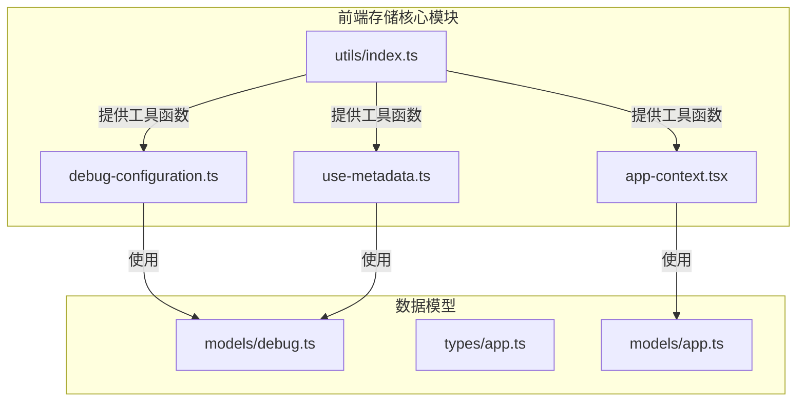
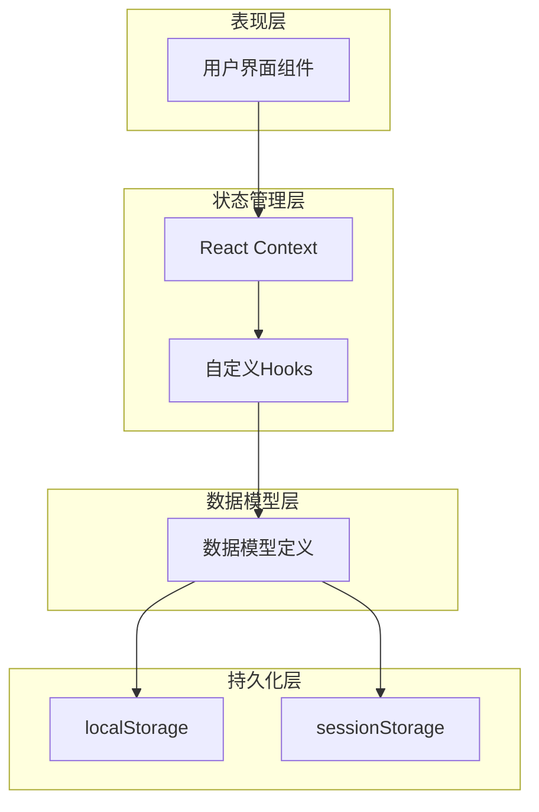
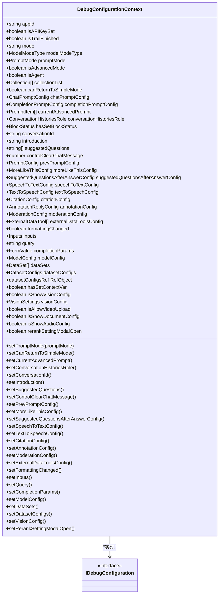
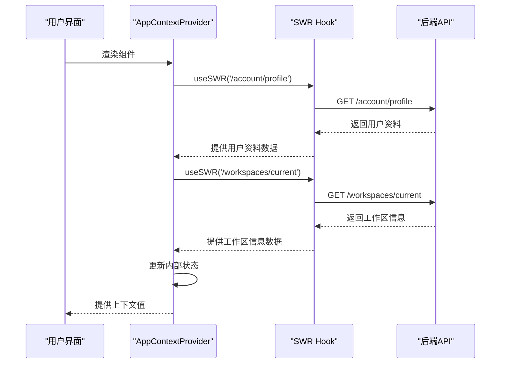
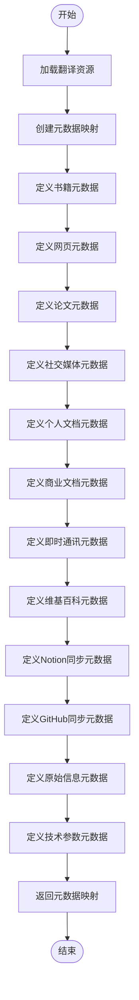
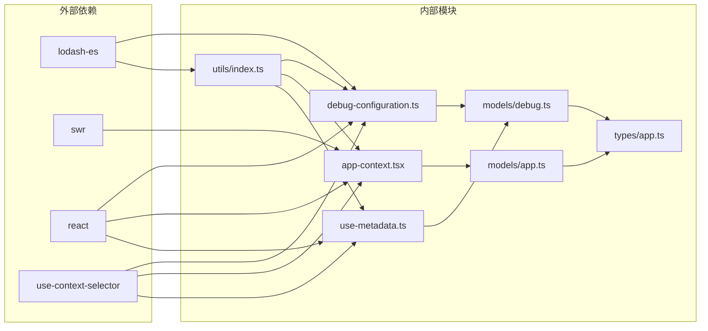
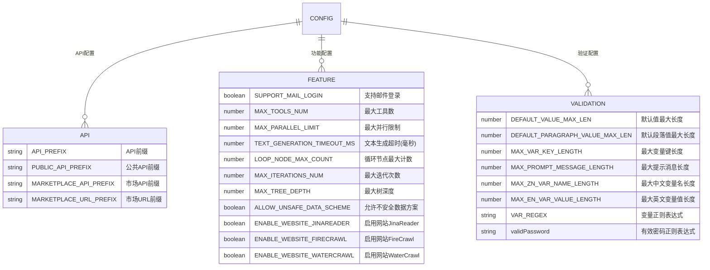

# 存储机制

<cite>
**本文档引用的文件**
- [debug-configuration.ts](file://web/context/debug-configuration.ts)
- [app-context.tsx](file://web/context/app-context.tsx)
- [use-metadata.ts](file://web/hooks/use-metadata.ts)
- [index.ts](file://web/utils/index.ts)
- [debug.ts](file://web/models/debug.ts)
- [app.ts](file://web/models/app.ts)
- [app.ts](file://web/types/app.ts)
</cite>

## 目录
1. [简介](#简介)
2. [项目结构](#项目结构)
3. [核心组件](#核心组件)
4. [架构概述](#架构概述)
5. [详细组件分析](#详细组件分析)
6. [依赖分析](#依赖分析)
7. [性能考虑](#性能考虑)
8. [故障排除指南](#故障排除指南)
9. [结论](#结论)
10. [附录](#附录)（如有必要）

## 简介
本文档详细介绍了Dify前端应用中localStorage和sessionStorage的使用策略。重点阐述了元数据、调试配置等状态的序列化存储实现，包括数据结构设计、版本管理及兼容性处理。文档还涵盖了存储空间优化、过期策略和异常处理机制，提供了实际代码示例展示状态读写操作，并说明了浏览器存储限制及应对方案，指导开发者正确使用存储API避免常见问题。

## 项目结构
Dify前端存储机制主要分布在`web/context`和`web/hooks`目录中，通过React Context和自定义Hook实现状态管理。核心文件包括`debug-configuration.ts`用于调试配置的上下文管理，`app-context.tsx`用于全局应用状态管理，以及`use-metadata.ts`用于元数据管理。

**Diagram sources**
- [debug-configuration.ts](file://web/context/debug-configuration.ts)
- [app-context.tsx](file://web/context/app-context.tsx)
- [use-metadata.ts](file://web/hooks/use-metadata.ts)
- [index.ts](file://web/utils/index.ts)

**Section sources**
- [debug-configuration.ts](file://web/context/debug-configuration.ts)
- [app-context.tsx](file://web/context/app-context.tsx)
- [use-metadata.ts](file://web/hooks/use-metadata.ts)
- [index.ts](file://web/utils/index.ts)

## 核心组件
Dify前端存储机制的核心组件包括调试配置上下文、应用上下文和元数据管理。这些组件通过React Context API实现跨组件的状态共享，同时利用浏览器的localStorage和sessionStorage进行持久化存储。

**Section sources**
- [debug-configuration.ts](file://web/context/debug-configuration.ts)
- [app-context.tsx](file://web/context/app-context.tsx)
- [use-metadata.ts](file://web/hooks/use-metadata.ts)

## 架构概述
Dify前端存储架构采用分层设计，上层为React Context提供状态管理，中层为数据模型定义结构，底层为浏览器存储API实现持久化。这种架构确保了状态的一致性和可维护性。

**Diagram sources**
- [debug-configuration.ts](file://web/context/debug-configuration.ts)
- [app-context.tsx](file://web/context/app-context.tsx)
- [use-metadata.ts](file://web/hooks/use-metadata.ts)

## 详细组件分析

### 调试配置分析
调试配置组件`debug-configuration.ts`管理应用的调试相关状态，包括模型配置、提示词配置、会话历史等。该组件使用React Context实现状态共享，并通过默认值确保应用的稳定性。

**Diagram sources**
- [debug-configuration.ts](file://web/context/debug-configuration.ts)
- [debug.ts](file://web/models/debug.ts)

#### 应用上下文分析
应用上下文组件`app-context.tsx`管理全局应用状态，包括用户资料、当前工作区、版本信息等。该组件使用SWR进行数据获取和缓存，确保状态的实时性和一致性。

**Diagram sources**
- [app-context.tsx](file://web/context/app-context.tsx)
- [app.ts](file://web/models/app.ts)

#### 元数据管理分析
元数据管理组件`use-metadata.ts`提供各种文档类型的元数据映射，包括书籍、网页、论文等。该组件使用i18n实现多语言支持，并提供格式化函数用于数据显示。

**Diagram sources**
- [use-metadata.ts](file://web/hooks/use-metadata.ts)
- [debug.ts](file://web/models/debug.ts)

## 依赖分析
Dify前端存储机制依赖于多个外部库和内部模块，形成了复杂的依赖关系网络。

**Diagram sources**
- [debug-configuration.ts](file://web/context/debug-configuration.ts)
- [app-context.tsx](file://web/context/app-context.tsx)
- [use-metadata.ts](file://web/hooks/use-metadata.ts)
- [index.ts](file://web/utils/index.ts)
- [debug.ts](file://web/models/debug.ts)
- [app.ts](file://web/models/app.ts)
- [app.ts](file://web/types/app.ts)

**Section sources**
- [debug-configuration.ts](file://web/context/debug-configuration.ts)
- [app-context.tsx](file://web/context/app-context.tsx)
- [use-metadata.ts](file://web/hooks/use-metadata.ts)
- [index.ts](file://web/utils/index.ts)

## 性能考虑
Dify前端存储机制在性能方面进行了多项优化，包括使用SWR进行数据缓存、避免不必要的重新渲染、以及合理使用浏览器存储API。通过React Context的useSelector优化，确保只有相关状态变化时组件才会重新渲染，提高了应用的整体性能。

## 故障排除指南
当遇到存储相关问题时，可以检查以下方面：
1. 确认浏览器是否支持localStorage和sessionStorage
2. 检查存储空间是否已满
3. 验证数据序列化和反序列化是否正确
4. 确认Context Provider是否正确包裹组件树
5. 检查SWR的缓存配置是否合理

**Section sources**
- [debug-configuration.ts](file://web/context/debug-configuration.ts)
- [app-context.tsx](file://web/context/app-context.tsx)
- [use-metadata.ts](file://web/hooks/use-metadata.ts)

## 结论
Dify前端存储机制通过React Context、自定义Hook和浏览器存储API的有机结合，实现了高效、可靠的状态管理。该机制不仅提供了良好的开发体验，还确保了应用的性能和稳定性。通过合理的架构设计和依赖管理，Dify为开发者提供了一个强大而灵活的前端存储解决方案。

## 附录
### 配置常量参考

**Diagram sources**
- [index.ts](file://web/config/index.ts)