# 安全防护

<cite>
**本文档引用的文件**
- [gmpy2_pkcs10aep_cipher.py](file://api/libs/gmpy2_pkcs10aep_cipher.py)
- [rsa.py](file://api/libs/rsa.py)
- [web-app-context.tsx](file://web/context/web-app-context.tsx)
- [global-public-context.tsx](file://web/context/global-public-context.tsx)
- [encrypt.py](file://api/core/plugin/backwards_invocation/encrypt.py)
- [test_rsa.py](file://api/tests/unit_tests/libs/test_rsa.py)
- [check-i18n.test.tsx](file://web/__tests__/check-i18n.test.tsx)
- [xss-prevention.test.tsx](file://web/__tests__/xss-prevention.test.tsx)
- [volume_permissions.py](file://api/extensions/storage/clickzetta_volume/volume_permissions.py)
- [compliance.py](file://api/controllers/console/billing/compliance.py)
- [billing_service.py](file://api/services/billing_service.py)
- [test_files_security.py](file://api/tests/unit_tests/controllers/console/test_files_security.py)
- [utils.ts](file://web/app/components/share/utils.ts)
- [refresh-token.ts](file://web/service/refresh-token.ts)
</cite>

## 目录
1. [简介](#简介)
2. [项目结构](#项目结构)
3. [核心组件](#核心组件)
4. [架构概述](#架构概述)
5. [详细组件分析](#详细组件分析)
6. [依赖分析](#依赖分析)
7. [性能考虑](#性能考虑)
8. [故障排除指南](#故障排除指南)
9. [结论](#结论)
10. [附录](#附录)（如有必要）

## 简介
本文档详细介绍了Dify前端状态安全防护机制，重点阐述了持久化数据的安全保护措施。文档涵盖了敏感信息加密存储方案、防XSS和CSRF攻击的状态保护机制、令牌安全存储与传输方案、安全审计日志记录、异常访问检测以及合规性要求的实现方式。同时提供了安全漏洞防范指南和应急响应流程，为系统安全提供了全面的技术保障。

## 项目结构
Dify项目采用前后端分离的架构设计，前端代码位于`web`目录，后端API代码位于`api`目录。前端使用Next.js框架构建，后端使用Flask框架。项目结构清晰，功能模块划分明确，安全相关代码分布在多个关键位置。

**Diagram sources**
- [web](file://web)
- [api](file://api)

**Section sources**
- [web](file://web)
- [api](file://api)

## 核心组件
Dify的安全防护体系由多个核心组件构成，包括加密模块、身份验证模块、权限控制模块和安全审计模块。这些组件协同工作，确保系统的整体安全性。

**Section sources**
- [gmpy2_pkcs10aep_cipher.py](file://api/libs/gmpy2_pkcs10aep_cipher.py)
- [rsa.py](file://api/libs/rsa.py)
- [encrypt.py](file://api/core/plugin/backwards_invocation/encrypt.py)

## 架构概述
Dify的安全架构采用分层防御策略，从数据加密、身份验证、权限控制到安全审计，构建了多层次的安全防护体系。前端与后端通过安全的API接口进行通信，所有敏感数据在传输和存储过程中都经过加密处理。

**Diagram sources**
- [web-app-context.tsx](file://web/context/web-app-context.tsx)
- [global-public-context.tsx](file://web/context/global-public-context.tsx)
- [rsa.py](file://api/libs/rsa.py)

## 详细组件分析

### 加密模块分析
Dify的加密模块采用混合加密方案，结合了RSA非对称加密和AES对称加密的优势，确保了数据的安全性和性能的平衡。

#### 加密算法选择

**Diagram sources**
- [rsa.py](file://api/libs/rsa.py#L0-L48)
- [gmpy2_pkcs10aep_cipher.py](file://api/libs/gmpy2_pkcs10aep_cipher.py#L29-L56)

#### 密钥管理策略
Dify采用租户隔离的密钥管理策略，每个租户拥有独立的RSA密钥对。私钥存储在安全的存储系统中，并通过Redis缓存提高访问效率。

**Diagram sources**
- [rsa.py](file://api/libs/rsa.py#L44-L78)
- [extensions/ext_redis.py](file://api/extensions/ext_redis.py)
- [extensions/ext_storage.py](file://api/extensions/ext_storage.py)

#### 加密解密流程

**Diagram sources**
- [rsa.py](file://api/libs/rsa.py#L0-L78)
- [gmpy2_pkcs10aep_cipher.py](file://api/libs/gmpy2_pkcs10aep_cipher.py)

### 状态保护机制分析
Dify实现了全面的状态保护机制，有效防范XSS和CSRF攻击，确保用户会话的安全。

#### 防XSS攻击机制

**Diagram sources**
- [xss-prevention.test.tsx](file://web/__tests__/xss-prevention.test.tsx)
- [utils.ts](file://web/utils/index.ts)

#### 防CSRF攻击机制

**Diagram sources**
- [web-app-context.tsx](file://web/context/web-app-context.tsx)
- [utils.ts](file://web/app/components/share/utils.ts)

#### 令牌安全存储与传输

**Diagram sources**
- [refresh-token.ts](file://web/service/refresh-token.ts)
- [utils.ts](file://web/app/components/share/utils.ts)

### 安全审计与合规性分析
Dify实现了完善的安全审计和合规性检查机制，确保系统符合相关安全标准。

#### 安全审计日志记录

**Diagram sources**
- [compliance.py](file://api/controllers/console/billing/compliance.py)
- [billing_service.py](file://api/services/billing_service.py)

#### 异常访问检测

**Diagram sources**
- [billing_service.py](file://api/services/billing_service.py#L149-L174)
- [test_files_security.py](file://api/tests/unit_tests/controllers/console/test_files_security.py)

#### 路径遍历防护

```mermaid
flowchart TD
Start([文件路径]) --> NormalizePath["规范化路径"]
NormalizePath --> CheckTraversal["检查路径遍历"]
CheckTraversal --> ContainsDotDot{"包含'..'?"}
ContainsDotDot --> |是| BlockRequest["阻止请求"]
ContainsDotDot --> |否| CheckNullByte["检查空字节"]
CheckNullByte --> ContainsNull{"包含空字节?"}
ContainsNullByte --> |是| BlockRequest
ContainsNullByte --> |否| CheckSpecialChars["检查特殊字符"]
CheckSpecialChars --> ContainsSpecial{"包含特殊字符?"}
ContainsSpecialChars --> |是| SanitizeChars["净化特殊字符"]
ContainsSpecialChars --> |否| ValidatePath["验证路径"]
ValidatePath --> CheckSensitive["检查敏感路径"]
CheckSensitive --> IsSensitive{"是敏感路径?"}
IsSensitive --> |是| BlockRequest
IsSensitive --> |否| AllowAccess["允许访问"]
AllowAccess --> End([完成])
```

**Diagram sources**
- [volume_permissions.py](file://api/extensions/storage/clickzetta_volume/volume_permissions.py)

## 依赖分析
Dify的安全组件依赖于多个外部库和内部模块，形成了复杂但有序的依赖关系网络。

**Diagram sources**
- [gmpy2_pkcs10aep_cipher.py](file://api/libs/gmpy2_pkcs10aep_cipher.py)
- [rsa.py](file://api/libs/rsa.py)
- [web-app-context.tsx](file://web/context/web-app-context.tsx)

**Section sources**
- [gmpy2_pkcs10aep_cipher.py](file://api/libs/gmpy2_pkcs10aep_cipher.py)
- [rsa.py](file://api/libs/rsa.py)
- [web-app-context.tsx](file://web/context/web-app-context.tsx)

## 性能考虑
Dify在安全性和性能之间取得了良好平衡。通过缓存机制减少密钥加载的开销，采用混合加密方案兼顾安全与效率，异步处理安全审计日志以避免阻塞主流程。

## 故障排除指南
当遇到安全相关问题时，可参考以下排查步骤：
1. 检查加密/解密操作是否正常
2. 验证令牌是否正确生成和验证
3. 确认CSP策略是否正确配置
4. 检查安全审计日志是否有异常记录
5. 验证速率限制是否正常工作

**Section sources**
- [CONTRIBUTING_CN.md](file://CONTRIBUTING_CN.md)
- [test_files_security.py](file://api/tests/unit_tests/controllers/console/test_files_security.py)

## 结论
Dify通过多层次的安全防护体系，有效保护了前端状态和持久化数据的安全。系统采用了先进的加密技术、完善的权限控制机制和全面的安全审计功能，为用户提供了一个安全可靠的AI应用开发平台。