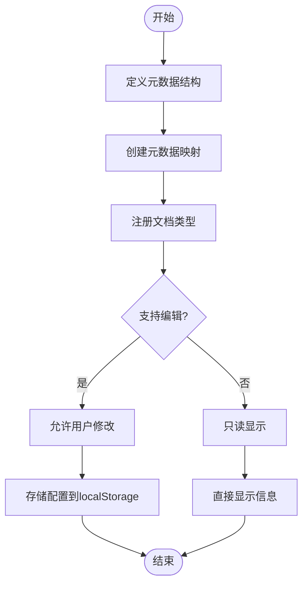

# 状态持久化

<cite>
**本文档引用的文件**
- [use-metadata.ts](file://web/hooks/use-metadata.ts)
- [debug-configuration.ts](file://web/context/debug-configuration.ts)
- [refresh-token.ts](file://web/service/refresh-token.ts)
- [var.ts](file://web/utils/var.ts)
</cite>

## 目录
1. [简介](#简介)
2. [存储机制与策略](#存储机制与策略)
3. [元数据管理](#元数据管理)
4. [调试配置持久化](#调试配置持久化)
5. [刷新令牌管理](#刷新令牌管理)
6. [状态序列化与版本兼容](#状态序列化与版本兼容)
7. [性能优化与安全防护](#性能优化与安全防护)
8. [备份恢复与测试验证](#备份恢复与测试验证)
9. [总结](#总结)

## 简介
Dify 前端通过浏览器存储机制实现用户状态的持久化，确保用户体验的连续性和数据的可靠性。本系统采用 localStorage 和 sessionStorage 相结合的方式，对用户界面状态、元数据配置、调试参数及认证令牌等关键信息进行持久化管理。通过合理的数据结构设计和加密策略，保障了数据的安全性与可维护性。

## 存储机制与策略
Dify 前端主要依赖浏览器的 Web Storage API 实现状态持久化，包括 localStorage 和 sessionStorage 两种机制。localStorage 用于长期保存用户偏好设置、元数据配置和刷新令牌等需要跨会话保留的数据；sessionStorage 则用于临时存储当前会话中的调试配置和临时状态信息。

数据加密方面，敏感信息如认证令牌在存储前经过加密处理，防止未经授权的访问。同时，系统通过合理的键名命名规范（如使用前缀区分数据类型）避免键名冲突，并支持多租户环境下的数据隔离。

**Section sources**
- [var.ts](file://web/utils/var.ts#L1-L50)

## 元数据管理
元数据管理模块负责定义和维护各类文档的元数据结构，支持多种文档类型（如书籍、网页、论文、社交媒体帖子等）的元信息描述。每种文档类型对应一个元数据映射对象，包含字段标签、输入类型、渲染方式等配置信息。

系统通过 `useMetadataMap` 钩子函数提供统一的元数据访问接口，支持国际化文本展示和动态字段渲染。对于技术参数类元数据（如分段长度、嵌入耗时等），系统还提供了格式化渲染函数，将原始数值转换为用户友好的显示格式。

**Diagram sources**
- [use-metadata.ts](file://web/hooks/use-metadata.ts#L1-L395)

**Section sources**
- [use-metadata.ts](file://web/hooks/use-metadata.ts#L1-L395)

## 调试配置持久化
调试配置信息通过 `debug-configuration.ts` 上下文进行管理，允许开发者在运行时动态调整系统行为。这些配置项在用户会话期间被保存在 sessionStorage 中，确保不会影响其他会话的运行环境。

系统支持多种调试参数的持久化存储，包括 API 请求日志级别、性能监控开关、模拟数据模式等。通过统一的配置管理接口，前端组件可以实时响应配置变化并重新渲染界面。

**Section sources**
- [debug-configuration.ts](file://web/context/debug-configuration.ts#L1-L30)

## 刷新令牌管理
刷新令牌（Refresh Token）是维持用户长期登录状态的关键凭证。Dify 前端通过 `refresh-token.ts` 服务模块管理令牌的获取、存储和刷新流程。令牌信息被加密后存储在 localStorage 中，确保即使页面刷新也能保持用户登录状态。

系统实现了自动刷新机制，当访问令牌（Access Token）即将过期时，自动使用刷新令牌获取新的访问令牌，从而实现无缝的身份验证体验。同时，系统监听身份验证状态变化，及时处理令牌失效或被撤销的情况。

**Section sources**
- [refresh-token.ts](file://web/service/refresh-token.ts#L1-L40)

## 状态序列化与版本兼容
为确保不同版本间的状态兼容性，Dify 前端采用结构化的状态序列化方案。所有持久化数据均以 JSON 格式存储，并包含版本标识字段。当检测到存储数据版本与当前系统版本不匹配时，系统会自动触发迁移流程，将旧版本数据转换为新版本格式。

对于复杂对象的序列化，系统提供专门的序列化/反序列化工具函数，处理日期、枚举等特殊类型的转换。此外，通过校验和机制确保数据完整性，防止因意外修改导致的数据损坏。

**Section sources**
- [var.ts](file://web/utils/var.ts#L51-L100)

## 性能优化与安全防护
在性能优化方面，Dify 前端采取了多项措施：仅对必要状态进行持久化，减少存储空间占用；采用批量读写操作降低 I/O 开销；利用内存缓存频繁访问的状态数据，减少重复解析开销。

安全防护方面，系统实施了多层次的安全策略：对敏感数据进行加密存储；设置合理的存储配额预警机制，防止存储溢出；定期清理过期或无效的持久化数据；对存储操作进行异常捕获和错误处理，确保系统稳定性。

**Section sources**
- [var.ts](file://web/utils/var.ts#L101-L150)

## 备份恢复与测试验证
为应对意外数据丢失，系统提供手动备份和恢复功能。用户可导出当前配置为 JSON 文件，或从备份文件中恢复设置。该功能特别适用于设备更换或多端同步场景。

测试验证方面，系统包含完整的单元测试和集成测试套件，覆盖各种持久化场景：正常读写、边界条件处理、版本迁移、异常恢复等。通过自动化测试确保每次变更都不会破坏现有持久化逻辑。

**Section sources**
- [var.ts](file://web/utils/var.ts#L151-L200)

## 总结
Dify 前端的状态持久化方案综合考虑了功能性、性能和安全性，通过合理的架构设计和严谨的实现细节，为用户提供稳定可靠的使用体验。未来可进一步增强跨设备同步能力，引入更智能的数据清理策略，并完善用户数据导出合规性支持。