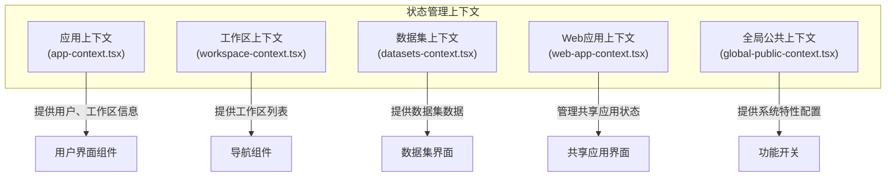
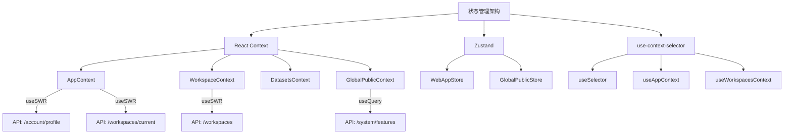
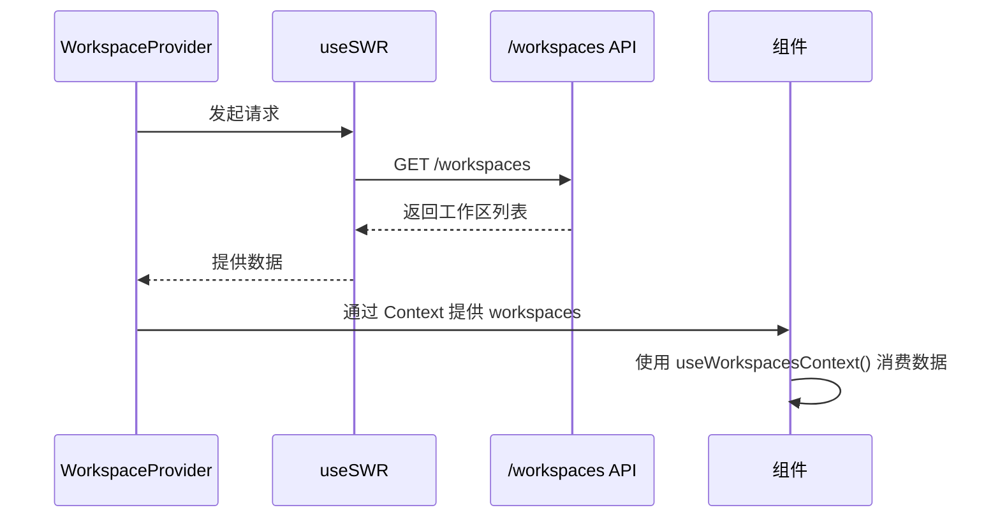
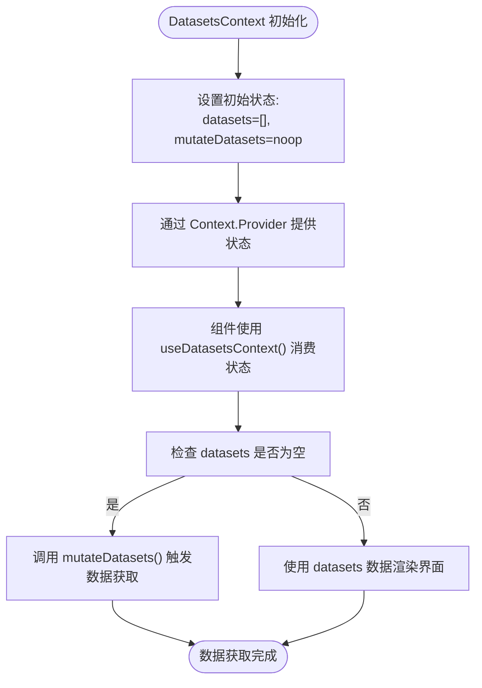
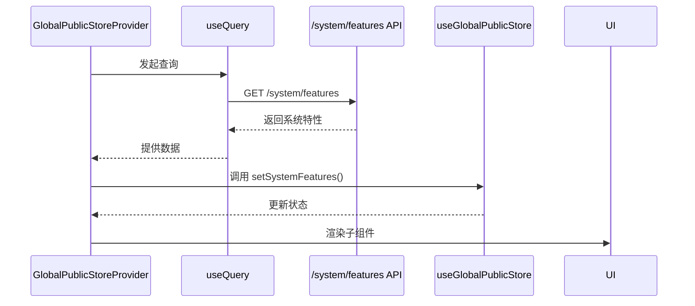

# 状态管理

<cite>
**本文档中引用的文件**  
- [app-context.tsx](file://web/context/app-context.tsx)
- [workspace-context.tsx](file://web/context/workspace-context.tsx)
- [datasets-context.tsx](file://web/context/datasets-context.tsx)
- [web-app-context.tsx](file://web/context/web-app-context.tsx)
- [global-public-context.tsx](file://web/context/global-public-context.tsx)
</cite>

## 目录
1. [简介](#简介)
2. [项目结构](#项目结构)
3. [核心组件](#核心组件)
4. [架构概述](#架构概述)
5. [详细组件分析](#详细组件分析)
6. [依赖分析](#依赖分析)
7. [性能考虑](#性能考虑)
8. [故障排除指南](#故障排除指南)
9. [结论](#结论)

## 简介
Dify 前端采用基于 React Context 和自定义 Hook 的状态管理方案，结合 Zustand 实现灵活的全局与局部状态控制。该系统通过分层上下文机制管理用户、工作区、数据集等核心状态，并利用 use-context-selector 优化渲染性能。状态持久化、访问控制和异步数据流通过组合式 API 实现，确保应用在复杂交互场景下的响应性和一致性。

## 项目结构
Dify 的状态管理模块集中于 `web/context` 目录，采用模块化设计分离关注点。每个上下文负责特定领域的状态管理，通过 Provider 组件注入，并提供自定义 Hook 供组件消费。



**Diagram sources**
- [app-context.tsx](file://web/context/app-context.tsx)
- [workspace-context.tsx](file://web/context/workspace-context.tsx)
- [datasets-context.tsx](file://web/context/datasets-context.tsx)
- [web-app-context.tsx](file://web/context/web-app-context.tsx)
- [global-public-context.tsx](file://web/context/global-public-context.tsx)

**Section sources**
- [app-context.tsx](file://web/context/app-context.tsx)
- [workspace-context.tsx](file://web/context/workspace-context.tsx)
- [datasets-context.tsx](file://web/context/datasets-context.tsx)
- [web-app-context.tsx](file://web/context/web-app-context.tsx)
- [global-public-context.tsx](file://web/context/global-public-context.tsx)

## 核心组件
Dify 的状态管理由多个核心上下文构成，每个上下文封装特定领域的状态逻辑。`AppContext` 管理用户身份和当前工作区信息，`WorkspaceContext` 提供工作区列表，`DatasetsContext` 负责数据集状态，`WebAppContext` 使用 Zustand 管理共享应用的访问状态，`GlobalPublicContext` 则通过 Zustand 存储全局系统特性。

**Section sources**
- [app-context.tsx](file://web/context/app-context.tsx#L1-L144)
- [workspace-context.tsx](file://web/context/workspace-context.tsx#L1-L36)
- [datasets-context.tsx](file://web/context/datasets-context.tsx#L1-L21)
- [web-app-context.tsx](file://web/context/web-app-context.tsx#L1-L102)
- [global-public-context.tsx](file://web/context/global-public-context.tsx#L1-L46)

## 架构概述
Dify 的状态管理架构采用分层设计，结合 React Context 和 Zustand 的优势。高层级上下文（如 `AppContext`）通过 useSWR 管理服务端状态同步，低层级上下文（如 `WebAppStore`）使用 Zustand 实现高效的客户端状态管理。`use-context-selector` 被用于优化 Context 消费者的渲染性能，避免不必要的重渲染。



**Diagram sources**
- [app-context.tsx](file://web/context/app-context.tsx#L1-L144)
- [workspace-context.tsx](file://web/context/workspace-context.tsx#L1-L36)
- [global-public-context.tsx](file://web/context/global-public-context.tsx#L1-L46)
- [web-app-context.tsx](file://web/context/web-app-context.tsx#L1-L102)

## 详细组件分析

### 应用上下文分析
`AppContext` 是 Dify 前端的核心状态容器，管理用户资料、当前工作区及系统版本信息。它通过 useSWR 实现数据的自动获取与缓存，并在组件挂载时同步更新用户信息和版本数据。

```mermaid
classDiagram
class AppContextValue {
+userProfile : UserProfileResponse
+mutateUserProfile : VoidFunction
+currentWorkspace : ICurrentWorkspace
+isCurrentWorkspaceManager : boolean
+isCurrentWorkspaceOwner : boolean
+isCurrentWorkspaceEditor : boolean
+isCurrentWorkspaceDatasetOperator : boolean
+mutateCurrentWorkspace : VoidFunction
+langGeniusVersionInfo : LangGeniusVersionResponse
+useSelector : typeof useSelector
+isLoadingCurrentWorkspace : boolean
}
class AppContextProvider {
-userProfile : UserProfileResponse
-langGeniusVersionInfo : LangGeniusVersionResponse
-currentWorkspace : ICurrentWorkspace
+updateUserProfileAndVersion() : void
}
AppContextProvider --> AppContextValue : "provides"
AppContextProvider --> "useSWR" : "fetchUserProfile"
AppContextProvider --> "useSWR" : "fetchCurrentWorkspace"
AppContextProvider --> "useSWR" : "fetchLangGeniusVersion"
```

**Diagram sources**
- [app-context.tsx](file://web/context/app-context.tsx#L1-L144)

**Section sources**
- [app-context.tsx](file://web/context/app-context.tsx#L1-L144)

### 工作区上下文分析
`WorkspaceContext` 管理用户可访问的工作区列表，通过 useSWR 从 `/workspaces` API 获取数据，并提供 `useWorkspacesContext` Hook 供组件消费。



**Diagram sources**
- [workspace-context.tsx](file://web/context/workspace-context.tsx#L1-L36)

**Section sources**
- [workspace-context.tsx](file://web/context/workspace-context.tsx#L1-L36)

### 数据集上下文分析
`DatasetsContext` 管理当前工作区的数据集状态，包含数据集列表、刷新函数和当前选中数据集。



**Diagram sources**
- [datasets-context.tsx](file://web/context/datasets-context.tsx#L1-L21)

**Section sources**
- [datasets-context.tsx](file://web/context/datasets-context.tsx#L1-L21)

### Web应用上下文分析
`WebAppStore` 使用 Zustand 创建独立的状态存储，管理共享应用的访问码、应用信息、参数和访问权限。

```mermaid
classDiagram
class WebAppStore {
+shareCode : string | null
+appInfo : AppData | null
+appParams : ChatConfig | null
+webAppAccessMode : AccessMode
+appMeta : AppMeta | null
+userCanAccessApp : boolean
+updateShareCode(shareCode)
+updateAppInfo(appInfo)
+updateAppParams(appParams)
+updateWebAppAccessMode(accessMode)
+updateWebAppMeta(appMeta)
+updateUserCanAccessApp(canAccess)
}
class WebAppStoreProvider {
-isGlobalPending : boolean
-isFetching : boolean
-isFetchingAccessToken : boolean
+getShareCodeFromRedirectUrl(redirectUrl)
+getShareCodeFromPathname(pathname)
}
WebAppStoreProvider --> WebAppStore : "使用 create() 创建"
WebAppStoreProvider --> "useGetWebAppAccessModeByCode" : "检查访问模式"
WebAppStoreProvider --> "checkOrSetAccessToken" : "处理访问令牌"
```

**Diagram sources**
- [web-app-context.tsx](file://web/context/web-app-context.tsx#L1-L102)

**Section sources**
- [web-app-context.tsx](file://web/context/web-app-context.tsx#L1-L102)

### 全局公共上下文分析
`GlobalPublicStore` 使用 Zustand 管理全局系统特性，通过 useQuery 从服务端获取系统配置。



**Diagram sources**
- [global-public-context.tsx](file://web/context/global-public-context.tsx#L1-L46)

**Section sources**
- [global-public-context.tsx](file://web/context/global-public-context.tsx#L1-L46)

## 依赖分析
Dify 的状态管理依赖多个关键库：`use-context-selector` 用于优化 Context 性能，`swr` 处理数据获取和缓存，`zustand` 提供轻量级状态存储，`@tanstack/react-query` 用于全局数据获取。

```mermaid
graph TD
A[状态管理依赖] --> B[use-context-selector]
A --> C[swr]
A --> D[zustand]
A --> E[@tanstack/react-query]
A --> F[lodash-es]
B --> G[useSelector]
B --> H[useContextSelector]
C --> I[useSWR]
D --> J[create]
E --> K[useQuery]
F --> L[noop]
```

**Diagram sources**
- [app-context.tsx](file://web/context/app-context.tsx#L1-L144)
- [workspace-context.tsx](file://web/context/workspace-context.tsx#L1-L36)
- [global-public-context.tsx](file://web/context/global-public-context.tsx#L1-L46)
- [web-app-context.tsx](file://web/context/web-app-context.tsx#L1-L102)

**Section sources**
- [app-context.tsx](file://web/context/app-context.tsx#L1-L144)
- [workspace-context.tsx](file://web/context/workspace-context.tsx#L1-L36)
- [global-public-context.tsx](file://web/context/global-public-context.tsx#L1-L46)
- [web-app-context.tsx](file://web/context/web-app-context.tsx#L1-L102)

## 性能考虑
Dify 通过多种策略优化状态管理性能：使用 `use-context-selector` 避免不必要的重渲染，`swr` 提供数据缓存和去重，Zustand 的独立存储减少 Context 膨胀。状态更新采用批量处理和防抖机制，确保复杂界面的流畅性。

## 故障排除指南
常见状态管理问题包括：Context 值未更新、组件重复渲染、数据获取失败。解决方案包括检查 Provider 层级、验证 useSWR key 唯一性、确保 Zustand store 正确订阅。调试时可启用 React DevTools 的 Profiler 分析渲染性能。

**Section sources**
- [app-context.tsx](file://web/context/app-context.tsx#L1-L144)
- [web-app-context.tsx](file://web/context/web-app-context.tsx#L1-L102)

## 结论
Dify 的状态管理方案通过组合 React Context、Zustand 和 use-context-selector，实现了高效、可维护的状态控制。分层架构清晰分离关注点，服务端状态与客户端状态协同工作，为复杂应用提供了稳定的状态基础。