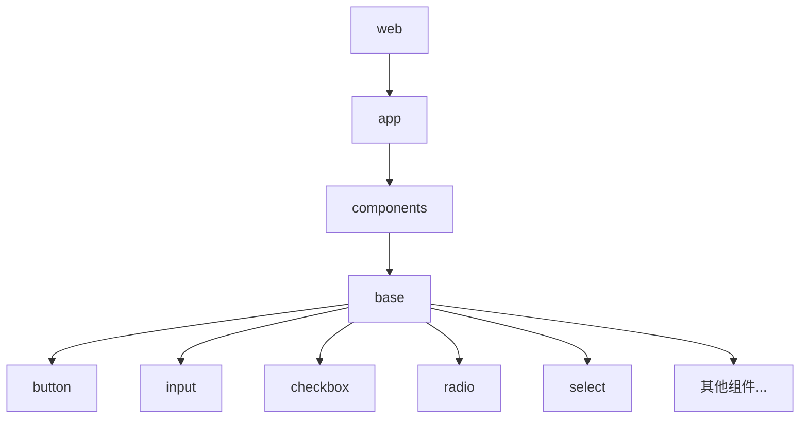
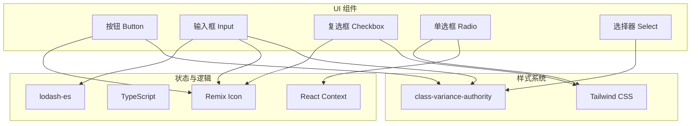
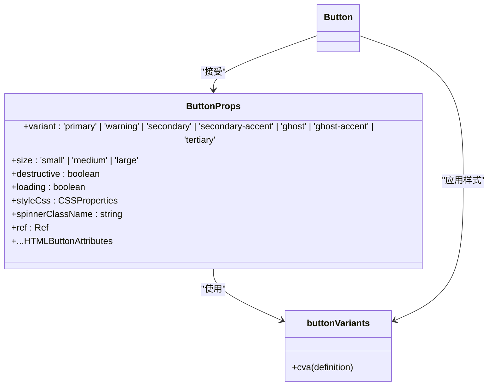
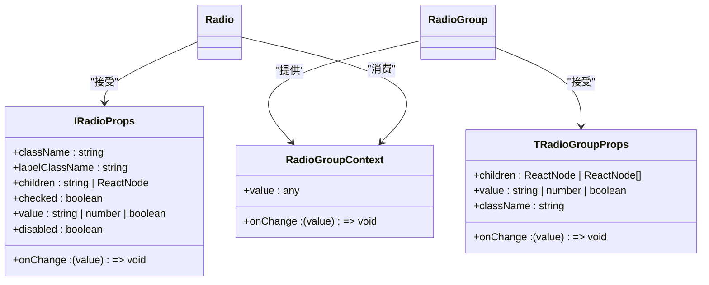

# 基础组件

<cite>
**本文档中引用的文件**  
- [button/index.tsx](file://web/app/components/base/button/index.tsx)
- [input/index.tsx](file://web/app/components/base/input/index.tsx)
- [checkbox/index.tsx](file://web/app/components/base/checkbox/index.tsx)
- [radio/index.tsx](file://web/app/components/base/radio/index.tsx)
- [radio/component/radio/index.tsx](file://web/app/components/base/radio/component/radio/index.tsx)
- [radio/component/group/index.tsx](file://web/app/components/base/radio/component/group/index.tsx)
- [select/index.tsx](file://web/app/components/base/select/index.tsx)
</cite>

## 目录
1. [简介](#简介)
2. [项目结构](#项目结构)
3. [核心组件](#核心组件)
4. [架构概览](#架构概览)
5. [详细组件分析](#详细组件分析)
6. [依赖分析](#依赖分析)
7. [性能考虑](#性能考虑)
8. [故障排除指南](#故障排除指南)
9. [结论](#结论)

## 简介
本文档详细介绍了 Dify 前端项目中的基础 UI 组件，重点涵盖按钮、输入框、复选框、单选框和选择器等原子级组件。文档阐述了这些组件的设计原则、可访问性支持（ARIA 标签、键盘导航）、响应式行为、Props 接口定义、TypeScript 类型安全实现、样式隔离机制（CSS Modules 或 Tailwind），以及视觉设计系统（颜色、间距、字体和动效规范）。同时提供实际代码示例说明如何使用这些组件构建复杂界面，并讨论性能优化策略。

## 项目结构
Dify 的前端代码位于 `web` 目录下，基础 UI 组件集中存放在 `web/app/components/base` 目录中。每个组件以独立的文件夹形式组织，包含其主要实现文件、样式文件、测试文件和故事书（Storybook）配置。



**图示来源**
- [button/index.tsx](file://web/app/components/base/button/index.tsx)
- [input/index.tsx](file://web/app/components/base/input/index.tsx)
- [checkbox/index.tsx](file://web/app/components/base/checkbox/index.tsx)
- [radio/index.tsx](file://web/app/components/base/radio/index.tsx)
- [select/index.tsx](file://web/app/components/base/select/index.tsx)

**章节来源**
- [web/app/components/base](file://web/app/components/base)

## 核心组件
本文档的核心组件包括按钮（Button）、输入框（Input）、复选框（Checkbox）、单选框（Radio）和选择器（Select）。这些组件构成了 Dify 用户界面的基石，遵循统一的设计语言和开发规范，确保了跨功能模块的一致性和可维护性。

**章节来源**
- [button/index.tsx](file://web/app/components/base/button/index.tsx)
- [input/index.tsx](file://web/app/components/base/input/index.tsx)
- [checkbox/index.tsx](file://web/app/components/base/checkbox/index.tsx)
- [radio/index.tsx](file://web/app/components/base/radio/index.tsx)
- [select/index.tsx](file://web/app/components/base/select/index.tsx)

## 架构概览
Dify 的基础 UI 组件采用基于 React 的函数式组件架构，结合 TypeScript 实现类型安全。样式管理主要依赖于 `class-variance-authority` (CVA) 库和 Tailwind CSS 的实用类，通过 `cva` 函数定义组件的变体（variants），实现了高度可配置的样式系统。组件间的通信和状态管理则利用 React 的 Context API（如 Radio 组件组）和标准的 Props 传递机制。



**图示来源**
- [button/index.tsx](file://web/app/components/base/button/index.tsx)
- [input/index.tsx](file://web/app/components/base/input/index.tsx)
- [checkbox/index.tsx](file://web/app/components/base/checkbox/index.tsx)
- [radio/index.tsx](file://web/app/components/base/radio/index.tsx)
- [radio/component/group/index.tsx](file://web/app/components/base/radio/component/group/index.tsx)

## 详细组件分析
本节将深入分析各个基础组件的实现细节，包括其 Props 接口、设计原则、可访问性支持和样式机制。

### 按钮组件分析
按钮组件（Button）是用户交互的核心元素，用于触发操作。它通过 `cva` 定义了 `variant`（变体）和 `size`（尺寸）两个维度的样式变体，并支持加载状态和破坏性操作的视觉反馈。

#### 组件接口与实现


**图示来源**
- [button/index.tsx](file://web/app/components/base/button/index.tsx#L1-L62)

**章节来源**
- [button/index.tsx](file://web/app/components/base/button/index.tsx#L1-L62)

### 输入框组件分析
输入框组件（Input）提供了文本输入功能，并集成了搜索图标、清除按钮、错误状态和单位显示等高级特性，提升了用户体验。

#### 组件接口与实现
```mermaid
classDiagram
class InputProps {
+size : 'regular' | 'large'
+showLeftIcon : boolean
+showClearIcon : boolean
+onClear : () => void
+disabled : boolean
+destructive : boolean
+wrapperClassName : string
+styleCss : CSSProperties
+unit : string
+ref : Ref<HTMLInputElement>
+...Omit<InputHTMLAttributes, 'size'>
}
class inputVariants {
+cva(definition)
}
InputProps --> inputVariants : "使用"
Input --> InputProps : "接受"
Input --> inputVariants : "应用样式"
Input --> "react-i18next" : "国际化"
Input --> "@remixicon/react" : "图标"
```

**图示来源**
- [input/index.tsx](file://web/app/components/base/input/index.tsx#L1-L103)

**章节来源**
- [input/index.tsx](file://web/app/components/base/input/index.tsx#L1-L103)

### 复选框组件分析
复选框组件（Checkbox）用于多项选择，支持选中、未选中、半选（indeterminate）和禁用状态。

#### 组件接口与实现
```mermaid
classDiagram
class CheckboxProps {
+id : string
+checked : boolean
+onCheck : () => void
+className : string
+disabled : boolean
+indeterminate : boolean
}
Checkbox --> CheckboxProps : "接受"
Checkbox --> "@remixicon/react" : "RiCheckLine"
Checkbox --> "IndeterminateIcon" : "自定义图标"
Checkbox --> "classnames" : "动态类名"
```

**图示来源**
- [checkbox/index.tsx](file://web/app/components/base/checkbox/index.tsx#L1-L52)

**章节来源**
- [checkbox/index.tsx](file://web/app/components/base/checkbox/index.tsx#L1-L52)

### 单选框组件分析
单选框组件（Radio）通常以组的形式出现，通过 React Context 实现组内状态的统一管理，确保同一时间只有一个选项被选中。

#### 组件接口与实现


**图示来源**
- [radio/index.tsx](file://web/app/components/base/radio/index.tsx#L1-L16)
- [radio/component/radio/index.tsx](file://web/app/components/base/radio/component/radio/index.tsx#L1-L65)
- [radio/component/group/index.tsx](file://web/app/components/base/radio/component/group/index.tsx#L1-L25)

**章节来源**
- [radio/index.tsx](file://web/app/components/base/radio/index.tsx#L1-L16)
- [radio/component/radio/index.tsx](file://web/app/components/base/radio/component/radio/index.tsx#L1-L65)
- [radio/component/group/index.tsx](file://web/app/components/base/radio/component/group/index.tsx#L1-L25)

## 依赖分析
基础 UI 组件依赖于一系列外部库和内部工具函数，形成了一个稳定的技术栈。

```mermaid
graph LR
Button --> class_variance_authority
Button --> react
Button --> classnames
Button --> @remixicon/react
Input --> class_variance_authority
Input --> react
Input --> react-i18next
Input --> @remixicon/react
Input --> classnames
Input --> lodash-es
Checkbox --> react
Checkbox --> @remixicon/react
Checkbox --> classnames
Radio --> react
Radio --> use-context-selector
Radio --> classnames
Radio --> CSS Modules
class_variance_authority[Class Variance Authority]
react[React]
react-i18next[React i18next]
@remixicon/react[Remix Icon]
classnames[Classnames]
lodash-es[lodash-es]
use-context-selector[use-context-selector]
CSS Modules[CSS Modules]
```

**图示来源**
- [button/index.tsx](file://web/app/components/base/button/index.tsx)
- [input/index.tsx](file://web/app/components/base/input/index.tsx)
- [checkbox/index.tsx](file://web/app/components/base/checkbox/index.tsx)
- [radio/index.tsx](file://web/app/components/base/radio/index.tsx)

**章节来源**
- [button/index.tsx](file://web/app/components/base/button/index.tsx)
- [input/index.tsx](file://web/app/components/base/input/index.tsx)
- [checkbox/index.tsx](file://web/app/components/base/checkbox/index.tsx)
- [radio/index.tsx](file://web/app/components/base/radio/index.tsx)

## 性能考虑
虽然基础组件本身不直接涉及复杂的性能优化如防抖、节流或虚拟滚动，但其设计为上层应用的性能优化提供了良好基础。例如，`Input` 组件的 `onClear` 回调和 `onChange` 事件可以被父组件轻松地进行防抖处理。组件的纯函数式设计和基于 Props 的状态管理也使得它们易于进行性能分析和优化。

## 故障排除指南
在使用基础组件时，可能遇到以下常见问题：

- **样式未生效**：检查是否正确引入了 Tailwind CSS 和 `class-variance-authority` 的配置。
- **国际化文本缺失**：确保 `react-i18next` 的上下文已正确设置，并且相应的语言包已加载。
- **Radio 组状态不同步**：确认所有 `Radio` 组件都包裹在同一个 `Radio.Group` 组件内。
- **图标不显示**：检查 `@remixicon/react` 是否已正确安装并导入所需图标。

**章节来源**
- [button/index.tsx](file://web/app/components/base/button/index.tsx)
- [input/index.tsx](file://web/app/components/base/input/index.tsx)
- [checkbox/index.tsx](file://web/app/components/base/checkbox/index.tsx)
- [radio/index.tsx](file://web/app/components/base/radio/index.tsx)

## 结论
Dify 的基础 UI 组件库设计精良，遵循了现代前端开发的最佳实践。通过 TypeScript、CVA、Tailwind 和 React Context 的结合，实现了类型安全、样式灵活、状态清晰的组件系统。这些组件不仅满足了当前的功能需求，也为未来的扩展和维护奠定了坚实的基础。开发者在构建新功能时，应优先复用这些基础组件，以保证产品整体的一致性和高质量。