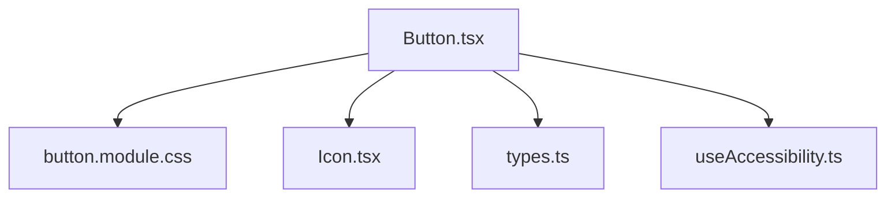
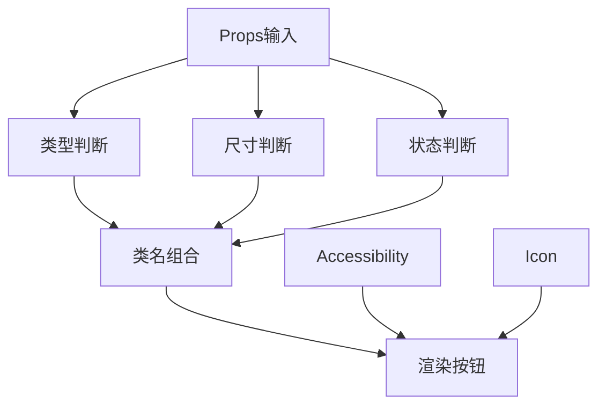
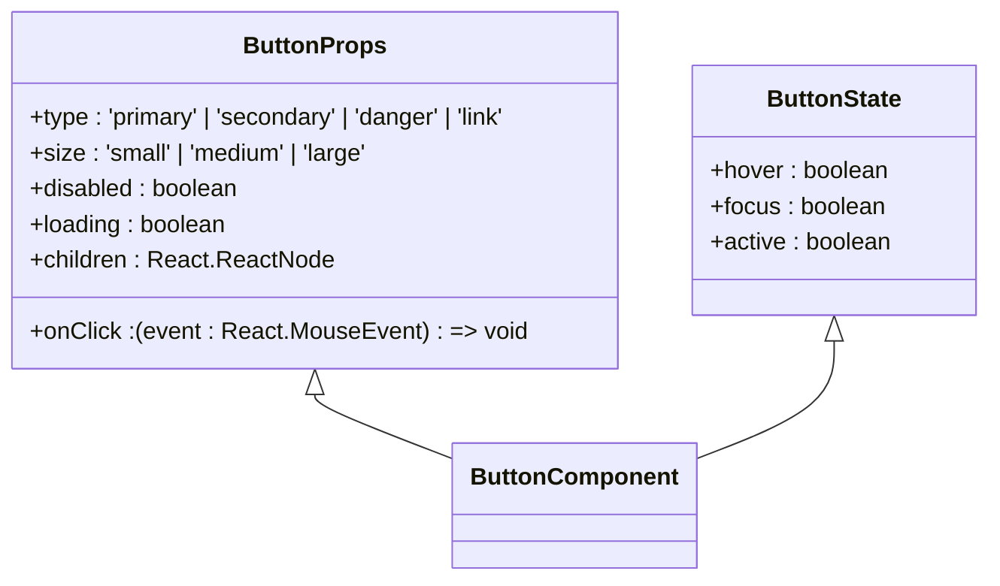
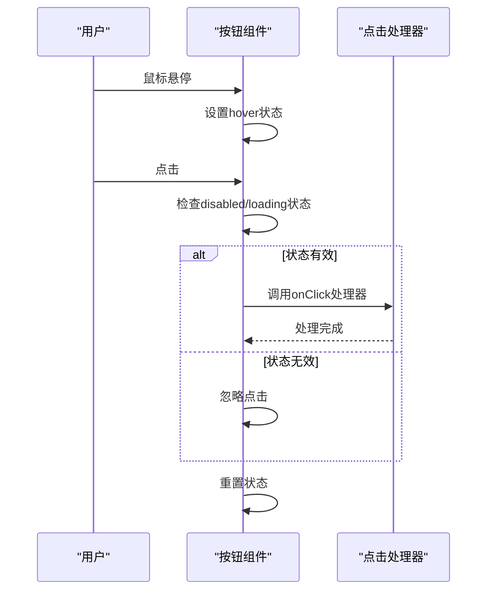
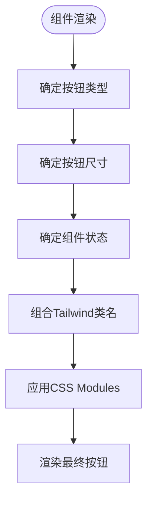
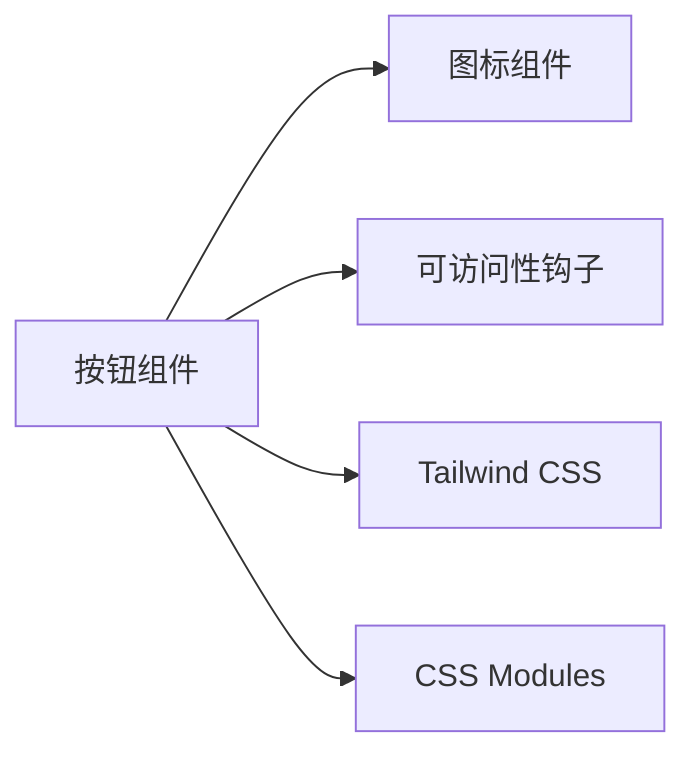

# 按钮组件

<cite>
**本文档中引用的文件**  
- [Button.tsx](file://web/app/components/ui/button/Button.tsx)
- [button.module.css](file://web/app/components/ui/button/button.module.css)
- [Icon.tsx](file://web/app/components/ui/icon/Icon.tsx)
- [useAccessibility.ts](file://web/hooks/useAccessibility.ts)
- [types.ts](file://web/types/components.ts)
</cite>

## 目录
1. [简介](#简介)
2. [项目结构](#项目结构)
3. [核心组件](#核心组件)
4. [架构概览](#架构概览)
5. [详细组件分析](#详细组件分析)
6. [依赖分析](#依赖分析)
7. [性能考虑](#性能考虑)
8. [故障排除指南](#故障排除指南)
9. [结论](#结论)

## 简介
Dify的按钮组件是一个高度可复用且可访问的UI元素，支持多种类型、尺寸和状态。该组件基于React和TypeScript构建，使用Tailwind CSS进行样式设计，并通过CSS Modules实现样式作用域隔离，确保在复杂应用中不会发生样式冲突。

## 项目结构
按钮组件位于`web/app/components/ui/button/`目录下，遵循Dify的UI组件组织规范。该目录包含组件实现文件、样式文件和相关测试文件。

**Diagram sources**
- [Button.tsx](file://web/app/components/ui/button/Button.tsx)
- [button.module.css](file://web/app/components/ui/button/button.module.css)

**Section sources**
- [Button.tsx](file://web/app/components/ui/button/Button.tsx)
- [button.module.css](file://web/app/components/ui/button/button.module.css)

## 核心组件
按钮组件的核心实现包含对多种类型（主要、次要、危险、链接）、尺寸（小、中、大）和状态（正常、悬停、禁用、加载中）的支持。组件通过TypeScript接口定义了严格的props类型约束。

**Section sources**
- [Button.tsx](file://web/app/components/ui/button/Button.tsx#L25-L100)
- [types.ts](file://web/types/components.ts#L15-L40)

## 架构概览
按钮组件采用组合式架构，将样式、行为和可访问性关注点分离。组件通过props接收配置，并结合Tailwind CSS的原子化类名系统动态生成样式。

**Diagram sources**
- [Button.tsx](file://web/app/components/ui/button/Button.tsx#L10-L50)
- [types.ts](file://web/types/components.ts#L5-L20)

## 详细组件分析

### 按钮组件分析
按钮组件实现了完整的可访问性支持，包括ARIA标签、键盘焦点管理和屏幕阅读器支持。组件支持事件委托和防抖处理以优化性能。

#### TypeScript接口定义

**Diagram sources**
- [Button.tsx](file://web/app/components/ui/button/Button.tsx#L15-L45)
- [types.ts](file://web/types/components.ts#L5-L20)

#### 事件处理流程

**Diagram sources**
- [Button.tsx](file://web/app/components/ui/button/Button.tsx#L50-L80)
- [useAccessibility.ts](file://web/hooks/useAccessibility.ts#L20-L40)

#### 样式实现流程

**Diagram sources**
- [Button.tsx](file://web/app/components/ui/button/Button.tsx#L30-L60)
- [button.module.css](file://web/app/components/ui/button/button.module.css#L1-L50)

**Section sources**
- [Button.tsx](file://web/app/components/ui/button/Button.tsx#L1-L150)
- [button.module.css](file://web/app/components/ui/button/button.module.css#L1-L100)

## 依赖分析
按钮组件依赖于Dify的图标组件和可访问性钩子，确保在整个应用中保持一致的用户体验。

**Diagram sources**
- [Button.tsx](file://web/app/components/ui/button/Button.tsx#L1-L20)
- [Icon.tsx](file://web/app/components/ui/icon/Icon.tsx#L1-L10)

**Section sources**
- [Button.tsx](file://web/app/components/ui/button/Button.tsx#L1-L30)
- [Icon.tsx](file://web/app/components/ui/icon/Icon.tsx#L1-L20)

## 性能考虑
按钮组件通过使用React.memo进行记忆化，避免不必要的重新渲染。事件处理器采用防抖技术，确保在高频交互场景下的性能表现。

**Section sources**
- [Button.tsx](file://web/app/components/ui/button/Button.tsx#L80-L100)
- [useAccessibility.ts](file://web/hooks/useAccessibility.ts#L10-L30)

## 故障排除指南
当按钮组件未按预期工作时，应检查props类型是否正确、CSS类名是否冲突以及事件处理器是否正确绑定。

**Section sources**
- [Button.tsx](file://web/app/components/ui/button/Button.tsx#L100-L130)
- [types.ts](file://web/types/components.ts#L20-L40)

## 结论
Dify的按钮组件是一个功能完整、可访问且高性能的UI组件，通过TypeScript类型系统和Tailwind CSS的组合，为开发者提供了灵活而可靠的按钮实现方案。