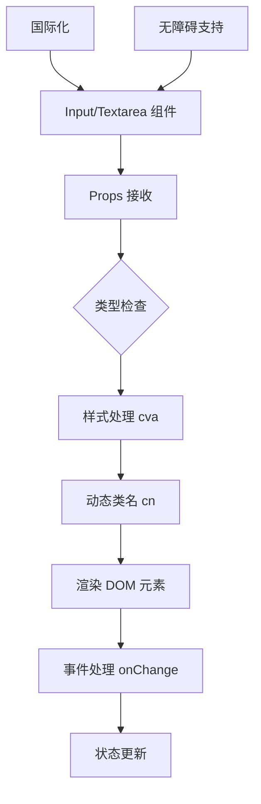

# 输入组件

<cite>
**本文档中引用的文件**  
- [input/index.tsx](file://web/app/components/base/input/index.tsx)
- [textarea/index.tsx](file://web/app/components/base/textarea/index.tsx)
</cite>

## 目录
1. [介绍](#介绍)
2. [项目结构](#项目结构)
3. [核心组件](#核心组件)
4. [架构概述](#架构概述)
5. [详细组件分析](#详细组件分析)
6. [依赖分析](#依赖分析)
7. [性能考虑](#性能考虑)
8. [故障排除指南](#故障排除指南)
9. [结论](#结论)

## 介绍
Dify 的输入组件为用户提供了一套完整且可定制的表单输入控件，主要包括 `Input` 和 `Textarea` 组件。这些组件支持多种输入类型、状态反馈、辅助元素，并具备良好的可访问性和与主流表单库的集成能力。本文档将深入解析其设计与实现，帮助开发者高效使用。

## 项目结构
Dify 的前端组件位于 `web/app/components` 目录下，输入组件具体位于 `base/input` 和 `base/textarea` 子目录中。该结构遵循功能模块化组织，便于维护和复用。

**Section sources**
- [input/index.tsx](file://web/app/components/base/input/index.tsx)
- [textarea/index.tsx](file://web/app/components/base/textarea/index.tsx)

## 核心组件
`Input` 和 `Textarea` 组件是 Dify 中处理用户文本输入的核心 UI 元素。它们通过 `class-variance-authority` (cva) 实现样式变体，并通过 `React.forwardRef` 支持原生 DOM 引用，确保了高性能和灵活性。

**Section sources**
- [input/index.tsx](file://web/app/components/base/input/index.tsx)
- [textarea/index.tsx](file://web/app/components/base/textarea/index.tsx)

## 架构概述
输入组件采用 React 函数式组件设计，结合 TypeScript 类型系统，实现了类型安全的 props 定义。组件通过组合式模式，将样式、状态和行为逻辑分离，依赖于 `classnames` 进行动态类名拼接，并利用 `react-i18next` 实现国际化。



**Diagram sources**
- [input/index.tsx](file://web/app/components/base/input/index.tsx)
- [textarea/index.tsx](file://web/app/components/base/textarea/index.tsx)

## 详细组件分析

### Input 组件分析
`Input` 组件是一个高度可配置的受控输入框，支持多种视觉状态和交互功能。

#### 功能特性
- **类型支持**: 通过继承 `React.InputHTMLAttributes<HTMLInputElement>`，原生支持 `text`, `password`, `search`, `number` 等所有 HTML5 输入类型。
- **状态管理**:
  - **聚焦/失焦**: 通过 CSS 类 `focus:border-components-input-border-active` 实现焦点状态的视觉反馈。
  - **错误状态**: 通过 `destructive` prop 触发，显示红色边框和警告图标 (`RiErrorWarningLine`)。
  - **禁用状态**: 通过 `disabled` prop 控制，改变背景色和光标样式。
- **辅助元素**:
  - **前缀图标**: `showLeftIcon` 结合 `RiSearchLine` 可显示搜索图标。
  - **清除图标**: `showClearIcon` 在有值且非禁用时显示清除按钮 (`RiCloseCircleFill`)，点击触发 `onClear` 回调。
  - **单位标签**: `unit` prop 可在输入框右侧显示单位文本。
  - **标签与帮助文本**: 虽然组件本身不直接渲染 `<label>`，但可通过 `wrapperClassName` 或外部包装器实现 `label` 关联。

#### 受控与非受控模式
组件设计为**受控组件**，其值由父组件通过 `value` 和 `onChange` props 管理。`onChange` 默认值为 `noop`，确保在未提供回调时不会报错。非受控模式可通过 `defaultValue` (继承自原生属性) 实现。

#### TypeScript 类型定义
```typescript
type InputProps = {
  showLeftIcon?: boolean;
  showClearIcon?: boolean;
  onClear?: () => void;
  disabled?: boolean;
  destructive?: boolean;
  wrapperClassName?: string;
  styleCss?: CSSProperties;
  unit?: string;
  ref?: React.Ref<HTMLInputElement>;
} & Omit<React.InputHTMLAttributes<HTMLInputElement>, 'size'> & VariantProps<typeof inputVariants>;
```
此定义确保了对原生属性的完整支持，同时扩展了自定义功能，并通过 `Omit` 避免与自定义 `size` 冲突。

#### 无障碍访问 (a11y)
- **ARIA 属性**: 组件继承所有原生 `input` 的 ARIA 属性，如 `aria-label`, `aria-describedby`。
- **键盘导航**: 原生支持 `Tab` 键导航和 `Enter` 键提交。
- **标签关联**: 需在组件外部使用 `<label htmlFor="id">` 进行正确关联。

**Section sources**
- [input/index.tsx](file://web/app/components/base/input/index.tsx)

### Textarea 组件分析
`Textarea` 组件位于 `web/app/components/base/textarea/index.tsx`，其设计原则与 `Input` 组件一致，专注于多行文本输入。

#### 功能特性
- **自动高度**: 可能与 `auto-height-textarea` 组件结合使用，实现内容自适应高度。
- **状态与辅助元素**: 同样支持 `disabled`, `destructive` 状态以及 `wrapperClassName` 等通用 props。
- **无障碍**: 同样继承原生 `textarea` 的无障碍特性。

**Section sources**
- [textarea/index.tsx](file://web/app/components/base/textarea/index.tsx)

## 依赖分析
输入组件依赖于项目中的多个核心库和工具。

```mermaid
graph LR
Input --> React
Input --> react-i18next
Input --> class-variance-authority
Input --> lodash-es
Input --> @remixicon/react
Input --> classnames
react-i18next --> i18n-config
class-variance-authority --> TailwindCSS
classnames --> TailwindCSS
```

**Diagram sources**
- [input/index.tsx](file://web/app/components/base/input/index.tsx)
- [textarea/index.tsx](file://web/app/components/base/textarea/index.tsx)

## 性能考虑
- **防抖处理**: 组件本身不内置防抖，但 `onChange` 回调可在父组件中轻松集成防抖逻辑（如使用 `lodash.debounce`），避免在搜索框等场景下频繁触发昂贵操作。
- **虚拟滚动**: 输入组件本身不涉及虚拟滚动。虚拟滚动通常应用于大型列表渲染，而非单个输入框。对于包含大量输入项的表单，应由父级容器管理性能。

## 故障排除指南
- **图标不显示**: 检查 `@remixicon/react` 是否正确安装，以及图标组件是否正确导入。
- **国际化文本缺失**: 确保 `react-i18next` 的 `useTranslation` hook 正确初始化，并且对应的翻译键（如 `common.operation.search`）存在于语言包中。
- **样式错乱**: 检查 `TailwindCSS` 是否正确配置，`cva` 定义的类名是否与 `Tailwind` 的 JIT 模式兼容。
- **清除按钮不工作**: 确认 `onClear` 回调函数已正确定义并传递给组件。

**Section sources**
- [input/index.tsx](file://web/app/components/base/input/index.tsx)

## 结论
Dify 的 `Input` 和 `Textarea` 组件提供了强大、灵活且符合现代 Web 标准的输入解决方案。通过清晰的类型定义、对无障碍的重视以及与 React 生态的无缝集成，它们为构建高质量的用户界面奠定了坚实基础。开发者应充分利用其受控模式和可扩展的 props API，结合外部表单库（如 React Hook Form）来管理复杂表单状态。