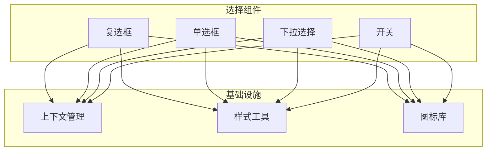
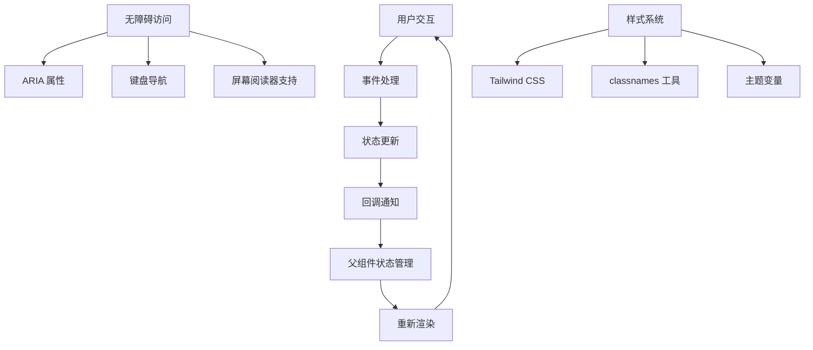
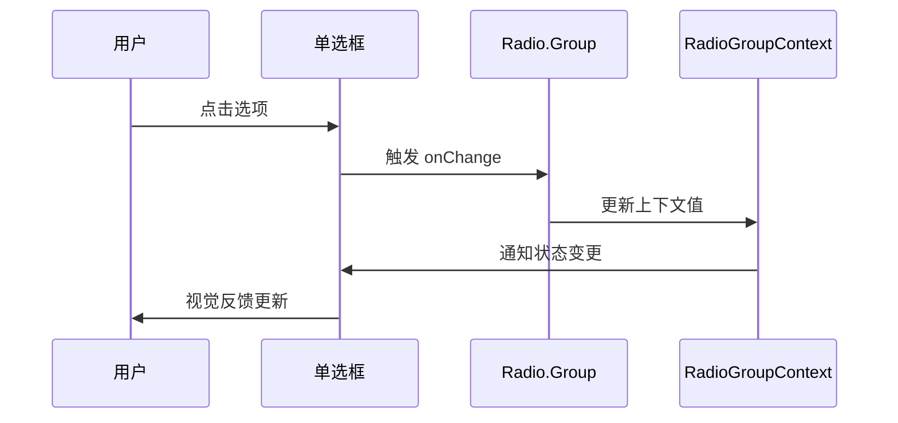
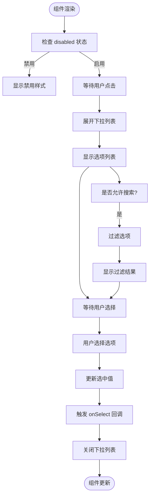
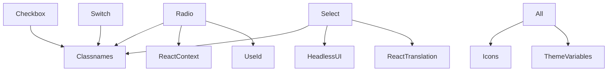

# 选择组件

<cite>
**本文档中引用的文件**
- [checkbox/index.tsx](file://web/app/components/base/checkbox/index.tsx)
- [radio/component/radio/index.tsx](file://web/app/components/base/radio/component/radio/index.tsx)
- [radio/component/group/index.tsx](file://web/app/components/base/radio/component/group/index.tsx)
- [select/index.tsx](file://web/app/components/base/select/index.tsx)
- [switch/index.tsx](file://web/app/components/base/switch/index.tsx)
</cite>

## 目录
1. [简介](#简介)
2. [项目结构](#项目结构)
3. [核心组件](#核心组件)
4. [架构概述](#架构概述)
5. [详细组件分析](#详细组件分析)
6. [依赖分析](#依赖分析)
7. [性能考虑](#性能考虑)
8. [故障排除指南](#故障排除指南)
9. [结论](#结论)

## 简介
本文档全面介绍 Dify 前端框架中的选择类组件，包括复选框(Checkbox)、单选框(Radio)、下拉选择(Select)和开关(Switch)。这些组件是用户界面中用于数据输入和状态切换的核心元素，广泛应用于表单配置、选项筛选和功能开关等场景。文档将深入解析各组件的设计理念、TypeScript 类型定义、状态管理机制和无障碍访问实现。

## 项目结构
Dify 的选择组件位于前端代码库的 base 组件目录中，采用模块化设计，每个组件都有独立的实现文件和样式定义。组件通过 TypeScript 严格类型约束，确保类型安全和开发体验。



**图示来源**
- [checkbox/index.tsx](file://web/app/components/base/checkbox/index.tsx)
- [radio/component/radio/index.tsx](file://web/app/components/base/radio/component/radio/index.tsx)
- [select/index.tsx](file://web/app/components/base/select/index.tsx)
- [switch/index.tsx](file://web/app/components/base/switch/index.tsx)

**本节来源**
- [web/app/components/base](file://web/app/components/base)

## 核心组件
Dify 的选择组件系统包含四种基本类型：复选框用于多选场景，单选框用于单选分组，下拉选择用于选项列表，开关用于二元状态切换。所有组件都实现了受控组件模式，通过 props 接收状态并提供回调函数进行状态更新。

**本节来源**
- [checkbox/index.tsx](file://web/app/components/base/checkbox/index.tsx#L1-L52)
- [radio/index.tsx](file://web/app/components/base/radio/index.tsx#L1-L16)
- [select/index.tsx](file://web/app/components/base/select/index.tsx#L1-L400)

## 架构概述
选择组件采用 React 函数组件和 Hooks 的现代 React 架构。组件通过 useContext 实现分组状态管理，使用 useId 确保可访问性，通过 className 工具函数组合样式。下拉选择组件基于 Headless UI 构建，提供完全可定制的无样式组件。



**图示来源**
- [radio/component/group/index.tsx](file://web/app/components/base/radio/component/group/index.tsx#L1-L25)
- [select/index.tsx](file://web/app/components/base/select/index.tsx#L1-L400)

## 详细组件分析

### 复选框组件分析
复选框组件提供三种状态：选中、未选中和半选中。组件通过 checked 和 indeterminate props 控制状态显示，使用 onCheck 回调处理点击事件。视觉反馈包括背景色变化、边框样式和选中图标。

```mermaid
classDiagram
class Checkbox {
+string id
+boolean checked
+boolean indeterminate
+boolean disabled
+function onCheck()
+string className
}
Checkbox --> "1" "RiCheckLine : 选中图标"
Checkbox --> "1" "IndeterminateIcon : 半选中图标"
Checkbox --> "1" "classnames : 样式工具"
```

**图示来源**
- [checkbox/index.tsx](file://web/app/components/base/checkbox/index.tsx#L1-L52)

**本节来源**
- [checkbox/index.tsx](file://web/app/components/base/checkbox/index.tsx#L1-L52)

### 单选框组件分析
单选框组件设计为分组使用，通过 Radio.Group 实现值的统一管理。组内所有单选框共享同一值域，当用户选择某个选项时，组内其他选项自动取消选中。这种设计确保了单选逻辑的正确性。



**图示来源**
- [radio/component/radio/index.tsx](file://web/app/components/base/radio/component/radio/index.tsx#L1-L65)
- [radio/component/group/index.tsx](file://web/app/components/base/radio/component/group/index.tsx#L1-L25)

**本节来源**
- [radio/component/radio/index.tsx](file://web/app/components/base/radio/component/radio/index.tsx#L1-L65)
- [radio/component/group/index.tsx](file://web/app/components/base/radio/component/group/index.tsx#L1-L25)

### 下拉选择组件分析
下拉选择组件提供多种变体：标准选择、简单选择和门户选择。组件支持搜索过滤、异步加载和自定义渲染。通过 Combobox 和 Listbox 等无样式组件构建，确保高度可定制性。



**图示来源**
- [select/index.tsx](file://web/app/components/base/select/index.tsx#L1-L400)

**本节来源**
- [select/index.tsx](file://web/app/components/base/select/index.tsx#L1-L400)

### 开关组件分析
开关组件用于二元状态的快速切换，如启用/禁用功能。组件提供清晰的视觉反馈，通过颜色和位置变化表示状态。支持受控和非受控两种使用模式，适应不同的状态管理需求。

[开关组件的概念性工作流图]

[由于此图为概念性描述，不直接对应具体源文件，因此无需列出来源]

[由于此节为概念性概述，不直接分析具体文件，因此无需列出来源]

## 依赖分析
选择组件依赖于多个基础模块：classnames 用于动态样式组合，React Hooks 用于状态管理，图标库提供视觉元素，国际化支持多语言环境。单选框组通过 React Context 实现跨组件通信。



**图示来源**
- [checkbox/index.tsx](file://web/app/components/base/checkbox/index.tsx#L1-L52)
- [radio/component/radio/index.tsx](file://web/app/components/base/radio/component/radio/index.tsx#L1-L65)
- [select/index.tsx](file://web/app/components/base/select/index.tsx#L1-L400)

**本节来源**
- [checkbox/index.tsx](file://web/app/components/base/checkbox/index.tsx#L1-L52)
- [radio/index.tsx](file://web/app/components/base/radio/index.tsx#L1-L16)
- [select/index.tsx](file://web/app/components/base/select/index.tsx#L1-L400)
- [switch/index.tsx](file://web/app/components/base/switch/index.tsx)

## 性能考虑
对于大型选项列表，下拉选择组件可通过虚拟滚动优化性能，仅渲染可见区域的选项。所有组件都使用 React.memo 进行记忆化，避免不必要的重新渲染。事件处理采用委托模式，减少事件监听器数量。

[通用性能建议，不针对特定文件]

[由于此节为通用性能讨论，不直接分析具体文件，因此无需列出来源]

## 故障排除指南
常见问题包括状态不同步、样式丢失和无障碍访问问题。确保受控组件的 value 和 onChange 正确配对，检查 CSS 变量是否正确加载，验证 ARIA 属性是否符合规范。使用开发者工具检查组件树和事件流。

**本节来源**
- [checkbox/index.tsx](file://web/app/components/base/checkbox/index.tsx#L1-L52)
- [radio/component/radio/index.tsx](file://web/app/components/base/radio/component/radio/index.tsx#L1-L65)
- [select/index.tsx](file://web/app/components/base/select/index.tsx#L1-L400)

## 结论
Dify 的选择组件系统提供了完整且一致的用户输入解决方案。组件设计注重可访问性、可定制性和性能，通过 TypeScript 提供强类型保障。开发者可以根据具体需求选择合适的组件变体，并通过丰富的 props 进行定制。

[总结性内容，不直接分析具体文件]