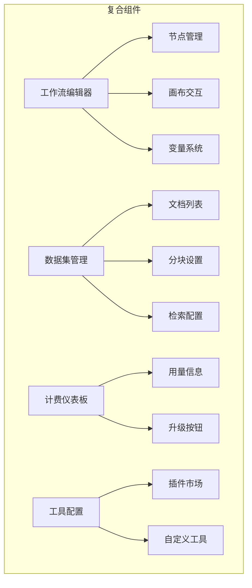
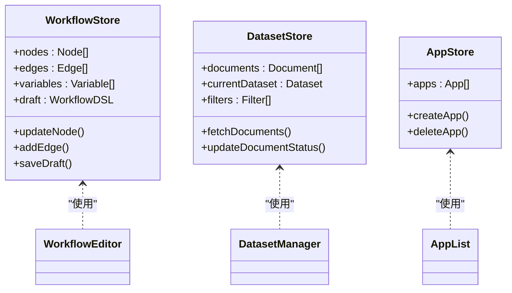
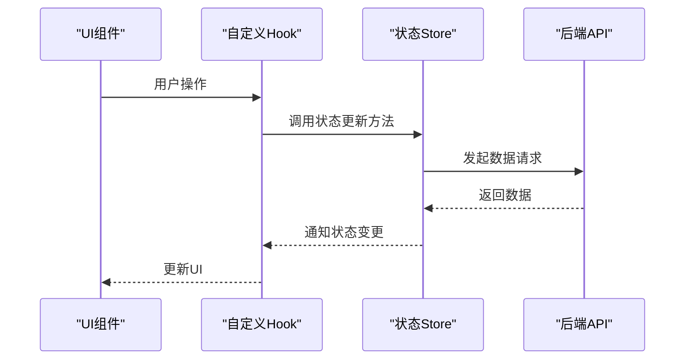
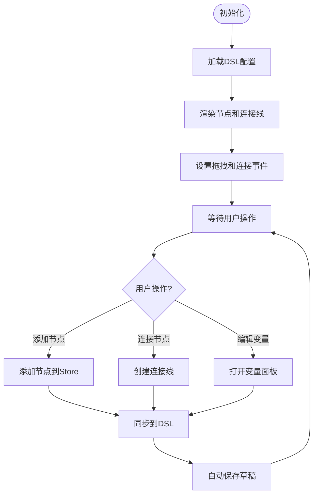
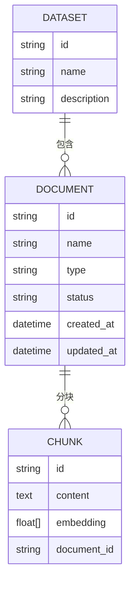
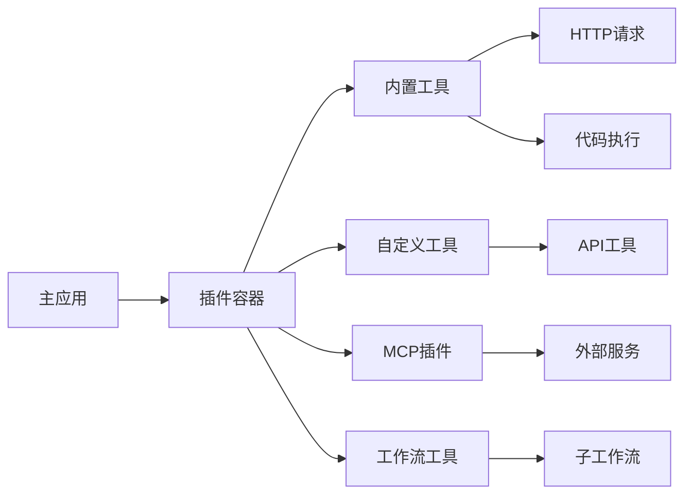

# 复合组件

<cite>
**本文档中引用的文件**  
- [workflow/index.tsx](file://web/app/components/workflow/index.tsx)
- [datasets/documents/list.tsx](file://web/app/components/datasets/documents/list.tsx)
- [billing/billing-page/index.tsx](file://web/app/components/billing/billing-page/index.tsx)
- [tools/workflow-tool/index.tsx](file://web/app/components/tools/workflow-tool/index.tsx)
- [apps/list.tsx](file://web/app/components/apps/list.tsx)
- [workflow/nodes/index.tsx](file://web/app/components/workflow/nodes/index.tsx)
- [datasets/create/index.tsx](file://web/app/components/datasets/create/index.tsx)
- [workflow/hooks/use-workflow.ts](file://web/app/components/workflow/hooks/use-workflow.ts)
- [datasets/common/document-picker/index.tsx](file://web/app/components/datasets/common/document-picker/index.tsx)
- [workflow/store/index.ts](file://web/app/components/workflow/store/index.ts)
- [datasets/documents/detail/index.tsx](file://web/app/components/datasets/documents/detail/index.tsx)
- [workflow/panel/index.tsx](file://web/app/components/workflow/panel/index.tsx)
- [tools/marketplace/index.tsx](file://web/app/components/tools/marketplace/index.tsx)
- [apps/app-card.tsx](file://web/app/components/apps/app-card.tsx)
</cite>

## 目录
1. [引言](#引言)
2. [项目结构](#项目结构)
3. [核心复合组件](#核心复合组件)
4. [架构设计与状态管理](#架构设计与状态管理)
5. [数据流与通信机制](#数据流与通信机制)
6. [复合组件详解](#复合组件详解)
7. [可配置性与插件化设计](#可配置性与插件化设计)
8. [性能优化策略](#性能优化策略)
9. [错误处理与调试](#错误处理与调试)
10. [结论](#结论)

## 引言
Dify 是一个低代码 AI 应用开发平台，其前端界面由多个高度集成的复合组件构成。这些复合组件通过组合基础 UI 元素，实现复杂的功能模块，如工作流编辑器、数据集管理、应用卡片、计费仪表板和工具配置界面。本文档旨在深入分析这些复合组件的设计原理、内部架构、状态管理机制和数据流模式，为开发者提供全面的技术参考。

## 项目结构
Dify 的前端组件主要位于 `web/app/components` 目录下，按功能模块组织。核心复合组件分布在 `workflow`、`datasets`、`billing`、`tools` 和 `apps` 等子目录中。每个复合组件通常由多个基础组件（如按钮、输入框、模态框）和自定义 Hook 组成，并通过状态管理 Store 进行数据同步。

**Diagram sources**
- [workflow/index.tsx](file://web/app/components/workflow/index.tsx)
- [datasets/documents/list.tsx](file://web/app/components/datasets/documents/list.tsx)
- [billing/billing-page/index.tsx](file://web/app/components/billing/billing-page/index.tsx)
- [tools/marketplace/index.tsx](file://web/app/components/tools/marketplace/index.tsx)

**Section sources**
- [web/app/components](file://web/app/components)

## 核心复合组件
Dify 的核心复合组件包括：
- **工作流编辑器**：可视化构建 AI 工作流的画布，支持拖拽节点、连接线、变量注入和调试。
- **数据集管理面板**：用于创建、上传、分块和检索知识库文档的完整界面。
- **应用卡片**：展示用户创建的应用，支持快速访问、复制和删除。
- **计费仪表板**：显示当前用量、套餐信息和升级选项。
- **工具配置界面**：集成插件市场，支持配置内置工具和自定义工具。

**Section sources**
- [apps/app-card.tsx](file://web/app/components/apps/app-card.tsx)
- [workflow/index.tsx](file://web/app/components/workflow/index.tsx)
- [datasets/create/index.tsx](file://web/app/components/datasets/create/index.tsx)
- [billing/billing-page/index.tsx](file://web/app/components/billing/billing-page/index.tsx)
- [tools/workflow-tool/index.tsx](file://web/app/components/tools/workflow-tool/index.tsx)

## 架构设计与状态管理
复合组件采用分层架构设计，结合 React Context、Zustand Store 和自定义 Hook 实现状态管理。

### 状态管理策略

**Diagram sources**
- [workflow/store/index.ts](file://web/app/components/workflow/store/index.ts)
- [datasets/documents/list.tsx](file://web/app/components/datasets/documents/list.tsx)
- [apps/list.tsx](file://web/app/components/apps/list.tsx)

**Section sources**
- [workflow/store/index.ts](file://web/app/components/workflow/store/index.ts)
- [datasets/documents/list.tsx](file://web/app/components/datasets/documents/list.tsx)
- [apps/list.tsx](file://web/app/components/apps/list.tsx)

## 数据流与通信机制
复合组件内部通过事件总线和回调函数实现组件间通信。外部数据通过 React Query 获取，并通过 Store 同步到各个子组件。

### 数据流模式

**Diagram sources**
- [workflow/hooks/use-workflow.ts](file://web/app/components/workflow/hooks/use-workflow.ts)
- [datasets/common/document-picker/index.tsx](file://web/app/components/datasets/common/document-picker/index.tsx)

**Section sources**
- [workflow/hooks/use-workflow.ts](file://web/app/components/workflow/hooks/use-workflow.ts)
- [datasets/common/document-picker/index.tsx](file://web/app/components/datasets/common/document-picker/index.tsx)

## 复合组件详解

### 工作流编辑器
工作流编辑器是 Dify 最复杂的复合组件，由节点画布、侧边栏、调试面板和版本历史组成。

#### 节点编辑器实现

**Diagram sources**
- [workflow/nodes/index.tsx](file://web/app/components/workflow/nodes/index.tsx)
- [workflow/panel/index.tsx](file://web/app/components/workflow/panel/index.tsx)

**Section sources**
- [workflow/index.tsx](file://web/app/components/workflow/index.tsx)
- [workflow/nodes/index.tsx](file://web/app/components/workflow/nodes/index.tsx)
- [workflow/panel/index.tsx](file://web/app/components/workflow/panel/index.tsx)

### 知识库文档列表
文档列表组件展示数据集中的所有文档，支持分页、筛选和批量操作。

**Diagram sources**
- [datasets/documents/list.tsx](file://web/app/components/datasets/documents/list.tsx)
- [datasets/documents/detail/index.tsx](file://web/app/components/datasets/documents/detail/index.tsx)

**Section sources**
- [datasets/documents/list.tsx](file://web/app/components/datasets/documents/list.tsx)
- [datasets/documents/detail/index.tsx](file://web/app/components/datasets/documents/detail/index.tsx)

## 可配置性与插件化设计
Dify 的复合组件具有高度可配置性，支持通过 DSL 配置和插件扩展。

### 插件化架构

**Diagram sources**
- [tools/marketplace/index.tsx](file://web/app/components/tools/marketplace/index.tsx)
- [tools/workflow-tool/index.tsx](file://web/app/components/tools/workflow-tool/index.tsx)

**Section sources**
- [tools/marketplace/index.tsx](file://web/app/components/tools/marketplace/index.tsx)
- [tools/workflow-tool/index.tsx](file://web/app/components/tools/workflow-tool/index.tsx)

## 性能优化策略
为提升大型复合组件的性能，Dify 采用了多种优化技术。

### 懒加载与代码分割
- **组件懒加载**：使用 `React.lazy` 和 `Suspense` 按需加载复杂组件。
- **虚拟滚动**：在文档列表和节点画布中使用虚拟滚动，减少 DOM 节点数量。
- **防抖更新**：对频繁的状态更新（如节点拖拽）进行防抖处理。

### 内存管理
- **Store 清理**：在组件卸载时清理 Store 中的临时数据。
- **事件解绑**：及时移除事件监听器，防止内存泄漏。
- **对象复用**：对频繁创建的对象（如节点配置）进行缓存复用。

**Section sources**
- [workflow/hooks/use-nodes-layout.ts](file://web/app/components/workflow/hooks/use-nodes-layout.ts)
- [datasets/hooks/use-document-list-query-state.ts](file://web/app/components/datasets/hooks/use-document-list-query-state.ts)

## 错误处理与调试
复合组件内置了完善的错误处理机制。

### 错误处理方案
- **边界错误捕获**：使用 Error Boundary 捕获组件渲染错误。
- **异步错误处理**：在 API 调用中统一处理网络错误和业务错误。
- **用户反馈**：通过 Toast 组件向用户展示操作结果。

**Section sources**
- [workflow/run/index.tsx](file://web/app/components/workflow/run/index.tsx)
- [datasets/common/document-status-with-action/status-with-action.tsx](file://web/app/components/datasets/common/document-status-with-action/status-with-action.tsx)

## 结论
Dify 的复合组件通过模块化设计、分层架构和高效的状态管理，实现了复杂功能的灵活组合。其插件化设计和可配置性使得平台具有极强的扩展能力。通过实施懒加载、虚拟滚动等性能优化策略，确保了大型工作流和数据集的流畅操作体验。这些设计模式为构建企业级低代码应用提供了有价值的参考。